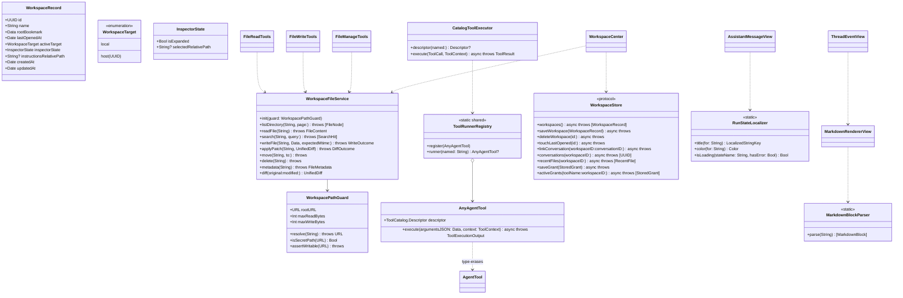
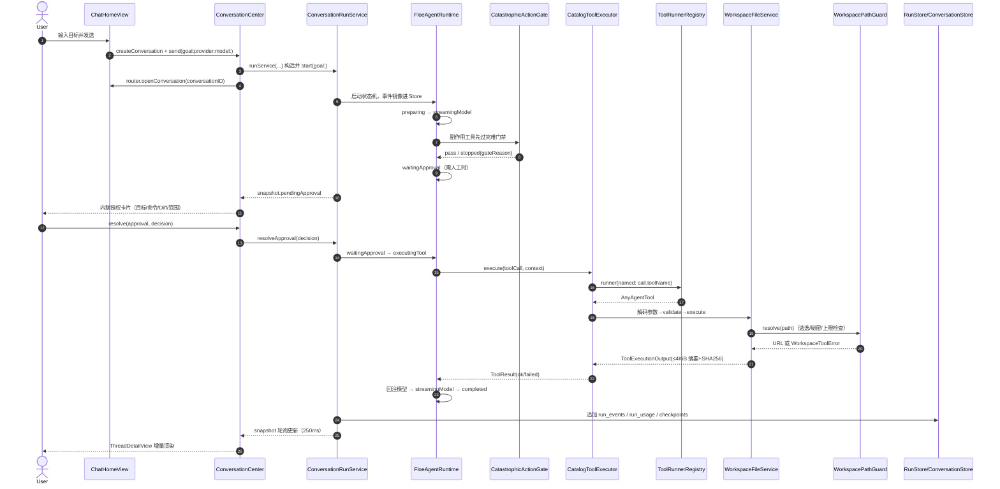
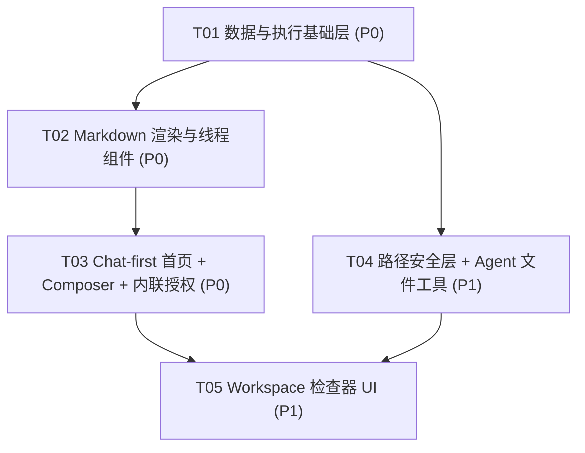

# Floe Agent Workspace 系统设计（P0 Chat-first 首页 + P1 Workspace/文件检查器/文件工具）

> 分支：`agent/alpha-daily`。本文档只含设计，不含实现代码。
> 基线：224 个 SPM 测试全绿；schema 追加式迁移（v1/v2/v3 冻结，v4 已随 `V4ModelPreferences` 落地，`DatabaseManager.currentSchemaVersion = 4`）。

---

## Part A：系统设计

### 1. 实现方案

#### 1.1 核心技术难点

| 难点 | 分析 | 对策 |
|---|---|---|
| Markdown 真渲染 | 线程主体内容必须渲染标题/列表/引用/链接/行内代码/代码块/表格/复制；`ThreadEventView` 目前纯 `Text` 会原样显示 `###` | 自写**块级解析器 + 系统内联解析**的混合方案（见 §1.2 论证） |
| 真实文件工具执行 | `CatalogToolExecutor.execute` 是存根（"No runner registered"） | 在 FloeTools 增加 `ToolRunnerRegistry`（类型擦除），新增 `FloeWorkspace` 模块实现 9 个工具并在启动时注册 |
| 路径安全 | 防 `../`、符号链接逃逸、越根、超大文件、秘密文件 | `WorkspacePathGuard` 单一收口，所有工具与检查器共用 |
| 安全作用域书签 | iOS 沙盒外目录需 bookmark 恢复 + stale 刷新 | 复用 `FilesCenter` 已验证的 bookmark 模式，收口到 `WorkspaceStore` + `WorkspaceCenter` |
| v5 追加迁移 | 不破坏 v1–v4，文件正文/秘密不入库 | 仅新增表，不改旧表；bookmark 为 BLOB、指令文件仅存相对路径 |
| Chat-first 首页 | 打开即可输入、发送即进线程、生成中发送键变停止键 | 复用 `ConversationCenter.send` / `AppRouter.openConversation`，首页改为线程式 IA |

#### 1.2 Markdown 渲染选型（重点论证）

候选三案：

| 方案 | 标题/列表/引用 | 代码块 | GFM 表格 | 内联样式/链接 | 新依赖 | 结论 |
|---|---|---|---|---|---|---|
| A. `AttributedString(markdown:)` 一把梭 | ❌ 块级全部塌成段落，标题无字号层级 | ❌ 围栏代码块变行内文本 | ❌ 不支持 | ✅ | 零 | 否决 |
| B. 引入 `apple/swift-markdown`（或 cmark-gfm）解析到 AST 再自渲染 | ✅ | ✅ | ❌ swift-markdown 核心无 GFM 表格（需再接扩展/cmark-gfm 才有） | ✅ | +1 SPM 依赖（且仍要写全部渲染层） | 否决 |
| C. **自写行式块级解析器**产出类型化 Block 树，块内文本交给系统 `AttributedString(markdown:options:.inlineOnlyPreservingWhitespace)` 做内联渲染 | ✅ | ✅ | ✅（管道表格在块级解析器中按行切分即可） | ✅（系统负责粗斜体/删除线/链接/行内代码） | **零** | **采用** |

采用 C 的理由：
1. **零新增第三方依赖**，符合仓库约束（现有 pin 已多处 deviation，不宜再加）。
2. Agent 输出的 Markdown 子集是**可枚举的**（标题/段落/无序与有序列表/引用/围栏代码块/表格/分隔线/内联样式），行式解析器约 300 行、纯函数、可快照测试，行为确定。
3. 内联层继续用系统解析器，避免自写强调/链接状态机的正确性风险与本地化/无障碍回退成本。
4. 方案 B 即使引入 AST 库，渲染层（SwiftUI 组件树、代码块复制按钮、表格网格）仍需全量自写，净收益仅省块级解析，不值得引入依赖与审核面。

产出模块：`FloeMarkdown`（新 SPM target，纯 Swift、跨平台、可单测）：
- `MarkdownBlockParser.parse(_:) -> [MarkdownBlock]`
- `MarkdownBlock`：`heading(level:text:)` / `paragraph(AttributedString)` / `list(ordered:items:)` / `quote([MarkdownBlock])` / `codeBlock(language:code:)` / `table(header:rows:)` / `thematicBreak`
- App 侧 `MarkdownRendererView`（FloeApp/Chat/Render）把 Block 树映射为 SwiftUI：代码块带语言标签 + 复制按钮 + `FloeTheme.Typography.evidence` 等宽字体 + 横向滚动；表格用 `Grid` 懒渲染；标题按 level 映射 `section`/`body.weight(.semibold)`。

流式期间渲染策略：run 未终结时对 `streamedText` 以**段落级**增量解析（仅在换行边界重解析尾部未完成块），终结后一次性解析并缓存 `AttributedString`，避免每 token 全文重排版。

#### 1.3 架构模式

- 沿用现有分层：SPM 模块（协议/模型/持久化/工具）+ App 层 `@MainActor` Center 协调器（`ConversationCenter`/`FilesCenter` 模式）+ SwiftUI 视图绑定 Center。
- 新增 Center：`WorkspaceCenter`（@MainActor，UI 唯一入口）；新增 SPM 模块 `FloeWorkspace`（路径安全 + 文件服务 + AgentTool 实现，依赖 FloeTools/FloeCore/FloeModels）。
- 工具注册方向：`FloeWorkspace → FloeTools ← FloeAgentRuntime`，runtime 不 import FloeWorkspace，通过 `ToolRunnerRegistry` 类型擦除解耦。

---

### 2. 文件列表（新建 ✚ / 修改 ✎）

#### SPM 模块（Sources/ 与 Tests/）

| 路径 | 变更 | 说明 |
|---|---|---|
| `Sources/FloeModels/Workspace.swift` | ✚ | `WorkspaceRecord`、`WorkspaceTarget`、`InspectorState` 值类型 |
| `Sources/FloeTools/ToolRunnerRegistry.swift` | ✚ | `AnyAgentTool` 类型擦除 + `ToolRunnerRegistry`（名称 → 解码/校验/执行闭包） |
| `Sources/FloeAgentRuntime/AgentRuntime.swift` | ✎ | `CatalogToolExecutor` 填实：查 `ToolRunnerRegistry`，无 runner 时保持现有结构化失败 |
| `Sources/FloePersistence/Migrations/V5Workspace.swift` | ✚ | v5 DDL（见 §5.2） |
| `Sources/FloePersistence/DatabaseManager.swift` | ✎ | 注册 v5；`currentSchemaVersion = 5` |
| `Sources/FloePersistence/WorkspaceStore.swift` | ✚ | `WorkspaceStore` 协议 + `SQLiteWorkspaceStore`（CRUD + 最近文件 + 授权授权范围持久化） |
| `Sources/FloeMarkdown/MarkdownBlock.swift` | ✚ | Block 树类型 |
| `Sources/FloeMarkdown/MarkdownBlockParser.swift` | ✚ | 行式块级解析器（含 GFM 管道表格） |
| `Sources/FloeMarkdown/InlineRenderer.swift` | ✚ | 块内文本 → `AttributedString`（系统 inline intent） |
| `Sources/FloeWorkspace/WorkspacePathGuard.swift` | ✚ | 路径规范化/逃逸检测/秘密文件排除/大小上限（API 见 §3） |
| `Sources/FloeWorkspace/WorkspaceFileService.swift` | ✚ | 树枚举（懒加载分页）、读取、写入（mtime+sha 冲突检测）、搜索、元数据、Diff 生成 |
| `Sources/FloeWorkspace/WorkspaceToolErrors.swift` | ✚ | 结构化错误 `WorkspaceToolError`（escapesRoot/secretFile/tooLarge/notFound/conflict…） |
| `Sources/FloeWorkspace/Tools/FileReadTools.swift` | ✚ | `list_directory`/`read_file`/`search_files`/`inspect_file_metadata` |
| `Sources/FloeWorkspace/Tools/FileWriteTools.swift` | ✚ | `create_file`/`write_file`/`apply_patch` |
| `Sources/FloeWorkspace/Tools/FileManageTools.swift` | ✚ | `move_file`/`delete_file` |
| `Sources/FloeWorkspace/WorkspaceToolRegistration.swift` | ✚ | `registerWorkspaceTools(rootProvider:)`：向 ToolCatalog + ToolRunnerRegistry 注册 |
| `Tests/FloePersistenceTests/V5WorkspaceTests.swift` | ✚ | 迁移测试（要点见 §5.3） |
| `Tests/FloeMarkdownTests/MarkdownBlockParserTests.swift` | ✚ | 块/表格/代码块/嵌套列表快照用例 |
| `Tests/FloeWorkspaceTests/WorkspacePathGuardTests.swift` | ✚ | `../`、symlink、绝对路径、秘密文件、大小上限 |
| `Tests/FloeWorkspaceTests/FileToolsTests.swift` | ✚ | 9 工具行为 + 结构化错误 + 输出截断 + 幂等 |
| `Package.swift` | ✎ | 新增 `FloeMarkdown`、`FloeWorkspace` 两个 target/product（零新依赖） |

#### App 层（FloeApp/）

| 路径 | 变更 | 说明 |
|---|---|---|
| `FloeApp/Home/ChatHomeView.swift` | ✚ | Chat-first 首页：最近线程列表 + 底部常驻 composer；无模型时完整可用仅禁 AI 发送 |
| `FloeApp/Home/HomeWorkbenchView.swift` | ✎ | 改为薄壳：iPad 保留 overview detail；iPhone 由 ChatHomeView 取代 workbench 卡片堆叠 |
| `FloeApp/Home/HomeWorkbenchViewModel.swift` | ✎ | 转型为 `ChatHomeViewModel`：发送即建线程并 `router.openConversation` |
| `FloeApp/Chat/ThreadComposerView.swift` | ✚ | 多行 composer：附件/模型选择/项目选择/执行目标/Agent 模式；生成中发送键变停止键 |
| `FloeApp/Chat/Render/MarkdownRendererView.swift` | ✚ | Block 树 → SwiftUI（代码块复制、表格、标题层级） |
| `FloeApp/Chat/Render/CodeBlockView.swift` | ✚ | 等宽 + 横向滚动 + 复制按钮 |
| `FloeApp/Chat/UserMessageBubble.swift` | ✚ | 用户消息气泡（含附件 chip） |
| `FloeApp/Chat/AssistantMessageView.swift` | ✚ | 助手回答（MarkdownRendererView，视觉主体） |
| `FloeApp/Chat/ReasoningBlockView.swift` | ✚ | 折叠"思考过程"块 |
| `FloeApp/Chat/ToolCallCardView.swift` | ✚ | 工具名 + 状态 + 耗时 + 输入摘要 + 结果摘要 |
| `FloeApp/Chat/ErrorEventView.swift` | ✚ | 错误卡片（终结加载态、可重试入口） |
| `FloeApp/Chat/RunStateLocalizer.swift` | ✚ | 机器状态 → 本地化文案/颜色/是否加载中的唯一映射 |
| `FloeApp/Chat/ThreadEventView.swift` | ✎ | 按 kind 分发到上述新组件；assistantText 走 MarkdownRendererView |
| `FloeApp/Chat/ThreadDetailView.swift` | ✎ | 底部常驻 ThreadComposerView（跟线程续聊）；接停止键 |
| `FloeApp/Chat/ApprovalCardView.swift` | ✎ | 升级为内联卡片：目标/命令/Diff 展示 + 授权范围选择（仅这一次/本次任务/当前项目/主机） |
| `FloeApp/Shell/AppRouter.swift` | ✎ | 增加 `inspectorVisible`/`inspectorContent`；iPad 第三栏默认隐藏、按需出现 |
| `FloeApp/Workspace/WorkspaceCenter.swift` | ✚ | @MainActor 协调器：workspace CRUD、bookmark 恢复、最近文件、检查器状态 |
| `FloeApp/Workspace/FileInspectorView.swift` | ✚ | iPad 可折叠右栏 / iPhone sheet 容器 |
| `FloeApp/Workspace/FileTreeViewModel.swift` | ✚ | 懒加载目录树 + 搜索过滤 |
| `FloeApp/Workspace/FileTreeView.swift` | ✚ | 树 UI（OutlineGroup 懒加载） |
| `FloeApp/Workspace/FilePreviewView.swift` | ✚ | 文本/Markdown/JSON/Swift/Python/JS 预览 + Quick Look 入口 |
| `FloeApp/Workspace/TextFileEditorView.swift` | ✚ | 文本编辑保存 + 外部修改冲突提示 |
| `FloeApp/Workspace/DiffView.swift` | ✚ | 统一 Diff 渲染（add/remove/context 行着色） |
| `FloeApp/Workspace/WorkspacePickerView.swift` | ✚ | composer/检查器共用的项目选择器 |
| `FloeApp/App/AppEnvironment.swift` | ✎ | 装配 `WorkspaceStore`/`WorkspaceCenter`，启动时调用 `registerWorkspaceTools` |
| `FloeApp/Resources/Localizable.xcstrings` | ✎ | 新增 ~60 key（组件文案/状态文案/错误文案，en + zh-Hans） |

---

### 3. 关键数据结构与接口



`WorkspacePathGuard.resolve` 语义（所有写/读操作的唯一入口）：

```
resolve(_ path: String) throws -> URL
  1. 拒绝空路径与绝对路径（"/"、"~" 开头）
  2. NSString.standardizingPath 展开 "." / ".."
  3. 拼接 root 后 resolvingSymlinksInPath() 解析符号链接
  4. 结果必须仍以 root 标准化路径为前缀，否则抛 .escapesRoot
  5. isSecretPath：命中排除清单（.env*、*.pem、*.key、id_rsa*、.ssh/、
     .aws/、.netrc、*.keystore、.git/config 等）抛 .secretFile
  6. 读路径校验大小 ≤ maxReadBytes（默认 10 MiB），写路径 ≤ maxWriteBytes（默认 4 MiB）
```

---

### 4. 程序调用流程



文件检查器打开流程（摘要）：`FileInspectorView` → `WorkspaceCenter.openWorkspace(id:)`（bookmark resolve + stale 刷新 + `touchLastOpened`）→ `FileTreeViewModel` 经 `WorkspaceFileService.listDirectory` 懒加载 → 选中文件经 guard resolve 后走预览（文本 ≤10MiB 内联，其余 Quick Look）→ 保存时 `writeFile(expectedMtime:)` 冲突则弹 `FileConflict` 提示。

---

### 5. 数据结构与持久化

#### 5.1 Workspace 数据模型

`WorkspaceRecord`（§3 classDiagram）：名称、根目录安全作用域书签（BLOB，仅存元数据）、最近打开时间、执行目标（本地/主机）、检查器展开状态、可选 Agent 指令文件**相对路径**（指令正文读取时经 guard，永不入库）。关联对话走 `workspace_conversations` 连接表，不反向侵入 `conversations` 表（v1 冻结）。

#### 5.2 schema v5 DDL 草案（追加式，不改 v1–v4）

```sql
-- 工作区（项目）。root_bookmark 为安全作用域书签；不含任何秘密。
CREATE TABLE workspaces (
    id TEXT PRIMARY KEY,
    name TEXT NOT NULL DEFAULT '',
    root_bookmark BLOB NOT NULL,
    last_opened_at TEXT,
    active_target_kind TEXT NOT NULL DEFAULT 'local',
    active_target_host_id TEXT REFERENCES hosts(id) ON DELETE SET NULL,
    inspector_state_json TEXT NOT NULL DEFAULT '{}',
    instructions_rel_path TEXT,
    created_at TEXT NOT NULL,
    updated_at TEXT NOT NULL
) STRICT;

-- 工作区 ↔ 对话 关联（多对多，删除对话级联清理关联）。
CREATE TABLE workspace_conversations (
    workspace_id TEXT NOT NULL REFERENCES workspaces(id) ON DELETE CASCADE,
    conversation_id TEXT NOT NULL REFERENCES conversations(id) ON DELETE CASCADE,
    created_at TEXT NOT NULL,
    PRIMARY KEY (workspace_id, conversation_id)
) STRICT;
CREATE INDEX idx_workspace_conversations_conversation
    ON workspace_conversations(conversation_id);

-- 每工作区最近文件（仅存相对路径与元数据，正文不入库）。
CREATE TABLE workspace_recent_files (
    workspace_id TEXT NOT NULL REFERENCES workspaces(id) ON DELETE CASCADE,
    relative_path TEXT NOT NULL,
    display_name TEXT NOT NULL DEFAULT '',
    last_opened_at TEXT NOT NULL,
    PRIMARY KEY (workspace_id, relative_path)
) STRICT;

-- 跨 run 记住的授权范围（"本次任务/当前项目/主机"）。
-- 仅存工具名/规范化相对路径/过期时间；绝不存参数正文或秘密。
CREATE TABLE approval_grants (
    id TEXT PRIMARY KEY,
    workspace_id TEXT REFERENCES workspaces(id) ON DELETE CASCADE,
    host_id TEXT REFERENCES hosts(id) ON DELETE CASCADE,
    tool_name TEXT NOT NULL,
    paths_json TEXT NOT NULL DEFAULT '[]',
    single_use INTEGER NOT NULL DEFAULT 1,
    policy_name TEXT NOT NULL,
    decided_at TEXT NOT NULL,
    expires_at TEXT
) STRICT;
CREATE INDEX idx_approval_grants_lookup
    ON approval_grants(tool_name, workspace_id, host_id);

PRAGMA user_version = 5;
```

#### 5.3 迁移测试要点（`V5WorkspaceTests`）

1. 从 v1 逐版本迁移到 v5 成功，`user_version == 5`，`grdb_migrations` 含 v1…v5。
2. v4 存量数据（conversations/messages/run_events/attachments）迁移后行数与内容不变（追加式回归）。
3. 外键：删 workspace 级联清 `workspace_conversations`/`workspace_recent_files`；删 conversation 级联清关联。
4. `approval_grants` 的 `workspace_id`/`host_id` 可空且 SET NULL/CASCADE 行为正确。
5. 重复执行 migrator 幂等（已应用迁移不重跑）。
6. STRICT 表拒绝类型不符写入（负例）。

---

### 6. Agent 文件工具规格（真实执行，全部经 `WorkspacePathGuard`）

统一约定：参数 JSON ≤ 64 KiB（`toolArgumentsMaxBytes`）；输出经 `ToolExecutionOutput`（summary ≤ 4096 字节 + 全文 SHA256）；结构化错误以 `WorkspaceToolError` 编码进 failed 结果；写工具在审批卡片中附带 Diff（`write_file`/`apply_patch`）或目标路径（`move_file`/`delete_file`）。

| name | 关键参数（JSON Schema 摘要） | RiskLabel | isSideEffecting | 输出限制 |
|---|---|---|---|---|
| `workspace.listDirectory` | `{path: string, pageToken?: string}` | readsFiles | false | ≤200 条/页，附 nextPageToken |
| `workspace.readFile` | `{path: string, offset?: int, limit?: int}` | readsFiles | false | ≤64 KiB/次，超出返回截断标记+总行数 |
| `workspace.searchFiles` | `{query: string, path?: string, maxResults?: int}` | readsFiles | false | ≤100 命中，逐命中 ≤200 字符上下文 |
| `workspace.inspectFileMetadata` | `{path: string}` | readsFiles | false | 大小/mtime/UTI/sha256/是否符号链接 |
| `workspace.createFile` | `{path: string, content: string}` | writesFiles | **true** | 已存在则 failed（不覆盖） |
| `workspace.writeFile` | `{path: string, content: string, expectedMtime?: string}` | writesFiles | **true** | 审批卡片展示新旧全文 Diff |
| `workspace.applyPatch` | `{path: string, patch: string(unified diff)}` | writesFiles | **true** | 逐 hunk 应用结果；失败不落盘 |
| `workspace.moveFile` | `{from: string, to: string}` | writesFiles | **true** | 两路径均过 guard |
| `workspace.deleteFile` | `{path: string}` | writesFiles, deletesFiles | **true** | 仅文件/空目录；审批卡片红显目标 |

接线：`WorkspaceToolRegistration.registerWorkspaceTools(rootProvider:)` 在 `AppEnvironment` 启动时调用——向 `ToolCatalog.register` 注册 Descriptor（编译期可见），向 `ToolRunnerRegistry` 注册 `AnyAgentTool`（运行期执行）。`CatalogToolExecutor.execute` 改为：查 Descriptor（缺失→拒绝）→ 查 runner（缺失→保持 "No runner registered" 结构化失败）→ 解码/校验/执行/包 `ToolResult`。审批链不变：副作用工具先过 `CatastrophicActionGate` 再过 `ApprovalPolicy`；`ApprovalScope.paths` 写入规范化相对路径，"当前项目"范围落到 `approval_grants` 表。

#### 6.1 内联授权卡片设计（P0）

- 只读工具（`isSideEffecting == false`）永不弹卡片，直接执行。
- 副作用工具在**线程内联**渲染 `ApprovalCardView`（不弹全屏）：工具名 + 风险标签 chip + 目标（主机/规范化路径）+ 命令或参数摘要 + 写类工具附 Diff 预览。
- 授权范围四档：`仅这一次`（singleUse）/ `本次任务`（run 生命周期内同工具同路径）/ `当前项目`（写 `approval_grants`，workspace 维度）/ `主机`（host 维度，等价现有 FullControl grant 粒度）。
- 灾难门禁不受授权范围影响：`.stopped` 决策在卡片中以红显展示且需二次本地认证释放（沿用现有 gate 语义，不削弱）。

#### 6.2 状态本地化映射（P0，`RunStateLocalizer` 唯一收口）

| 机器状态 | 文案 key | 颜色 | 加载中 |
|---|---|---|---|
| preparing | `state.preparing` 正在准备 | primary | ✅ |
| streamingModel | `state.streaming` 正在生成 | primary | ✅ |
| executingTool | `state.executing_tool` 正在调用工具 | primary | ✅ |
| waitingApproval | `state.waiting_approval` 等待授权 | pending | ⏸（ spinner 停） |
| compacting / checkpointed / paused | `state.paused` 已挂起 | pending | ⏸ |
| cancelling | `state.cancelling` 正在取消 | destructive | ✅ |
| completed | `state.completed` 已完成 | success | ❌ |
| failed / 任意 error 事件 | `state.failed` 已失败 | destructive | ❌ |

规则：**出现 `.error` 事件或 `.failed` 转换必须立即结束加载态**；`isLoading(stateName:hasError:)` 是唯一判定函数，视图不各自解释。

---

### 7. 待明确事项（假设已注明）

1. **schema 版本口径**：需求描述为 "当前 v3"，代码实为 v4（`V4ModelPreferences` 已注册）。本设计按 **v5** 追加，假设 v4 已发布冻结。
2. **执行目标=主机时文件工具语义**：本设计假设 P1 文件工具仅作用于 **local workspace**；远程主机文件操作走后续 SSH 工具（`workspace.*` 对 host scope 一律抛 `unsupportedScope`）。需确认。
3. **Agent 指令文件**：假设约定文件名 `FLOE.md`（存在即注入系统提示，正文经 guard 读取、≤16 KiB），不入库；是否暴露编辑 UI 待定。
4. **apply_patch 格式**：假设为标准 unified diff（`diff -u` 子集，单文件）；多文件 patch 拒绝并提示逐文件调用。
5. **附件在 composer 的落点**：复用 v3 `attachments` 表（securityScopedBookmark），不新增结构。
6. iPhone 上 Home 与 Chat 是否合并为同一 tab（本设计保留 5 tab，Home 即 Chat-first 首页，发送后跳 Chat tab；可考虑后续合并）。

---

## Part B：任务分解

### 8. 依赖包

**零新增第三方依赖。** 全部使用系统能力 + 现有 pin：

```
- Foundation / SwiftUI / UIKit（系统）: 解析、渲染、QuickLook、安全作用域书签
- GRDB 7.8.0（现有）: v5 迁移与 WorkspaceStore
- Crypto (swift-crypto 3.15.1，现有): 输出摘要与冲突检测 sha256
- AttributedString Markdown inline intents（系统）: 内联渲染
- QuickLookUI / QLPreviewController（系统）: 非文本预览
```

### 9. 有序任务列表（≤5，按依赖排序）

| Task | 名称 | 源文件（新建/修改） | 依赖 | 优先级 |
|---|---|---|---|---|
| **T01** | 数据与执行基础层 | `Sources/FloeModels/Workspace.swift`✚、`Sources/FloePersistence/Migrations/V5Workspace.swift`✚、`Sources/FloePersistence/DatabaseManager.swift`✎、`Sources/FloePersistence/WorkspaceStore.swift`✚、`Sources/FloeTools/ToolRunnerRegistry.swift`✚、`Sources/FloeAgentRuntime/AgentRuntime.swift`✎（CatalogToolExecutor 填实）、`Package.swift`✎、`Tests/FloePersistenceTests/V5WorkspaceTests.swift`✚、`Tests/FloeToolsTests/ToolRunnerRegistryTests.swift`✚ | — | P0 |
| **T02** | Markdown 渲染与线程组件 | `Sources/FloeMarkdown/*`✚（3 文件）、`Tests/FloeMarkdownTests/MarkdownBlockParserTests.swift`✚、`FloeApp/Chat/Render/MarkdownRendererView.swift`✚、`FloeApp/Chat/Render/CodeBlockView.swift`✚、`FloeApp/Chat/UserMessageBubble.swift`✚、`FloeApp/Chat/AssistantMessageView.swift`✚、`FloeApp/Chat/ReasoningBlockView.swift`✚、`FloeApp/Chat/ToolCallCardView.swift`✚、`FloeApp/Chat/ErrorEventView.swift`✚、`FloeApp/Chat/RunStateLocalizer.swift`✚、`FloeApp/Chat/ThreadEventView.swift`✎ | T01 | P0 |
| **T03** | Chat-first 首页 + Composer + 内联授权 | `FloeApp/Home/ChatHomeView.swift`✚、`FloeApp/Home/HomeWorkbenchView.swift`✎、`FloeApp/Home/HomeWorkbenchViewModel.swift`✎、`FloeApp/Chat/ThreadComposerView.swift`✚、`FloeApp/Chat/ThreadDetailView.swift`✎、`FloeApp/Chat/ApprovalCardView.swift`✎、`FloeApp/Shell/AppRouter.swift`✎、`FloeApp/Resources/Localizable.xcstrings`✎ | T02 | P0 |
| **T04** | Workspace 路径安全层 + Agent 文件工具 | `Sources/FloeWorkspace/WorkspacePathGuard.swift`✚、`Sources/FloeWorkspace/WorkspaceFileService.swift`✚、`Sources/FloeWorkspace/WorkspaceToolErrors.swift`✚、`Sources/FloeWorkspace/Tools/FileReadTools.swift`✚、`Sources/FloeWorkspace/Tools/FileWriteTools.swift`✚、`Sources/FloeWorkspace/Tools/FileManageTools.swift`✚、`Sources/FloeWorkspace/WorkspaceToolRegistration.swift`✚、`FloeApp/App/AppEnvironment.swift`✎（注册接线）、`Tests/FloeWorkspaceTests/WorkspacePathGuardTests.swift`✚、`Tests/FloeWorkspaceTests/FileToolsTests.swift`✚ | T01 | P1 |
| **T05** | Workspace 检查器 UI + Diff + 上下文接入 | `FloeApp/Workspace/WorkspaceCenter.swift`✚、`FloeApp/Workspace/FileInspectorView.swift`✚、`FloeApp/Workspace/FileTreeViewModel.swift`✚、`FloeApp/Workspace/FileTreeView.swift`✚、`FloeApp/Workspace/FilePreviewView.swift`✚、`FloeApp/Workspace/TextFileEditorView.swift`✚、`FloeApp/Workspace/DiffView.swift`✚、`FloeApp/Workspace/WorkspacePickerView.swift`✚、`FloeApp/Shell/AppRouter.swift`✎（右栏/sheet 接线）、`FloeApp/Chat/ThreadComposerView.swift`✎（项目选择+加入上下文） | T03, T04 | P1 |

### 10. 跨文件约定（共享知识）

```
- 所有 Agent 工具名前缀 "workspace."；Descriptor 经 ToolCatalog 编译期注册，runner 经 ToolRunnerRegistry 运行期注册，两者缺一不可执行。
- 路径一律相对 workspace 根；任何文件访问必须经 WorkspacePathGuard.resolve；视图层不得直接拼 URL。
- 授权范围四档映射 ApprovalScope：singleUse=true / run 生命周期（内存 grant）/ approval_grants 表（workspace_id）/ host_id。
- 文件正文永不入库；库中只存相对路径、元数据、sha256、bookmark BLOB。秘密永不入库（含 approval_grants）。
- 工具输出统一 ToolExecutionOutput（summary ≤4096B + 全文 SHA256）；read_file 单次 ≤64KiB；list ≤200 条/页。
- 机器状态→文案唯一经 RunStateLocalizer；出现 error 事件或 failed 必须立即结束加载态。
- RunEventRecord.payloadJSON 保持 [String:String] 平面结构（ConversationCenter.decodePayload 现状），新字段先加 payload key 再考虑演进。
- 本地化：所有 UI 字符串进 Localizable.xcstrings（en + zh-Hans），禁硬编码；沿用 FloeTheme token 与 minimumTarget=44。
- 迁移纪律：v1–v4 冻结，新结构只进 V5Workspace；迁移注册后须跑全量 224+ 测试。
- 写操作冲突检测 = expectedMtime + sha256 双校验；冲突不覆盖，抛结构化错误交 UI 显式处理。
```

### 11. 任务依赖图


