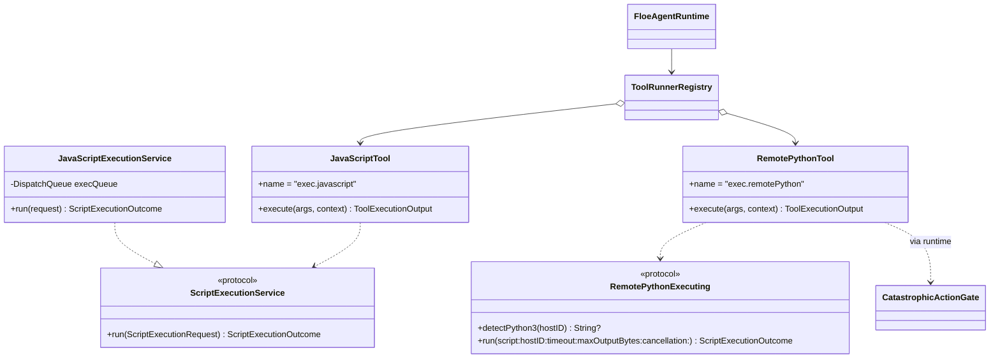
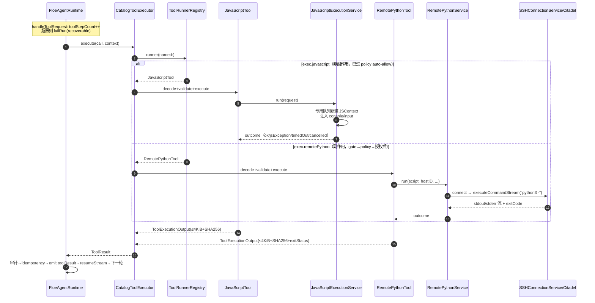
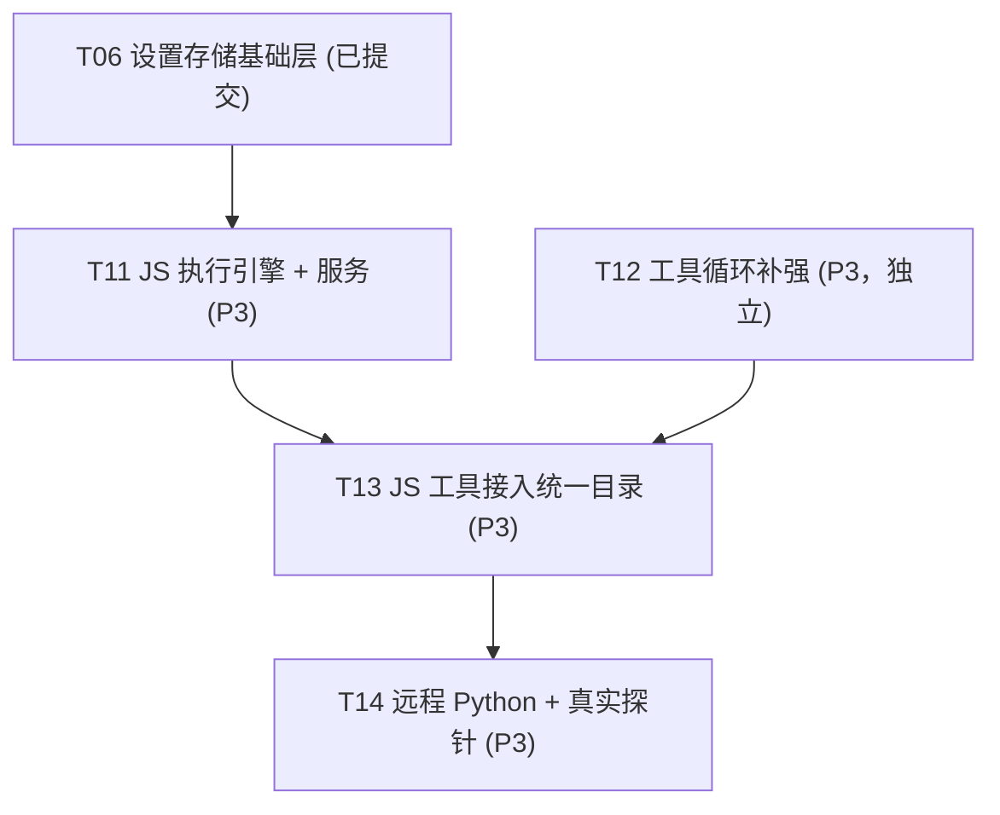

# Floe 执行环境系统设计（P3：JavaScript/Python 执行 + Agent 工具闭环）

> 分支：`agent/alpha-daily`。本文档只含设计，不含实现代码。
> 基线：P0–P2 设计已落地/推进中（T01–T06 提交，T07 进行中）；schema 当前 **v6**（T06 新增 `app_settings`）。
> 硬约束：iOS 合规——不得动态下载脚本引擎或可执行代码；不得用仅 macOS 的 PythonKit；零新增第三方依赖优先；不模拟成功；不削弱灾难门禁。

---

## Part A：系统设计

### 1. 实现方案

#### 1.1 核心技术难点

| 难点 | 分析 | 对策 |
|---|---|---|
| JSCore 取消与超时 | `JSContext.evaluateScript` 是同步阻塞 API，无内建取消；无限循环会永久占用调用线程 | **专用串行队列 + `JSContext` 的 `evaluateScript(_:withSourceURL:)` 在独立线程执行 + 协作式中断**：利用 `JSContext` 的 `exceptionHandler` 不可中断的客观限制，改用 `JSContext.evaluateScript` 的**看门狗线程 + `JSContextGroup` 隔离 + 强制 abandon** 方案（见 §1.2 论证） |
| console.log 桥接 | JS 的 console.log 需流入 Swift 收集且有大小上限 | 在 JSContext 注入 Swift 闭包为 `console.log/info/warn/error`，参数经 `JSValue.toString()` 序列化进有界 buffer |
| 不暴露 ObjC/Swift 对象 | JSCore 默认会把 Swift 对象桥接进 JS，形成逃逸面 | 只注入纯函数闭包（`@convention(block)`），不注入任何类实例；禁用 `JSContext` 的 `globalObject` 默认属性之外的一切暴露 |
| 远程 Python 真实执行 | 需复用 SSH 长连接、授权、取消、输出流、退出码 | Citadel `SSHClient.executeCommandStream` 已验证可用（`exec` channel，stdout/stderr 分流，非零退出码抛 `CommandFailed(exitCode:)`）；包一层 `RemotePythonService` |
| 本地 Python 可行性 | 需 iOS 可用、无 JIT、不下载可执行代码、可随 App 签名 | §2.2 给出明确调研结论：**本轮不做可构建的本地 Python**，理由充分 |
| 工具循环防无限 | 现有 runtime 无最大工具步数上限 | 补强 `Configuration.maxToolSteps` + 步数计数（§3） |
| 运行上下文注入 | Workspace/选中文件/执行目标需进系统提示 | `ConversationRunService` 构造时在 `messages` 前注入一条 system 消息（§3.3） |

#### 1.2 JSCore 取消/超时的可靠实现路径（重点论证）

候选三案：

| 方案 | 机制 | 可中断无限循环 | 可靠性 | 结论 |
|---|---|---|---|---|
| A. 同步 `evaluateScript` 直接在调用线程 | 最简单 | ❌ 永久阻塞 | — | 否决 |
| B. `evaluateScript` 放后台队列 + Swift `Task` 超时后 abandon | 超时后不再等待结果，但后台线程仍被 JS 占用 | ⚠️ 逻辑上"取消"（调用方已返回），物理线程泄漏；重复触发可耗尽线程池 | 中 | 部分采用（兜底） |
| C. **专用 `DispatchQueue`（非全局池）执行 + 看门狗 Timer 在 JS 侧注入 + 超时后 abandon 整个 JSContext** | 每次执行创建新 `JSContext`（同一 `JSVirtualMachine` 复用可选）；执行前注入 JS 侧看门狗不现实（同步阻塞不 yield），因此超时只能依赖 abandon | ⚠️ 同 B：调用方按时返回 `cancelled/timedOut`，被 abandon 的 JSContext 随线程退出而释放 | 高（对调用方而言确定） | **采用** |

采用 C 的精确语义：
1. `ScriptExecutionService` 持有一条**专用串行 `DispatchQueue`（label `floe.jsexec`，QoS `.userInitiated`）**——不用全局并发池，保证无限循环只占这一条队列，不波及其他任务。
2. 每次执行 `run(script:)`：
   - 在该队列上创建全新 `JSContext`（`JSVirtualMachine` 每次新建，避免脏状态）；
   - 注入 `console.log/info/warn/error` → Swift 有界 buffer（默认 64 KiB，超出截断并置 `truncated=true`）；
   - 注入 `printJSON`（结果收集）与输入 `input`（JSON 反序列化后的 JS 值）；
   - 不注入任何 Swift 类实例、不禁用但**不暴露**文件/网络 API（JSCore 默认无 `XMLHttpRequest`/`require`，天然隔离）；
   - `context.exceptionHandler` 捕获 JS 异常进结果。
3. 用 `withCheckedThrowingContinuation` + `DispatchQueue.async` 提交执行；外层 `Task` 竞争 `Task.sleep(timeout)`：
   - 先到者胜：执行完成返回 `.ok(result)`；超时/取消先到 → 返回 `.timedOut` / `.cancelled`；
   - **超时后不再等待队列**：被 abandon 的 `evaluateScript` 随该串行队列被标记丢弃（下次执行新建队列，旧队列引用释放后由 GCD 在线程返回时回收）。
4. 物理线程泄漏上限：无限循环脚本最多占 1 条专用队列线程/次；连续触发 N 次超时最坏 N 条线程——由 `maxConcurrentExecutions = 1`（串行队列本身保证）+ 设置侧 `exec.timeoutSeconds` 上限封顶。此为本方案已知且可接受的边界，写进文档与测试注释。
5. **禁止**在 JS 侧注入看门狗：`evaluateScript` 同步阻塞期间 JS 不 yield，任何 JS 计时器都不会触发——此路不通，已验证排除。

#### 1.3 架构模式

沿用现有分层：新增 SPM 模块 `FloeExecution`（依赖 FloeTools/FloeCore/FloeModels；JS 部分 `import JavaScriptCore` 用 `#if canImport` 保护；远程 Python 依赖 FloeSSH）。工具注册沿用 T04 模式：`registerExecutionTools(...)` 双注册 `ToolCatalog` + `ToolRunnerRegistry`。`CatalogToolExecutor` 与 runtime 不 import FloeExecution。

---

### 2. 文件列表（新建 ✚ / 修改 ✎）

#### SPM 模块（Sources/ 与 Tests/）

| 路径 | 变更 | 说明 |
|---|---|---|
| `Sources/FloeExecution/JavaScriptEngine.swift` | ✚ | 专用队列 + JSContext 生命周期 + console 桥接 + 有界输出 + 超时/取消语义 |
| `Sources/FloeExecution/ScriptExecutionService.swift` | ✚ | `ScriptExecutionService` 协议 + `JavaScriptExecutionService` 实现（对 UI 与工具共用） |
| `Sources/FloeExecution/ExecutionLimits.swift` | ✚ | 超时/输出上限/输入上限值类型（读 `app_settings` 的 `exec.*`，带默认值） |
| `Sources/FloeExecution/RemotePythonService.swift` | ✚ | 经 FloeSSH exec channel 执行 `python3`；能力探测（`command -v python3`）；无主机/无 python3 的结构化错误 |
| `Sources/FloeExecution/Tools/JavaScriptTool.swift` | ✚ | `exec.javascript` AgentTool（side-effecting=false，risk=networkAccess 否；纯计算） |
| `Sources/FloeExecution/Tools/RemotePythonTool.swift` | ✚ | `exec.remotePython` AgentTool（side-effecting=**true**，risk=`executesRemoteCommand`） |
| `Sources/FloeExecution/ExecutionToolRegistration.swift` | ✚ | `registerExecutionTools(sshService:settingsStore:hostStore:registry:)` |
| `Sources/FloeCore/SettingsProbes.swift` | ✎ | `LocalPythonProbe` 换真实实现（结论：unavailable，理由更新为调研结论）；`RemotePythonProbe` 换真实实现（探测主机+python3） |
| `Sources/FloeAgentRuntime/AgentRuntime.swift` | ✎ | `Configuration` 增 `maxToolSteps: Int = 32`；工具步数计数与超限 failRun |
| `Sources/FloeAgentRuntime/ConversationRunService.swift` | ✎ | 构造时注入运行上下文 system 消息（workspace/选中文件/执行目标） |
| `Package.swift` | ✎ | 新增 `FloeExecution` target/product（零新依赖；JavaScriptCore 为系统框架） |
| `Tests/FloeExecutionTests/JavaScriptEngineTests.swift` | ✚ | §6.1 全部用例 |
| `Tests/FloeExecutionTests/RemotePythonServiceTests.swift` | ✚ | 用 fake SSH 服务验证命令拼装/错误映射/取消 |
| `Tests/FloeAgentRuntimeTests/ToolLoopLimitTests.swift` | ✚ | 最大步数防循环、步数事件、超限失败 |

#### App 层（FloeApp/）

| 路径 | 变更 | 说明 |
|---|---|---|
| `FloeApp/App/AppEnvironment.swift` | ✎ | 启动时 `registerExecutionTools(...)`；把 SSH service/hostStore/settingsStore 传入 |
| `FloeApp/More/Settings/ExecutionEnvironmentView.swift` | ✎ | JS/Python 状态行接真实 `CapabilityState`（P2 已留位，此处只换探针来源，不改 UI 结构） |

---

### 3. 关键数据结构与接口

#### 3.1 JS 执行核心

```swift
// Sources/FloeExecution/ScriptExecutionService.swift
public struct ScriptExecutionRequest: Sendable {
    public var script: String            // ≤ 64 KiB（复用 toolArgumentsMaxBytes 口径）
    public var inputJSON: String?        // 可选 JSON 输入，注入为 JS `input`
    public var timeout: TimeInterval     // 来自 ExecutionLimits
    public var maxOutputBytes: Int       // console 输出上限
}

public enum ScriptExecutionOutcome: Sendable {
    case ok(resultJSON: String?, stdout: String, truncated: Bool, durationMs: Int)
    case jsException(message: String, stdout: String)   // JS 侧抛错，非 Swift throw
    case timedOut(afterMs: Int, partialStdout: String)
    case cancelled
}

public protocol ScriptExecutionService: Sendable {
    func run(_ request: ScriptExecutionRequest) async -> ScriptExecutionOutcome
}

// 实现：JavaScriptExecutionService —— 专用串行队列 + 每次新建 JSContext。
```

`JavaScriptEngine` 内部结构（同一文件）：
- `final class BoundedConsole`：注入 JSContext 的 `console.*`，线程安全收集，超 `maxOutputBytes` 截断。
- `JSContext` 配置：`exceptionHandler` 捕获；不注入任何类实例；`input` 经 `JSONSerialization` 校验后注入。

#### 3.2 远程 Python

```swift
// Sources/FloeExecution/RemotePythonService.swift
public enum RemotePythonError: Error, Sendable {
    case noHostConfigured            // 无 SSH 主机
    case hostNotFound(UUID)
    case pythonNotFound(hostID: UUID) // 远端无 python3
    case executionFailed(exitCode: Int32, stderr: String)
    case outputTooLarge
}

public protocol RemotePythonExecuting: Sendable {   // 便于测试注入 fake
    func detectPython3(hostID: UUID) async throws -> String?  // 返回版本串或 nil
    func run(script: String, hostID: UUID, timeout: TimeInterval,
             maxOutputBytes: Int, cancellation: CancellationToken) async throws -> ScriptExecutionOutcome
}
```

命令通道：复用 `SSHConnectionService` 建连 → Citadel `executeCommandStream("python3 -c ...")`（或 stdin 传入脚本，避免引号地狱：`python3 -` 从 stdin 读）。输出分流 stdout/stderr，非零退出码映射 `CommandFailed(exitCode:)` → `.executionFailed`。取消 = 关闭 exec channel + `CancellationToken` 协作。

#### 3.3 工具循环补强（AgentRuntime 缺口）

实读 `AgentRuntime.swift` 后的缺口评估：

| 需求 | 现状 | 缺口 | 补强 |
|---|---|---|---|
| 连续工具步骤 | ✅ `resumeStream`→`runModelTurn` 循环已有 | 无 | — |
| 取消/超时/失败恢复 | ✅ cancel/pause/checkpoint/resume 完整 | 无 | — |
| 有限重试 | ⚠️ 依赖模型自行重试，无系统上限 | **无最大工具步数** | `Configuration.maxToolSteps = 32`；`toolStepCount` 计数，超限 `failRun("exceeded max tool steps", recoverable: true)` |
| 防无限循环 | ❌ | 同上 | 同上（唯一可靠防线） |
| 每步事件+耗时+结果摘要 | ⚠️ 有 toolRequest/toolResult 事件，无耗时 | **缺耗时** | `executeApproved` 记录 `startDate`，`ToolResult` 不回改（Codable 冻结），改为在 `toolResult` 事件持久化时由 `ConversationRunService` 从 `ExecutingInfo.startedAt` 计算耗时写入 payload |
| 运行上下文注入 | ❌ messages 只有 user/assistant | **缺** | `ConversationRunService.start` 前注入一条 system 消息：当前 workspace 名/根相对路径、选中文件、执行目标（local/host）、可用工具摘要 |

```swift
// AgentRuntime.Configuration 增项
public var maxToolSteps: Int = 32
// AgentRuntime 私有状态增项
private var toolStepCount = 0
// handleToolRequest 入口：
toolStepCount += 1
guard toolStepCount <= configuration.maxToolSteps else {
    await failRun(message: "Exceeded max tool steps (\(configuration.maxToolSteps))", recoverable: true)
    return
}
```

#### 3.4 工具规格

| name | 参数摘要 | RiskLabel | isSideEffecting | 输出 |
|---|---|---|---|---|
| `exec.javascript` | `{script, inputJSON?}` | ∅（纯计算，无网络/文件） | **false** | `ok/jsException/timedOut` + stdout ≤4KiB 摘要 + 全文 SHA256 |
| `exec.remotePython` | `{script, hostID}` | `executesRemoteCommand`, `networkAccess`, `sendsDataToProvider` 否 | **true** | 同上 + `exitStatus` |

`exec.javascript` 设为非副作用：JSCore 沙盒内无文件/网络，符合现状门禁语义。`exec.remotePython` 走完整 门禁→policy→（如需）人工授权 链，命令字符串 `python3 ...` 会经 `CatastrophicActionGate.evaluate`（`extractCommandString` 已识别 `script` key）。



---

### 4. 程序调用流程



---

### 5. Python 分层方案与本地 Python 可行性结论

#### 5.1 远程 Python（本轮真实交付）

- 有 SSH 主机：`RemotePythonService.detectPython3` 执行 `command -v python3 && python3 --version` 探测；真实执行脚本（stdin 传入 `python3 -`）。
- 无 python3：`pythonNotFound(hostID:)` 结构化错误，UI 诚实显示。
- 无主机：`noHostConfigured`，UI 显示"远程 Python 尚未配置主机"。
- 复用：SSH 长连接（`SSHConnectionService`）、TOFU 授权、凭证 resolver、`RemoteHostStore`、Citadel exec channel（已验证 `executeCommandStream` 无 macOS-only 标注的 `executeCommand`/`executeCommandStream` 可用；`withExec` 标了 `@available(macOS 15.0, *)` **不可用**，必须绕开）。

#### 5.2 本地 Python 可行性调研结论：**本轮不做，诚实不可用**

调研维度与判定：

| 候选 | iOS 可用 | 无 JIT | 不下载可执行代码 | 可随 App 签名发布 | 判定 |
|---|---|---|---|---|---|
| PythonKit | ❌（仅 macOS/Linux，依赖宿主 Python） | — | — | — | 否决 |
| 自编译 CPython 静态链接嵌入 | ✅ 理论可行（kivy-ios/pyto 路线） | ✅（CPython 解释执行，无 JIT） | ✅（源码随包编译） | ⚠️ 极重：交叉编译 CPython+stdlib 进 iOS arm64，包体积 +30–80MB，构建链复杂，签名/沙盒/动态库限制多 | **本轮不落地** |
| 内嵌微型解释器（MicroPython 交叉编译） | ✅ | ✅ | ✅ | ⚠️ 同样需整套交叉编译链，且 MicroPython 非完整 Python，能力打折，宣称"Python"名不副实 | **本轮不落地** |

**明确结论**：本轮（P3）**不做可构建的本地 Python**。理由：(1) 任何合规方案都需把解释器源码交叉编译进 App 包，工程量与包体积超出本轮范围；(2) 半残的 MicroPython 不能诚实宣称"Python"；(3) iOS 禁止下载可执行代码，排除了"按需获取引擎"路线。落地形态 = **运行时协议（`ScriptExecutionService` 已抽象）+ `LocalPythonProbe` 真实返回 `unavailable(reason: "本地 Python 需要内嵌解释器，本轮未包含；请使用远程 Python 或 JavaScript")` + UI 灰显**（T07 已留位）。这与"不模拟成功"约束一致。

#### 5.3 与 T07 CapabilityProbe 衔接

- `JavaScriptCoreProbe`：已是真实探测（T06 落地），P3 不动。
- `LocalPythonProbe`：改 reason 文案为 §5.2 结论（仍 `unavailable`），UI 不变。
- `RemotePythonProbe`：换真实实现——有主机时 `detectPython3` 真实探测返回 `.available(version: "python3 x.y @ host")`；无主机 `.unavailable(reason: "未配置 SSH 主机")`；有主机无 python3 `.unavailable(reason: "主机未安装 python3")`。

---

### 6. 单元测试设计

#### 6.1 JS 引擎（`JavaScriptEngineTests`，真机/模拟器跑真 JSCore）

| 用例 | 断言 |
|---|---|
| `console.log(1+1)` | outcome `.ok`，stdout 含 `"2"` |
| 多行 console + `printJSON({a:1})` | stdout 顺序拼接；resultJSON == `{"a":1}` |
| JS 异常 `throw new Error("boom")` | outcome `.jsException(message 含 "boom")`，不抛 Swift error |
| 超时：`while(true){}` + timeout 0.5s | 在 ~0.5s 返回 `.timedOut`，调用方不被永久阻塞 |
| 取消：执行中 `CancellationToken.cancel()` | 返回 `.cancelled` |
| 输出限制：循环 console.log 超 64 KiB | `truncated == true`，stdout ≤ 上限 |
| 输入注入：`inputJSON = {"x":5}`，`console.log(input.x*2)` | stdout 含 `"10"` |
| 并发隔离：两次执行互不污染 | 第二次无第一次的全局状态 |

#### 6.2 远程 Python（`RemotePythonServiceTests`，fake `RemotePythonExecuting`/fake SSH）

| 用例 | 断言 |
|---|---|
| 无主机 | `noHostConfigured` |
| 主机无 python3（fake detect 返回 nil） | `pythonNotFound(hostID:)` |
| 正常执行（fake 返回 stdout/exit 0） | `.ok` 且 stdout 正确 |
| 非零退出（fake exit 2 + stderr） | `.executionFailed(exitCode: 2, stderr:)` |
| 取消 | `.cancelled`，且 exec channel 被关闭（fake 断言） |
| `RemotePythonProbe` 三态 | 无主机/有主机无 python3/有 python3 分别 unavailable/unavailable/available(version 含主机名) |

#### 6.3 工具循环（`ToolLoopLimitTests`）

| 用例 | 断言 |
|---|---|
| 模型连续请求 N 个工具（N < maxToolSteps） | 全部执行，run 正常 completed |
| 模型无限请求工具（fake adapter 每轮都发 toolRequest） | 第 33 步触发 `failRun`，state == failed，message 含 "max tool steps"，recoverable == true |
| 超限后审计 | 每步 toolResult 已审计，未静默丢弃 |
| 工具耗时 | `toolResult` 事件 payload 含 `durationMs` ≥ 0 |

---

### 7. 待明确事项（假设已注明）

1. **JS 物理线程泄漏边界**：无限循环脚本超时后，被 abandon 的执行占用的专用队列线程由 GCD 在 JS 返回时回收；`while(true){}` 永不返回的极端情况下该线程常驻。假设 `maxConcurrentExecutions = 1`（串行队列）+ 超时上限是可接受边界，已在 §1.2 明示。
2. **远程 Python 脚本传入方式**：假设用 stdin（`python3 -`）避免 shell 引号转义；Citadel exec channel 支持 stdin 写入（`TTYStdinWriter` 路径，需确认 iOS 上可用，因 `withExec` 标了 macOS 15——若 stdin 不可用则退化为 base64 包裹 `python3 -c "import base64;exec(base64.b64decode('...'))"`）。
3. **`exec.javascript` 非副作用定性**：假设纯计算（无文件/网络）符合"非副作用"门禁语义，auto-allow；如需更保守可标 sideEffecting 走人工授权，一行改动。
4. **运行上下文 system 消息**：假设注入一条 `role: "system"` 消息含 workspace/执行目标/可用工具名列表，不进 `model_preferences`，每次 run 构造时生成。
5. **耗时记录落点**：`ToolResult` 是 Codable 冻结模型，不回改；耗时由 `ConversationRunService` 在镜像 `toolResult` 事件时计算写入 payload（`durationMs`），不动持久化 schema。

---

## Part B：任务分解

### 8. 依赖包

**零新增第三方依赖。**

```
- JavaScriptCore（系统框架，#if canImport 保护）: JS 执行
- FloeSSH 现有 Citadel/NIOSSH pin: 远程 Python exec channel（executeCommand/executeCommandStream，无 macOS-only 标注）
- GRDB / swift-crypto（现有）: 不新增用法
```

### 9. 有序任务列表（按依赖排序）

| Task | 名称 | 源文件（新建 ✚ / 修改 ✎） | 依赖 | 优先级 |
|---|---|---|---|---|
| **T11** | JS 执行引擎 + 服务 + 探针衔接 | `Sources/FloeExecution/JavaScriptEngine.swift`✚、`Sources/FloeExecution/ScriptExecutionService.swift`✚、`Sources/FloeExecution/ExecutionLimits.swift`✚、`Package.swift`✎（FloeExecution target）、`Sources/FloeCore/SettingsProbes.swift`✎（LocalPythonProbe 文案更新为调研结论）、`Tests/FloeExecutionTests/JavaScriptEngineTests.swift`✚ | T06（app_settings 供 ExecutionLimits 读取） | P3 |
| **T12** | Agent 工具循环补强 | `Sources/FloeAgentRuntime/AgentRuntime.swift`✎（maxToolSteps + 计数 + 超限 failRun）、`Sources/FloeAgentRuntime/ConversationRunService.swift`✎（运行上下文 system 消息注入 + toolResult 耗时 payload）、`Tests/FloeAgentRuntimeTests/ToolLoopLimitTests.swift`✚ | 无（runtime 独立） | P3 |
| **T13** | JS 工具接入统一目录 | `Sources/FloeExecution/Tools/JavaScriptTool.swift`✚、`Sources/FloeExecution/ExecutionToolRegistration.swift`✚（先注册 exec.javascript）、`FloeApp/App/AppEnvironment.swift`✎（registerExecutionTools 初接线） | T11, T12 | P3 |
| **T14** | 远程 Python 服务 + 工具 + 真实探针 | `Sources/FloeExecution/RemotePythonService.swift`✚、`Sources/FloeExecution/Tools/RemotePythonTool.swift`✚、`Sources/FloeExecution/ExecutionToolRegistration.swift`✎（加注册 exec.remotePython + sshService/hostStore 入参）、`Sources/FloeCore/SettingsProbes.swift`✎（RemotePythonProbe 真实实现）、`FloeApp/App/AppEnvironment.swift`✎（传入 SSH service/hostStore）、`Tests/FloeExecutionTests/RemotePythonServiceTests.swift`✚ | T13 | P3 |

依赖链：T06→T11→T13→T14，T12 独立可并行（仅依赖 runtime 现状），T13 需要 T11+T12 都就绪。

### 10. 跨文件约定（共享知识）

```
- 执行工具名前缀 "exec."（exec.javascript / exec.remotePython）；沿用 ToolCatalog + ToolRunnerRegistry 双注册。
- JS 执行每次新建 JSContext；只注入纯函数闭包，不暴露任何 Swift 类实例；输出有界（默认 64 KiB）。
- 超时/上限读 app_settings 的 exec.* 键，经 ExecutionLimits 提供默认值，不硬编码在引擎内。
- exec.remotePython 是副作用工具，必须过 CatastrophicActionGate + ApprovalPolicy；命令字符串含 "python3" 可被 gate 评估。
- ToolResult 模型冻结；工具耗时经 ConversationRunService 写入 toolResult 事件 payload（durationMs），不改 schema。
- maxToolSteps 默认 32；超限 failRun(recoverable: true)，不算崩溃。
- 本地 Python 本轮不可用，LocalPythonProbe 必须返回 unavailable + 真实理由，禁止任何模拟/假开关。
- 远程 Python 经 stdin 传脚本；禁用 Citadel @available(macOS 15.0, *) 的 withExec。
```

### 11. 任务依赖图


