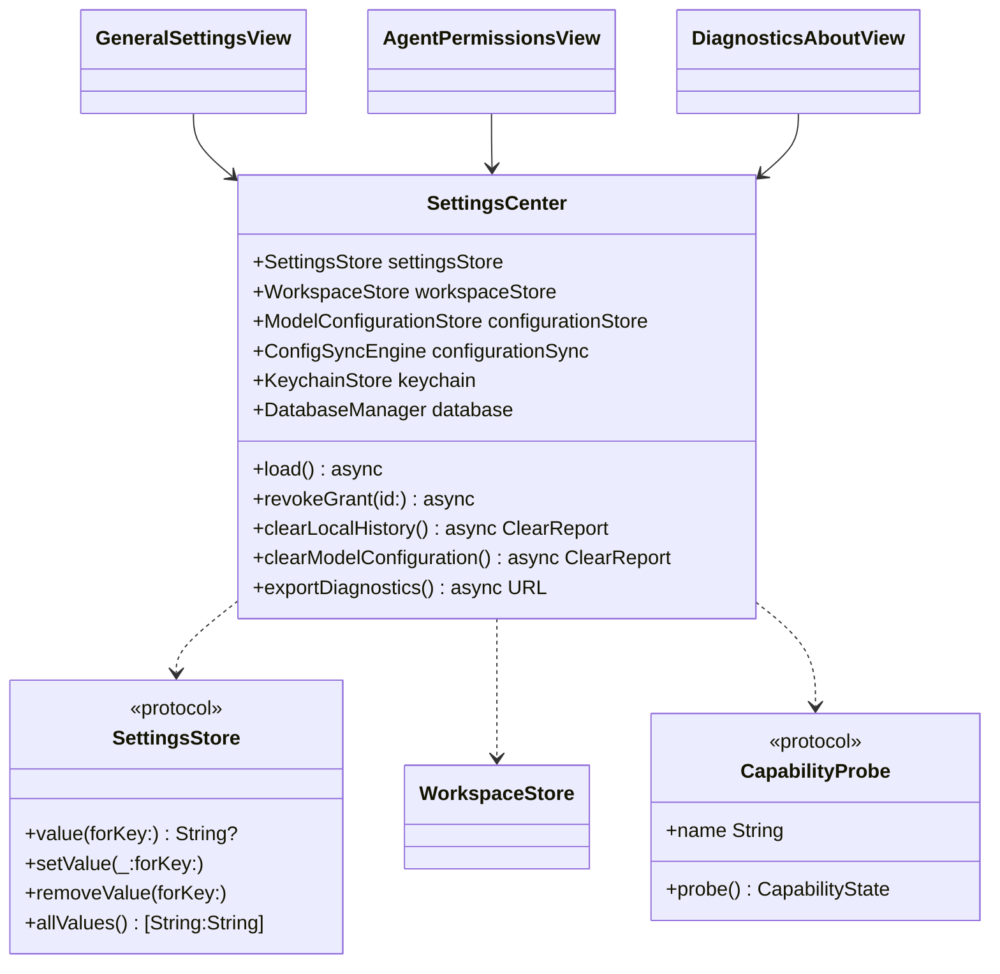
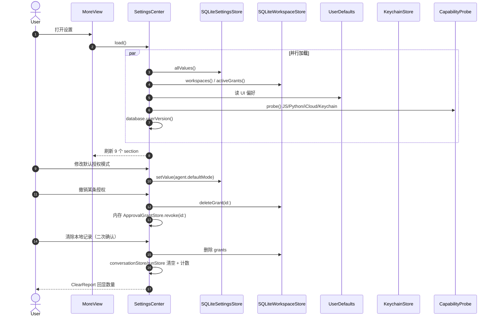
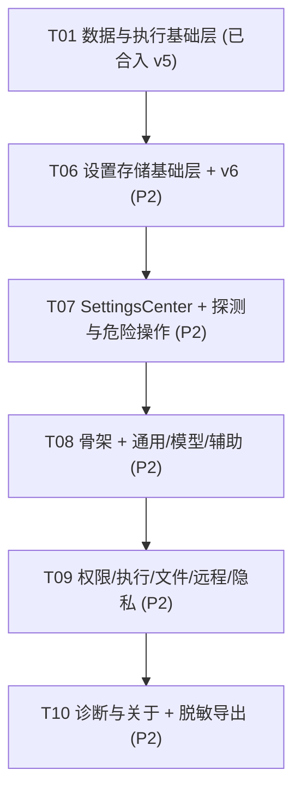

# Floe 设置中心系统设计（P2：9 分类完整设置）

> 分支：`agent/alpha-daily`。本文档只含设计，不含实现代码。
> 现状：`MoreView` 的 Settings 是 `SettingsPlaceholder` 空壳；schema 当前 **v5**（v1–v4 冻结，v5 随 T01 落地）。
> 约束：优先复用现有 store/Center；零新增第三方依赖；凭证只进 Keychain；每项设置必须真实存储或诚实显示不可用；不写安全/发布结论。

---

## Part A：系统设计

### 1. 实现方案

#### 1.1 核心技术难点

| 难点 | 分析 | 对策 |
|---|---|---|
| 设置存储三栖 | 9 个分类的设置分别落在数据库 / UserDefaults / 系统状态探测，且现有 `model_preferences` 表（v4）已占模型路由 | 三分层规则（§2.1）：持久化偏好进新表 `app_settings`（v6 追加）；即时 UI 偏好进 UserDefaults；系统状态只探测不存储 |
| 真实 vs 不可用 | "本地 JS/Python 状态"由 P3 提供探测能力，P2 阶段不能造假 | `CapabilityProbe` 协议（§3.3）：P2 落地真实探针壳 + 诚实 `unavailable(reason:)` 显示；P3 替换实现不动 UI |
| 授权管理 | 授权跨内存（`ApprovalGrantStore`）与持久（v5 `approval_grants`）两层 | `SettingsCenter` 聚合两源；撤销写 DB + 清内存；`WorkspaceStore` 需补 `allGrants`/`deleteGrant` 两个方法（小改） |
| 默认授权模式 | 现有 `HumanApprovalPolicy` 硬编码在 `ConversationCenter.runService` | 新增 `defaultAgentMode` 设置项，`ConversationCenter` 按设置构造 policy；默认 human，不改灾难门禁 |
| 危险操作 | 清除本地记录/清除模型配置需真实删除且可审计 | 全部经 `SettingsCenter` 走 store 删除 + Keychain 删除，UI 二次确认，结果以数量回显，不静默 |

#### 1.2 架构模式

沿用现有分层：`SettingsStore`（SPM 持久化协议 + SQLite 实现）→ `SettingsCenter`（@MainActor 协调器，UI 唯一入口）→ 9 个 section 视图（SwiftUI Form/List）。`SettingsCenter` 聚合 `ModelConfigurationStore`/`WorkspaceStore`/`ConfigSyncEngine`/`KeychainStore`/`DatabaseManager`/系统探测，视图不直接碰 store。复用 `Providers/` 现有编辑/发现/测试连接页面，不复制。

---

### 2. 设置存储设计

#### 2.1 存储分层规则（硬约束）

| 层 | 内容 | 位置 | 规则 |
|---|---|---|---|
| **数据库**（v6 追加） | 跨会话持久化的用户偏好：默认 Agent 模式、默认执行目标、超时/输出上限、SSH/VNC 默认行为、是否保存执行产物、默认项目、默认启动页面 | `app_settings` 键值表 | 追加式迁移；只存非秘密值；键以分类前缀（`agent.`、`exec.`、`remote.`…） |
| **UserDefaults** | 即时 UI 偏好：外观、语言覆盖、动效/触感开关、日期时间显示格式 | `UserDefaults.standard`，键前缀 `floe.settings.` | 不入库；删除 App 即清；不存任何标识符/秘密 |
| **只读系统状态** | Keychain/iCloud Keychain 状态、iCloud Drive 状态、本地 JS/Python 可用性、数据库版本、能力摘要 | 现场探测，不存储 | 每次进页面实时探测；失败诚实显示 unknown |
| **Keychain** | Provider API Key、SSH 密码/密钥、VNC 密码（现有） | 现有 `KeychainStore`/`KeychainSecretStore` | 绝不入库；设置中心只展示"已配置/未配置"与同步开关状态，不展示值 |

#### 2.2 复用与新增表

- **复用**：`model_preferences`（v4）继续承载 onboardingStatus / defaultAgentModelID / auxiliaryImageMode / 三个图像模型 ID；`providers`/`models`（v1/v2）承载供应商与模型；`workspaces`（v5）承载默认项目候选；`approval_grants`（v5）承载已保存授权。
- **新增**：`app_settings` 一张通用键值表即可覆盖全部数据库偏好，避免为每个分类建表。

#### 2.3 schema v6 DDL 草案（追加式，不改 v1–v5）

```sql
-- Generic non-secret user preferences. Keys are namespaced by category
-- ("agent.defaultMode", "exec.timeoutSeconds", ...). Values are JSON
-- scalars/objects. Secrets and identifiers of secrets never land here.
CREATE TABLE app_settings (
    key TEXT PRIMARY KEY,
    value_json TEXT NOT NULL,
    updated_at TEXT NOT NULL
) STRICT;

PRAGMA user_version = 6;
```

迁移测试要点：v1→v6 全链迁移成功、`user_version == 6`、v5 存量（workspaces/approval_grants）行数不变、`app_settings` upsert/删除/类型不符负例。

---

### 3. 关键数据结构与接口

#### 3.1 `SettingsStore`（Sources/FloePersistence/SettingsStore.swift，新建）

```swift
/// Durable, non-secret app preferences backed by `app_settings`.
public protocol SettingsStore: Sendable {
    func value(forKey key: String) async throws -> String?      // JSON 原文
    func setValue(_ json: String, forKey key: String) async throws
    func removeValue(forKey key: String) async throws
    func allValues() async throws -> [String: String]
}
public actor SQLiteSettingsStore: SettingsStore { /* GRDB upsert into app_settings */ }
```

#### 3.2 `SettingsCenter`（FloeApp/More/Settings/SettingsCenter.swift，新建，@MainActor）

```swift
@MainActor
final class SettingsCenter: ObservableObject {
    // 通用
    @Published var appearance: AppearancePreference        // UserDefaults
    @Published var languageOverride: LanguagePreference    // UserDefaults
    @Published var defaultStartPage: AppDestination        // DB app_settings
    @Published var reduceMotionOverride: Bool?             // UserDefaults
    @Published var hapticsEnabled: Bool                    // UserDefaults
    @Published var dateTimeStyle: DateTimeDisplayStyle     // UserDefaults
    @Published var defaultAgentMode: AgentMode             // DB app_settings

    // Agent 与权限
    @Published var savedGrants: [StoredGrant]              // WorkspaceStore
    @Published var fullControlGrants: [FullControlPolicy.Grant] // 内存 grant store 投影

    // 执行环境
    @Published var executionTarget: WorkspaceTarget        // DB app_settings
    @Published var executionTimeoutSeconds: Int            // DB app_settings
    @Published var maxOutputBytes: Int                     // DB app_settings
    @Published var savesArtifacts: Bool                    // DB app_settings
    @Published var jsCapability: CapabilityState           // CapabilityProbe（P3 替换）
    @Published var pythonCapability: CapabilityState       // CapabilityProbe（P3 替换）

    // 文件与 iCloud
    @Published var workspaces: [WorkspaceRecord]           // WorkspaceStore
    @Published var defaultWorkspaceID: UUID?               // DB app_settings
    @Published var iCloudDriveAvailable: Bool              // FileManager.ubiquityIdentityToken
    @Published var configSyncStatus: SyncStatus            // ConfigSyncEngine.status

    // 主机与远程会话
    @Published var sshDefaults: RemoteSessionDefaults      // DB app_settings
    @Published var vncDefaults: RemoteSessionDefaults      // DB app_settings
    @Published var idleDisconnectMinutes: Int              // DB app_settings
    @Published var trustedHosts: [RemoteHostRecord]        // RemoteHostStore（指纹）

    // 诊断与关于
    @Published var databaseUserVersion: Int                // DatabaseManager.userVersion()
    @Published var capabilitySummary: CapabilitySummary    // providers/models/tools 计数

    func load() async
    func setAppearance/_:(_:)                              // 各 setter 落 UserDefaults/DB 并刷新 @Published
    func revokeGrant(id: UUID) async                       // DB delete + 内存 revoke
    func clearLocalHistory() async throws -> ClearReport   // conversations/runs/events 删除计数
    func clearModelConfiguration() async throws -> ClearReport // providers/models/preferences + Keychain key 删除
    func exportDiagnostics() async throws -> URL           // 脱敏文本导出
}
```

#### 3.3 `CapabilityProbe`（Sources/FloeCore/CapabilityProbe.swift，新建）

```swift
public enum CapabilityState: Sendable, Hashable {
    case available(version: String)
    case unavailable(reason: String)
    case unknown
}

/// Runtime capability probe. P2 ships honest probes (JS via JavaScriptCore
/// presence, Python unavailable until P3); P3 replaces implementations
/// without touching the UI.
public protocol CapabilityProbe: Sendable {
    var name: String { get }
    func probe() async -> CapabilityState
}
```

#### 3.4 值类型（Sources/FloeCore/AppSettings.swift，新建）

`AppearancePreference{system,light,dark}`、`LanguagePreference{system,en,zhHans}`、`DateTimeDisplayStyle{relative,absolute}`、`AgentMode{human,approvalModel,fullControl}`、`RemoteSessionDefaults{autoReconnect:Bool, keepAlive:Bool}`、`ClearReport{deletedConversations:Int, deletedRuns:Int, deletedGrants:Int, deletedKeychainItems:Int}`、`CapabilitySummary{providerCount:Int, modelCount:Int, toolCount:Int, adapterKinds:[String]}`。



---

### 4. 程序调用流程



---

### 5. 设置中心信息架构与每分类数据来源

iPad：把 `MoreDestination.settings` 展开为 `NavigationSplitView` 主从——左侧 9 分类列表，右侧对应 section；iPhone：`NavigationStack` 推进。新增 `FloeApp/More/Settings/` 目录，每分类一个 section 视图 + 根 `SettingsRootView`。

| # | 分类（视图文件） | 设置项 → 真实来源 |
|---|---|---|
| 1 | **通用** `GeneralSettingsView` | 语言 → UserDefaults 覆盖 + 系统 `Locale`；外观 → UserDefaults；默认启动页面 → DB `app_settings[ui.defaultStartPage]`；动效 → UserDefaults 覆盖 + `accessibilityReduceMotion`；触感 → UserDefaults；日期时间显示 → UserDefaults；默认 Agent 模式 → DB `app_settings[agent.defaultMode]`（`ConversationCenter` 读取） |
| 2 | **模型与供应商** `ProvidersSettingsView` | 复用现有 `ProviderListView`/`ProviderEditorView`/`ModelPickerView`（`ModelConfigurationStore` + `ConfigSyncEngine`）；三协议不回退 |
| 3 | **辅助模型** `AuxiliarySettingsView` | 复用 `AuxiliaryModelsView`；共享/分开、默认生成/编辑模型 → `model_preferences`（v4）；能力状态 → `ModelProfile.capabilities`；未实现适配器按 `ProviderKind` 诚实显示"未实现" |
| 4 | **Agent 与权限** `AgentPermissionsView` | 默认授权模式 → DB；完全控制说明 → 静态文案；已保存授权 → v5 `approval_grants` + 内存 `ApprovalGrantStore`；撤销 → `WorkspaceStore.deleteGrant` + 内存 revoke；灾难性操作保护 → `CatastrophicActionGate` 加载状态（failClosed 红显） |
| 5 | **执行环境** `ExecutionEnvironmentView` | 本地 JS → `JavaScriptCore` 框架可链接探测（真实）；本地 Python → P2 诚实 `unavailable(P3 未落地)`；远程 Python/终端 → `RemoteHostStore` 主机数 + `RemoteSessionRegistry` 活跃会话；默认执行目标/超时/最大输出/保存产物 → DB `app_settings[exec.*]` |
| 6 | **文件与 iCloud** `FilesSettingsView` | 工作空间列表/默认项目 → `WorkspaceStore` + DB `app_settings[files.defaultWorkspace]`；iCloud Drive → `FileManager.ubiquityIdentityToken` 探测；配置同步 → `ConfigSyncEngine.status/lastSyncAt`；缓存管理 → 计算 `Application Support/FloeAgent` tmp 体积 + 清理按钮（真实删除临时文件） |
| 7 | **主机与远程会话** `RemoteSettingsView` | SSH/VNC 默认行为、长连接、空闲断开 → DB `app_settings[remote.*]`；主机指纹/授权 → `RemoteHostStore`（已知主机 + host key 指纹记录） |
| 8 | **隐私与安全** `PrivacySecurityView` | Keychain 状态 → 尝试读写临时条目探测；iCloud Keychain → `SecretReference.synchronizable` 统计；API Key 同步说明 → 静态文案 + 每 provider 同步开关状态；清除本地记录/模型配置 → `SettingsCenter.clear*`；导出诊断脱敏说明 → 静态文案 + `SecretRedactor` 说明 |
| 9 | **诊断与关于** `DiagnosticsAboutView` | 版本/构建号 → `Bundle.main.infoDictionary`；数据库版本 → `DatabaseManager.userVersion()`；能力摘要 → providers/models/ToolCatalog 计数 + `ProviderKind` 列表；运行日志 → `FloeLogger`（os.log）导出说明 + 脱敏导出按钮；开源许可/隐私说明 → 复用 `PrivacyView` + 新增许可文本资源 |

**诚实不可用规则**：P3 未落地的能力（本地 Python、远程 Python、部分图像适配器）显示 `unavailable(reason:)` 灰显行 + 说明文字，不显示开关假装可用。

---

### 6. 待明确事项（假设已注明）

1. **schema 版本**：设计按 v6 追加；若 T05 已占用 v6，则顺延 v7——DDL 与迁移编号以合入时实际版本为准。
2. **UserDefaults vs DB 边界**：本设计把"即时 UI 偏好"（外观/语言/动效/触感/日期格式）放 UserDefaults，把"跨会话行为偏好"（默认模式/执行目标/远程默认）放 DB；如需统一进 DB 便于未来同步，可在 `app_settings` 中加 `ui.*` 键平移。
3. **Keychain 探测方式**：假设用一个 `floe.settings.probe` 临时条目做写入-读取-删除探测；失败即显示不可用。
4. **运行日志导出**：`os.log` 无法直接读取历史，导出为"当前会话内缓冲 + 脱敏"需 `FloeLogger` 增加内存环形缓冲（P2 范围内小改）；如需完整历史导出则依赖 OSLogStore（iOS 15+，沙盒内仅本进程）。
5. **默认授权模式生效点**：`ConversationCenter.runService` 目前硬编码 `HumanApprovalPolicy()`；T06 需改为读取 `agent.defaultMode` 构造对应 policy，但 fullControl 仍需 Face ID/密码 + 风险确认（UI 层）。

---

## Part B：任务分解

### 7. 依赖包

**零新增第三方依赖。** 全部系统能力 + 现有模块：

```
- Foundation / SwiftUI / UIKit / JavaScriptCore（系统）: 设置存储、UI、JS 探测
- GRDB 7.8.0（现有）: app_settings 持久化
- CloudKit（现有 ConfigSyncEngine）: 同步状态展示
- os.log（系统）: 日志导出
```

### 8. 有序任务列表（≤5，按依赖排序）

| Task | 名称 | 源文件（新建 ✚ / 修改 ✎） | 依赖 | 优先级 |
|---|---|---|---|---|
| **T06** | 设置存储基础层 + v6 迁移 | `Sources/FloePersistence/Migrations/V6AppSettings.swift`✚、`Sources/FloePersistence/DatabaseManager.swift`✎（注册 v6，`currentSchemaVersion = 6`）、`Sources/FloePersistence/SettingsStore.swift`✚、`Sources/FloeCore/AppSettings.swift`✚（值类型）、`Sources/FloeCore/CapabilityProbe.swift`✚、`Sources/FloePersistence/WorkspaceStore.swift`✎（补 `allGrants`/`deleteGrant`）、`Tests/FloePersistenceTests/V6AppSettingsTests.swift`✚、`Tests/FloePersistenceTests/SettingsStoreTests.swift`✚ | T01（v5 已合入） | P2 |
| **T07** | SettingsCenter + 探测与危险操作 | `FloeApp/More/Settings/SettingsCenter.swift`✚、`FloeApp/More/Settings/SettingsProbes.swift`✚（JS/iCloud/Keychain/同步状态探针）、`FloeApp/More/Settings/SettingsActions.swift`✚（清除记录/清除模型配置/撤销授权/导出诊断）、`FloeApp/App/AppEnvironment.swift`✎（装配 settingsCenter + SettingsStore）、`FloeApp/Remote/ConversationCenter.swift`✎（按 `agent.defaultMode` 构造 policy） | T06 | P2 |
| **T08** | 设置中心骨架 + 通用/模型/辅助三分类 | `FloeApp/More/Settings/SettingsRootView.swift`✚（iPad 主从 / iPhone 导航）、`FloeApp/More/Settings/GeneralSettingsView.swift`✚、`FloeApp/More/Settings/ProvidersSettingsView.swift`✚（复用 Providers/）、`FloeApp/More/Settings/AuxiliarySettingsView.swift`✚（复用 AuxiliaryModelsView）、`FloeApp/More/MoreView.swift`✎（SettingsPlaceholder → SettingsRootView）、`FloeApp/Shell/AppDestination.swift`✎（如需要拆设置子路由）、`FloeApp/Resources/Localizable.xcstrings`✎ | T07 | P2 |
| **T09** | 权限/执行/文件/远程/隐私五分类 | `FloeApp/More/Settings/AgentPermissionsView.swift`✚、`FloeApp/More/Settings/ExecutionEnvironmentView.swift`✚、`FloeApp/More/Settings/FilesSettingsView.swift`✚、`FloeApp/More/Settings/RemoteSettingsView.swift`✚、`FloeApp/More/Settings/PrivacySecurityView.swift`✚、`FloeApp/Resources/Localizable.xcstrings`✎ | T08 | P2 |
| **T10** | 诊断与关于 + 脱敏导出 + 收尾 | `FloeApp/More/Settings/DiagnosticsAboutView.swift`✚、`Sources/FloeCore/FloeLogger.swift`✎（内存环形缓冲用于导出）、`FloeApp/More/Settings/DiagnosticsExporter.swift`✚（脱敏导出）、许可/隐私资源文件✚、`Tests/FloeAgentUITests/SettingsFlowTests.swift`✚（关键路径 UI 测试） | T09 | P2 |

### 9. 跨文件约定（共享知识）

```
- 设置读取唯一入口 SettingsCenter；视图不直接 import UserDefaults/Store。
- app_settings 键命名 "<category>.<name>"（agent./exec./remote./files./ui.）；值一律 JSON。
- 凭证只进 Keychain；设置中心只显示"已配置/未配置"与同步开关，绝不回显秘密值。
- 未落地能力（本地/远程 Python、部分图像适配器）必须显示 unavailable(reason:)，禁止假开关。
- 撤销授权双写：SQLiteWorkspaceStore.deleteGrant + ApprovalGrantStore.revoke。
- 清除类操作二次确认 + 返回 ClearReport 计数回显；不静默成功。
- 本地化沿用 Localizable.xcstrings（en + zh-Hans）；颜色/字体沿用 FloeTheme token。
- 迁移纪律：v1–v5 冻结；v6 只新增 app_settings；迁移后全量测试必跑。
```

### 10. 任务依赖图


