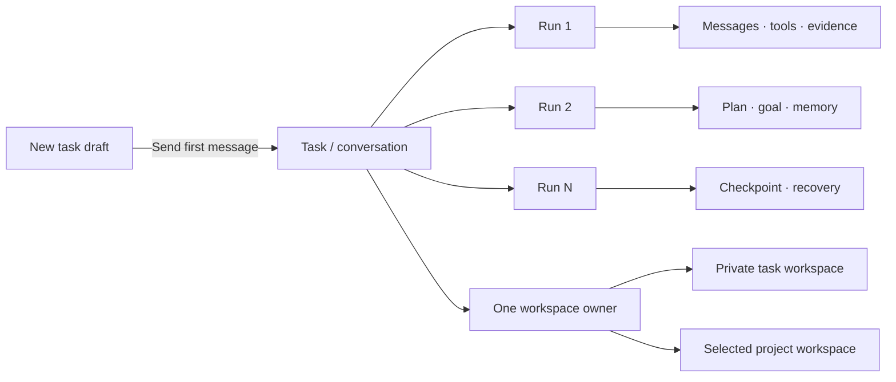
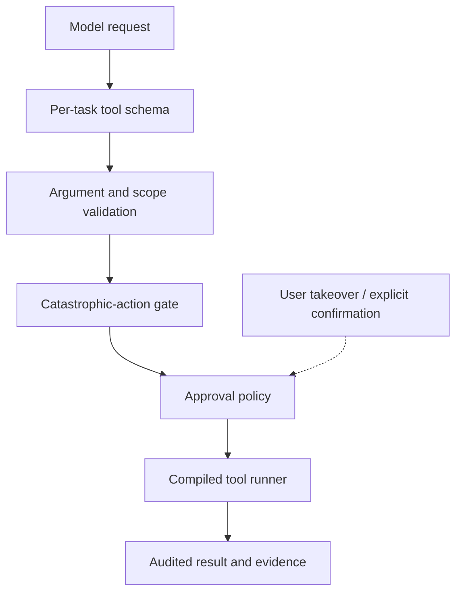

<div align="center">
  
  <h1>Floe Agent for iPad &amp; iPhone</h1>
  <p><strong>Floe — Native iOS AI Agent</strong></p>
  <p>Your models. Your files. Your machines.</p>
  <p>A private, bring-your-own-key AI agent workspace built natively for iPad first, with iPhone support.</p>
  <p>
    <a href="README.zh-CN.md">简体中文</a> ·
    <a href="https://www.floe-agent.com/">Website</a> ·
    <a href="docs/USER_GUIDE.md">User guide</a> ·
    <a href="https://github.com/JiangNanGenius/floe-agent/releases">Releases</a> ·
    <a href="SECURITY.md">Security</a>
  </p>
</div>

[](https://github.com/JiangNanGenius/floe-agent/releases)
[](FloeAgent/project.yml)
[](FloeAgent/Package.swift)
[](LICENSE)


<p align="center">
  <a href="https://www.floe-agent.com/#download"><strong>Add to Feather</strong></a>
  ·
  <a href="https://www.floe-agent.com/#download"><strong>Add to AltStore</strong></a>
  ·
  <a href="https://github.com/JiangNanGenius/floe-agent/releases"><strong>Download releases</strong></a>
</p>


Floe Agent turns a model conversation into a durable task. Each message continues the same task, while every model execution becomes a separate run with its own progress, tool evidence, approvals, checkpoints, and recovery state. A task can use an app-managed private workspace or an explicitly selected project workspace.

## Floe 1.7 internal beta

**Current internal TestFlight: 1.7.0 (218).** Apple VALID, unexpired and IN_BETA_TESTING in the existing private Floe QA group, verified September 21 at 15:08 UTC. This build adds an explicit Linux download-and-start path, Office CJK font and Pencil repairs, distinct standalone and IDE Office routes, IDE source control and archive browsing, and stable multi-turn local-model tools. TinyEMU/Linux remains the main local environment; native Python/Node payloads are excluded. Device acceptance belongs to the user. [Release notes](docs/RELEASE_NOTES_1.7.0_BUILD_218.md) · [Delivery record](docs/TESTFLIGHT_1.7.0_BETA.md).

Floe 1.7 upgrades the iPad-first Notes workspace with illustrated mind maps, native Office editing, image and creative tools, on-device speech, and task-owned environments running TinyEMU/Linux. TinyEMU provides the main local Linux path; guest package managers own Linux language/tool installation, while WASM remains a separate compatibility route. See the [implementation status](docs/FLOE_1_7_IMPLEMENTATION_STATUS.md), [migration guide](docs/FLOE_1_7_MIGRATION.md), [build boundaries](docs/FLOE_1_7_BUILD_AND_ACCEPTANCE.md) and [version archive](docs/README.md).

### Notes, Office and local speech

Notes (手记) is a separate workspace above Creative mode, with its own durable content and undo history while sharing Floe models, tools and permissions. PDF/image annotation, [illustrated mind maps with document windows](docs/FLOE_1_7_MIND_MAPS.md), Office editing, selection questions and editable archives are being integrated. The whole app prioritizes iPadOS 27, also validates iPhone, and keeps version 26 compatible.

Mind maps reflow as topics, images and branches change, preserve zoom during editing, and fit independent PDF windows. Notes supports Trash recovery and confirmed permanent deletion with deferred collection that protects shared files and undo history.

Voice input, video automatic captions and Agent file transcription now share on-demand multilingual Whisper Small with Apple recognition fallback. Timed exports support SRT, VTT and JSON. Home, conversations and Canvas can explicitly select Notes material and revoke access. Installing speech resources does not establish bilingual recognition quality. See the [implementation and evidence record](docs/FLOE_1_7_CONTINUATION_STATUS.md) for remaining work; full package/model delivery and physical-device acceptance remain incomplete.

## Why Floe Agent

- **Bring your own models.** Connect compatible providers with credentials you control. Agent, vision, image-generation, and image-editing roles can be configured independently.
- **Run on device when it fits.** Use the iOS 27 Apple Foundation Model or downloaded MLX models. Local models have their own context and memory policy, while cloud-model context and tools remain unchanged.
- **Keep work inspectable.** Reasoning previews, tool calls, file changes, browser state, child agents, approvals, and errors live in one continuous timeline.
- **Work where the files are.** Use Files workspaces, local image tools, SSH terminals, jump hosts, VNC, and a visible WebKit browser without a Floe-operated relay.
- **Build visual workflows inside the workspace.** Each workspace can open one native infinite-canvas project with multiple canvases, direct touch navigation, editable content nodes, explicit generation-task nodes, artifact nodes, in-place node AI, and a scoped Canvas Assistant.
- **Connect standard MCP servers.** Add optional Streamable HTTP servers for ordinary Agent runs; every remote tool remains namespaced, locally policy-checked, and disabled for canvas by default.
- **Manage source without leaving the workspace.** Inspect changes and diffs, initialize a repository, stage, commit, branch, fetch, fast-forward pull, push, and connect GitHub from a lightweight native source-control surface.
- **Convert existing documents directly.** Convert Markdown, Word, HTML, RTF and text files, with PDF input/output. The model supplies paths instead of rewriting the body; source files remain intact and scanned-page/format limits are reported.
- **Create and revise Office files.** Build DOCX, XLSX and PPTX locally, inspect read-only inline previews, then enter fullscreen to edit document pages, spreadsheet cells and slide objects with the local Office engine. Full functionality and layout fidelity remain under qualification; documents need not be uploaded.
- **Run long work in the background.** Submit large downloads and Python data jobs with a jobID, keep conversing, and collect results on completion — with suspension-surviving downloads and local notifications.
- **Render Chinese documents correctly.** A curated bundle of nine open-license CJK font families serves the Office engine, PDF editing, and web previews alike.
- **Approve consequential actions.** Task policies narrow file, network, browser, upload, credential, and remote-execution authority. Sensitive actions still require explicit confirmation.
- **Resume honestly.** Checkpoints, notifications, and background coordination preserve safe progress. iOS suspension and uncertain side effects are reported instead of hidden.
- **Extend with audited skills.** Skill Creator and Skill Finder install validated instruction and knowledge packages. A skill may bundle bounded UTF-8 Python scripts and exact-version pure-Python wheels: Floe audits them once at creation or installation, then permits only identical script and dependency fingerprints to run without repeated prompts. Native code, install hooks, changed code, and silent tool grants remain blocked.
- **Automate with Apple platforms.** App Intents expose immediate and scheduled Floe tasks to Shortcuts, while device-local controls govern Calendar, Reminders, Home, Maps, vision, documents, camera, location, and related integrations.

## The task model



The app normally opens directly into **New Task**. Sending the first message creates the task, workspace ownership, initial run, user message, attachments, and task policy atomically. Later messages create new runs inside the same task, so context does not fragment into unrelated jobs.

## Get started

### TestFlight

Floe Agent **1.7.0 (build 191)** is the latest build recorded as available to the **Floe QA internal TestFlight group**. See the [TestFlight availability record](docs/TESTFLIGHT_1.7.0_BETA.md) and the [build 191 release notes](docs/RELEASE_NOTES_1.7.0_BUILD_191.md). Floe Agent **1.7.0 (build 196)** is available to the **Floe QA internal TestFlight group** (VALID / IN_BETA_TESTING at 2026-09-19 02:24 UTC). See the [build 196 notes](docs/RELEASE_NOTES_1.7.0_BUILD_196.md) and the [TestFlight record](docs/TESTFLIGHT_1.7.0_BETA.md). Builds 192 and 193 never compiled; builds 194 and 195 were accepted by Apple but never published — [192](docs/RELEASE_NOTES_1.7.0_BUILD_192.md), [193](docs/RELEASE_NOTES_1.7.0_BUILD_193.md), [194](docs/RELEASE_NOTES_1.7.0_BUILD_194.md), [195](docs/RELEASE_NOTES_1.7.0_BUILD_195.md) records. Earlier 1.5.3 evidence is retained in the [historical verification record](docs/RELEASE_VERIFICATION_1.5.3.md).

### Unsigned IPA

GitHub prereleases include an unsigned IPA for advanced testers and downstream packagers:

1. Download the IPA and `.sha256` file from [Releases](https://github.com/JiangNanGenius/floe-agent/releases).
2. Verify the checksum before opening or re-signing it.
3. Inspect the source and attached SBOM, license inventory, test summary, and provenance.
4. Sign the IPA with your own certificate and provisioning profile using a tool you trust.

> [!WARNING]
> The GitHub IPA is not the TestFlight/App Store package and cannot normally be installed as downloaded. Floe Agent does not provide signing certificates or a sideloading service.

### Feather source

The stable Floe feed is published at `https://raw.githubusercontent.com/JiangNanGenius/floe-agent/main/feather.json`. Open the [download page](https://www.floe-agent.com/#download) and choose **Add to Feather** or **Add to AltStore**, or paste the source URL into the app's Sources screen. GitHub's Markdown sanitizer removes `feather://` and `altstore://` links, so the website is the working quick-add entry. The independently verified publishing process and manual source URL are described in the [source guide](docs/FEATHER_SOURCE.md).

### Build from source

Requirements: macOS, a full Xcode installation with the iOS 26 SDK or newer, Swift 6.2+, and XcodeGen. Xcode 27 is required to compile the iOS 27 Foundation Models path used by the current release target.

```bash
git clone https://github.com/JiangNanGenius/floe-agent.git
cd floe-agent/FloeAgent
brew install xcodegen
xcodegen generate
scripts/local_build.sh
```

For focused checks:

```bash
swift build
swift test
DEVELOPER_DIR=/Applications/Xcode.app/Contents/Developer \
  xcodebuild -project FloeAgent.xcodeproj -scheme FloeAgent \
  -destination 'generic/platform=iOS Simulator' build
```

See the [English user guide](docs/USER_GUIDE.md), [简体中文使用指南](docs/USER_GUIDE.zh-CN.md), and [developer README](FloeAgent/README.md) for the complete setup path.

## Core surfaces

| Surface | Purpose |
| --- | --- |
| New Task | Choose a model, workspace, execution target, skills, and task permissions before the first message. |
| Task thread | Continue the same conversation across runs and inspect reasoning, tools, evidence, questions, and approvals. |
| Task Center | Filter running, waiting, approval-required, failed, completed, and scheduled tasks. |
| Inspector | Review changes, files, browser, terminal/host, progress, and child agents. It is collapsed by default; current-task permissions live only below the chat composer. |
| Visible browser | Automate a real `WKWebView`, then hand control to the user for login, QR codes, verification, uploads, or other trusted interaction. |
| Source Control | Review repository status, diffs and history; stage, commit, branch and synchronize without destructive reset, clean, force-push or history rewriting. |
| Workspace Canvas | Arrange content → task → artifact flows on a native infinite surface. Refine a selected node in place with AI, save generation settings, then explicitly start and monitor the task. |
| Standard MCP | Connect optional Streamable HTTP tool servers for ordinary Agent runs, with per-server and per-tool controls. |
| Settings | Configure providers, auxiliary models, task defaults, execution, files, sync, remote hosts, data controls, and diagnostics. |

### Models and image providers

The system-owned Apple Foundation Model appears in **Settings → Local Models** on every device. On iOS/iPadOS 27 it uses the Foundation Models framework and reports the system's real availability state, including device eligibility, Apple Intelligence being disabled, or the model still downloading. There is no API-key or model-download setting because iOS owns both. It answers ordinary conversation directly rather than requiring every turn to be phrased as an action. Downloaded Qwen and Gemma MLX models are separate: Floe checks safe load headroom, keeps at most one resident model, uses quantized device-budgeted KV/prefill settings, releases transient MLX caches after each generation, and supplies a bounded catalog of real task tools. All on-device models run in text-only mode to avoid loading a vision projector. Attached images are transcribed with Apple Vision OCR into a task-workspace text file; PDF inspection, rendering and OCR remain available, while semantic `image.inspect` is reserved for compatible cloud models.

Every enabled model has a separate **Hide from primary model picker** switch. It is off by default. Hiding a model removes it only from the New Task/Home model menu, so it can remain configured for auxiliary roles, internal routing and existing tasks.

OpenAI image generation/editing defaults to `gpt-image-2`. Google Gemini Images includes Nano Banana Pro (`gemini-3-pro-image`). Both provider entries accept an editable Base URL for compatible proxies; generation, editing and vision remain separate roles.

### Workspaces, Git and approvals

Private task workspaces are created and bound atomically with the first message. Project workspaces retain their explicit Files scope. The Files inspector includes a lightweight Source Control tab, while **Settings → GitHub & Source Control** supports GitHub's official device authorization flow plus fine-grained token fallback. Credentials remain in the device Keychain, with repository listing, cloning, and creation available after connection.

Routine bounded reads, local workspace operations, image generation/inspection, OCR, read-only PDF work and LAN discovery do not wait for an approval-model round trip. The composer permission control saves immediately and can change a live task. Once the user requests installation, deployment, environment repair, or a Floe guardian update, ordinary system packages, package-source changes, dependency repair, and Floe's verified atomic guardian update do not interrupt for command-by-command approval. Destructive changes, credentials, uploads, payments, ambiguous broad remote commands and force/history-rewriting Git operations remain blocked or explicitly reviewed. A broad request such as “test all tools” can authorize safe diagnostics, but cannot silently expand into destructive or credential-bearing tests.

### Python execution

Local Python, Node.js, shell commands and services run in the selected TinyEMU/Linux environment. Download the verified Linux component from Settings → Execution. Shell and direct Python share that environment’s files and packages. apt/dpkg install Linux packages; Python uses pip/venv and Node uses npm. Native iOS Python/Node source and recipes are archived, and their runtime payloads are excluded from this App. Binary packages must match the Linux guest ABI; iOS wheels are not reused as Linux binaries. WASM remains a separate compatibility capability.

Skills may carry bounded `.py` files plus exact pure-Python package requirements. Floe validates script paths and source, resolves and inspects universal wheels at install time, and records the approved script/package fingerprints. Later runs may reuse only that exact audited code with changing task input passed separately as JSON; edits, dependency changes, privileged operations, destructive file changes, credentials and external side effects return to the normal approval path.

### Native Office documents — published 1.5.3 baseline

Floe can create DOCX documents, multi-sheet XLSX workbooks with values and formulas, and 16:9 PPTX decks with slide notes. The document package is generated and checked locally, without a web editor or office-cloud upload. Opening an Office file keeps the system preview as the first layer; **Edit Office document** enters a separate basic editor for manual Word text, spreadsheet cells/formulas, PowerPoint text and speaker notes. Saving applies only changed semantic fields, rewrites the OOXML package atomically, and preserves untouched package parts such as styles, media and relationships. Advanced layout fidelity, charts, macros, ActiveX and full desktop Office parity are not claimed.

The development branch replaces this basic editor with the native Office frontend described in the upgrade section above. Its complete acceptance remains in progress.

For statistics without external packages, `exec.localNumerical` implements bounded R-, Stata- and MATLAB/Octave-compatible expressions, descriptive statistics, quantiles, correlation and simple OLS. It does not claim to bundle the proprietary Stata runtime: PyStata requires a licensed Stata installation, and native-extension packages such as `pyreadstat` must run on a configured host rather than inside the pure-Python iOS package sandbox.

### Archive and credential sync

**Settings → Data Management** combines total/category storage accounting, safe cache cleanup, archived-task restore/single/batch deletion, and one Floe-global font library. Import a validated font once from Files or a public HTTPS URL and reuse it in Word/PDF work across every workspace; bounded install/system-font resolution bypass approval-model latency, while cross-workspace removal remains reviewed. The task list still supports swipe-to-archive and permanent deletion always requires confirmation. Configuration sync covers provider/model profiles and non-secret host metadata; API keys use iCloud Keychain. The separate **Sync saved credentials** switch is off by default and publishes only vault descriptors to CloudKit while SSH, VNC, website, and token secret bytes remain in Keychain. Task/workspace-scoped temporary credentials never sync.

## Security boundary




API keys belong in Keychain, model output is treated as untrusted input, and executor-side checks reject forged or out-of-scope tool calls. Browser login, credentials, uploads, payments, destructive operations, and broadly dangerous commands do not become safe merely because a task or Skill requested them.

Floe Agent does **not** provide a hosted model proxy, Floe account, remote relay, advertising SDK, model marketplace, arbitrary on-device execution of downloaded code, or a guarantee that iOS keeps a long-running connection alive indefinitely.

## Documentation

| Read | English | 简体中文 |
| --- | --- | --- |
| Product use | [User guide](docs/USER_GUIDE.md) | [使用指南](docs/USER_GUIDE.zh-CN.md) |
| Architecture | [Architecture overview](docs/ARCHITECTURE_OVERVIEW.md) | Bilingual diagrams and terminology in the same document |
| Development | [Contributing](CONTRIBUTING.md) | [贡献指南](CONTRIBUTING.zh-CN.md) |
| Security | [Security policy](SECURITY.md) | [安全策略](SECURITY.zh-CN.md) |
| Support | [Support](SUPPORT.md) | [支持](SUPPORT.zh-CN.md) |
| Design | [Design direction](docs/WORKFLOW_UPGRADE.md) | Key terms include Chinese equivalents |

Internal plans, audits, validation notes and release handoffs are intentionally not published in this repository.

## Project principles

1. Keep credentials, files, and machines under user control.
2. Make the current task, next decision, and supporting evidence legible.
3. Prefer recoverability and honest interruption over pretending work continued.
4. Make powerful access explicit, scoped, time-bounded, and stoppable.
5. Treat model output, remote content, Skill packages, and tool arguments as untrusted input.

## Contributing and license

Before a large or security-sensitive change, read [CONTRIBUTING.md](CONTRIBUTING.md) and open an issue describing the user problem, scope, security impact, and verification plan. Report vulnerabilities privately through the process in [SECURITY.md](SECURITY.md).

Original Floe Agent code is licensed under the [Mozilla Public License 2.0](LICENSE). Third-party components retain their own licenses and notices.

The 1.7 UI continuation adds General → Automatic/Light/Dark appearance, project/conversation container management, and foldable reasoning/tool batches. Availability and beta qualification are tracked in the [implementation status](docs/FLOE_1_7_IMPLEMENTATION_STATUS.md).

Engineering viewers are being added to workspace files and the IDE: [format matrix and current verification status](docs/FLOE_ENGINEERING_VIEWERS.md). DXF/DWG now have local line/circle/text editing and guarded saves; 3D/PCB previews offer an AI review attachment with parsed information. CAD round trips and independent DWG reads passed on synthetic samples; native App acceptance and KiCad integration remains pending.
