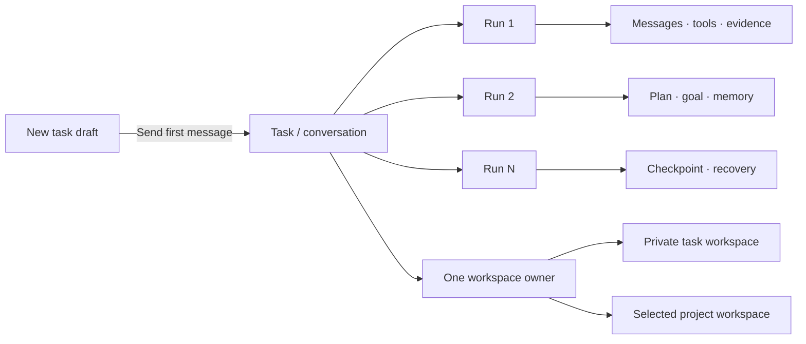
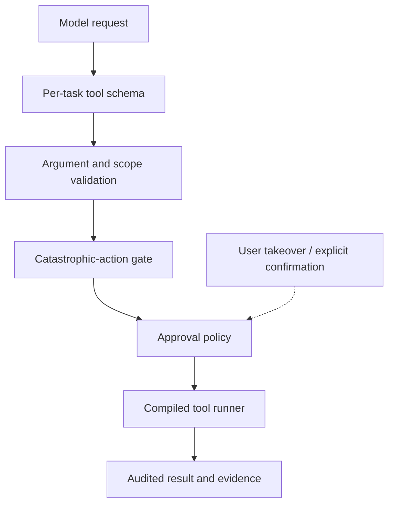

<div align="center">
  
  <h1>Floe Agent for iPad &amp; iPhone</h1>
  <p><strong>Floe — Native iOS AI Agent</strong></p>
  <p>Your models. Your files. Your machines.</p>
  <p>A private, bring-your-own-key AI agent workspace built natively for iPad first, with iPhone support.</p>
  <p>
    <a href="README.zh-CN.md">简体中文</a> ·
    <a href="https://www.floe-agent.com/">Website</a> ·
    <a href="docs/USER_GUIDE.md">User guide</a> ·
    <a href="https://github.com/JiangNanGenius/floe-agent/releases">Releases</a> ·
    <a href="SECURITY.md">Security</a>
  </p>
</div>

[](https://github.com/JiangNanGenius/floe-agent/releases)
[](FloeAgent/project.yml)
[](FloeAgent/Package.swift)
[](LICENSE)


<p align="center">
  <a href="https://www.floe-agent.com/add/feather"></a>
  &nbsp;
  <a href="https://www.floe-agent.com/add/altstore"></a>
  &nbsp;
  <a href="https://github.com/JiangNanGenius/floe-agent/releases"><strong>Download releases</strong></a>
</p>


Floe Agent turns a model conversation into a durable task. Each message continues the same task, while every model execution becomes a separate run with its own progress, tool evidence, approvals, checkpoints, and recovery state. A task can use an app-managed private workspace or an explicitly selected project workspace.

## Floe 1.7 internal beta

**Current internal TestFlight: 1.7.0 (230).** Immutable tag `v1.7.0-beta.87` binds source `06c15e35`; [release run 36256360563](https://github.com/JiangNanGenius/floe-agent/actions/runs/36256360563) built with Xcode 26.6, retained the unsigned IPA (739,518,631 bytes; SHA-256 `1dc9a10bdaaf1fd5ea9022cc5ceee9249d196cccf2202258e28e195383bc16b9`), uploaded the signed build and published the [GitHub prerelease](https://github.com/JiangNanGenius/floe-agent/releases/tag/v1.7.0-beta.87). [Prepare run 36259276773](https://github.com/JiangNanGenius/floe-agent/actions/runs/36259276773) read back both beta-note languages; [verify run 36259380555](https://github.com/JiangNanGenius/floe-agent/actions/runs/36259380555) confirmed Apple `VALID`, unexpired and `IN_BETA_TESTING` in the sole private internal Floe QA group. [Build 230 release notes](docs/RELEASE_NOTES_1.7.0_BUILD_230.md) · [Delivery record](docs/TESTFLIGHT_1.7.0_BETA.md).

**Build 230 targets the observed iPad MLX crash and PPT loading regression.** Bounded local-model context and an MLX prefill error check address the ordinary-chat crash path; the cloud real-weight host completed two separate file-tool calls with receipts and continuations. Office host readiness and IDE tab loading were repaired and the pinned host was embedded in the IPA. Two-core Linux remains unavailable: the shipping guest has one vCPU. Cloud runs and packaging do not establish physical-device behavior.

**Physical-device acceptance remains open.** The iPad still needs to confirm PPT open/edit/save/reopen in Workspace, Notes and IDE; Office exit and cancellation; and local-model loading, benchmark, multi-turn chat and tool use. The packaged Office host was verified in the IPA, but the simulator cannot run its native engine or prove a painted slide. PiP, notifications and keyboard/touch behavior also remain device checks.

**Build 224 never compiled.** Its immutable tag `v1.7.0-beta.81` (`c36b7b24`) and failed accepted-SDK run [35767875337](https://github.com/JiangNanGenius/floe-agent/actions/runs/35767875337) (exit 65, no artifact or upload) are retained as the failure record; see the [Build 224 notes](docs/RELEASE_NOTES_1.7.0_BUILD_224.md) and the Build 225 failure table.

**Distribution channels are separate.** GitHub has the Build 230 prerelease and unsigned IPA; Apple validation and Floe QA group verification have passed. [Gitee release-sync run 36258647317](https://github.com/JiangNanGenius/floe-agent/actions/runs/36258647317) created the matching [Gitee prerelease](https://gitee.com/JiangNanGenius/floe-agent/releases/tag/v1.7.0-beta.87) with six small assets and a manifest. The 705.3 MiB IPA could not be attached because the 1 GiB repository attachment quota had only 28.9 MiB free; use the GitHub IPA.

Floe 1.7 upgrades the iPad-first Notes workspace with illustrated mind maps, native Office editing, image and creative tools, on-device speech, and task-owned environments running TinyEMU/Linux. TinyEMU provides the main local Linux path; guest package managers own Linux language/tool installation, while WASM remains a separate compatibility route. See the [implementation status](docs/FLOE_1_7_IMPLEMENTATION_STATUS.md), [migration guide](docs/FLOE_1_7_MIGRATION.md), [build boundaries](docs/FLOE_1_7_BUILD_AND_ACCEPTANCE.md) and [version archive](docs/README.md).

### Notes, Office and local speech

Notes (手记) is a separate workspace above Creative mode, with its own durable content and undo history while sharing Floe models, tools and permissions. PDF/image annotation, [illustrated mind maps with document windows](docs/FLOE_1_7_MIND_MAPS.md), native Office editing, selection questions and editable archives are available; full Office layout fidelity and physical-device acceptance remain tracked in the [implementation status](docs/FLOE_1_7_IMPLEMENTATION_STATUS.md). The whole app prioritizes iPadOS 27, also validates iPhone, and keeps version 26 compatible.

Mind maps reflow as topics, images and branches change, preserve zoom during editing, and fit independent PDF windows. Notes supports Trash recovery and confirmed permanent deletion with deferred collection that protects shared files and undo history.

Voice input, video automatic captions and Agent file transcription now share on-demand multilingual Whisper Small with Apple recognition fallback. Timed exports support SRT, VTT and JSON. Home, conversations and Canvas can explicitly select Notes material and revoke access. Installing speech resources does not establish bilingual recognition quality. See the [implementation and evidence record](docs/FLOE_1_7_CONTINUATION_STATUS.md) for remaining work; full package/model delivery and physical-device acceptance remain incomplete.

## Why Floe Agent

- **Bring your own models.** Connect compatible providers with credentials you control. Agent, vision, image-generation, and image-editing roles can be configured independently.
- **Run on device when it fits.** Use the iOS 27 Apple Foundation Model or downloaded MLX models. Floe validates the installed snapshot and the real device allowance, including a running Linux guest's memory reservation, before mapping weights. Local models have their own context and memory policy, while cloud-model context and tools remain unchanged.
- **Keep work inspectable.** Reasoning previews, tool calls, file changes, browser state, child agents, approvals, and errors live in one continuous timeline.
- **Work where the files are.** Use Files workspaces, local image tools, SSH terminals, jump hosts, VNC, and a visible WebKit browser without a Floe-operated relay.
- **Build visual workflows inside the workspace.** Each workspace can open one native infinite-canvas project with multiple canvases, direct touch navigation, editable content nodes, explicit generation-task nodes, artifact nodes, in-place node AI, and a scoped Canvas Assistant.
- **Connect standard MCP servers.** Add optional Streamable HTTP servers for ordinary Agent runs; every remote tool remains namespaced, locally policy-checked, and disabled for canvas by default.
- **Manage source without leaving the workspace.** Inspect changes and diffs, initialize a repository, stage, commit, branch, fetch, fast-forward pull, push, and connect GitHub from a lightweight native source-control surface.
- **Edit code in a native workbench.** The IDE uses native SwiftUI/UIKit for its activity bar, file/search/Git sidebars, editor tabs, text and code editing, terminal panel and status bar. There is no Web text editor switch. The native editor supports multiple buffers, line numbers, bounded highlighting, find/replace, undo/redo, code-text zoom and conflict-safe saving; Markdown adds an outline, formatting controls and native preview over the same draft. The [targeted cloud App/UI run](https://github.com/JiangNanGenius/floe-agent/actions/runs/35947162133) passed on iPad mini and iPhone simulators, including native save and cold reopen. One iPhone DXF preview assertion failed on its first attempt and passed on automatic retry. The native workbench ships in delivered Build 227; physical-device keyboard, IME and touch acceptance is still pending, and the Build 227 IDE Office-tab opening regression above is an open issue.
- **Convert existing documents directly.** Convert Markdown, Word, HTML, RTF and text files, with PDF input/output. The model supplies paths instead of rewriting the body; source files remain intact and scanned-page/format limits are reported.
- **Create and revise Office files.** Build DOCX, XLSX and PPTX locally, inspect read-only inline previews, then edit document pages, spreadsheet cells and slide objects with the local Office engine. Editing from a workspace preview opens the standalone full-screen editor; only an open that starts in the IDE file tree keeps the embedded tab. Closing with unsaved changes asks to save, discard or cancel, Command-S saves in place through the shared save path, and documents need not be uploaded. Full layout fidelity and advanced Office features remain under qualification.
- **Run long work in the background.** Submit large downloads and Python data jobs with a jobID, keep conversing, and collect results on completion — with suspension-surviving downloads and local notifications.
- **Render Chinese documents correctly.** A curated bundle of nine open-license CJK font families serves the Office engine, PDF editing, and web previews alike.
- **Approve consequential actions.** Task policies narrow file, network, browser, upload, credential, and remote-execution authority. Sensitive actions still require explicit confirmation.
- **Resume honestly.** Checkpoints, notifications, and background coordination preserve safe progress. iOS suspension and uncertain side effects are reported instead of hidden.
- **Extend with audited skills.** Skill Creator and Skill Finder install validated instruction and knowledge packages. A skill may bundle bounded UTF-8 Python scripts and exact-version pure-Python wheels: Floe audits them once at creation or installation, then permits only identical script and dependency fingerprints to run without repeated prompts. Native code, install hooks, changed code, and silent tool grants remain blocked.
- **Automate with Apple platforms.** App Intents expose immediate and scheduled Floe tasks to Shortcuts, while device-local controls govern Calendar, Reminders, Home, Maps, vision, documents, camera, location, and related integrations.

## The task model



The app normally opens directly into **New Task**. Sending the first message creates the task, workspace ownership, initial run, user message, attachments, and task policy atomically. Later messages create new runs inside the same task, so context does not fragment into unrelated jobs.

## Get started

### TestFlight

Floe Agent **1.7.0 (build 228)** is verified available to the **Floe QA internal TestFlight group** (Apple `VALID`, unexpired, audience `APP_STORE_ELIGIBLE` and `IN_BETA_TESTING`, verified 2026-09-24 14:50 UTC from immutable tag `v1.7.0-beta.85`, source `ed8f233a`, by [verify run 36015717443](https://github.com/JiangNanGenius/floe-agent/actions/runs/36015717443)). The [TestFlight delivery record](docs/TESTFLIGHT_1.7.0_BETA.md) separates source, build, upload, processing and group availability, and retains earlier delivery history.

### Unsigned IPA

GitHub prereleases include an unsigned IPA for advanced testers and downstream packagers:

1. Download the IPA and `.sha256` file from [Releases](https://github.com/JiangNanGenius/floe-agent/releases).
2. Verify the checksum before opening or re-signing it.
3. Inspect the source and attached SBOM, license inventory, test summary, and provenance.
4. Sign the IPA with your own certificate and provisioning profile using a tool you trust.

> [!WARNING]
> The GitHub IPA is not the TestFlight/App Store package and cannot normally be installed as downloaded. Floe Agent does not provide signing certificates or a sideloading service.

### Gitee China mirror

A public one-way mirror is published at [`gitee.com/JiangNanGenius/floe-agent`](https://gitee.com/JiangNanGenius/floe-agent) for networks where GitHub is slow. GitHub remains the single trust-bearing primary, and the mirror is explicitly partial: the [gitee-mirror](.github/workflows/gitee-mirror.yml) workflow pushes `main` and release tags one-way GitHub→Gitee and verifies the two `main` refs match (it never fetches from Gitee, so Gitee can never overwrite GitHub), while a separate release-asset gate copies asset bytes and verifies each file by size and SHA-256. Gitee's release attachments are quota-limited: the repository-wide attachment quota was measured at 1 GiB, so the Build 227 unsigned IPA (about 705 MiB) is **not** hosted there and there is no direct Gitee IPA or Feather/AltStore source — only the small release assets are mirrored and recorded with a per-asset state in `GITEE-MIRROR-MANIFEST.json`. The ~573 MB Linux image is published as a manifest plus nine 64 MiB pieces (64 MiB is the mirror script's shard size, not a measured platform limit); each piece is pinned by size and SHA-512 and the whole archive by the same digest as the catalog. The Linux guest downloader always tries GitHub Releases first and contacts the Gitee mirror only after a bounded primary availability failure (network loss, 5xx, 408/429); a definite 4xx, invalid response, local rejection or cancellation fails closed, verified pieces persist in a stable staging directory so an interrupted install resumes, and the reassembled archive is re-verified against the pinned whole-archive SHA-512 before import. See the [mirror limits](docs/FLOE_GITEE_RELEASE_MIRROR.md) and [image distribution notes](docs/FLOE_LINUX_GUEST_IMAGE_BUILD.md#distribution-mirror-gitee-sharded).

### Feather source

The stable Floe feed is published at `https://raw.githubusercontent.com/JiangNanGenius/floe-agent/main/feather.json`. Tap a badge above (or open the same official quick-add endpoints from the [download page](https://www.floe-agent.com/#download)). Each endpoint tries the exact route on your device and then shows the manual steps and download links:

- Feather: `https://www.floe-agent.com/add/feather` → `feather://source/https://raw.githubusercontent.com/JiangNanGenius/floe-agent/main/feather.json`
- AltStore: `https://www.floe-agent.com/add/altstore` → `altstore://source?url=https%3A%2F%2Fraw.githubusercontent.com%2FJiangNanGenius%2Ffloe-agent%2Fmain%2Ffeather.json`

You can also paste the source URL directly into the app's Sources screen. GitHub's Markdown sanitizer removes `feather://` and `altstore://` links, so the README badges point at the official HTTPS endpoints, which perform the custom-scheme launch and always render a readable fallback instead of a dead link. The independently verified publishing process and manual source URL are described in the [source guide](docs/FEATHER_SOURCE.md). Re-checked read-only on 2026-09-24: both endpoints answered HTTP 200 with the exact deep link plus the manual fallback, the published feed's newest entry is 1.7.0 (227) with the same unsigned-IPA SHA-256 as the GitHub prerelease, and the GitHub Markdown API still stripped both link forms to plain text — GitHub itself cannot host the add-source action, so the HTTPS endpoints remain the only clickable quick-add path.

### Build from source

Requirements: macOS, a full Xcode installation with the iOS 26 SDK or newer, Swift 6.2+, and XcodeGen. Xcode 27 is required to compile the iOS 27 Foundation Models path used by the current release target.

```bash
git clone https://github.com/JiangNanGenius/floe-agent.git
cd floe-agent/FloeAgent
brew install xcodegen
xcodegen generate
scripts/local_build.sh
```

For focused checks:

```bash
swift build
swift test
DEVELOPER_DIR=/Applications/Xcode.app/Contents/Developer \
  xcodebuild -project FloeAgent.xcodeproj -scheme FloeAgent \
  -destination 'generic/platform=iOS Simulator' build
```

See the [English user guide](docs/USER_GUIDE.md), [简体中文使用指南](docs/USER_GUIDE.zh-CN.md), and [developer README](FloeAgent/README.md) for the complete setup path.

## Core surfaces

| Surface | Purpose |
| --- | --- |
| New Task | Choose a model, workspace, execution target, skills, and task permissions before the first message. |
| Task thread | Continue the same conversation across runs and inspect reasoning, tools, evidence, questions, and approvals. |
| Task Center | Filter running, waiting, approval-required, failed, completed, and scheduled tasks. |
| Inspector | Review changes, files, browser, terminal/host, progress, and child agents. It is collapsed by default; current-task permissions live only below the chat composer. |
| Visible browser | Automate a real `WKWebView`, then hand control to the user for login, QR codes, verification, uploads, or other trusted interaction. |
| Source Control | Review repository status, diffs and history; stage, commit, branch and synchronize without destructive reset, clean, force-push or history rewriting. |
| Workspace Canvas | Arrange content → task → artifact flows on a native infinite surface. Refine a selected node in place with AI, save generation settings, then explicitly start and monitor the task. |
| Standard MCP | Connect optional Streamable HTTP tool servers for ordinary Agent runs, with per-server and per-tool controls. |
| Settings | Configure providers, auxiliary models, task defaults, execution, files, sync, remote hosts, data controls, and diagnostics. |

### Models and image providers

The system-owned Apple Foundation Model appears in **Settings → Local Models** on every device. On iOS/iPadOS 27 it uses the Foundation Models framework and reports the system's real availability state, including device eligibility, Apple Intelligence being disabled, or the model still downloading. There is no API-key or model-download setting because iOS owns both. It answers ordinary conversation directly rather than requiring every turn to be phrased as an action. Downloaded Qwen MLX models are separate: Floe validates the installed snapshot against its pinned manifest before mapping weights, checks safe load headroom after subtracting memory a running TinyEMU Linux guest is admitted to use, keeps at most one resident model, uses quantized device-budgeted KV/prefill settings, releases transient MLX caches after each generation, and supplies a bounded catalog of real task tools. Corrupt-snapshot and insufficient-memory failures are reported separately, and a model that cannot fit (currently the 5.15 GB Gemma 4 E4B entry) is removed from the recommended download list while an existing download stays discoverable for explicit deletion. All on-device models run in text-only mode to avoid loading a vision projector. Attached images are transcribed with Apple Vision OCR into a task-workspace text file; PDF inspection, rendering and OCR remain available, while semantic `image.inspect` is reserved for compatible cloud models.

Every enabled model has a separate **Hide from primary model picker** switch. It is off by default. Hiding a model removes it only from the New Task/Home model menu, so it can remain configured for auxiliary roles, internal routing and existing tasks.

OpenAI image generation/editing defaults to `gpt-image-2`. Google Gemini Images includes Nano Banana Pro (`gemini-3-pro-image`). Both provider entries accept an editable Base URL for compatible proxies; generation, editing and vision remain separate roles.

### Workspaces, Git and approvals

Private task workspaces are created and bound atomically with the first message. Project workspaces retain their explicit Files scope. The Files inspector includes a lightweight Source Control tab, and ZIP, TAR and 7z archives open in the same inspector as a bounded listing with entry preview and staged extraction.

**Build 227** adds on-device tar.gz/tar.xz and single-file gzip/xz handling plus archive creation — ZIP, TAR, tar.gz, tar.xz, tar.bz2 and single-file gzip/bzip2/xz can be created, and ZIP, TAR, tar.gz, tar.xz and 7z listed or extracted — entirely without starting a Linux guest; bzip2 decoding and RAR browsing state their concrete reason instead (RAR extraction is available through the Agent's signed decoder). **Settings → GitHub & Source Control** supports GitHub's official device authorization flow plus fine-grained token fallback. Credentials remain in the device Keychain, with repository listing, cloning, and creation available after connection. An open source-control pane refreshes immediately after repository initialization or a Git mutation and re-reads on foreground return, so a repository created by an agent tool appears without a manual refresh.

Routine bounded reads, local workspace operations, image generation/inspection, OCR, read-only PDF work and LAN discovery do not wait for an approval-model round trip. The composer permission control saves immediately and can change a live task. Once the user requests installation, deployment, environment repair, or a Floe guardian update, ordinary system packages, package-source changes, dependency repair, and Floe's verified atomic guardian update do not interrupt for command-by-command approval. Destructive changes, credentials, uploads, payments, ambiguous broad remote commands and force/history-rewriting Git operations remain blocked or explicitly reviewed. A broad request such as “test all tools” can authorize safe diagnostics, but cannot silently expand into destructive or credential-bearing tests.

### Python execution

TinyEMU/Linux is the primary local runtime for interpreter, CLI, package and server work. Local Python, Node.js, shell commands and services run in the selected environment's Linux guest, and the first Linux-required action — Shell, `exec.localPython`, Node/npm, `apt`/`dpkg`, a background service or a language package — runs one shared, cancellable prepare → download → verify → install → start flow and then resumes the original command. **Settings → Execution Environments** and the Terminal expose the same component state with explicit download, update, start and stop controls and the guest's reported network state. Shell and direct Python share that environment's files, packages and single venv; guest apt/dpkg install Linux packages, Python uses pip/venv and Node uses the guest's npm. Native iOS Python/Node source and recipes are archived, and their runtime payloads — including a native Ruby interpreter — are absent from this App; a language or tool that needs the guest reports that truthfully rather than falling back to a removed in-process runtime. Binary packages must match the Linux guest ABI; iOS wheels are not reused as Linux binaries. The signed WASI catalog (for example Lua 5.4.8, Ruby 3.4.1, PHP 8.2.33 and `floe-text`) remains a separate sandboxed WebAssembly capability, installed through the verified catalog rather than as Debian packages.

**Build 227** — image, video, audio, PDF and OCR work is native-first. Those tasks are routed to the app's purpose-built tools — Apple frameworks on-device (Vision, CoreImage, AVFoundation/VideoToolbox, CoreML, PDFKit) or the app's configured model route for generation — and the guest interpreter is not the default route for them; a video/image/audio/PDF request is not sent to Linux merely because the guest is installed. The Linux guest is used for media only when the task's operation is not covered by an offered native tool or when you explicitly ask for a script or command-line tool. Routing follows the capabilities that are actually enabled and configured for the current task: a native tool name alone is not a promise that the operation is available, and a capability that is not offered is reported instead of silently emulated. Tool selection is per task and does not expose the full global catalog to on-device models. See the [next-release status](docs/FLOE_1_7_NEXT_RELEASE_STATUS.md) for the routing contract, its tests and the remaining device-verification boundaries.

Skills may carry bounded `.py` files plus exact pure-Python package requirements. Floe validates script paths and source, resolves and inspects universal wheels at install time, and records the approved script/package fingerprints. Later runs may reuse only that exact audited code with changing task input passed separately as JSON; edits, dependency changes, privileged operations, destructive file changes, credentials and external side effects return to the normal approval path.

### Native Office documents

Floe can create DOCX documents, multi-sheet XLSX workbooks with values and formulas, and 16:9 PPTX decks with slide notes. The document package is generated and checked locally, without a web editor or office-cloud upload. Opening an Office file keeps the system preview as the first layer; **Edit Office document** from a workspace preview opens the standalone full-screen editor, while an open that starts in the IDE file tree keeps the IDE's embedded document tab. Word text, spreadsheet cells/formulas, PowerPoint text, speaker notes, drawing/annotation settings and presentation controls use the local Office engine, and one Office document keeps a single working copy between its preview and editing. Saving applies only changed semantic fields, rewrites the OOXML package atomically, preserves untouched package parts such as styles, media and relationships, checks the original version, and keeps a recoverable draft when saving fails or conflicts. Closing the standalone editor with unsaved changes asks to save, discard or cancel, and Command-S saves in place through the same shared save path for DOCX, XLSX and PPTX. Advanced layout fidelity, charts, macros, ActiveX and full desktop Office parity are not claimed.

For statistics without external packages, `exec.localNumerical` implements bounded R-, Stata- and MATLAB/Octave-compatible expressions, descriptive statistics, quantiles, correlation and simple OLS. It does not claim to bundle the proprietary Stata runtime: PyStata requires a licensed Stata installation, and native-extension packages such as `pyreadstat` need a guest-installable riscv64 build or an audited pure-Python wheel rather than a bundled iOS payload.

### Archive and credential sync

**Settings → Data Management** combines total/category storage accounting, safe cache cleanup, archived-task restore/single/batch deletion, and one Floe-global font library. Import a validated font once from Files or a public HTTPS URL and reuse it in Word/PDF work across every workspace; bounded install/system-font resolution bypass approval-model latency, while cross-workspace removal remains reviewed. The task list still supports swipe-to-archive and permanent deletion always requires confirmation. Configuration sync covers provider/model profiles and non-secret host metadata; API keys use iCloud Keychain. The separate **Sync saved credentials** switch is off by default and publishes only vault descriptors to CloudKit while SSH, VNC, website, and token secret bytes remain in Keychain. Task/workspace-scoped temporary credentials never sync.

## Security boundary




API keys belong in Keychain, model output is treated as untrusted input, and executor-side checks reject forged or out-of-scope tool calls. Browser login, credentials, uploads, payments, destructive operations, and broadly dangerous commands do not become safe merely because a task or Skill requested them.

Floe Agent does **not** provide a hosted model proxy, Floe account, remote relay, advertising SDK, model marketplace, arbitrary on-device execution of downloaded code, or a guarantee that iOS keeps a long-running connection alive indefinitely.

## Documentation

| Read | English | 简体中文 |
| --- | --- | --- |
| Product use | [User guide](docs/USER_GUIDE.md) | [使用指南](docs/USER_GUIDE.zh-CN.md) |
| Next-release status | [Implementation status and verification boundaries](docs/FLOE_1_7_NEXT_RELEASE_STATUS.md) | 同一文档含简体中文摘要 |
| Current status | [Build 227 delivery](docs/RELEASE_NOTES_1.7.0_BUILD_227.md) · [Build 225 previous delivery](docs/RELEASE_NOTES_1.7.0_BUILD_225.md) | [Build 227 交付](docs/RELEASE_NOTES_1.7.0_BUILD_227.md) · [Build 225 上一交付](docs/RELEASE_NOTES_1.7.0_BUILD_225.md) |
| Architecture | [Architecture overview](docs/ARCHITECTURE_OVERVIEW.md) | Bilingual diagrams and terminology in the same document |
| Development | [Contributing](CONTRIBUTING.md) | [贡献指南](CONTRIBUTING.zh-CN.md) |
| Security | [Security policy](SECURITY.md) | [安全策略](SECURITY.zh-CN.md) |
| Support | [Support](SUPPORT.md) | [支持](SUPPORT.zh-CN.md) |
| Design | [Design direction](docs/WORKFLOW_UPGRADE.md) (historical 1.5.3 scope table) | Key terms include Chinese equivalents |
| Index | [Documentation index](docs/README.md) | [文档索引](docs/README.md) |

Dated release records, qualification evidence and implementation plans live under [`docs/`](docs/README.md). A historical file describes the state at its recorded commit and does not, by itself, describe current behavior.

## Project principles

1. Keep credentials, files, and machines under user control.
2. Make the current task, next decision, and supporting evidence legible.
3. Prefer recoverability and honest interruption over pretending work continued.
4. Make powerful access explicit, scoped, time-bounded, and stoppable.
5. Treat model output, remote content, Skill packages, and tool arguments as untrusted input.

## Contributing and license

Before a large or security-sensitive change, read [CONTRIBUTING.md](CONTRIBUTING.md) and open an issue describing the user problem, scope, security impact, and verification plan. Report vulnerabilities privately through the process in [SECURITY.md](SECURITY.md).

Original Floe Agent code is licensed under the [Mozilla Public License 2.0](LICENSE). Third-party components retain their own licenses and notices. The app shows one legal entry — **Settings → Diagnostics & About → Third-Party Licenses** — which reproduces the complete TinyEMU/slirp notices and every other bundled dependency notice, including a component summary with versions and sources; the generated repository record remains [`FloeAgent/LICENSES-THIRD-PARTY.md`](FloeAgent/LICENSES-THIRD-PARTY.md). **Build 227** consolidates the formerly separate TinyEMU screen into this single entry.

The 1.7 UI continuation adds General → Automatic/Light/Dark appearance, project/conversation container management, and foldable reasoning/tool batches. Availability and beta qualification are tracked in the [implementation status](docs/FLOE_1_7_IMPLEMENTATION_STATUS.md).

Engineering viewers are available in workspace files and the IDE: [format matrix and current verification status](docs/FLOE_ENGINEERING_VIEWERS.md). DXF/DWG have local line/circle/text editing and guarded saves; 3D/PCB previews offer an AI review attachment with parsed information. CAD round trips and independent DWG reads passed on synthetic samples; native App acceptance and KiCad integration remains pending.
