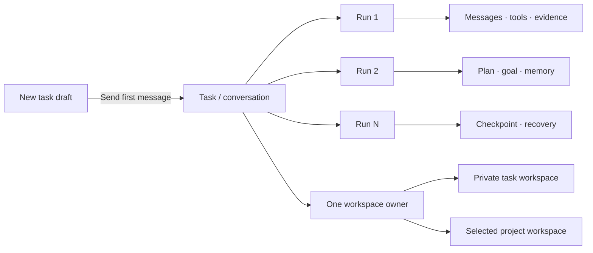
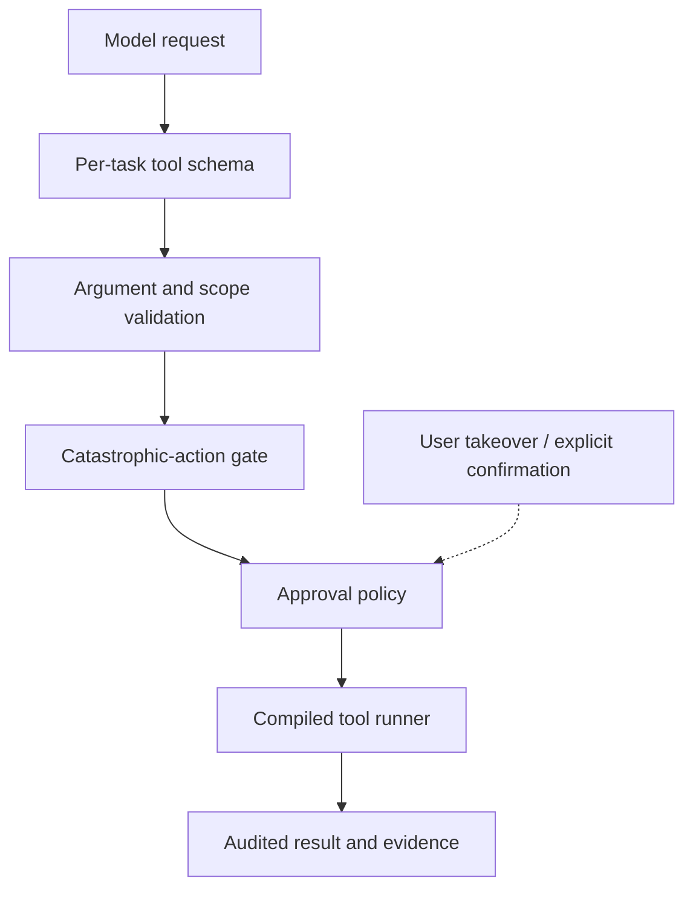

<div align="center">
  
  <h1>Floe Agent</h1>
  <p><strong>Your models. Your files. Your machines.</strong></p>
  <p>A native, private, bring-your-own-key AI agent workspace for iPhone and iPad.</p>
  <p>
    <a href="README.zh-CN.md">简体中文</a> ·
    <a href="https://www.floe-agent.com/">Website</a> ·
    <a href="docs/USER_GUIDE.md">User guide</a> ·
    <a href="https://github.com/JiangNanGenius/floe-agent/releases">Releases</a> ·
    <a href="SECURITY.md">Security</a>
  </p>
</div>

[](https://github.com/JiangNanGenius/floe-agent/releases)
[](FloeAgent/project.yml)
[](FloeAgent/Package.swift)
[](LICENSE)


Floe Agent turns a model conversation into a durable task. Each message continues the same task, while every model execution becomes a separate run with its own progress, tool evidence, approvals, checkpoints, and recovery state. A task can use an app-managed private workspace or an explicitly selected project workspace.

## Why Floe Agent

- **Bring your own models.** Connect compatible providers with credentials you control. Agent, vision, image-generation, and image-editing roles can be configured independently.
- **Keep work inspectable.** Reasoning previews, tool calls, file changes, browser state, child agents, approvals, and errors live in one continuous timeline.
- **Work where the files are.** Use Files workspaces, local image tools, SSH terminals, jump hosts, VNC, and a visible WebKit browser without a Floe-operated relay.
- **Approve consequential actions.** Task policies narrow file, network, browser, upload, credential, and remote-execution authority. Sensitive actions still require explicit confirmation.
- **Resume honestly.** Checkpoints, notifications, and background coordination preserve safe progress. iOS suspension and uncertain side effects are reported instead of hidden.
- **Extend declaratively.** Skill Creator and Skill Finder install validated instruction and knowledge packages. Skills cannot dynamically load native code or silently grant tools.

## The task model



The app normally opens directly into **New Task**. Sending the first message creates the task, workspace ownership, initial run, user message, attachments, and task policy atomically. Later messages create new runs inside the same task, so context does not fragment into unrelated jobs.

## Get started

### TestFlight

Signed builds are distributed through TestFlight when a testing group is available. The current source targets Floe Agent 1.2.6 (build 17); consult [Releases](https://github.com/JiangNanGenius/floe-agent/releases) for artifacts that actually completed the release gates. TestFlight access may remain limited while the project is in prerelease.

### Unsigned IPA

GitHub prereleases include an unsigned IPA for advanced testers and downstream packagers:

1. Download the IPA and `.sha256` file from [Releases](https://github.com/JiangNanGenius/floe-agent/releases).
2. Verify the checksum before opening or re-signing it.
3. Inspect the source and attached SBOM, license inventory, test summary, and provenance.
4. Sign the IPA with your own certificate and provisioning profile using a tool you trust.

> [!WARNING]
> The GitHub IPA is not the TestFlight/App Store package and cannot normally be installed as downloaded. Floe Agent does not provide signing certificates or a sideloading service.

### Build from source

Requirements: macOS, a full Xcode installation with the iOS 26 SDK or newer, Swift 6.2+, and XcodeGen.

```bash
git clone https://github.com/JiangNanGenius/floe-agent.git
cd floe-agent/FloeAgent
brew install xcodegen
xcodegen generate
scripts/local_build.sh
```

For focused checks:

```bash
swift build
swift test
DEVELOPER_DIR=/Applications/Xcode.app/Contents/Developer \
  xcodebuild -project FloeAgent.xcodeproj -scheme FloeAgent \
  -destination 'generic/platform=iOS Simulator' build
```

See the [English user guide](docs/USER_GUIDE.md), [简体中文使用指南](docs/USER_GUIDE.zh-CN.md), and [developer README](FloeAgent/README.md) for the complete setup path.

## Core surfaces

| Surface | Purpose |
| --- | --- |
| New Task | Choose a model, workspace, execution target, skills, and task permissions before the first message. |
| Task thread | Continue the same conversation across runs and inspect reasoning, tools, evidence, questions, and approvals. |
| Task Center | Filter running, waiting, approval-required, failed, completed, and scheduled tasks. |
| Inspector | Review changes, files, browser, terminal/host, progress, child agents, and permissions. It is collapsed by default. |
| Visible browser | Automate a real `WKWebView`, then hand control to the user for login, QR codes, verification, uploads, or other trusted interaction. |
| Settings | Configure providers, auxiliary models, task defaults, execution, files, sync, remote hosts, data controls, and diagnostics. |

### Python execution

Floe does not download or execute a Python runtime inside the App Store app. Pair an SSH host that has `python3`, trust its host key in the Hosts screen, select that host as the task execution target, and allow remote execution in the task policy. `exec.remotePython` then runs bounded source through the same catastrophic-command gate and approval path as other remote commands. Output, stderr, timeout, truncation, cancellation, missing-host, authentication, and missing-Python states are returned explicitly.

### Archive and credential sync

Swipe a task to archive it or open Task Center → Archived to restore or batch-delete tasks. Deletion always requires confirmation. Configuration sync covers provider/model profiles and non-secret host metadata; API keys use iCloud Keychain. The separate **Sync saved credentials** switch is off by default and publishes only vault descriptors to CloudKit while SSH, VNC, website, and token secret bytes remain in Keychain. Task/workspace-scoped temporary credentials never sync.

## Security boundary




API keys belong in Keychain, model output is treated as untrusted input, and executor-side checks reject forged or out-of-scope tool calls. Browser login, credentials, uploads, payments, destructive operations, and broadly dangerous commands do not become safe merely because a task or Skill requested them.

Floe Agent does **not** provide a hosted model proxy, Floe account, remote relay, advertising SDK, model marketplace, arbitrary on-device execution of downloaded code, or a guarantee that iOS keeps a long-running connection alive indefinitely.

## Documentation

| Read | English | 简体中文 |
| --- | --- | --- |
| Product use | [User guide](docs/USER_GUIDE.md) | [使用指南](docs/USER_GUIDE.zh-CN.md) |
| Architecture | [Architecture overview](docs/ARCHITECTURE_OVERVIEW.md) | Bilingual diagrams and terminology in the same document |
| Development | [Contributing](CONTRIBUTING.md) | [贡献指南](CONTRIBUTING.zh-CN.md) |
| Security | [Security policy](SECURITY.md) | [安全策略](SECURITY.zh-CN.md) |
| Support | [Support](SUPPORT.md) | [支持](SUPPORT.zh-CN.md) |
| Design | [Design direction](DESIGN.md) | Key terms include Chinese equivalents |

Implementation reports and historical audits are indexed in [`docs/README.md`](docs/README.md). Historical reports describe the state at their recorded commit; they are not current release claims.

## Project principles

1. Keep credentials, files, and machines under user control.
2. Make the current task, next decision, and supporting evidence legible.
3. Prefer recoverability and honest interruption over pretending work continued.
4. Make powerful access explicit, scoped, time-bounded, and stoppable.
5. Treat model output, remote content, Skill packages, and tool arguments as untrusted input.

## Contributing and license

Before a large or security-sensitive change, read [CONTRIBUTING.md](CONTRIBUTING.md) and open an issue describing the user problem, scope, security impact, and verification plan. Report vulnerabilities privately through the process in [SECURITY.md](SECURITY.md).

Original Floe Agent code is licensed under the [Mozilla Public License 2.0](LICENSE). Third-party components retain their own licenses and notices.
