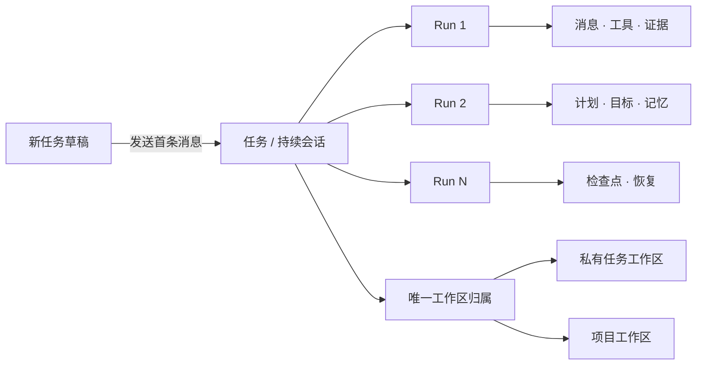
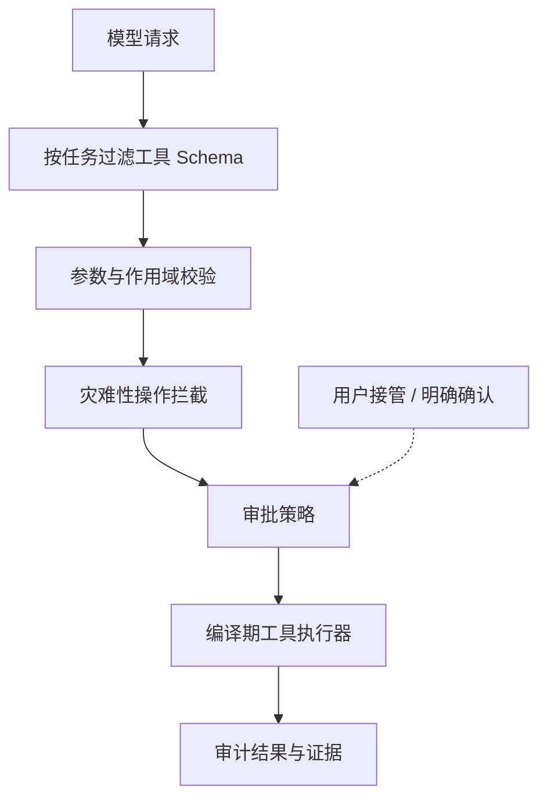

<div align="center">
  
  <h1>Floe Agent for iPad &amp; iPhone</h1>
  <p><strong>Floe — Native iOS AI Agent</strong></p>
  <p>你的模型，你的文件，你的电脑。</p>
  <p>以 iPad 为优先、同时支持 iPhone 的原生私有 AI Agent 工作空间，使用你自己的模型密钥。</p>
  <p>
    <a href="README.md">English</a> ·
    <a href="https://www.floe-agent.com/">官方网站</a> ·
    <a href="docs/USER_GUIDE.zh-CN.md">使用指南</a> ·
    <a href="https://github.com/JiangNanGenius/floe-agent/releases">下载版本</a> ·
    <a href="SECURITY.zh-CN.md">安全策略</a>
  </p>
</div>

[](https://github.com/JiangNanGenius/floe-agent/releases)
[](FloeAgent/project.yml)
[](FloeAgent/Package.swift)
[](LICENSE)


Floe Agent 把一次模型对话组织成一条可持续的任务。每次发送都会在同一任务中创建新的 Run，并保留历史消息、工具证据、用户决策、计划、目标、记忆、权限和恢复检查点。任务可以使用 App 内部的私有工作区，也可以归属于用户明确选择的项目工作区。

## Floe 1.7 内部测试版

**当前内部 TestFlight：1.7.0（214）**。9 月 20 日 21:32 UTC 已核实 Apple VALID、未过期、现有私有 Floe QA 组及 IN_BETA_TESTING。TinyEMU/Linux 成为主要本地环境，原生 Python/Node 不再打包；包含本轮全部反馈修复。只做定向轻量检查与云端 App 构建，真机验收由用户完成。[交付证据](docs/qualification/build214-release/README.md)。

Floe 1.7 面向 iPad 优先升级手记、Office、动态导图、统一语音、图像与视频工作台，以及项目/会话运行环境。**Build 201（`v1.7.0-beta.58`，源码 `be06cece`）是此前的内部 Floe QA TestFlight 交付版本**：Apple `buildID` `ea0f0b12-6fad-4a55-b1f2-ac2033328c74` 于 2026-09-19 17:44 UTC 核实 `VALID`、未过期、唯一私有 Floe QA 组和 `IN_BETA_TESTING`，中英文测试说明均已保存并读回（[Build 201 说明](docs/RELEASE_NOTES_1.7.0_BUILD_201.md)、[TestFlight 记录](docs/TESTFLIGHT_1.7.0_BETA.md)）。该构建的发布作业因冻结标签检出中缺少发布说明文件而停止，带来源证明的未签名 GitHub prerelease `v1.7.0-beta.58` 与 Feather 源均由同一保留工件恢复，未重新构建、未二次上传。**Build196（`v1.7.0-beta.53`，源码 `0771aee5`）仍在内部 Floe QA TestFlight 组可安装**：Apple `buildID` `27355e88-2f37-4c60-8b6e-713db546773b` 于 2026-09-19 02:24 UTC 核实 `VALID`、未过期、唯一私有 Floe QA 组和 `IN_BETA_TESTING`，中英文测试说明均已保存（[Build 196 说明](docs/RELEASE_NOTES_1.7.0_BUILD_196.md)、[TestFlight 记录](docs/TESTFLIGHT_1.7.0_BETA.md)）。该构建对冻结提交只用验收上传 SDK 编译一次，未签名设备 IPA（`bd080ba7…80c4`）与匹配私有符号在签名前留存；带来源证明的未签名 GitHub prerelease 与 Feather 源均由同一工件发布。Build194（`v1.7.0-beta.51`）与 Build195（`v1.7.0-beta.52`）已被 Apple 接受（`VALID`）但从未发布；Build192（`v1.7.0-beta.49`）与 Build193（`v1.7.0-beta.50`）编译失败。四个标签均作为证据保留。按用户要求跳过模拟器/界面验收，本次属内部真机测试，不代表完整验收。正式发布另行安排。分发状态见[TestFlight 记录](docs/TESTFLIGHT_1.7.0_BETA.md)。

当前签名包使用 Xcode 26.6 / SDK 26.5，部分 27 专属接口使用兼容入口；SDK 27 源码另经云端验证。

[反馈修复版](docs/FLOE_156_FEEDBACK_REPAIR.md)的手记新增 **“＋”→“从 Floe 工作区导入”**，可以选择会话或项目中生成的文档，复制到手记独立保存。封面资料列表支持打开文档进入全屏编辑，并搜索已经索引的正文。详见[搜索与导入说明](docs/USER_GUIDE.zh-CN.md#本轮修复候选搜索与工作区导入)；SDK 27 完整 App 的手记 UI 用例已在 iPad/iPhone 通过；build 172 曾交付 Floe QA TestFlight；固定源码还通过 1,270 次 Swift 测试执行和 159 项 SDK 27 完整 App 回归，真机验收仍由用户执行。

[Build 178](docs/FLOE_172_REPAIR_EXECUTION.md)已交付手记专属助手、重新开始会话、修改后自动刷新，以及 IDE 冲突处理和图纸审阅等功能。历史失败和回归记录保留在对应交付文档中。

**Build191（`v1.7.0-beta.48`，源码 `715cbc42`）已在内部 TestFlight（Floe QA）可安装。** [成功的恢复上传](https://github.com/JiangNanGenius/floe-agent/actions/runs/35347141494)复用固定源码工件，没有重编译。2026-09-18 13:43UTC 已核实 Apple VALID、未过期、Floe QA 私有内部组和 IN_BETA_TESTING；中英文测试说明均已保存。两个 SDK 的应用回归各通过 204/204，iPad、iPhone 手记组件各通过 101/101。三项界面失败均经用户明确同意先行内部真机测试，原失败证据保留，不代表完整验收通过。[当前证据](docs/qualification/build191-release/README.md)、[已留存封面截图](docs/qualification/build190-release/accepted-ipad-covers-after-relaunch.png)。Office 封面可能是带标识的内容摘要，并非原始页面排版；本地模型与原生 Office/Pencil 的真机验收仍由测试者完成。

**Build196 已把 191 反馈修复交付到内部 TestFlight**（192、193 编译失败；194、195 上传成功但从未发布；四个标签均保留为证据，194–196 的 App 源码相同）。修复包含 Office 真实编辑权限与 IDE 文件路由、Git 操作、终端及包管理、首页模型回退和普通对话视频工具；[双语候选说明](docs/RELEASE_NOTES_1.7.0_BUILD_196.md)区分已实现行为、宿主级验证与待真机验收项。本构建内置的签名能力目录在 `floe/lua` 5.4.8 之外新增 `floe/ruby` 3.4.1 与 `floe/php` 8.2.33（签名批次 35399070312，源提交 `96be231e`），可在 Shell 中安装；解释器启动可能需要更长 `timeout` 或后台任务，真机运行验收由测试者完成。Build191 本地模型闪退尚未证实修复。验收上传 SDK 的 App 编译与签名上传由发布工作流对这份固定源码执行一次；本文档属于内部测试记录，不代表完整验收或正式发布。

环境归属与持久化、签名仓库样本、有界媒体导出以及原生 shell/Node 的定向测试已有验证。环境迁移、完整包安装链路、模型推理、工作台和真机验收仍在推进。15 个软件包条目和 33 个模型条目是候选清单，不能视为可下载能力。

参见[实施状态](docs/FLOE_1_7_IMPLEMENTATION_STATUS.md)、[升级与恢复](docs/FLOE_1_7_MIGRATION.md)、[构建与验收](docs/FLOE_1_7_BUILD_AND_ACCEPTANCE.md)。历次版本记录保留在[文档索引](docs/README.md)。

本轮还接入了固定版本的 MIT ZLImageEditor，并重做为 Floe 原生图像工作台，提供裁剪、涂鸦、文字、马赛克、滤镜和调色。画布视频节点复用现有视频编辑器。参见[图像编辑集成与验收边界](docs/FLOE_1_7_IMAGE_EDITOR_INTEGRATION.md)。

### 手记、Office 与本地语音

手记是优先于创意模式的独立工作区，使用独立资料存储与撤销历史，复用 Floe 的模型、工具和权限服务。已接入 PDF/图片批注、[图文思维导图与文档小窗](docs/FLOE_1_7_MIND_MAPS.md)、Office 文件编辑、选区提问与可编辑归档；进一步集成与完整应用验收仍在进行。全项目以 iPadOS 27 为首要体验，iPhone 同步验证，26 保持兼容。

思维导图随主题、附图和分支变化自动排版，连续编辑保留缩放，并适配 PDF 独立小窗。手记提供回收站恢复及二次确认的永久删除，延迟回收会保留共享附件和其他内容的撤销历史。

语音输入、视频自动字幕与 Agent 文件转录已接入按需下载的多语言 Whisper Small，无法使用时回退 Apple 识别，支持 SRT、VTT 和 JSON 字幕导出。首页、普通对话及画布均可显式选择手记资料并撤销授权。资源安装不等于混合中英识别质量已验收；最新证据、限制和剩余内容见[本轮实施记录](docs/FLOE_1_7_CONTINUATION_STATUS.md)。

### 媒体工作台预览


iOS 模拟器上的开发界面，使用合成测试素材。截图展示素材播放、逐帧控制、播放速度及保存后的剪辑区间；完整 App、真机和共享任务队列仍在验收。

## 为什么使用 Floe Agent

- **自带模型。** 用户自行连接兼容服务商，并可分别设置 Agent、识图、生图和图片编辑模型。
- **合适时完全在设备端运行。** 可使用 iOS 27 的 Apple Foundation Model 或主动下载的 MLX 模型；本地模型采用独立上下文和内存策略，不缩减云端模型的上下文与工具能力。
- **全过程可检查。** 思考预览、工具调用、文件变更、浏览器状态、子 Agent、审批和错误统一出现在持续时间线中。
- **直接使用自己的资源。** 支持 Files 工作区、图片操作、SSH、跳板机、VNC，以及用户可见的 WebKit 浏览器，不经过 Floe 中转服务。
- **在工作区内构建视觉流程。** 每个工作区可打开一个原生无限画布项目，通过自然触控管理内容节点、显式生成任务、产物节点、节点原位 AI 与受限画布助手。
- **连接标准 MCP。** 普通 Agent 可按需连接 Streamable HTTP 服务器；远程工具始终有独立命名空间、继续经过本地策略检查，并且默认不向画布开放。
- **在工作区内管理源码。** 轻量原生源码管理可查看更改与差异、初始化仓库、暂存、提交、分支、抓取、快进拉取、推送并连接 GitHub。
- **直接转换已有文档。** Markdown、Word、HTML、RTF 和文本互转，并支持 PDF 输入/输出。模型只需提供文件位置，无需重新抄写全文；源文件保留，扫描件及格式限制会明确提示。
- **创建并修改 Office 文件。** 可在本机生成 DOCX、XLSX 和 PPTX，右侧只读查看，全屏后使用本地 Office 引擎编辑真实页面、单元格和幻灯片对象。完整功能与布局保真仍在验收，文档无需上传云端。
- **任务级权限。** 文件、网络、浏览器、上传、凭据和远程执行权限都有明确上限；敏感操作仍需逐次确认。
- **真实恢复。** 后台协调、通知和检查点只恢复可安全继续的阶段；iOS 暂停和结果不确定不会伪装成成功。
- **经审计的技能。** Skill Creator 与 Skill Finder 安装经过静态校验的指令/知识包。技能可以附带受限的 UTF-8 Python 脚本和锁定版本的纯 Python 包：创建或安装时统一审计一次，后续只有完全相同的脚本与依赖指纹才能免去重复询问。原生插件、安装钩子、代码变更和暗中扩大工具权限仍会被阻止。
- **接入 Apple 自动化。** App Intents 把立即运行和安排 Floe 任务公开给快捷指令；设备本地开关分别管理日历、提醒事项、家庭、地图、视觉、文档、相机、位置等系统能力。

## 任务层级



普通启动会直接进入**新建任务**。发送首条消息时，Task、工作区归属、首个 Run、用户消息、附件和初始权限在同一事务中创建。后续发送只会在同一个 Task 内创建新 Run，不会把上下文拆成互不相关的任务。

## 开始使用

### TestFlight

Floe Agent **1.7.0（build 178）** 是目前分发记录中已向 **Floe QA 内部 TestFlight 测试组**开放的最新构建，详见[TestFlight 状态记录](docs/TESTFLIGHT_1.7.0_BETA.md)和 [build 178 发布说明](docs/RELEASE_NOTES_1.7.0_BUILD_178.md)。代码修改和测试截图不代表已有更新的构建上传。此前 1.5.3 的证据保留在[历史验证记录](docs/RELEASE_VERIFICATION_1.5.3.md)。

### 未签名 IPA

GitHub 预发布版本为高级测试者和下游打包者提供未签名 IPA：

1. 从 [Releases](https://github.com/JiangNanGenius/floe-agent/releases) 下载 IPA 与 `.sha256`。
2. 在打开或重签名前核验 SHA-256。
3. 检查源码以及随包提供的 SBOM、许可证、测试摘要和构建证明。
4. 使用自己信任的工具、证书和描述文件进行签名。

> [!WARNING]
> GitHub IPA 不是 TestFlight/App Store 安装包，通常不能直接安装。Floe Agent 不提供证书、描述文件或代签服务。

### 从源码构建

需要 macOS、包含 iOS 26 SDK 或更新版本的完整 Xcode、Swift 6.2+ 与 XcodeGen。当前发布目标中的 iOS 27 Foundation Models 路径必须使用 Xcode 27 编译。

```bash
git clone https://github.com/JiangNanGenius/floe-agent.git
cd floe-agent/FloeAgent
brew install xcodegen
xcodegen generate
scripts/local_build.sh
```

针对性检查：

```bash
swift build
swift test
DEVELOPER_DIR=/Applications/Xcode.app/Contents/Developer \
  xcodebuild -project FloeAgent.xcodeproj -scheme FloeAgent \
  -destination 'generic/platform=iOS Simulator' build
```

完整配置流程请阅读[简体中文使用指南](docs/USER_GUIDE.zh-CN.md)；开发环境与测试命令见[工程 README](FloeAgent/README.md)。

## 主要界面

| 界面 | 用途 |
| --- | --- |
| 新建任务 | 在发送前选择模型、工作区、执行目标、技能和任务权限。 |
| 任务线程 | 在同一会话中持续工作，并查看思考、工具、证据、澄清问题与审批。 |
| 任务中心 | 筛选运行中、待输入、待审批、失败、完成和已安排任务。 |
| 右侧检查器 | 查看变更、文件、浏览器、终端/主机、进度和子 Agent；默认收起。当前任务权限只在聊天输入框下方修改。 |
| 可见浏览器 | Agent 操作真实 `WKWebView`；登录、扫码、验证或上传时交由用户接管。 |
| 源码管理 | 查看仓库状态、差异和历史，执行暂存、提交、分支与同步；不提供破坏性的 reset、clean、强制推送或历史改写。 |
| 工作区画布 | 在原生无限平面组织“内容 → 任务 → 产物”；节点 AI 原位完善内容，保存配置后由用户明确开始并查看任务状态。 |
| 标准 MCP | 为普通 Agent 连接可选 Streamable HTTP 工具服务器，并逐服务器、逐工具控制。 |
| 设置 | 配置服务商、辅助模型、权限默认值、执行环境、文件、同步、主机、数据管理和诊断。 |

### 模型与图片服务商

系统管理的 Apple Foundation Model 始终显示在**设置 → 本地模型**。在 iOS/iPadOS 27 上，Floe 会显示系统返回的真实可用状态，例如设备不支持、Apple Intelligence 未开启或系统模型仍在准备。它不需要 API Key，也不由 Floe 下载。用户主动下载的 Qwen、Gemma 模型则可以分别启用或停用；Floe 会根据设备当前状态安排运行、在每轮结束后释放临时占用，并只提供这些小型模型能够可靠使用的任务工具。所有设备端模型都按纯文字模式运行，不再加载视觉组件；附图由 Apple Vision OCR 转成任务工作区文字文件。PDF 检查、页面渲染和 OCR 仍可使用，语义识图 `image.inspect` 只提供给兼容的云端模型。

每个已启用模型另有独立的**在主模型列表中隐藏**开关，默认关闭。隐藏只会把它从首页/新建任务的主 LLM 菜单移除；模型仍可保留为辅助角色、内部路由使用，并可继续服务已有任务。

OpenAI 生图与图片编辑默认使用 `gpt-image-2`；Google Gemini Images 提供 Nano Banana Pro（`gemini-3-pro-image`）。两类服务商都允许修改 Base URL 以连接兼容代理；生图、编辑和识图仍是彼此独立的角色。

### 工作区、Git 与审批

私有任务工作区会与首条消息原子创建并绑定；项目工作区继续使用用户明确选择的 Files 范围。文件检查器新增轻量源码管理标签；**设置 → GitHub 与源码管理**支持 GitHub 官方设备授权直接登录和细粒度 Token 后备入口，凭据只保存在设备钥匙串，并可列出、克隆和创建仓库。

有界只读、本地工作区操作、生图/识图、OCR、PDF 只读和局域网发现不等待审批模型。任务权限在聊天输入框下方选择后自动保存，也可在任务运行中切换。用户明确要求安装、部署、环境修复或更新 Floe 守护程序后，完成该目标所需的常规系统包、换源、依赖修复和守护程序原子更新不会逐条重复询问。删除、凭据、上传、付款、目标不明的宽泛远程命令，以及强制推送/历史改写仍会被阻止或要求明确复核。“帮我测试一下所有工具”这类宽泛请求可以授权安全诊断，但不会静默扩展为删除、凭据或破坏性测试。

### Python 执行

本地 Python、Node.js、Shell 和服务统一运行在选定的 TinyEMU/Linux 环境中，可从设置 → 执行列表下载经校验的 Linux 组件。Shell 与直接 Python 入口共享该环境的文件和软件包；apt/dpkg 安装 Linux 包，Python 使用 pip/venv，Node 使用 npm。iOS 原生 Python/Node 的源码与构建配方已封存，运行时不再打进本版 App。二进制包须匹配 Linux 客体 ABI，iOS wheel 不会作为 Linux 二进制复用；WASM 保留为独立兼容能力。

技能可以附带受限的 `.py` 文件和锁定版本的纯 Python 依赖。Floe 在创建或安装技能时验证脚本路径与源码、解析并检查通用 wheel，并记录获准的脚本和依赖指纹。后续运行只能复用这份完全相同的已审计代码，变化的任务数据通过 JSON 单独传入；修改脚本或依赖、提权、危险文件改动、凭据和外部副作用仍回到正常审批流程。

### 原生 Office 文档——已发布 1.5.3 的能力

Floe 可以创建 DOCX 文档、包含多张工作表及值/公式的 XLSX，以及带演讲者备注的 16:9 PPTX。文档包在本机生成并校验，不依赖网页编辑器，也不会上传到 Office 云端。打开 Office 文件时仍先使用系统预览；点击**编辑 Office 文档**后，进入独立的基础编辑器，可手工修改 Word 文字、表格单元格/公式、PowerPoint 文字和备注。保存时只更新发生变化的语义字段，原子重写 OOXML，并保留未修改的样式、媒体和关系。它不宣称支持桌面 Office 的全部高级排版、图表、宏、ActiveX 或像素级兼容。

开发分支正在以上方升级说明中的原生 Office 前端替换这套基础编辑器，完整验收仍在进行。

### 归档与凭据同步

“设置 → 数据管理”统一提供应用总占用与分类、安全清理、归档恢复/单删/批量删除，以及 Floe 全局字体库。字体可从 Files 或公开 HTTPS 直链导入一次并供所有工作区的 Word/PDF 流程复用；受限安装不等待审批模型，跨工作区删除仍需审核。任务列表仍可左滑归档；永久删除始终需要二次确认。配置同步只包含服务商/模型配置与主机非秘密信息，API Key 通过 iCloud Keychain 同步。“同步已保存凭据”是独立开关并默认关闭：CloudKit 只保存凭据库描述符，SSH、VNC、网页密码和 Token 正文仍只在 Keychain；任务或工作区临时凭据永远不同步。

## 安全边界




API 密钥应保存在 Keychain 中；模型输出一律视为不可信输入；即使模型伪造工具调用，执行端仍会检查任务权限与资源作用域。浏览器登录、凭据、上传、付款、删除和大范围危险命令不会因为任务或 Skill 提出请求就自动变成安全操作。

Floe Agent **不提供**托管模型代理、Floe 账户、远程中继、广告 SDK、模型市场、下载代码的任意本机执行，也不承诺 iOS 会无限期维持后台连接。

## 文档导航

| 内容 | 简体中文 | English |
| --- | --- | --- |
| 产品使用 | [使用指南](docs/USER_GUIDE.zh-CN.md) | [User guide](docs/USER_GUIDE.md) |
| 架构 | [架构总览（双语术语）](docs/ARCHITECTURE_OVERVIEW.md) | [Architecture overview](docs/ARCHITECTURE_OVERVIEW.md) |
| 参与开发 | [贡献指南](CONTRIBUTING.zh-CN.md) | [Contributing](CONTRIBUTING.md) |
| 安全 | [安全策略](SECURITY.zh-CN.md) | [Security policy](SECURITY.md) |
| 支持 | [支持](SUPPORT.zh-CN.md) | [Support](SUPPORT.md) |
| 设计方向 | [设计方向](docs/WORKFLOW_UPGRADE.md) | 关键术语包含中文对照 |

历史实现报告和审计记录统一收录在 [`docs/README.md`](docs/README.md)。历史文件只代表其记录提交的状态，不能当作当前版本的功能声明。

## 项目原则

1. 凭据、文件和电脑始终由用户控制。
2. 当前任务、下一步决定和支持证据必须清楚可见。
3. 优先保证可恢复和诚实中断，不假装任务仍在后台运行。
4. 强大权限必须明确、限域、限时且可随时停止。
5. 模型输出、远程内容、Skill 包和工具参数全部视为不可信输入。

## 贡献与许可证

准备进行大型或安全敏感改动前，请阅读[贡献指南](CONTRIBUTING.zh-CN.md)，并先创建 Issue 说明用户问题、范围、安全影响和验证方法。安全漏洞请按[安全策略](SECURITY.zh-CN.md)私下报告。

Floe Agent 原创代码采用 [Mozilla Public License 2.0](LICENSE)；第三方组件保留各自许可证与声明。

1.7 界面更新加入「通用 → 自动/日间/夜间」外观、项目与会话容器管理，以及可折叠的思考与工具调用组。功能可用性和测试版验收进展见[实施状态](docs/FLOE_1_7_IMPLEMENTATION_STATUS.md)。

### Feather 安装源

使用自行签名安装的用户可添加 [Floe Feather 源](docs/FEATHER_SOURCE.md)，当前版本为191。GitHub 提供未签名 IPA、校验文件和来源证明；TestFlight 为独立分发渠道。
