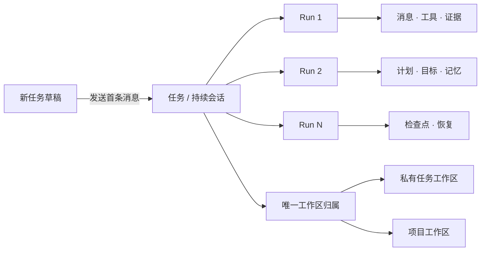
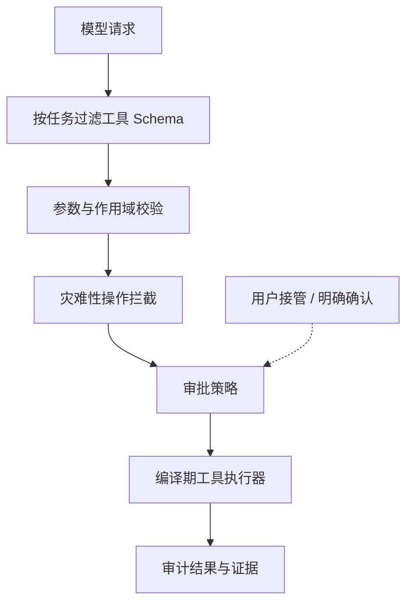

<div align="center">
  
  <h1>Floe Agent for iPad &amp; iPhone</h1>
  <p><strong>Floe — Native iOS AI Agent</strong></p>
  <p>你的模型，你的文件，你的电脑。</p>
  <p>以 iPad 为优先、同时支持 iPhone 的原生私有 AI Agent 工作空间，使用你自己的模型密钥。</p>
  <p>
    <a href="README.md">English</a> ·
    <a href="https://www.floe-agent.com/">官方网站</a> ·
    <a href="docs/USER_GUIDE.zh-CN.md">使用指南</a> ·
    <a href="https://github.com/JiangNanGenius/floe-agent/releases">下载版本</a> ·
    <a href="SECURITY.zh-CN.md">安全策略</a>
  </p>
</div>

[](https://github.com/JiangNanGenius/floe-agent/releases)
[](FloeAgent/project.yml)
[](FloeAgent/Package.swift)
[](LICENSE)


<p align="center">
  <a href="https://www.floe-agent.com/add/feather"></a>
  &nbsp;
  <a href="https://www.floe-agent.com/add/altstore"></a>
  &nbsp;
  <a href="https://github.com/JiangNanGenius/floe-agent/releases"><strong>下载发布版本</strong></a>
</p>


Floe Agent 把一次模型对话组织成一条可持续的任务。每次发送都会在同一任务中创建新的 Run，并保留历史消息、工具证据、用户决策、计划、目标、记忆、权限和恢复检查点。任务可以使用 App 内部的私有工作区，也可以归属于用户明确选择的项目工作区。

## Floe 1.7 内部测试版

**当前内部 TestFlight：1.7.0（227）**。不可变标签 `v1.7.0-beta.84` 固定源码 `9c756864`；[发布 run 35957256008](https://github.com/JiangNanGenius/floe-agent/actions/runs/35957256008) 使用 Xcode 26.6 完成云端构建，在签名前保留未签名 IPA（739,368,613 字节，SHA-256 `a77b3b9a120a55dd6737bf1fb89efe7609c8917ca3facab7cd9cbb5c4c66b30c`），接受签名上传并发布 [GitHub 预发布](https://github.com/JiangNanGenius/floe-agent/releases/tag/v1.7.0-beta.84)。Apple build `640e39a2-001b-4672-9b17-b4a378d9eb6a` 已核实 `VALID`、未过期并在唯一私有内部 Floe QA 组 `IN_BETA_TESTING`（2026-09-24 05:42 UTC，[核验 run 35961062720](https://github.com/JiangNanGenius/floe-agent/actions/runs/35961062720)），中英文测试说明均已读回。[Build 227 说明](docs/RELEASE_NOTES_1.7.0_BUILD_227.md) · [交付记录](docs/TESTFLIGHT_1.7.0_BETA.md)。

**Build 227 是当前内部交付版本。** 它承载[Build 226 候选说明](docs/RELEASE_NOTES_1.7.0_BUILD_226.md)记录的功能范围——iPad 原生 IDE 工作台、压缩归档操作、可复用 Linux 模板与私有磁盘（已发布的模板镜像仍须通过本构建的安装路径检查，才可描述为用户可下载）、Runtime v2 资源管理、后台/PiP 与通知修复、本地模型工具续轮、支持自动换行及按会话草稿的输入框、统一许可入口、原生优先媒体路由与固定 Office 宿主。Build 226 本身没有产出 IPA：其云端构建因文件树压缩入口缺少 `FloeTools` 导入而停止，Build 227 从新的不可变源码修复了该问题。云端构建、未签名 IPA 留存、签名上传、Apple 处理和测试组可安装各自独立取证，均不代表真机行为。

**Build 227 已知真机回归（未通过验收）。** 2026-09-24 在 iPad 上测试该构建时报告：下载的 MLX 本地模型在普通对话与测速中崩溃（与是否使用工具无关）；PPT/PPTX 预览可以打开，但随后进入编辑的操作会停住；从 IDE 文件树打开的 Word/Excel/PPT 文档一直停留在打开指示。窄宽度下 Git 侧栏布局也需要修复。以上作为下一候选的待处理回归跟踪——均未修复、未豁免、不属于任何通过结论。PPT 编辑、本地模型加载与测速、画中画、通知、键盘/输入法以及双核客体运行在真机上仍未验收。

**Build 224 从未编译成功。** 其不可变标签 `v1.7.0-beta.81`（`c36b7b24`）与失败的验收 SDK run [35767875337](https://github.com/JiangNanGenius/floe-agent/actions/runs/35767875337)（exit 65，无工件、无上传）作为失败记录保留；参见 [Build 224 说明](docs/RELEASE_NOTES_1.7.0_BUILD_224.md)与 Build 225 说明中的失败记录表。

**源码状态——Build 227 之后的未发布修复（未宣布新构建号）。** `main` 已领先于已交付的 Build 227，包含尚不属于任何已交付构建的在办修复：PPT 编辑入口的有界 extent 引导后备、通过共享文档会话打开 IDE Office 标签、窄宽度下可触控的 IDE Git 侧栏操作，以及 Linux 客体运行形状/核心选择链路。组件检查不能替代云端 App 构建、TestFlight 可安装与真机验收；在后续构建通过这些门槛之前，上述 Build 227 真机回归均不算修复。

Floe 1.7 面向 iPad 优先升级手记工作区：图文思维导图、原生 Office 编辑、图像与创意工具、设备端语音，以及运行 TinyEMU/Linux 的任务归属环境。TinyEMU 提供主要本地 Linux 路径；Linux 语言和工具由客体包管理器安装，WASM 保留为独立兼容路线。参见[实施状态](docs/FLOE_1_7_IMPLEMENTATION_STATUS.md)、[迁移说明](docs/FLOE_1_7_MIGRATION.md)、[构建与验收边界](docs/FLOE_1_7_BUILD_AND_ACCEPTANCE.md)及[版本档案](docs/README.md)。

### 手记、Office 与本地语音

手记是优先于创意模式的独立工作区，使用独立资料存储与撤销历史，复用 Floe 的模型、工具和权限服务。PDF/图片批注、[图文思维导图与文档小窗](docs/FLOE_1_7_MIND_MAPS.md)、原生 Office 编辑、选区提问与可编辑归档均已可用；Office 完整排版保真与真机验收仍以[实施状态](docs/FLOE_1_7_IMPLEMENTATION_STATUS.md)为准。全项目以 iPadOS 27 为首要体验，iPhone 同步验证，26 保持兼容。

思维导图随主题、附图和分支变化自动排版，连续编辑保留缩放，并适配 PDF 独立小窗。手记提供回收站恢复及二次确认的永久删除，延迟回收会保留共享附件和其他内容的撤销历史。

语音输入、视频自动字幕与 Agent 文件转录已接入按需下载的多语言 Whisper Small，无法使用时回退 Apple 识别，支持 SRT、VTT 和 JSON 字幕导出。首页、普通对话及画布均可显式选择手记资料并撤销授权。资源安装不等于混合中英识别质量已验收；最新证据、限制和剩余内容见[本轮实施记录](docs/FLOE_1_7_CONTINUATION_STATUS.md)。

## 为什么使用 Floe Agent

- **自带模型。** 用户自行连接兼容服务商，并可分别设置 Agent、识图、生图和图片编辑模型。
- **合适时完全在设备端运行。** 可使用 iOS 27 的 Apple Foundation Model 或主动下载的 MLX 模型；Floe 会在映射权重前校验已安装快照，并从真实设备可用额度中扣除正在运行的 Linux 客体内存预留。本地模型采用独立上下文和内存策略，不缩减云端模型的上下文与工具能力。
- **全过程可检查。** 思考预览、工具调用、文件变更、浏览器状态、子 Agent、审批和错误统一出现在持续时间线中。
- **直接使用自己的资源。** 支持 Files 工作区、图片操作、SSH、跳板机、VNC，以及用户可见的 WebKit 浏览器，不经过 Floe 中转服务。
- **在工作区内构建视觉流程。** 每个工作区可打开一个原生无限画布项目，通过自然触控管理内容节点、显式生成任务、产物节点、节点原位 AI 与受限画布助手。
- **连接标准 MCP。** 普通 Agent 可按需连接 Streamable HTTP 服务器；远程工具始终有独立命名空间、继续经过本地策略检查，并且默认不向画布开放。
- **在工作区内管理源码。** 轻量原生源码管理可查看更改与差异、初始化仓库、暂存、提交、分支、抓取、快进拉取、推送并连接 GitHub。
- **使用原生代码工作台编辑代码。** IDE 的活动栏、文件/搜索/Git 侧栏、编辑标签、文本及代码编辑、终端面板和状态栏使用原生 SwiftUI/UIKit，不提供 Web 文本编辑切换。编辑器支持多缓冲区、行号、有界高亮、查找替换、撤销/重做、字体缩放与保留草稿的冲突安全保存；Markdown 在同一草稿上提供大纲、格式操作和原生预览。[定向云端 App 与界面运行](https://github.com/JiangNanGenius/floe-agent/actions/runs/35947162133) 在 iPad mini 和 iPhone 模拟器上通过，包含原生保存和冷启动重开；iPhone 的 DXF 预览断言首次失败、自动重试通过。新工作台已随 Build 227 交付；真机键盘、输入法与触控体验仍待验收，上文 Build 227 的 IDE Office 标签打开回归仍是未解决项。
- **直接转换已有文档。** Markdown、Word、HTML、RTF 和文本互转，并支持 PDF 输入/输出。模型只需提供文件位置，无需重新抄写全文；源文件保留，扫描件及格式限制会明确提示。
- **创建并修改 Office 文件。** 可在本机生成 DOCX、XLSX 和 PPTX，右侧只读查看，随后使用本地 Office 引擎编辑真实页面、单元格和幻灯片对象。从工作区预览编辑时进入独立全屏编辑器；只有从 IDE 文件树打开才保留内嵌标签。关闭有未保存修改的文档会询问保存、放弃或取消，Command-S 通过同一保存路径就地保存，文档无需上传云端。完整排版保真与高级 Office 功能仍在验收。
- **任务级权限。** 文件、网络、浏览器、上传、凭据和远程执行权限都有明确上限；敏感操作仍需逐次确认。
- **真实恢复。** 后台协调、通知和检查点只恢复可安全继续的阶段；iOS 暂停和结果不确定不会伪装成成功。
- **经审计的技能。** Skill Creator 与 Skill Finder 安装经过静态校验的指令/知识包。技能可以附带受限的 UTF-8 Python 脚本和锁定版本的纯 Python 包：创建或安装时统一审计一次，后续只有完全相同的脚本与依赖指纹才能免去重复询问。原生插件、安装钩子、代码变更和暗中扩大工具权限仍会被阻止。
- **接入 Apple 自动化。** App Intents 把立即运行和安排 Floe 任务公开给快捷指令；设备本地开关分别管理日历、提醒事项、家庭、地图、视觉、文档、相机、位置等系统能力。

## 任务层级



普通启动会直接进入**新建任务**。发送首条消息时，Task、工作区归属、首个 Run、用户消息、附件和初始权限在同一事务中创建。后续发送只会在同一个 Task 内创建新 Run，不会把上下文拆成互不相关的任务。

## 开始使用

### TestFlight

Floe Agent **1.7.0（build 227）**已核实可在 **Floe QA 内部 TestFlight 测试组**安装（Apple `VALID`、未过期、受众 `APP_STORE_ELIGIBLE` 且 `IN_BETA_TESTING`，2026-09-24 05:42 UTC 从不可变标签 `v1.7.0-beta.84`、源码 `9c756864` 验证，核验 run 35961062720）。[TestFlight 交付记录](docs/TESTFLIGHT_1.7.0_BETA.md)保留精确的源码、构建、上传、测试说明与测试组证据，以及此前版本的交付历史。Build 192 与 193 从未编译成功；Build 194 与 195 被 Apple 接受但从未发布——[192](docs/RELEASE_NOTES_1.7.0_BUILD_192.md)、[193](docs/RELEASE_NOTES_1.7.0_BUILD_193.md)、[194](docs/RELEASE_NOTES_1.7.0_BUILD_194.md)、[195](docs/RELEASE_NOTES_1.7.0_BUILD_195.md) 记录。此前 1.5.3 的证据保留在[历史验证记录](docs/RELEASE_VERIFICATION_1.5.3.md)。

### 未签名 IPA

GitHub 预发布版本为高级测试者和下游打包者提供未签名 IPA：

1. 从 [Releases](https://github.com/JiangNanGenius/floe-agent/releases) 下载 IPA 与 `.sha256`。
2. 在打开或重签名前核验 SHA-256。
3. 检查源码以及随包提供的 SBOM、许可证、测试摘要和构建证明。
4. 使用自己信任的工具、证书和描述文件进行签名。

> [!WARNING]
> GitHub IPA 不是 TestFlight/App Store 安装包，通常不能直接安装。Floe Agent 不提供证书、描述文件或代签服务。

### Gitee 中国镜像

面向 GitHub 较慢的网络，公开单向镜像发布在 [`gitee.com/JiangNanGenius/floe-agent`](https://gitee.com/JiangNanGenius/floe-agent)。GitHub 始终是唯一承担信任的主源，且镜像明确是**部分镜像**：[gitee-mirror](.github/workflows/gitee-mirror.yml) 工作流把 `main` 与发布标签单向从 GitHub 推送到 Gitee 并校验两边 `main` 一致（它从不从 Gitee 拉取，因此 Gitee 永远不能覆盖 GitHub）；发行资产另有独立门禁，逐文件按大小与 SHA-256 校验后复制。Gitee 的发行附件受配额限制：仓库级附件配额实测为 1 GiB，因此 Build 227 约 705 MiB 的未签名 IPA **不**托管在 Gitee，也不存在 Gitee 直装包或 Feather/AltStore 源——只镜像小型发行资产，并在 `GITEE-MIRROR-MANIFEST.json` 中逐资产记录状态。约 573 MB 的 Linux 镜像以一份清单加九个 64 MiB 分片发布（64 MiB 是镜像脚本的分片大小，并非已测定的平台上限）；每个分片按大小与 SHA-512 固定，整包按与目录一致的摘要固定。Linux 客体下载器总是先尝试 GitHub Releases，仅在主源出现有界可用性失败（断网、5xx、408/429）后才联系 Gitee 镜像；明确 4xx、无效响应、本地拒绝或取消一律安全中止；已验证分片保留在稳定暂存目录，中断后可断点续传，重组归档在导入前再次比对整包 SHA-512。详见[镜像限制](docs/FLOE_GITEE_RELEASE_MIRROR.md)与[镜像分发说明](docs/FLOE_LINUX_GUEST_IMAGE_BUILD.md#distribution-mirror-gitee-sharded)。

### Feather 安装源

稳定源地址为 `https://raw.githubusercontent.com/JiangNanGenius/floe-agent/main/feather.json`。点击上方徽章（或在[下载页面](https://www.floe-agent.com/#download)打开相同的官方快速添加入口）即可：每个入口会先在设备上尝试对应深链，随后显示手动步骤与下载链接：

- Feather：`https://www.floe-agent.com/add/feather` → `feather://source/https://raw.githubusercontent.com/JiangNanGenius/floe-agent/main/feather.json`
- AltStore：`https://www.floe-agent.com/add/altstore` → `altstore://source?url=https%3A%2F%2Fraw.githubusercontent.com%2FJiangNanGenius%2Ffloe-agent%2Fmain%2Ffeather.json`

也可以把源地址直接粘贴到对应 App 的软件源界面。GitHub 的 Markdown 过滤会移除 `feather://` 与 `altstore://` 链接，因此 README 徽章指向官方 HTTPS 入口：由官网完成自定义 scheme 启动，并在无法打开时显示清晰的手动回退，而不是死链。手动源地址与独立验证的发布流程见 [Floe 安装源说明](docs/FEATHER_SOURCE.md)；GitHub 提供未签名 IPA、校验文件和来源证明，TestFlight 为独立分发渠道。2026-09-24 只读复核：两个入口均返回 HTTP 200，包含精确深链与手动回退内容；已发布 feed 的最新条目为 1.7.0（227），其未签名 IPA SHA-256 与 GitHub 预发布一致；GitHub Markdown API 仍会把两种链接写法都过滤为纯文本——GitHub 本身无法承载 add-source 动作，HTTPS 入口仍是唯一可点击的快速添加路径。

### 从源码构建

需要 macOS、包含 iOS 26 SDK 或更新版本的完整 Xcode、Swift 6.2+ 与 XcodeGen。当前发布目标中的 iOS 27 Foundation Models 路径必须使用 Xcode 27 编译。

```bash
git clone https://github.com/JiangNanGenius/floe-agent.git
cd floe-agent/FloeAgent
brew install xcodegen
xcodegen generate
scripts/local_build.sh
```

针对性检查：

```bash
swift build
swift test
DEVELOPER_DIR=/Applications/Xcode.app/Contents/Developer \
  xcodebuild -project FloeAgent.xcodeproj -scheme FloeAgent \
  -destination 'generic/platform=iOS Simulator' build
```

完整配置流程请阅读[简体中文使用指南](docs/USER_GUIDE.zh-CN.md)；开发环境与测试命令见[工程 README](FloeAgent/README.md)。

## 主要界面

| 界面 | 用途 |
| --- | --- |
| 新建任务 | 在发送前选择模型、工作区、执行目标、技能和任务权限。 |
| 任务线程 | 在同一会话中持续工作，并查看思考、工具、证据、澄清问题与审批。 |
| 任务中心 | 筛选运行中、待输入、待审批、失败、完成和已安排任务。 |
| 右侧检查器 | 查看变更、文件、浏览器、终端/主机、进度和子 Agent；默认收起。当前任务权限只在聊天输入框下方修改。 |
| 可见浏览器 | Agent 操作真实 `WKWebView`；登录、扫码、验证或上传时交由用户接管。 |
| 源码管理 | 查看仓库状态、差异和历史，执行暂存、提交、分支与同步；不提供破坏性的 reset、clean、强制推送或历史改写。 |
| 工作区画布 | 在原生无限平面组织“内容 → 任务 → 产物”；节点 AI 原位完善内容，保存配置后由用户明确开始并查看任务状态。 |
| 标准 MCP | 为普通 Agent 连接可选 Streamable HTTP 工具服务器，并逐服务器、逐工具控制。 |
| 设置 | 配置服务商、辅助模型、权限默认值、执行环境、文件、同步、主机、数据管理和诊断。 |

### 模型与图片服务商

系统管理的 Apple Foundation Model 始终显示在**设置 → 本地模型**。在 iOS/iPadOS 27 上，Floe 会显示系统返回的真实可用状态，例如设备不支持、Apple Intelligence 未开启或系统模型仍在准备。它不需要 API Key，也不由 Floe 下载。用户主动下载的 Qwen MLX 模型则可以分别启用或停用；Floe 会在映射权重前按固定清单校验已安装快照，并从可用内存中扣除正在运行的 TinyEMU Linux 客体内存预留，按设备当前状态安排运行、在每轮结束后释放临时占用，并只提供这些小型模型能够可靠使用的任务工具。快照损坏与内存不足会分别报错；当前设备上放不下的模型（目前是 5.15 GB 的 Gemma 4 E4B）会从推荐下载列表移除，已下载的副本仍可由用户明确删除。所有设备端模型都按纯文字模式运行，不再加载视觉组件；附图由 Apple Vision OCR 转成任务工作区文字文件。PDF 检查、页面渲染和 OCR 仍可使用，语义识图 `image.inspect` 只提供给兼容的云端模型。

每个已启用模型另有独立的**在主模型列表中隐藏**开关，默认关闭。隐藏只会把它从首页/新建任务的主 LLM 菜单移除；模型仍可保留为辅助角色、内部路由使用，并可继续服务已有任务。

OpenAI 生图与图片编辑默认使用 `gpt-image-2`；Google Gemini Images 提供 Nano Banana Pro（`gemini-3-pro-image`）。两类服务商都允许修改 Base URL 以连接兼容代理；生图、编辑和识图仍是彼此独立的角色。

### 工作区、Git 与审批

私有任务工作区会与首条消息原子创建并绑定；项目工作区继续使用用户明确选择的 Files 范围。文件检查器新增轻量源码管理标签；ZIP、TAR 与 7z 压缩包也在同一检查器中有界浏览，支持条目预览与暂存解压。**Build 227** 增加本机 tar.gz/tar.xz 与单文件 gzip/xz 处理，以及归档创建——可创建 ZIP、TAR、tar.gz、tar.xz、tar.bz2 及单文件 gzip/bzip2/xz，可列出或解压 ZIP、TAR、tar.gz、tar.xz 与 7z——全程无需启动 Linux 客体；bzip2 解压与 RAR 浏览改为说明具体原因（RAR 解压可通过 Agent 的已签名解码器完成）。**设置 → GitHub 与源码管理**支持 GitHub 官方设备授权直接登录和细粒度 Token 后备入口，凭据只保存在设备钥匙串，并可列出、克隆和创建仓库。已打开的源码管理面板会在仓库初始化或任何 Git 变更后立即刷新，并在回到前台时重新读取，因此 Agent 工具创建的仓库无需手动刷新即可显示。

有界只读、本地工作区操作、生图/识图、OCR、PDF 只读和局域网发现不等待审批模型。任务权限在聊天输入框下方选择后自动保存，也可在任务运行中切换。用户明确要求安装、部署、环境修复或更新 Floe 守护程序后，完成该目标所需的常规系统包、换源、依赖修复和守护程序原子更新不会逐条重复询问。删除、凭据、上传、付款、目标不明的宽泛远程命令，以及强制推送/历史改写仍会被阻止或要求明确复核。“帮我测试一下所有工具”这类宽泛请求可以授权安全诊断，但不会静默扩展为删除、凭据或破坏性测试。

### Python 执行

TinyEMU/Linux 是解释器、CLI、软件包与服务类工作的主要本地运行环境。本地 Python、Node.js、Shell 和服务运行在所选环境的 Linux 客体中；首次出现 Linux 需求（Shell、`exec.localPython`、Node/npm、`apt`/`dpkg`、后台服务或语言包）时，会先执行同一套可取消的“准备 → 下载 → 校验 → 安装 → 启动”流程，然后继续执行原命令。**设置 → 执行环境**与终端提供同一份组件状态，以及明确的下载、更新、启动、停止入口和客体上报的网络状态。Shell 与直接 Python 共享该环境的文件、软件包和唯一 venv；客体 apt/dpkg 安装 Linux 包，Python 使用 pip/venv，Node 使用客体的 npm。iOS 原生 Python/Node 的源码与构建配方已封存，其运行时载荷（包括原生 Ruby 解释器）不再随本版 App 分发；需要客体的语言或工具会如实提示，而不会回退到已移除的进程内运行时。二进制包须匹配 Linux 客体 ABI，iOS wheel 不会作为 Linux 二进制复用。签名 WASI 目录（如 Lua 5.4.8、Ruby 3.4.1、PHP 8.2.33 与 `floe-text`）仍是独立的 WebAssembly 沙箱能力，通过已验证目录安装，而不是 Debian 软件包。

**Build 227**——图像、视频、音频、PDF 与 OCR 任务原生优先：这类任务交给 App 自带的专用工具——设备侧的 Apple 框架（Vision、CoreImage、AVFoundation/VideoToolbox、CoreML、PDFKit）或生成类任务已配置的模型通道——客体解释器不是它们的默认路径；不会因为 Linux 客体已安装就把视频/图片/音频/PDF 请求交给它。只有当前任务的操作没有可用的原生工具覆盖，或用户明确要求脚本/命令行时，才使用 Linux 客体处理媒体。路由只依据当前任务真实启用并配置好的能力：工具名字本身不代表该操作可用，未被提供的能力会如实说明，而不是被静默模拟；工具按任务精选，不会把完整全局目录交给本地小模型。路由契约、测试与剩余真机验证边界见[下一版状态文档](docs/FLOE_1_7_NEXT_RELEASE_STATUS.md)。

技能可以附带受限的 `.py` 文件和锁定版本的纯 Python 依赖。Floe 在创建或安装技能时验证脚本路径与源码、解析并检查通用 wheel，并记录获准的脚本和依赖指纹。后续运行只能复用这份完全相同的已审计代码，变化的任务数据通过 JSON 单独传入；修改脚本或依赖、提权、危险文件改动、凭据和外部副作用仍回到正常审批流程。

### 原生 Office 文档

Floe 可以创建 DOCX 文档、包含多张工作表及值/公式的 XLSX，以及带演讲者备注的 16:9 PPTX。文档包在本机生成并校验，不依赖网页编辑器，也不会上传到 Office 云端。打开 Office 文件时仍先使用系统预览；从工作区预览点击**编辑 Office 文档**会进入独立全屏编辑器，而只有从 IDE 文件树打开才保留 IDE 内嵌文档标签。Word 文字、表格单元格/公式、PowerPoint 文字、备注、批注绘图设置和演示控制都由本地 Office 引擎处理，同一份 Office 文档在预览与编辑之间只保留一个工作副本。保存时只更新发生变化的语义字段，原子重写 OOXML，保留未修改的样式、媒体和关系，核对原文件版本，并在保存失败或冲突时保留可恢复草稿。关闭独立编辑器且存在未保存修改时会询问保存、放弃或取消，Command-S 通过同一共享保存路径就地保存 DOCX、XLSX 与 PPTX。它不宣称支持桌面 Office 的全部高级排版、图表、宏、ActiveX 或像素级兼容。

### 归档与凭据同步

“设置 → 数据管理”统一提供应用总占用与分类、安全清理、归档恢复/单删/批量删除，以及 Floe 全局字体库。字体可从 Files 或公开 HTTPS 直链导入一次并供所有工作区的 Word/PDF 流程复用；受限安装不等待审批模型，跨工作区删除仍需审核。任务列表仍可左滑归档；永久删除始终需要二次确认。配置同步只包含服务商/模型配置与主机非秘密信息，API Key 通过 iCloud Keychain 同步。“同步已保存凭据”是独立开关并默认关闭：CloudKit 只保存凭据库描述符，SSH、VNC、网页密码和 Token 正文仍只在 Keychain；任务或工作区临时凭据永远不同步。

## 安全边界




API 密钥应保存在 Keychain 中；模型输出一律视为不可信输入；即使模型伪造工具调用，执行端仍会检查任务权限与资源作用域。浏览器登录、凭据、上传、付款、删除和大范围危险命令不会因为任务或 Skill 提出请求就自动变成安全操作。

Floe Agent **不提供**托管模型代理、Floe 账户、远程中继、广告 SDK、模型市场、下载代码的任意本机执行，也不承诺 iOS 会无限期维持后台连接。

## 文档导航

| 内容 | 简体中文 | English |
| --- | --- | --- |
| 产品使用 | [使用指南](docs/USER_GUIDE.zh-CN.md) | [User guide](docs/USER_GUIDE.md) |
| 下一版状态 | [实施状态与验证边界](docs/FLOE_1_7_NEXT_RELEASE_STATUS.md) | Same document includes a Simplified Chinese summary |
| 当前状态 | [Build 227 交付](docs/RELEASE_NOTES_1.7.0_BUILD_227.md) · [Build 225 上一交付](docs/RELEASE_NOTES_1.7.0_BUILD_225.md) | [Build 227 delivery](docs/RELEASE_NOTES_1.7.0_BUILD_227.md) · [Build 225 previous delivery](docs/RELEASE_NOTES_1.7.0_BUILD_225.md) |
| 架构 | [架构总览（双语术语）](docs/ARCHITECTURE_OVERVIEW.md) | [Architecture overview](docs/ARCHITECTURE_OVERVIEW.md) |
| 参与开发 | [贡献指南](CONTRIBUTING.zh-CN.md) | [Contributing](CONTRIBUTING.md) |
| 安全 | [安全策略](SECURITY.zh-CN.md) | [Security policy](SECURITY.md) |
| 支持 | [支持](SUPPORT.zh-CN.md) | [Support](SUPPORT.md) |
| 设计方向 | [设计方向](docs/WORKFLOW_UPGRADE.md)（1.5.3 时期范围表，历史） | 关键术语包含中文对照 |
| 文档索引 | [文档索引](docs/README.md) | [Documentation index](docs/README.md) |

历史实现报告、发布档案和审计记录统一收录在 [`docs/`](docs/README.md)。历史文件只代表其记录提交的状态，不能当作当前版本的功能声明。

## 项目原则

1. 凭据、文件和电脑始终由用户控制。
2. 当前任务、下一步决定和支持证据必须清楚可见。
3. 优先保证可恢复和诚实中断，不假装任务仍在后台运行。
4. 强大权限必须明确、限域、限时且可随时停止。
5. 模型输出、远程内容、Skill 包和工具参数全部视为不可信输入。

## 贡献与许可证

准备进行大型或安全敏感改动前，请阅读[贡献指南](CONTRIBUTING.zh-CN.md)，并先创建 Issue 说明用户问题、范围、安全影响和验证方法。安全漏洞请按[安全策略](SECURITY.zh-CN.md)私下报告。

Floe Agent 原创代码采用 [Mozilla Public License 2.0](LICENSE)；第三方组件保留各自许可证与声明。App 只保留一个法律入口：**设置 → 诊断与关于 → 第三方开源许可**，其中完整呈现 TinyEMU/slirp 全文及其他所有随包声明，并附带版本与来源的构件摘要；仓库中由脚本生成的记录仍为 [`FloeAgent/LICENSES-THIRD-PARTY.md`](FloeAgent/LICENSES-THIRD-PARTY.md)。**Build 227** 把原先单独的 TinyEMU 页面合并进这一入口。

1.7 界面更新加入「通用 → 自动/日间/夜间」外观、项目与会话容器管理，以及可折叠的思考与工具调用组。功能可用性和测试版验收进展见[实施状态](docs/FLOE_1_7_IMPLEMENTATION_STATUS.md)。

工程文件预览已在工作区文件与 IDE 中提供：[格式矩阵与当前验证状态](docs/FLOE_ENGINEERING_VIEWERS.md)。DXF/DWG 支持本机线／圆／文字编辑与受保护保存；三维／PCB 预览可附带解析信息生成 AI 审阅附件。CAD 往返与独立 DWG 读取已在合成样本上通过；原生 App 验收与 KiCad 集成仍待完成。
