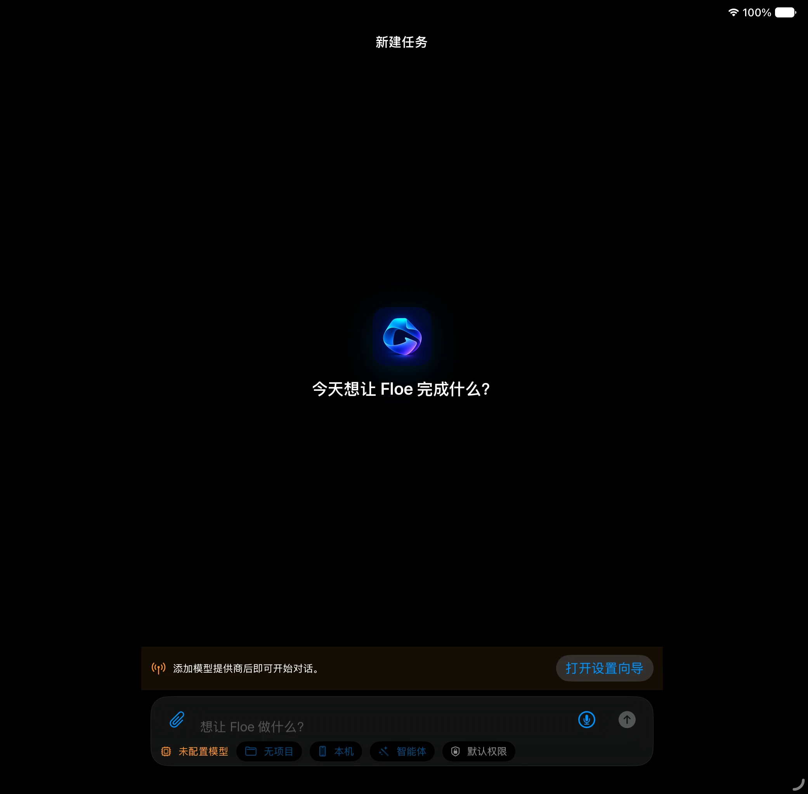
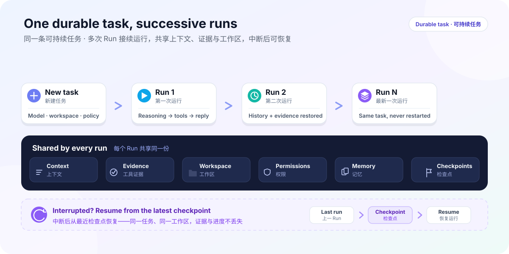
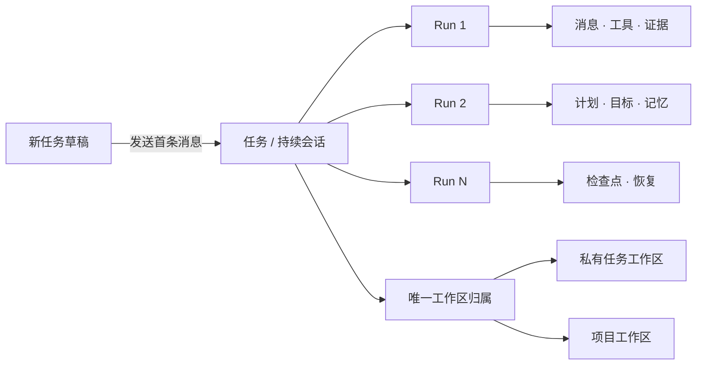
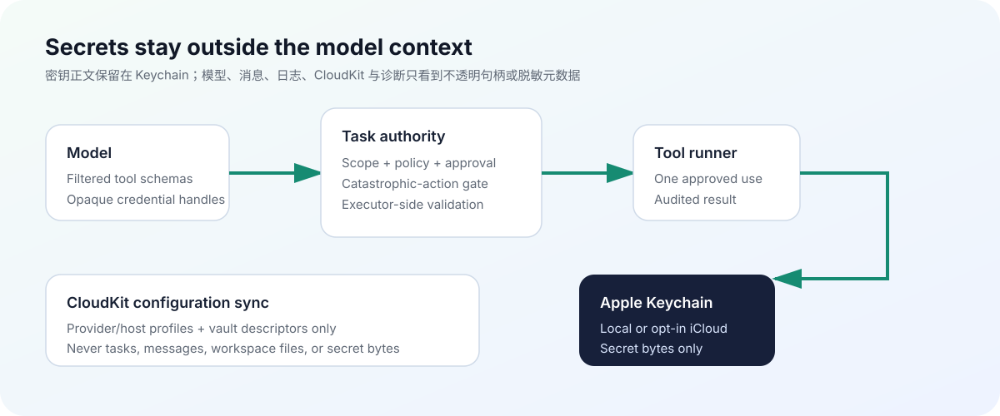
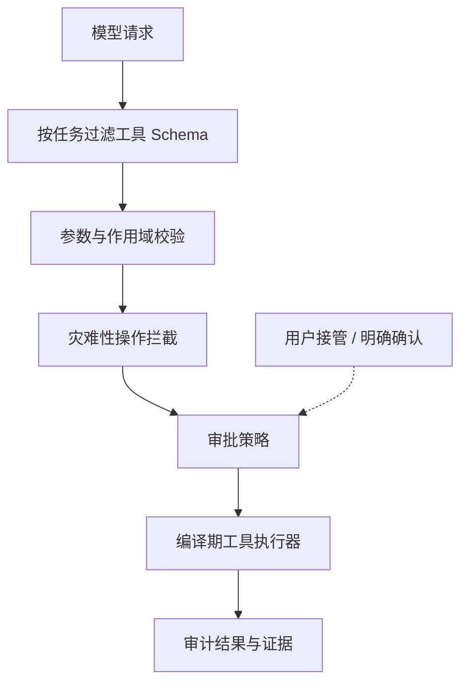

<div align="center">
  
  <h1>Floe Agent</h1>
  <p><strong>你的模型，你的文件，你的电脑。</strong></p>
  <p>面向 iPhone 与 iPad 的原生、私有、自带密钥 AI Agent 工作空间。</p>
  <p>
    <a href="README.md">English</a> ·
    <a href="https://www.floe-agent.com/">官方网站</a> ·
    <a href="docs/USER_GUIDE.zh-CN.md">使用指南</a> ·
    <a href="https://github.com/JiangNanGenius/floe-agent/releases">下载版本</a> ·
    <a href="SECURITY.zh-CN.md">安全策略</a>
  </p>
</div>

[](https://github.com/JiangNanGenius/floe-agent/releases)
[](FloeAgent/project.yml)
[](FloeAgent/Package.swift)
[](LICENSE)





Floe Agent 把一次模型对话组织成一条可持续的任务。每次发送都会在同一任务中创建新的 Run，并保留历史消息、工具证据、用户决策、计划、目标、记忆、权限和恢复检查点。任务可以使用 App 内部的私有工作区，也可以归属于用户明确选择的项目工作区。

## 为什么使用 Floe Agent

- **自带模型。** 用户自行连接兼容服务商，并可分别设置 Agent、识图、生图和图片编辑模型。
- **合适时完全在设备端运行。** 可使用 iOS 27 的 Apple Foundation Model 或主动下载的 MLX 模型；本地模型采用独立上下文和内存策略，不缩减云端模型的上下文与工具能力。
- **全过程可检查。** 思考预览、工具调用、文件变更、浏览器状态、子 Agent、审批和错误统一出现在持续时间线中。
- **直接使用自己的资源。** 支持 Files 工作区、图片操作、SSH、跳板机、VNC，以及用户可见的 WebKit 浏览器，不经过 Floe 中转服务。
- **在工作区内管理源码。** 轻量原生源码管理可查看更改与差异、初始化仓库、暂存、提交、分支、抓取、快进拉取、推送并连接 GitHub。
- **任务级权限。** 文件、网络、浏览器、上传、凭据和远程执行权限都有明确上限；敏感操作仍需逐次确认。
- **真实恢复。** 后台协调、通知和检查点只恢复可安全继续的阶段；iOS 暂停和结果不确定不会伪装成成功。
- **声明式技能。** Skill Creator 与 Skill Finder 只安装经过静态校验的指令/知识包，不能动态加载原生插件或偷偷增加工具权限。
- **接入 Apple 自动化。** App Intents 把立即运行和安排 Floe 任务公开给快捷指令；设备本地开关分别管理日历、提醒事项、家庭、地图、视觉、文档、相机、位置等系统能力。

## 任务层级



普通启动会直接进入**新建任务**。发送首条消息时，Task、工作区归属、首个 Run、用户消息、附件和初始权限在同一事务中创建。后续发送只会在同一个 Task 内创建新 Run，不会把上下文拆成互不相关的任务。

## 开始使用

### TestFlight

项目会在测试组开放时通过 TestFlight 分发签名版本。当前源码目标版本为 Floe Agent 1.4.28（build 59）；只有同时通过发布门禁并能在 TestFlight 中看到的构建才算完成发布。仅有源码版本或标签不能证明 Apple 已收到或处理该构建。

### 未签名 IPA

GitHub 预发布版本为高级测试者和下游打包者提供未签名 IPA：

1. 从 [Releases](https://github.com/JiangNanGenius/floe-agent/releases) 下载 IPA 与 `.sha256`。
2. 在打开或重签名前核验 SHA-256。
3. 检查源码以及随包提供的 SBOM、许可证、测试摘要和构建证明。
4. 使用自己信任的工具、证书和描述文件进行签名。

> [!WARNING]
> GitHub IPA 不是 TestFlight/App Store 安装包，通常不能直接安装。Floe Agent 不提供证书、描述文件或代签服务。

### 从源码构建

需要 macOS、包含 iOS 26 SDK 或更新版本的完整 Xcode、Swift 6.2+ 与 XcodeGen。当前发布目标中的 iOS 27 Foundation Models 路径必须使用 Xcode 27 编译。

```bash
git clone https://github.com/JiangNanGenius/floe-agent.git
cd floe-agent/FloeAgent
brew install xcodegen
xcodegen generate
scripts/local_build.sh
```

针对性检查：

```bash
swift build
swift test
DEVELOPER_DIR=/Applications/Xcode.app/Contents/Developer \
  xcodebuild -project FloeAgent.xcodeproj -scheme FloeAgent \
  -destination 'generic/platform=iOS Simulator' build
```

完整配置流程请阅读[简体中文使用指南](docs/USER_GUIDE.zh-CN.md)；开发环境与测试命令见[工程 README](FloeAgent/README.md)。

## 主要界面

| 界面 | 用途 |
| --- | --- |
| 新建任务 | 在发送前选择模型、工作区、执行目标、技能和任务权限。 |
| 任务线程 | 在同一会话中持续工作，并查看思考、工具、证据、澄清问题与审批。 |
| 任务中心 | 筛选运行中、待输入、待审批、失败、完成和已安排任务。 |
| 右侧检查器 | 查看变更、文件、浏览器、终端/主机、进度、子 Agent 和权限；默认收起。 |
| 可见浏览器 | Agent 操作真实 `WKWebView`；登录、扫码、验证或上传时交由用户接管。 |
| 源码管理 | 查看仓库状态、差异和历史，执行暂存、提交、分支与同步；不提供破坏性的 reset、clean、强制推送或历史改写。 |
| 设置 | 配置服务商、辅助模型、权限默认值、执行环境、文件、同步、主机、数据管理和诊断。 |

### 模型与图片服务商

系统管理的 Apple Foundation Model 始终显示在**设置 → 本地模型**。在 iOS/iPadOS 27 上，它通过 Foundation Models 框架调用，并显示系统返回的真实可用状态，例如设备不支持、Apple Intelligence 未开启或系统模型仍在下载。它没有 API Key 或单独下载开关，因为模型和下载都由 iOS 管理。主动下载的 Qwen、Gemma MLX 模型则独立管理：加载前检查安全内存余量，同一时间最多驻留一个模型，卸载或失败时清理运行时缓存，并向本地模型提供经过裁剪的真实任务工具目录。

OpenAI 生图与图片编辑默认使用 `gpt-image-2`；Google Gemini Images 提供 Nano Banana Pro（`gemini-3-pro-image`）。两类服务商都允许修改 Base URL 以连接兼容代理；生图、编辑和识图仍是彼此独立的角色。

### 工作区、Git 与审批

私有任务工作区会与首条消息原子创建并绑定；项目工作区继续使用用户明确选择的 Files 范围。文件检查器新增轻量源码管理标签；**设置 → GitHub 与源码管理**只把细粒度 GitHub Token 保存在设备钥匙串，并可列出、克隆和创建仓库。

有界只读、本地工作区操作、生图/识图、OCR、PDF 只读和局域网发现不等待审批模型。会产生后果的写入按目标范围和用户意图判断。删除、凭据、上传、付款、宽泛远程命令，以及强制推送/历史改写仍会被阻止或要求明确复核。“帮我测试一下所有工具”这类宽泛请求可以授权安全诊断，但不会静默扩展为删除、凭据或破坏性测试。

### Python 执行

Floe 的签名构建会把固定的 CPython 3.13 运行时和标准库作为 App 资源一同打包。`exec.localPython` 在 App 沙盒内运行受限源码；受管包接口会隔离下载依赖，只有通过哈希、静态检查与软件包审核的纯 Python 通用 wheel 才能激活，原生扩展、JIT、Mach-O/ELF、动态库和子进程仍不可用。需要更完整的环境时，可添加装有 `python3` 的 SSH 主机，核对并信任主机密钥，再把它选为任务执行目标并允许远程执行。两种路径都会明确返回标准输出、标准错误、超时、截断、取消和能力缺失，不能伪装为成功。

### 归档与凭据同步

“设置 → 数据管理”统一提供应用总占用与分类、安全清理、归档恢复/单删/批量删除，以及 Floe 全局字体库。字体可从 Files 或公开 HTTPS 直链导入一次并供所有工作区的 Word/PDF 流程复用；受限安装不等待审批模型，跨工作区删除仍需审核。任务列表仍可左滑归档；永久删除始终需要二次确认。配置同步只包含服务商/模型配置与主机非秘密信息，API Key 通过 iCloud Keychain 同步。“同步已保存凭据”是独立开关并默认关闭：CloudKit 只保存凭据库描述符，SSH、VNC、网页密码和 Token 正文仍只在 Keychain；任务或工作区临时凭据永远不同步。

## 安全边界





API 密钥应保存在 Keychain 中；模型输出一律视为不可信输入；即使模型伪造工具调用，执行端仍会检查任务权限与资源作用域。浏览器登录、凭据、上传、付款、删除和大范围危险命令不会因为任务或 Skill 提出请求就自动变成安全操作。

Floe Agent **不提供**托管模型代理、Floe 账户、远程中继、广告 SDK、模型市场、下载代码的任意本机执行，也不承诺 iOS 会无限期维持后台连接。

## 文档导航

| 内容 | 简体中文 | English |
| --- | --- | --- |
| 产品使用 | [使用指南](docs/USER_GUIDE.zh-CN.md) | [User guide](docs/USER_GUIDE.md) |
| 架构 | [架构总览（双语术语）](docs/ARCHITECTURE_OVERVIEW.md) | [Architecture overview](docs/ARCHITECTURE_OVERVIEW.md) |
| 参与开发 | [贡献指南](CONTRIBUTING.zh-CN.md) | [Contributing](CONTRIBUTING.md) |
| 安全 | [安全策略](SECURITY.zh-CN.md) | [Security policy](SECURITY.md) |
| 支持 | [支持](SUPPORT.zh-CN.md) | [Support](SUPPORT.md) |
| 设计方向 | [设计方向](DESIGN.md) | 关键术语包含中文对照 |

历史实现报告和审计记录统一收录在 [`docs/README.md`](docs/README.md)。历史文件只代表其记录提交的状态，不能当作当前版本的功能声明。

## 项目原则

1. 凭据、文件和电脑始终由用户控制。
2. 当前任务、下一步决定和支持证据必须清楚可见。
3. 优先保证可恢复和诚实中断，不假装任务仍在后台运行。
4. 强大权限必须明确、限域、限时且可随时停止。
5. 模型输出、远程内容、Skill 包和工具参数全部视为不可信输入。

## 贡献与许可证

准备进行大型或安全敏感改动前，请阅读[贡献指南](CONTRIBUTING.zh-CN.md)，并先创建 Issue 说明用户问题、范围、安全影响和验证方法。安全漏洞请按[安全策略](SECURITY.zh-CN.md)私下报告。

Floe Agent 原创代码采用 [Mozilla Public License 2.0](LICENSE)；第三方组件保留各自许可证与声明。
