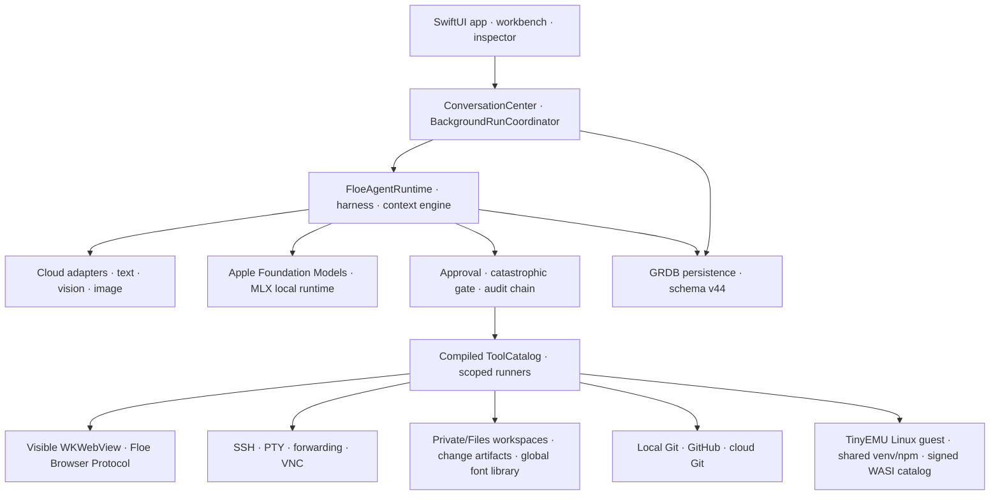
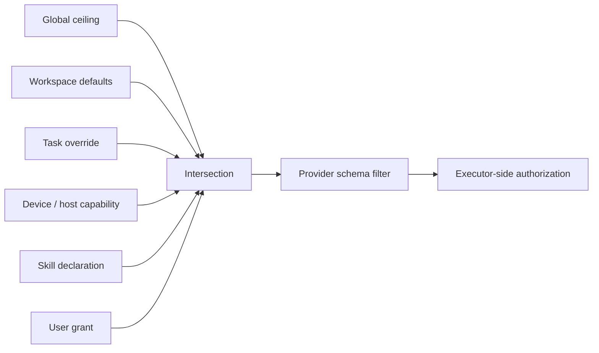

# Floe Agent Architecture Overview

[README](../README.md) · [简体中文 README](../README.zh-CN.md) · [User guide](USER_GUIDE.md)

This page describes the Floe 1.7 integration architecture (schema v44). The delivered internal build is **1.7.0 (225)**; `main` also carries the next integration, whose implemented/pending boundaries are recorded in [next-release status](FLOE_1_7_NEXT_RELEASE_STATUS.md) and [implementation status](FLOE_1_7_IMPLEMENTATION_STATUS.md), while the [Build 225 release notes](RELEASE_NOTES_1.7.0_BUILD_225.md) describe the delivered runtime behavior. Older audit and delivery documents retain their historical meaning.

## Floe 1.7 integration boundaries

`FloeEnvironments` owns environment records, layer types and resolved paths; `FloePackages` consumes these types instead of defining a second environment model. `EnvironmentExecutionCoordinator` resolves workspace/conversation ownership, leases executions and retains ownership until workers have actually stopped. Tool contexts and persisted background jobs carry `environmentID`; schema v40 added the background-job field and the line continues through v44 (media-job ownership/idempotency, durable private-workspace cleanup intents, conversation search index repair).

Resolution order is session, project, shared, then base, with an explicit write layer. The integration is not complete across all Python/WASM/install paths. Environment separation is dependency/data/lifecycle layering, not a security sandbox for native code in the same process.

Local Python, Node.js, shell commands and services run inside each environment's TinyEMU Linux guest; the App bundles no native Python, Node or Ruby payload, and the retired in-process CPython/NodeMobile recipes are archived under `FloeAgent/ThirdParty/NativeRuntimeArchive/` and blocked by `FloeAgent/scripts/audit_native_runtime_free.py`. First use of a Linux-required entry point runs one shared prepare/download/verify/install/start job and resumes the original command; the guest configures and reports its own network. Signed WASI commands remain a separate capability class. Media transcode/audio conversion use bounded processing and verified temporary outputs. Unconnected enhancement runners are not registered as available tools. Package transactions stage and verify payloads before journaled file changes; current fixture coverage and remaining gaps are tracked in [implementation status](FLOE_1_7_IMPLEMENTATION_STATUS.md).

## Domain vocabulary / 领域术语

| English | 简体中文 | Meaning |
| --- | --- | --- |
| Task / Conversation | 任务 / 持续会话 | The durable user-visible thread. |
| Run | 单次执行 | One model execution inside a task. |
| Child Run | 子执行 / 子 Agent | An independently budgeted run related to a parent run. |
| Workspace | 工作区 | The file and tool scope owned by one task. |
| Checkpoint | 检查点 | Recoverable runtime state at a safe boundary. |
| Task policy | 任务策略 | Effective tool, file, network, browser, credential, remote, background, and notification limits. |

## System map

## Persistence and ownership

The ownership model introduced in schema v20 retains one workspace owner per task through `conversation_workspace_ownership`. A task created without a project receives an internal `privateTask` workspace; a project task points to a `project` workspace. Legacy many-to-many links are migrated and no longer used for canonical writes.

New-task persistence is atomic: conversation, workspace ownership, run, user message, message parts, staged attachments, policy, and initial events either all commit or all roll back. Run launch validates that the parent conversation still exists before provider I/O begins.

## Context assembly

`ConversationHistoryAssembler` combines recent verbatim messages with sourced compression records, tool evidence, user decisions, attachments, plan, goal, scoped memory, workspace instructions, and effective task policy. Historical content cannot modify current permissions. Checkpoint format v3 records orchestration fields, a bounded execution ledger, and the exact lifecycle phase of every pending tool call. Recovery removes unfinished stream fields, restores completed evidence, distinguishes a recorded-but-not-dispatched call from an unknown external outcome, and never silently replays a successful identical call.

Cloud and local context policies are independent. Cloud adapters retain the configured provider context, compression and full allowed tool schema. Local adapters choose a dynamic device-safe context and an intent-ranked subset of real compiled tools, then use a strict JSON fallback when a small model does not emit a native structured call.

## Harness settlement and recovery

Every provider tool batch has three visible boundaries: request recording, executor dispatch, and result commitment. Floe executes an approved batch, reconciles every result back into provider order, updates the full execution ledger and lifecycle set, writes one batch-settlement checkpoint, and only then publishes result UI or starts the next provider turn. A crash therefore cannot expose a later tool result while leaving the durable batch at an earlier index. Stateful tool families publish bounded discovery-to-action workflows; structured IDs, cursors, task IDs, and artifact bindings are preserved ahead of truncated output so the next call can reuse verified values instead of guessing. Deterministic failures name the required discovery predecessor. Remote cloud workspaces provide a read-only catalog before file or Git actions.

`HarnessInvariant` verifies ordered call/result pairing, unique lifecycle IDs, legal lifecycle monotonicity, immutable tool identity and authorization identity, and the absence of orphan lifecycle records. A model-dispatch checkpoint stores a stable prompt digest before provider I/O. Critical timeline records retry and fail closed rather than being discarded with `try?`; final assistant content and terminal state remain ordered. Loop protection uses an exact fingerprint inside the current progress epoch, so changed arguments, changed evidence, a successful mutation, an explicit wait, or new user direction resets the detector instead of consuming a global tool-round allowance.

Tool execution passes through one runtime-owned settlement boundary: normalization, authorization bound to the original executor/workspace/host context, monotonicity and idempotency checks, execution, result finalization, durable persistence, and model-visible delivery. The Harness overwrites executor-supplied provenance and publishes bounded `resourceBindings` for IDs and cursors discovered by list/search calls. A malformed call receives one correction opportunity without creating a synthetic call/result pair. Run-event watermarks and keyset timeline cursors prevent restored or very large tasks from replaying old events as current work.

## Browser boundary

Floe's browser protocol is CDP-like, not Chrome DevTools Protocol. Public WebKit APIs provide navigation, isolated-world JavaScript, semantic DOM observation, snapshots, tabs, and user-visible interaction. WebKit does not expose a local CDP endpoint or a public way to forge trusted iOS touch events.

Element references include a `documentID`; stale references fail closed. Login, QR codes, CAPTCHA, 2FA, passwords, payment, protected file upload, canvas, closed shadow DOM, and inaccessible cross-origin frames use `needsUser` and pause for takeover.

## Permission evaluation

Provider schema filtering reduces accidental requests; executor-side authorization is the security boundary. Deterministic low-risk reads, image/OCR/PDF inspection and LAN discovery bypass approval-model latency. Consequential operations remain scope-aware and reviewable even when broader authority is granted; vague diagnostic intent never grants destructive or credential access.

## Package layout

| Target | Responsibility |
| --- | --- |
| `FloeCore`, `FloeModels` | Shared protocols, profiles, events, policies, and value models. Also the pure background-work contracts: the durable `BackgroundWorkSnapshot`/`BackgroundWorkRegistry` model, the completion-dwell and generation-safe teardown policy, the opt-in status PiP release gate, the guest `/proc` parsers, and the notification policy/authorization decision types. |
| `FloeProviders` | SSE/wire translation plus text, vision, image-generation, and image-editing adapters. |
| `FloeLocalModels` | Apple Foundation Models availability/runtime, curated MLX models, memory policy, dynamic context, and bounded local tool translation. |
| `FloeAgentRuntime` | State machine, harness, context assembly, Plan/Goal/Memory, checkpoints, and tool loop. |
| `FloeTools`, `FloeSecurity` | Compile-time catalog, authorization, approvals, audit, and catastrophic-action detection. `CapabilityExecutionRouter` is the exhaustive, pure decision table declaring which backend owns each stable tool name: interpreters/CLIs/packages/servers in the Linux guest, heavy media/GPU work on native Apple frameworks with no silent emulator fallback, and remote-prefixed commands on a configured SSH host. `CapabilityRouteLedger` keeps a bounded trail of the routing actually used. |
| `FloePersistence` | GRDB stores and append-only migrations through schema v44. |
| `FloeWorkspace`, `FloeDocuments`, `FloeImages` | File scope, working copies, change artifacts, documents, and local image operations. `FloeWorkspace` also owns the native text/code editing kernel (`IDENativeTextWorkspace`: per-buffer drafts, bounded highlighting, conflict-safe saves) and the bounded archive engine (zip/tar/tar.gz/tar.xz create/list/extract, bzip2 create-only, 7z read-only; RAR through the app's signed decoder). |
| `FloeGit` | Non-destructive local repository operations, GitHub connection, and local/cloud source-control tools. |
| `FloeSSH`, `FloeExecution`, `FloeVNC` | Authorized remote execution, the TinyEMU Linux guest runtime and visible computer control. Guest Python/Node and signed WASI commands are separate capability paths. `FloeExecution` also owns Runtime v2: SHA-512 content-addressed images, immutable software templates with pinned per-environment copy-on-write deltas, the three-axis CPU/RAM/VM pool (SMP admission only from a verified image manifest; the six-vCPU performance tier stays dormant behind its evidence gate) and the local-service supervisor. `LinuxGuestMetricsSampler` produces bounded, consumer-limited resource samples (emulator-thread CPU, guest `/proc` CPU and memory, network counters; GPU always unavailable) and only runs while a foreground consumer is registered. |
| `FloeSkills` | Declarative package validation, compatibility, provenance, and per-run tool ceiling. |
| `FloeApp` | Native iPhone/iPad interface, browser sessions, voice, notifications, and lifecycle coordination. `BackgroundRunCoordinator` is the single owner of background-work lifetime: it requests the system continued-processing task only for explicit foreground user actions, publishes snapshots into `BackgroundWorkRegistry`, keeps one foreground in-app banner instead of duplicating a system alert, routes notification deep links by payload identity, and applies the 3-second success completion dwell with generation-checked teardown (failures/checkpoints stay actionable). |

## IDE, archives and the Linux environment boundary

The IDE code tab hosts two kernels and keeps both mounted. The native Swift text workspace is the default for text, code, and content-verified unknown text files; Office, PDF, CAD, image, media, archive, and binary paths route to their typed native surfaces, and the bundled Web workbench stays available as the advanced fallback that owns multi-cursor, folding and its own explorer. The persisted choice is the `workspace.ide.nativeTextEditor` app-storage key, switched from the IDE toolbar, and switching never discards native buffers. A buffer's draft is separate from its saved baseline: the workspace holds at most 12 open buffers, evicts only clean ones, and when all 12 are dirty it refuses a new open with a typed, bilingual reason and a **Save All** action instead of silently dropping a draft. Editing guards are explicit: a 4 MiB text limit, UTF-8 verification for unknown extensions, a bounded highlighting pass over the first 512 Ki UTF-16 units, an input-method composition guard that defers storage writes during marked text, and version-checked saves that keep the draft and open a conflict review.

Archive work is host-native and bounded, not a guest feature: `ArchiveEngine` lists, extracts and creates zip, tar, tar.gz and tar.xz with entry/total-size/cancellation limits, path-traversal and symlink containment, staged commit and no-overwrite outputs; bzip2 can be created but not decoded (its one-shot decoder cannot be bounded before allocation, so decode is refused with that reason) and 7z is read-only. RAR list/extract goes through the app's signed decoder (`ArchiveCompressedBridge`), while the guest `floe-host archive` bridge and its `helloCapabilityArgument` seam are present but not negotiated in the app, so no guest archive path is claimed yet; a per-environment archive FileTree UI is likewise still pending.

The Linux boundary has two storage models that must not be conflated. Host-side layers (session → project → shared → base, resolved by `EnvironmentRegistry`) provide read-only inheritance and an explicit writable layer per container. Inside Runtime v2, one verified base image is content-addressed and shared; an immutable software template pins a version/digest, and each environment keeps a private delta bound to its boot base, so a pinned environment's changes are captured only against its template while unpinned environments keep base-image behavior. Installed state is therefore private per environment, a saved template never absorbs an environment's installs, and the host's rebuildable cache directories are not installed state. Exactly one writable lease exists per environment; commands, terminals and services in that environment share one guest (files, packages, network, localhost), while different environments get different guests. Pool admission is three-axis (vCPU/RAM/pressure) and SMP-capable boot is granted only from a verified image manifest — the current pinned image declares no SMP capability, so dual-hart requests fail closed with an actionable reason and the performance tier is not enabled. Installation state and the VM runtime identity are separate: a stopped environment keeps its disk, and the next start is a new runtime with a new identity.

The heavy-runtime arbiter is the single coordinator between local MLX inference and Linux admission. Linux start waits for an idle local model, and an explicit drain handler physically unmaps a retained-but-idle engine (the durable task claim survives; the next turn reloads the same snapshot) instead of failing or cancelling active work; genuinely active inference answers `.retained`, keeps the guest queued and reaches a bounded, truthful `linuxModelRetained` error rather than deadlocking. A same-run Linux tool that leaves its own disposable guest running is released automatically for the continuation when every active guest belongs to that run and no service exists; another run's, a user-started, quarantined or racing guest still falls back to the explicit confirmation. The background status surface is the opt-in status PiP behind `StatusPiPReleaseGate`, rendered from the durable `BackgroundWorkRegistry` snapshot; it reports measured values only (guests' unmeasured fields render "暂无"/"N/A"), uses per-launch runtime identity for its pages and notification identifiers, and its generation/stream and pending start/stop repairs are still landing, so its device behavior is not acceptance evidence.

## Creative mode and asset architecture

Creative Mode is a native infinite-canvas surface, not a replacement for the existing Task/Run/Workspace model. Floe remains chat-first. A private canvas can be opened without creating a Workspace, while Workspace canvases retain project-owned material and explicit export. The canvas persists one graph of content nodes, provider-neutral generation-task nodes, and imported or generated artifact nodes. The node-scoped AI editor applies structured patches through the existing undo/save/sync path without creating a Run or invoking tools. The separate Canvas Assistant uses the production Conversation/Run/checkpoint path with canvas-filtered tools, bounded provider recovery, and Canvas Vision preprocessing for selected images when the primary model is text-only. Saving task configuration never starts generation; execution and recovery are explicit task-card actions with mirrored artifact status.

Images, videos, audio, documents, prompts, screenshots, and design outputs use one shared `CreativeArtifact` lifecycle. Project artifacts are the default destination. A user may explicitly promote an image to the global long-term `ImageLibraryAsset`; every Conversation/Run can read and hybrid-search these images. Videos, audio, and canvas documents remain project or conversation artifacts unless exported elsewhere. Media blobs are stored separately from canvas JSON and retained or garbage-collected by reference checks. Recent, favorites, date, type, and search are derived views rather than physical folders.

The same media-generation service is available to ordinary Chat, Creative Mode, and Workspace. LLM providers cover both ordinary text models and vision-capable models; vision is a model capability, not a separate provider type. All video models are added and maintained under the existing Model Providers settings; Auxiliary Models stores the default video model used by Agent calls. A user-initiated Canvas generation may temporarily choose any enabled compatible video model without changing that default. The surface changes the default context and result destination; it does not create a second video-generation or model-settings implementation. Existing provider/model settings, Conversation/Run progress, task cancellation, approvals, data management, Skills, and Workspace export boundaries remain shared.

Every Run records a project context snapshot containing optional Workspace and CanvasProject IDs, selected CanvasDocument/node/artifact IDs, explicitly authorized project-context document IDs and versions, allowed asset scopes, and the active surface. Ordinary chat can read the global long-term image library through search and sees its existing Workspace/file context. A Run in CanvasProject sees the selected CanvasDocument(s), canvas artifacts, and selected planning/background documents in read-only form; it does not see ordinary chat code or arbitrary Workspace files. The Workspace parent provides the existing chat hierarchy, the single canvas entry, navigation, and this bounded project-context projection; it does not provide a shared Agent. Canvas writes, image-library promotion, media export, and deletion remain scoped and reviewable.

Standard MCP servers are optional external tool sources for the ordinary Agent, not a canvas bridge and not a new Agent type. Floe supports the current remote Streamable HTTP tools protocol and the previous session-based Streamable HTTP revision. Servers may require no credential, a user-provided bearer token, or a custom authentication header; secrets remain in Keychain. Interactive OAuth, deprecated HTTP+SSE endpoints, and a remote stdio bridge are not part of the first public beta. Canvas runs do not receive MCP tools by default; a user may explicitly allow an individual server for canvas use, after which the current canvas surface and task policy still filter its tools. Canvas Agent has bounded `web.search` and `web.fetch` access for discovering public references and fetching an explicit URL, but no browser navigation, clicking, login, or computer-control tools. Imported web material retains source and license status. MCP schemas and results are untrusted data; they cannot download or execute code on iOS, expose uncompiled native APIs, or bypass Floe approvals, data-sharing consent, audit, cancellation, and execution-ledger checks.

Skills remain declarative packages with an explicit capability and tool ceiling. They may contain bounded UTF-8 Python scripts plus exact-version pure-Python requirements. Creation or installation is the trust transition: paths, source markers, immutable package specs, universal-wheel contents and artifact digests are audited there. Runtime preapproval is fingerprint-bound to the identical script and package set; it is not a persistent permission for arbitrary Python, important-file mutation, credentials, privilege, destructive behavior or external effects.

The current interaction, data model, generation reuse, Pencil behavior, AI/MCP boundary, and recovery rules are documented in [Creative mode, canvas and asset architecture](CREATIVE_MODE_AND_ASSET_ARCHITECTURE.md) and its [Simplified Chinese version](CREATIVE_MODE_AND_ASSET_ARCHITECTURE.zh-CN.md).

## Workflow-upgrade contracts

Schema v36 records private-workspace cleanup intent transactionally with deletion. Physical cleanup and mount removal clear that intent only after success; startup and manager retries replay the queue. Shared project files are retained. An isolated workspace browser owns an independent network registry.

Conversation snapshots carry revisions across asynchronous reads; coalesced notifications drain newer revisions. Visible chat/canvas surfaces reconcile persisted state without repeating model or tool execution. Canvas reload defers during interactive drafts and skips unchanged file metadata.

Office inspect exposes a digest. Saves validate expected versions, write a staged package, reopen and verify changed fields, then replace the source. This basic path does not establish advanced Office fidelity. PDF uses a shared PDFKit reading session across inline/fullscreen presentations, with guarded local reloads and bounded remote snapshots.

`document.convert` and the separate `document.pdf.convert` accept workspace input/output paths and a target format. A bundled, pinned JavaScript engine converts Markdown, DOCX and HTML; native rich-text and PDF services supply RTF and PDF input/output. It never asks a model to regenerate the body. Source bytes remain intact, outputs are staged and atomically published under new names, and the model receives only compact status, digests and limitations. Local images are authorized and embedded before rendering; a nonpersistent WebKit view blocks network/file loading and strips active content. Size, decoded-image, page-count, timeout and cancellation bounds apply throughout. Searchable PDF extraction is text-oriented; conversion does not promise exact Office layout fidelity. Export font glyph mappings preserve distinct source Unicode characters during PDF extraction.

The official plugin catalog is verified against bundled trust keys and resolved source revisions. Before signing, the builder validates localized release notes and application versions against the app's decoding contract. Published ZIP versions are immutable. User removal of an exposed official plugin persists across launches. Expanded permissions remain visible during updates. See [qualification and outstanding work](WORKFLOW_UPGRADE.md).

## 1.7 手记与动态导图补充

FloeNotes 持有独立文档、页面、笔迹、主题、来源、历史和授权；Canvas 仍持有节点及工作流。两者只共享模型、文件/权限和任务服务。导图为主题的原生画布：结构数据与有界图片直接渲染为原生主题卡片，确定性树形布局按内容尺寸排版，首次编辑才把坐标写回文档；文档修订与布局方向均由原生存储确认。PDF 小窗有独立编辑会话与撤销。

手记永久删除使用数据库事务及独立资源回收日志。原文、历史、编辑回执和活动资源读取租约共同决定资源是否仍被引用；文件删除失败不得丢失回收记录。详见[恢复说明](FLOE_1_7_MIGRATION.md)与[当前验收记录](FLOE_1_7_CONTINUATION_STATUS.md)。
