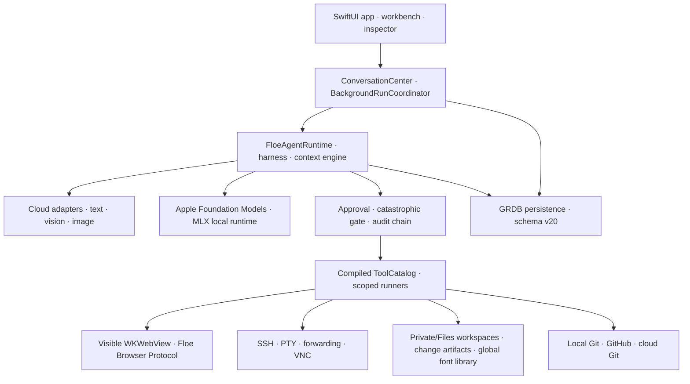
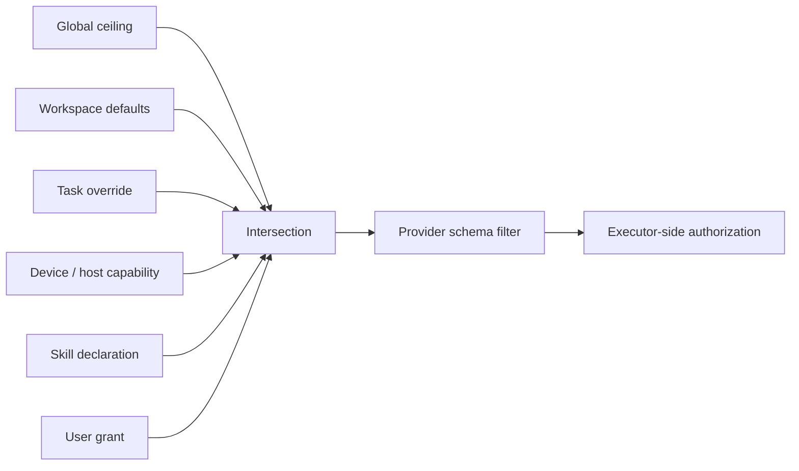

# Floe Agent Architecture Overview

[README](../README.md) · [简体中文 README](../README.zh-CN.md) · [User guide](USER_GUIDE.md)

This page is the current 1.4.46 map. Older audit and delivery documents are historical evidence and may use superseded schema versions or navigation names.

## Domain vocabulary / 领域术语

| English | 简体中文 | Meaning |
| --- | --- | --- |
| Task / Conversation | 任务 / 持续会话 | The durable user-visible thread. |
| Run | 单次执行 | One model execution inside a task. |
| Child Run | 子执行 / 子 Agent | An independently budgeted run related to a parent run. |
| Workspace | 工作区 | The file and tool scope owned by one task. |
| Checkpoint | 检查点 | Recoverable runtime state at a safe boundary. |
| Task policy | 任务策略 | Effective tool, file, network, browser, credential, remote, background, and notification limits. |

## System map

## Persistence and ownership

Schema v20 retains one workspace owner per task through `conversation_workspace_ownership`. A task created without a project receives an internal `privateTask` workspace; a project task points to a `project` workspace. Legacy many-to-many links are migrated and no longer used for canonical writes.

New-task persistence is atomic: conversation, workspace ownership, run, user message, message parts, staged attachments, policy, and initial events either all commit or all roll back. Run launch validates that the parent conversation still exists before provider I/O begins.

## Context assembly

`ConversationHistoryAssembler` combines recent verbatim messages with sourced compression records, tool evidence, user decisions, attachments, plan, goal, scoped memory, workspace instructions, and effective task policy. Historical content cannot modify current permissions. Checkpoint format v3 records orchestration fields, a bounded execution ledger, and the exact lifecycle phase of every pending tool call. Recovery removes unfinished stream fields, restores completed evidence, distinguishes a recorded-but-not-dispatched call from an unknown external outcome, and never silently replays a successful identical call.

Cloud and local context policies are independent. Cloud adapters retain the configured provider context, compression and full allowed tool schema. Local adapters choose a dynamic device-safe context and an intent-ranked subset of real compiled tools, then use a strict JSON fallback when a small model does not emit a native structured call.

## Harness settlement and recovery

Every provider tool batch has three visible boundaries: request recording, executor dispatch, and result commitment. Floe executes an approved batch, reconciles every result back into provider order, updates the full execution ledger and lifecycle set, writes one batch-settlement checkpoint, and only then publishes result UI or starts the next provider turn. A crash therefore cannot expose a later tool result while leaving the durable batch at an earlier index. Stateful tool families publish bounded discovery-to-action workflows; structured IDs, cursors, task IDs, and artifact bindings are preserved ahead of truncated output so the next call can reuse verified values instead of guessing. Deterministic failures name the required discovery predecessor. Remote cloud workspaces provide a read-only catalog before file or Git actions.

`HarnessInvariant` verifies ordered call/result pairing, unique lifecycle IDs, legal lifecycle monotonicity, immutable tool identity and authorization identity, and the absence of orphan lifecycle records. A model-dispatch checkpoint stores a stable prompt digest before provider I/O. Critical timeline records retry and fail closed rather than being discarded with `try?`; final assistant content and terminal state remain ordered. Loop protection uses an exact fingerprint inside the current progress epoch, so changed arguments, changed evidence, a successful mutation, an explicit wait, or new user direction resets the detector instead of consuming a global tool-round allowance.

## Browser boundary

Floe's browser protocol is CDP-like, not Chrome DevTools Protocol. Public WebKit APIs provide navigation, isolated-world JavaScript, semantic DOM observation, snapshots, tabs, and user-visible interaction. WebKit does not expose a local CDP endpoint or a public way to forge trusted iOS touch events.

Element references include a `documentID`; stale references fail closed. Login, QR codes, CAPTCHA, 2FA, passwords, payment, protected file upload, canvas, closed shadow DOM, and inaccessible cross-origin frames use `needsUser` and pause for takeover.

## Permission evaluation

Provider schema filtering reduces accidental requests; executor-side authorization is the security boundary. Deterministic low-risk reads, image/OCR/PDF inspection and LAN discovery bypass approval-model latency. Consequential operations remain scope-aware and reviewable even when broader authority is granted; vague diagnostic intent never grants destructive or credential access.

## Package layout

| Target | Responsibility |
| --- | --- |
| `FloeCore`, `FloeModels` | Shared protocols, profiles, events, policies, and value models. |
| `FloeProviders` | SSE/wire translation plus text, vision, image-generation, and image-editing adapters. |
| `FloeLocalModels` | Apple Foundation Models availability/runtime, curated MLX models, memory policy, dynamic context, and bounded local tool translation. |
| `FloeAgentRuntime` | State machine, harness, context assembly, Plan/Goal/Memory, checkpoints, and tool loop. |
| `FloeTools`, `FloeSecurity` | Compile-time catalog, authorization, approvals, audit, and catastrophic-action detection. |
| `FloePersistence` | GRDB stores and append-only migrations through schema v20. |
| `FloeWorkspace`, `FloeDocuments`, `FloeImages` | File scope, working copies, change artifacts, documents, and local image operations. |
| `FloeGit` | Non-destructive local repository operations, GitHub connection, and local/cloud source-control tools. |
| `FloeSSH`, `FloeExecution`, `FloeVNC` | Authorized remote execution and visible computer control. |
| `FloeSkills` | Declarative package validation, compatibility, provenance, and per-run tool ceiling. |
| `FloeApp` | Native iPhone/iPad interface, browser sessions, voice, notifications, and lifecycle coordination. |

## Creative mode and asset architecture

Creative Mode is a native infinite-canvas surface, not a replacement for the existing Task/Run/Workspace model. Floe remains chat-first. A private canvas can be opened without creating a Workspace, while Workspace canvases retain project-owned material and explicit export. The canvas persists one graph of content nodes, provider-neutral generation-task nodes, and imported or generated artifact nodes. The node-scoped AI editor applies structured patches through the existing undo/save/sync path without creating a Run or invoking tools. The separate Canvas Assistant uses the production Conversation/Run/checkpoint path with canvas-filtered tools, bounded provider recovery, and Canvas Vision preprocessing for selected images when the primary model is text-only. Saving task configuration never starts generation; execution and recovery are explicit task-card actions with mirrored artifact status.

Images, videos, audio, documents, prompts, screenshots, and design outputs use one shared `CreativeArtifact` lifecycle. Project artifacts are the default destination. A user may explicitly promote an image to the global long-term `ImageLibraryAsset`; every Conversation/Run can read and hybrid-search these images. Videos, audio, and canvas documents remain project or conversation artifacts unless exported elsewhere. Media blobs are stored separately from canvas JSON and retained or garbage-collected by reference checks. Recent, favorites, date, type, and search are derived views rather than physical folders.

The same media-generation service is available to ordinary Chat, Creative Mode, and Workspace. LLM providers cover both ordinary text models and vision-capable models; vision is a model capability, not a separate provider type. All video models are added and maintained under the existing Model Providers settings; Auxiliary Models stores the default video model used by Agent calls. A user-initiated Canvas generation may temporarily choose any enabled compatible video model without changing that default. The surface changes the default context and result destination; it does not create a second video-generation or model-settings implementation. Existing provider/model settings, Conversation/Run progress, task cancellation, approvals, data management, Skills, and Workspace export boundaries remain shared.

Every Run records a project context snapshot containing optional Workspace and CanvasProject IDs, selected CanvasDocument/node/artifact IDs, explicitly authorized project-context document IDs and versions, allowed asset scopes, and the active surface. Ordinary chat can read the global long-term image library through search and sees its existing Workspace/file context. A Run in CanvasProject sees the selected CanvasDocument(s), canvas artifacts, and selected planning/background documents in read-only form; it does not see ordinary chat code or arbitrary Workspace files. The Workspace parent provides the existing chat hierarchy, the single canvas entry, navigation, and this bounded project-context projection; it does not provide a shared Agent. Canvas writes, image-library promotion, media export, and deletion remain scoped and reviewable.

Standard MCP servers are optional external tool sources for the ordinary Agent, not a canvas bridge and not a new Agent type. Floe supports the current remote Streamable HTTP tools protocol and the previous session-based Streamable HTTP revision. Servers may require no credential, a user-provided bearer token, or a custom authentication header; secrets remain in Keychain. Interactive OAuth, deprecated HTTP+SSE endpoints, and a remote stdio bridge are not part of the first public beta. Canvas runs do not receive MCP tools by default; a user may explicitly allow an individual server for canvas use, after which the current canvas surface and task policy still filter its tools. Canvas Agent has bounded `web.search` and `web.fetch` access for discovering public references and fetching an explicit URL, but no browser navigation, clicking, login, or computer-control tools. Imported web material retains source and license status. MCP schemas and results are untrusted data; they cannot download or execute code on iOS, expose uncompiled native APIs, or bypass Floe approvals, data-sharing consent, audit, cancellation, and execution-ledger checks.

Skills remain declarative packages with an explicit capability and tool ceiling. They may contain bounded UTF-8 Python scripts plus exact-version pure-Python requirements. Creation or installation is the trust transition: paths, source markers, immutable package specs, universal-wheel contents and artifact digests are audited there. Runtime preapproval is fingerprint-bound to the identical script and package set; it is not a persistent permission for arbitrary Python, important-file mutation, credentials, privilege, destructive behavior or external effects.

The current interaction, data model, generation reuse, Pencil behavior, AI/MCP boundary, and recovery rules are documented in [Creative mode, canvas and asset architecture](CREATIVE_MODE_AND_ASSET_ARCHITECTURE.md) and its [Simplified Chinese version](CREATIVE_MODE_AND_ASSET_ARCHITECTURE.zh-CN.md).
