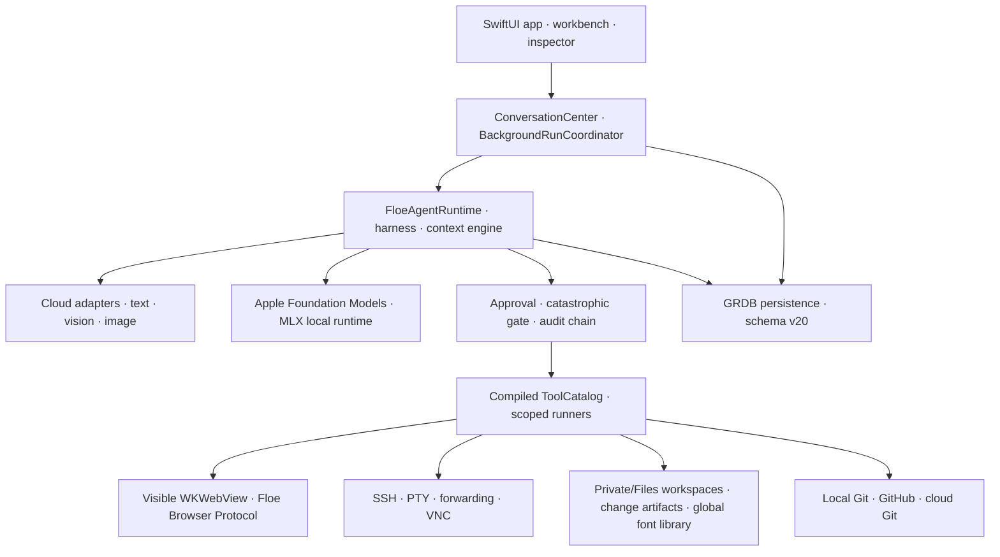
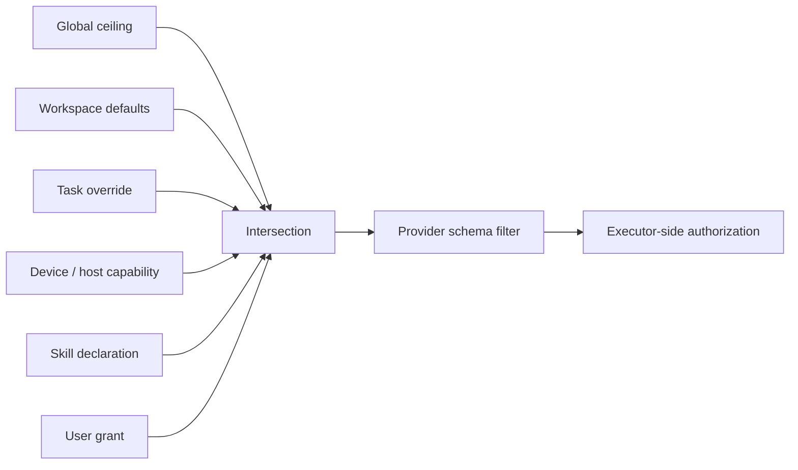

# Floe Agent Architecture Overview

[README](../README.md) · [简体中文 README](../README.zh-CN.md) · [User guide](USER_GUIDE.md)

This page is the current 1.4.33 map. Older audit and delivery documents are historical evidence and may use superseded schema versions or navigation names.

## Domain vocabulary / 领域术语

| English | 简体中文 | Meaning |
| --- | --- | --- |
| Task / Conversation | 任务 / 持续会话 | The durable user-visible thread. |
| Run | 单次执行 | One model execution inside a task. |
| Child Run | 子执行 / 子 Agent | An independently budgeted run related to a parent run. |
| Workspace | 工作区 | The file and tool scope owned by one task. |
| Checkpoint | 检查点 | Recoverable runtime state at a safe boundary. |
| Task policy | 任务策略 | Effective tool, file, network, browser, credential, remote, background, and notification limits. |

## System map

## Persistence and ownership

Schema v20 retains one workspace owner per task through `conversation_workspace_ownership`. A task created without a project receives an internal `privateTask` workspace; a project task points to a `project` workspace. Legacy many-to-many links are migrated and no longer used for canonical writes.

New-task persistence is atomic: conversation, workspace ownership, run, user message, message parts, staged attachments, policy, and initial events either all commit or all roll back. Run launch validates that the parent conversation still exists before provider I/O begins.

## Context assembly

`ConversationHistoryAssembler` combines recent verbatim messages with sourced compression records, tool evidence, user decisions, attachments, plan, goal, scoped memory, workspace instructions, and effective task policy. Historical content cannot modify current permissions. Checkpoint format v2 records orchestration fields plus a bounded execution ledger. Recovery removes unfinished stream fields, restores completed tool evidence, and resumes from a safe boundary without replaying successful identical calls.

Cloud and local context policies are independent. Cloud adapters retain the configured provider context, compression and full allowed tool schema. Local adapters choose a dynamic device-safe context and an intent-ranked subset of real compiled tools, then use a strict JSON fallback when a small model does not emit a native structured call.

## Browser boundary

Floe's browser protocol is CDP-like, not Chrome DevTools Protocol. Public WebKit APIs provide navigation, isolated-world JavaScript, semantic DOM observation, snapshots, tabs, and user-visible interaction. WebKit does not expose a local CDP endpoint or a public way to forge trusted iOS touch events.

Element references include a `documentID`; stale references fail closed. Login, QR codes, CAPTCHA, 2FA, passwords, payment, protected file upload, canvas, closed shadow DOM, and inaccessible cross-origin frames use `needsUser` and pause for takeover.

## Permission evaluation

Provider schema filtering reduces accidental requests; executor-side authorization is the security boundary. Deterministic low-risk reads, image/OCR/PDF inspection and LAN discovery bypass approval-model latency. Consequential operations remain scope-aware and reviewable even when broader authority is granted; vague diagnostic intent never grants destructive or credential access.

## Package layout

| Target | Responsibility |
| --- | --- |
| `FloeCore`, `FloeModels` | Shared protocols, profiles, events, policies, and value models. |
| `FloeProviders` | SSE/wire translation plus text, vision, image-generation, and image-editing adapters. |
| `FloeLocalModels` | Apple Foundation Models availability/runtime, curated MLX models, memory policy, dynamic context, and bounded local tool translation. |
| `FloeAgentRuntime` | State machine, harness, context assembly, Plan/Goal/Memory, checkpoints, and tool loop. |
| `FloeTools`, `FloeSecurity` | Compile-time catalog, authorization, approvals, audit, and catastrophic-action detection. |
| `FloePersistence` | GRDB stores and append-only migrations through schema v20. |
| `FloeWorkspace`, `FloeDocuments`, `FloeImages` | File scope, working copies, change artifacts, documents, and local image operations. |
| `FloeGit` | Non-destructive local repository operations, GitHub connection, and local/cloud source-control tools. |
| `FloeSSH`, `FloeExecution`, `FloeVNC` | Authorized remote execution and visible computer control. |
| `FloeSkills` | Declarative package validation, compatibility, provenance, and per-run tool ceiling. |
| `FloeApp` | Native iPhone/iPad interface, browser sessions, voice, notifications, and lifecycle coordination. |
