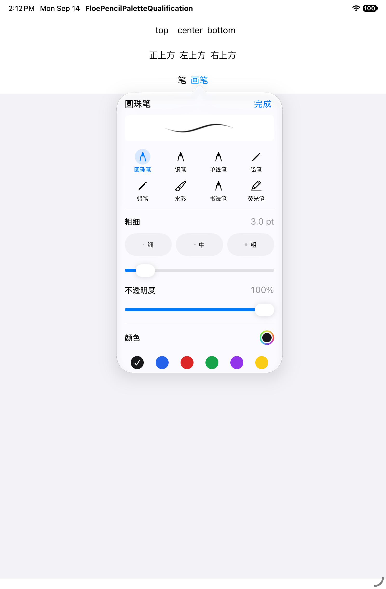
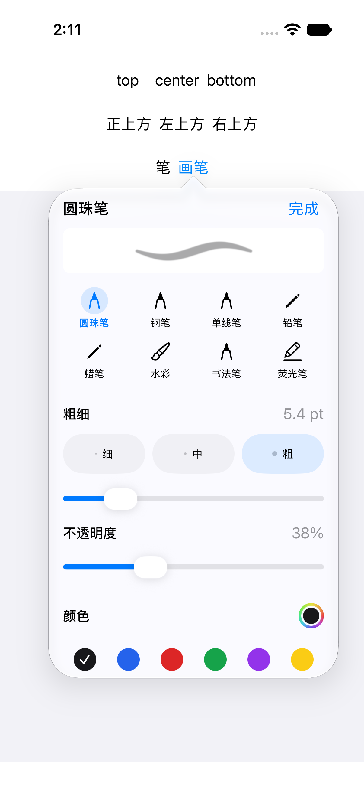

# Notes Pencil tool arc

Mode: Operate. This is a narrow part of the iPad-first Notes editor, inheriting
Floe's native typography, semantic selection color and light/dark materials.
It is independent of Canvas editing state.

The user-defined interaction is:

1. Squeeze once to open near the Pencil tip; squeeze again to close.
2. Move, hover or drag to preview a tool. Lifting never confirms a selection.
3. Explicitly tap a tool to select it and close the menu.
4. Tap blank space to close without changing the current tool.

Use a thin open arc, with an empty center and room below for the hand. Avoid a
large filled disk, a rectangular popover wrapper, black outlines and large
colored wedges. Five tool icons have stable positions and 44-point targets.
The default remains directly above the tip. Notes > writing toolbar > More > Tool arc position also offers upper-left and upper-right placements, stored across launches. Upper-left runs from lower-left to upper-right around the tip, leaving the lower-right hand area free; upper-right mirrors it. Icons remain upright.

The current tool has a small selection highlight; preview names appear only
when needed. Ink color and width remain in the main writing toolbar.

Reference inspection on 2026-09-14:

- [Goodnotes Pencil Pro](https://support.goodnotes.com/hc/en-us/articles/9757771783823-Utilize-the-new-features-of-Apple-Pencil-Pro): its official reference shows a narrow curved tool strip near the tip.
- [Notability squeeze gestures](https://support.gingerlabs.com/hc/en-us/articles/7316896037786-Squeeze-Gestures-with-Apple-Pencil-Pro): the live article's Arc Menu image shows an open, lightly elevated strip with compact icons. The cached search excerpt omitted this newer section, so the live page was inspected.

These references guide geometry and density. Floe follows the user's explicit
confirmation and dismissal rules; it does not copy third-party artwork or
claim identical behavior in every setting.

Qualification must cover page-edge placement, repeated opening/closing,
movement without committing, explicit tap, blank dismissal and preservation of
the current tool on iPad and iPhone. Simulator checks use the production view
and actual touch paths. Pencil Pro squeeze and hover delivery require the
user's physical-device test after TestFlight is available.

The brush panel uses native PencilKit ballpoint, fountain pen, monoline, pencil,
crayon, watercolor, reed/calligraphy and highlighter tools. It renders native
stroke samples and stores each type's color and width separately, preserving
legacy pen/highlighter preferences. The pen slot restores the last non-marker
brush. Width limits come from each native ink type. Native serialization,
nonempty rendering and canvas-tool application are qualification requirements.

## Brush chooser and parameters

The main brush panel follows the hierarchy seen in the official
[Goodnotes Pen tool reference](https://support.goodnotes.com/hc/en-us/articles/7353756785679-Write-and-customize-ink-with-the-Pen-tool):
current stroke preview, compact pen-style controls, then parameters.
[Notability's tool guide](https://support.gingerlabs.com/hc/en-us/articles/4867633230234-Getting-Started-with-Notability)
also places color, line weight and style behind a second tap on the current pen.
The references guide interaction, without reusing their graphics.

Floe provides eight native brush styles in a compact two-row rack. The selected
brush has one larger native stroke preview instead of eight large sample cards.
Thin/medium/thick width shortcuts and a continuous slider use that brush's native
range; the number is in page points, not a claimed physical millimeter size.
Opacity (10–100%) is applied to the native tool's ink color. Six common colors and
a custom color picker remain in the same scrollable panel, with a fixed Done button.
Color, width and opacity are stored separately per brush. Older snapshots without
opacity retain their settings and get their previous opacity (highlighter 45%,
other brushes 100%). Preview rendering responds to the selected parameters.
Pressure curves, nib sharpness and stabilization are not exposed as nonfunctional
controls: the current PencilKit integration does not offer those adjustments.
The tip arc remains a quick tool switcher; these controls belong to the main panel.

Qualification reuses the production parameter panel in the small native host.
It checks width presets and opacity across relaunch, the actual PKInkingTool
values in unit tests, eight native brush modes, and native drawing save/reopen.

## Verified component screenshots

These unedited SDK 27 Simulator attachments show the production panel inside
the native qualification host, not the complete Floe app. The source, test cases
and original attachment hashes are retained in the [screenshot manifest](evidence/floe-1.7/release-167/brush-component-screenshots/manifest.json).
The UI cases passed; that original run had a separate monoline serialization
assertion failure, subsequently corrected and verified on both SDKs as recorded
in the [unit qualification](evidence/floe-1.7/release-167/brush-unit-qualification.json).

| iPad: eight brush styles | iPhone: changed width and opacity |
| --- | --- |
|  |  |
