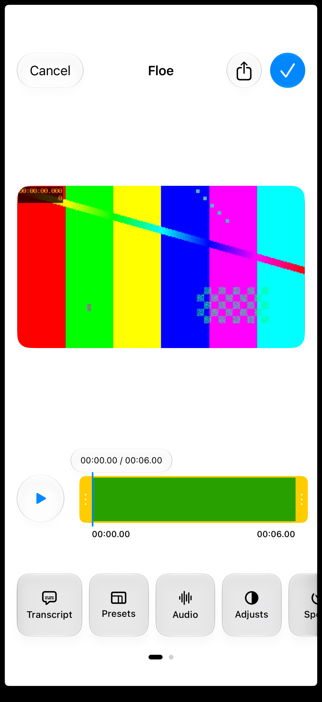

# Floe 1.7 视频编辑库集成

开发中。iOS 27 模拟器已通过中文字幕烧录与起止时间像素测试（1 项，5.7 秒），真机与综合验收仍待完成。

## 选型

| 库 | 判断 |
| --- | --- |
| [VideoEditorKit](https://github.com/didisouzacosta/VideoEditorKit) | MIT；提供 SwiftUI 剪辑、裁剪、旋转、字幕合成和导出，已选择接入 |
| [PryntTrimmerView](https://github.com/HHK1/PryntTrimmerView) | MIT；裁剪和截取控件，不是完整字幕编辑器 |
| [VideoIO](https://github.com/MetalPetal/VideoIO) | MIT；视频输入输出基础设施，不提供编辑界面 |
| [IMG.LY](https://github.com/imgly/starterkit-video-editor-ios) | 成品编辑器，需要 CE.SDK 授权密钥，未接入 |
| [Banuba](https://docs.banuba.com/ve-pe-sdk/docs/ios/integration-ve/) | 成品编辑器，需要授权密钥，未接入 |

## 使用链路

工作区打开视频 → 媒体工作台 → 剪裁、旋转与添加字幕。手工添加字幕及原素材起止时间，然后进入可视化编辑器调整裁剪、旋转、变速、字幕文字、位置和大小。未配置远程转录服务，手工字幕不需要 API 密钥。

参数保存到 `.floe-media-edits/*-visual.json`，与原来的基础编辑工程分开。原始素材保留；库保存或导出的文件经过可播放性与时长检查，复制为当前工作区内的新 MP4。返回页面可以播放成片。

## 来源与边界

源码固定到 `c917b1e99ddc631b754a43704c05dfe3836e8183`，位于 `FloeAgent/ThirdParty/VideoEditorKit`，保留 MIT 许可证，去除上游约 37 MiB 演示视频。App 与 NativeMedia 定向工程引用相同源码。

已验证一个 2 秒纯色视频的中文字幕烧录：0.1 秒、0.9 秒和 1.7 秒的白色文字像素分别为 0、271、0，字幕范围为 0.5–1.4 秒。仍需验证裁剪/变速组合的字幕时间映射、工程重开、长视频、取消、后台及空间不足。上游目前主要面向 iPhone，iPad 需要单独适配验收。Agent 任务与库导出尚未统一，不能把集成或编译通过当作功能验收完成。

[测试记录](evidence/floe-1.7/video-editor-captions/test-result.txt) · [实际导出视频](evidence/floe-1.7/video-editor-captions/chinese-caption.mp4)

Floe 的适配补齐手工字幕的时间映射；对没有逐词时间戳的字幕，库的预览和导出均使用整条文字，避免自动拆词。上游水印测试曾长时间未完成，水印不是本轮对外声明的能力。

可视化编辑器开发截图，已加载合成测试素材。
