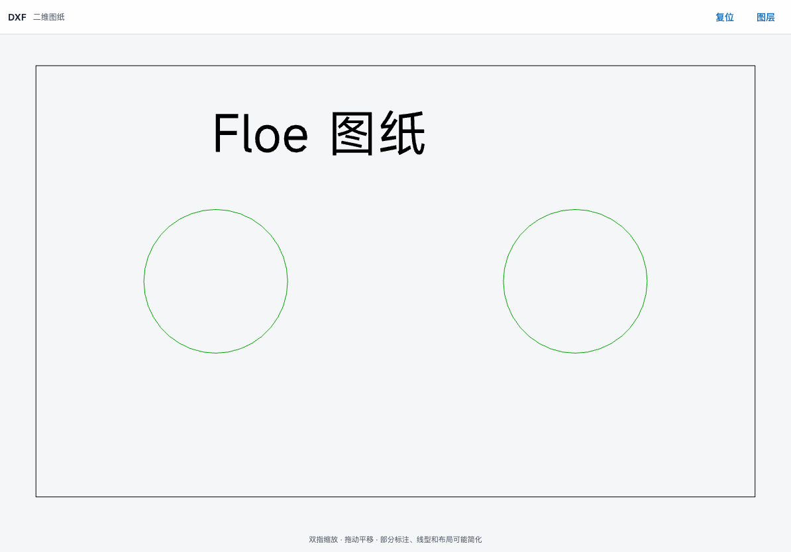
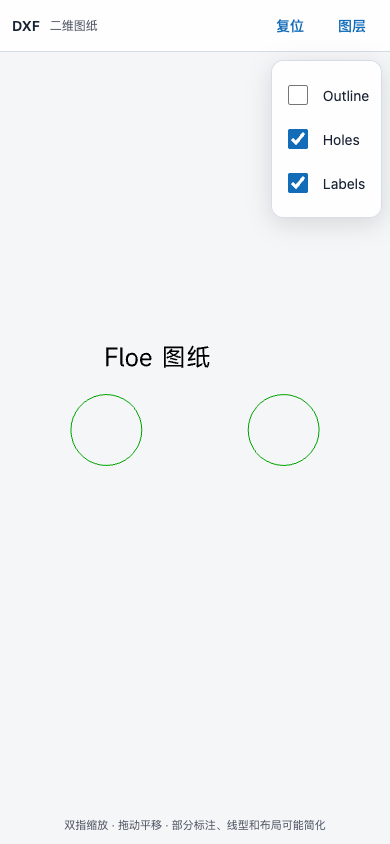
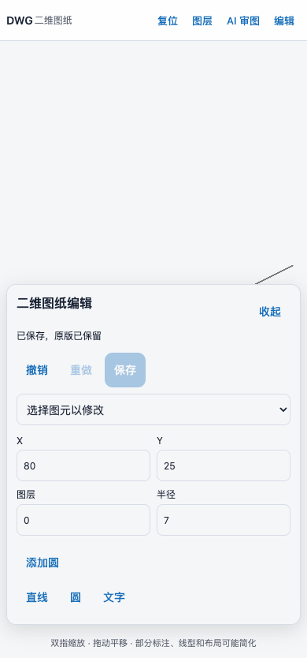

# Engineering viewers — implementation and qualification

2026-09-15 working candidate. These changes have **not** been uploaded to TestFlight. Build 172 remains the last confirmed internal delivery. This document separates a bundled renderer from a verified sample and from full-App/device acceptance.

## User flow

Open an engineering file from workspace files or the IDE → inline preview → full-screen button. DXF/DWG then offer Edit: select a line, circle or text by tapping it or using the entity list; add geometry, move it numerically, change text/radius, delete, undo/redo and save in the original format. Other 3D/PCB formats remain read only. Done warns about unsaved edits. Chinese/English controls and light/dark shell styling share the application conventions. Assets and parsing are local; no third-party conversion account or upload is used.

## Compatibility matrix

| Files | Current integration | Evidence / limitation |
| --- | --- | --- |
| DXF / DWG | acadrust 0.5.5 native document editing in WASM; dxf-viewer 1.0.48 display projection | Synthetic plate: outline, circles, Latin/Chinese text and three layers rendered; wide/compact browser checks passed. Not all dimensions, linetypes, hatches, paper-space layouts or encodings are faithful. |
| STL | Online 3D Viewer 0.18.0, bundled | Four-face tetrahedron rendered; wide/compact browser checks passed. |
| OBJ/MTL, PLY, OFF, 3DS, DAE, FBX, 3MF, AMF, glTF/GLB, WRL, BIM | Routed to the bundled mesh importer | Format-specific real samples still pending; unsupported compression and absent external references can prevent or reduce rendering. Do not call every format validated. |
| Gerber / Excellon | gerber-to-svg 4.2.8, bundled | Synthetic copper and drill files rendered in both browser sizes. Single layer only; a multilayer board stack is not yet implemented. |
| USDZ and existing system formats | Existing native Quick Look route | Not requalified by this patch. |
| KiCad PCB / schematic | Candidate reviewed; not yet bundled | KiCanvas `b031159eb74aaa7eef2b026fd85d35bc05ff2095`: top-level MIT but generated Newstroke file has GPL header conflicting with the top-level font attribution. Resolve provenance; remove remote fonts and test touch/real schematic hierarchy before distribution. |
| STEP / IGES / BREP / FreeCAD | Candidate reviewed; not yet bundled | `occt-import-js` 0.0.23 WASM is LGPL-2.1; exact corresponding OCCT source/build/license distribution and bounded real-file qualification remain. No remote CDN fallback. |
| DWT / DGN, IFC, Rhino 3DM | Decoder not bundled | Export DXF/PDF or GLB/STL using the originating application. |

Primary sources: [DXF viewer](https://github.com/vagran/dxf-viewer), [Online 3D Viewer](https://github.com/kovacsv/Online3DViewer), [tracespace](https://github.com/tracespace/tracespace), [KiCanvas license](https://github.com/theacodes/kicanvas/blob/b031159eb74aaa7eef2b026fd85d35bc05ff2095/LICENSE.md), [KiCanvas generated font](https://github.com/theacodes/kicanvas/blob/b031159eb74aaa7eef2b026fd85d35bc05ff2095/src/kicad/text/newstroke-glyphs.ts), [OCCT importer](https://github.com/kovacsv/occt-import-js), [CAD viewer DWG opt-in](https://github.com/mlightcad/cad-viewer).

## Data and lifecycle

`EngineeringPreviewPackage` reads immutable bytes through `WorkspacePathGuard`. Aggregate input is limited to 20 MiB/32 files, also respecting the existing workspace per-file cap. It follows only explicit OBJ/MTL/glTF dependencies; remote URLs, traversal, secrets, unsupported paths and missing files are not silently fetched. Missing references remain visible. Remote workspace previews carry a single downloaded file and report missing companions.

The nonpersistent WKWebView receives one immutable package after checking the main-frame origin. Its bridge provides bounded review capture and, only in a local full-screen CAD editor, a save callback bound to that one file and its original SHA. It has no arbitrary-file, credential or tool execution API. The token-protected loopback server serves only bundled viewer assets. CSP blocks remote connections and navigation. DXF/Gerber parsers use workers; native timeout and WebKit termination errors preserve the source file and offer retry. Closing/replacing the view cancels startup/watchdog and stops its own server. Large compressed input can still exhaust the WebKit process; device memory qualification remains required.

## Editing and AI review

The original DWG document stays in the Rust engine; DXF is only a display projection. Saved output is reparsed and compared for geometry, handles, references, layers, styles and nongraphical objects. Unresolved parse diagnostics or changed round-trip values reject saving. This is not a universal lossless DWG claim. Synthetic AutoCAD 2010/2013/2018 format versions are verified; complex third-party blocks, layouts, xrefs and proprietary objects need additional fixtures.

The editor supports line, circle and text operations; locked layers are protected. The first 500 entities are selectable, with other entities retained. Eight undo/redo snapshots, a 10 MiB CAD input/output ceiling, 20,000-entity ceiling and 384 MiB WASM memory cap bound work. Workspace read/write limits still apply (default write limit 4 MiB). Engine work runs in a disposable worker with a 45-second request timeout.

Native saving holds the shared file mutation lock and compares the expected SHA. It preserves the previous version under `Recovered Edits` before an atomic replacement. If a person or Agent changed/deleted the file, saving preserves a separate draft and reports a conflict without overwriting the current file. Binary CAD revisions are not automatically merged. Remote CAD preview remains read only.

**AI 审图 / Ask AI** captures actual visible WKWebView pixels and bounded parsed evidence: filename/source hashes, CAD version, units/layers/bounds, selected entity and a sample of up to 100 entities; mesh counts/bounds; or Gerber/drill viewport metadata. Missing companions and sampling limits remain explicit. The user reviews the attachment and adds a question before sending through the existing configured Agent/model and permission services. It does not automatically spend model credit. A text-only path must not claim to have inspected the image; a viewport is not an exhaustive engineering or compliance review. Drawing text is untrusted reference content.

The bundled writer is MPL-2.0 [acadrust](https://github.com/hakanaktt/acadrust). `CAD_SOURCES.json`, `CAD_NOTICES.txt` and the asset hash manifest retain exact provenance and dependency notices. LibreDWG was used privately as an independent validation reader; it is not included in the App.

## Evidence

[Machine-readable browser results](evidence/floe-1.7/engineering-viewers/result.json): Playwright 1.62.1 + installed Edge 153, 1194×834 and 390×844. Browser plugin unavailable, so existing Playwright was used. Four synthetic fixtures × two viewports rendered, no relevant console errors or external requests observed; fit and DXF layer interaction exercised. These are **desktop browser component checks**, not iPad/iPhone App acceptance. Screenshots were visually inspected; the original zero-height DXF result was rejected and corrected, not counted as a pass.

Local Swift 6.4/Xcode 27: source parsing and preview package + three test bodies typechecking passed against the existing compiled FloeWorkspace module. Direct test typechecking initially omitted TestingMacros; it passed after using the installed plugin path. This did not execute the tests. Added cloud qualification tests cover referenced-file restrictions, symlinks/secrets/traversal, missing materials, limits and decoder routing. Added full-App UI test covers workspace DXF → inline render → full-screen → layers → return on both device jobs; its outcome is pending.

### CAD editing checkpoint, 2026-09-15

[Cloud run 34974090590](https://github.com/JiangNanGenius/floe-agent/actions/runs/34974090590), source `b82850f42510a43a27058b81bf466f0fd4a5635e`: three native test cases passed, including six DXF/DWG × AC1024/AC1027/AC1032 edit/save/reopen combinations; invalid edits and corrupt/diagnostic-bearing documents rejected. Rust 1.98.1, wasm-bindgen 0.2.126, pinned Cargo.lock; WASM compilation and exact dependency notices passed.

[CAD component evidence](evidence/floe-1.7/cad-editing/result.json): latest bundled engine passed four browser edit/undo/redo/save/reopen cases at 1194×834 and 390×844. The two saved DWGs were independently read by `@mlightcad/libredwg-web` 0.7.10; assertions confirmed four entities, original Chinese text and the added circle at (80,25), radius 7. Native save callbacks were mocked in these browser checks. No App/device or AI inference acceptance is implied.

Cloud native App tests now include a real DWG save, cold launch/readback and review sheet with a unique saved text marker. These tests are pending. The earlier source `08ecacbf` had a WebKit load timeout, an iPad assistant restart timeout, an iPad IDE launch timeout and an iPhone Files locator failure. Those failures remain recorded; targeted fixes are awaiting a fresh complete run.

## Remaining before release acceptance

Complete native two-device checks, corrupted/missing/compressed inputs and memory/cancellation evidence; integrate and verify the outstanding KiCad/CAD decoders and multilayer PCB view; broaden mesh-format fixtures. Publish only the capabilities actually verified. Retain previous runtime/language/package/assistant/concurrent-edit work and its own evidence. TestFlight, GitHub prerelease, Feather, review materials and main merge remain separate unfinished delivery steps.
