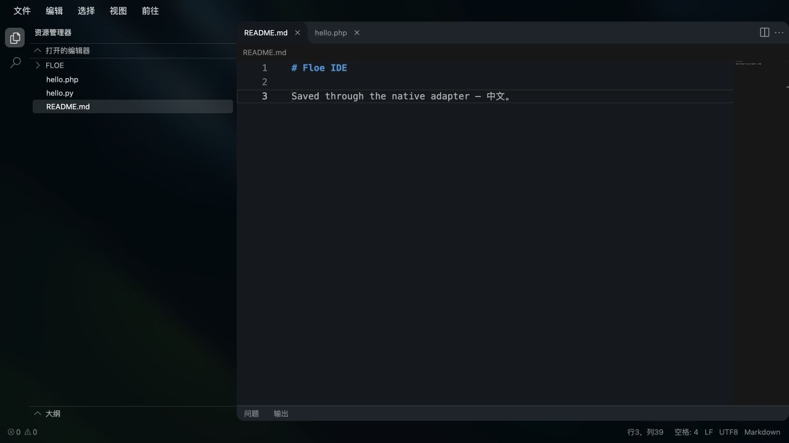

# Full-screen IDE and language integration

Updated 2026-09-15. Candidate implementation; no new TestFlight delivery claim.

## Workbench and files

The file inspector has an **Open in IDE** action, also available while previewing a file. The full-screen workbench reuses OpenSumi CodeBlitz 2.4.6, rather than reconstructing its file tree, search, tab groups, menus and editor. The fixed npm archive is verified by SHA-512; selected bundled files, the Monaco worker, Oniguruma and Codicons have checked hashes. Resources are served on an ephemeral, token-protected loopback listener; it serves only bundled IDE assets, never workspace files. It stops with the IDE. CSP blocks remote resources, frames and network connections. No extension marketplace or arbitrary extension worker is enabled.

Each IDE binds to the workspace file service present at opening. BrowserFS reads, directory operations and saves pass through `IDEWorkspaceSession` and the existing path/secret/symlink checks. Native atomic saves finish before the editor receives success. The first read establishes a SHA-256/mtime baseline. Concurrent Agent edits produce a conflict; repeated search reads cannot silently replace that baseline. Editing UTF-8 text is capped at 4 MiB per file. The bridge retains hashes rather than a second copy of all searched file contents. Closing with pending edits offers save, keep editing or discard; a failed save keeps the IDE open. After an external edit conflict, preserve the draft and reopen the IDE to establish a new disk baseline; automatic merge/rebase is not yet implemented.

The native toolbar opens the active file with Floe's existing Office, PDF, image or media viewer/editor, and opens the terminal bound to the same workspace. These auxiliary actions must not silently follow a changed global workspace. The outer iPad navigation structure is unchanged. Narrow layouts keep the file tree collapsed initially.

## Editing is distinct from execution

The pinned grammar bundle recognizes common source languages, including C, C++, C#, Swift, Objective-C, Java, Kotlin, Python, PHP, JavaScript, TypeScript, Go, Rust, Ruby, Lua, Perl, R, SQL, shell, HTML, CSS, JSON, YAML, Dockerfiles and Makefiles. Syntax recognition is **not a promise of a local compiler/runtime**, debug adapter, language server or native extension ABI.

| Language/package family | Execution route | Current boundary / required evidence |
| --- | --- | --- |
| Python | Bundled CPython, environment-bound pip, owned background services | Existing implementation and new native integration tests; pip/native-wheel end-to-end qualification still required |
| JavaScript / Node | Bundled Node host, npm/pnpm and owned services | Existing implementation; installation, imports, version reporting, HTTP preview and stop/port release must pass in the App |
| Shell / WASI commands | Floe shell and interpreted WASI | Current patch carries cwd/environment and avoids draining a terminal before command startup; new real-WASI cwd test pending cloud execution |
| C/C++ | Candidate: clang/LLVM targeting WASI, then interpreted execution | a-Shell and Code App demonstrate the architecture; reviewed current compiler payload, source/hash/license, sysroot, native/device tests and update path still needed |
| PHP | Candidate: signed iOS PHP framework or maintained WASI PHP | Code App's published framework is historical; version/ABI/source update must be established before shipping. Old PHP 8.2.6 WASI artifacts are not accepted as a current runtime |
| Swift | Editor support now; local compiler unresolved | Swift's official WASM SDK compiles on its host; it does not establish an on-iPad Swift compiler. Code App documents Swift as server-side |
| Lua/Ruby/other interpreters | Candidate: maintained WASI builds or reviewed native runtimes | Not shipped/validated by this patch |
| Native Python wheels | pip / Floe wheelhouse | Requires matching CPython/iOS ABI and embedded/signable extensions; never npm or APT wheels |
| Native npm addons | npm/pnpm compatibility repository | Node ABI, platform and signed framework bridge required; no generic Linux `.node` claim |
| Native Linux binaries | Only compatible prebuilt iOS/WASI commands | A Linux ELF binary does not become executable on iOS through installation alone |

The local shell provides a Linux-like command environment. It does not introduce a Linux kernel or bypass iOS executable-code restrictions. Public Beta materials must describe actual execution routes.

## Candidate review

Primary sources: [CodeBlitz](https://github.com/opensumi/codeblitz), [a-Shell](https://github.com/holzschu/a-shell), [Code App languages](https://code.thebaselab.com/extras/supported-languages), [Pyto native packages](https://pyto.readthedocs.io/en/latest/third_party.html), [Swift WASM SDK](https://www.swift.org/documentation/articles/wasm-getting-started.html).

Do not reuse `makalin/php2wasm` as a PHP runtime: its inspected implementation was a small custom parser rather than the Zend PHP engine. WASIX packages and Emscripten PHP modules cannot simply be dropped into Floe's WASI Preview 1 interpreter. Monaco's upstream mobile limitations require real iPad/iPhone touch, keyboard/IME and WebKit qualification even when the desktop browser prototype works.

## Evidence and remaining gates

- The real pinned CodeBlitz workbench rendered, opened multiple tabs, recognized PHP/Markdown, searched the saved document by body text (1 file / 1 result), and saved Chinese text through the BrowserFS adapter to a **synthetic browser fixture**. An incorrect Date-vs-milliseconds adapter was found during actual save and fixed. This is not native iPad storage evidence.
- Four Node bridge tests pass: delayed save acknowledgment, UTF-8 payload, conflict propagation without false success, stable numeric timestamps, size/append rejection (the latter two share tests).
- Native workspace tests cover disk saves, unread-file overwrite rejection, concurrent changes, path restrictions, directory operations and session closure. They await cloud execution. Local full SwiftPM testing was stopped when it expanded beyond the intended small check; it is not recorded as a pass.
- Swift parsing and pinned-asset validation pass. Heavy App compilation, WebKit loopback initialization, touch/IME, dirty-tab recovery, full-text search, workspace changes, rich-editor return and resource release still need App validation.
- Existing repair, media/model, package compatibility, Qwen crash, log-server deployment, internal TestFlight, GitHub/Feather, owner-reviewed public Beta and final main merge remain part of the parent task.

