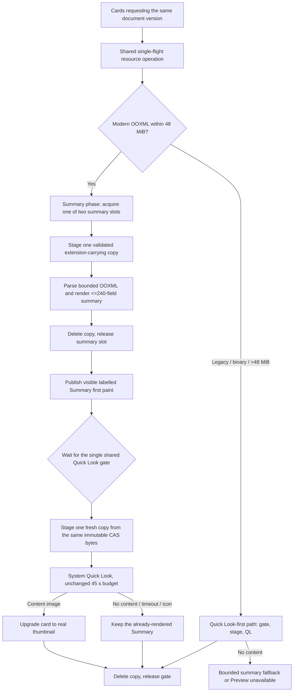

# Office previews in Notes / 手记 Office 预览

Implementation history: `2a907841b50a19b07488f5e9fff40dc4f3b9cf1f` (request
coalescing) and `d421fea260523d063270e2d21d623bd011acd9ea` (build 186 candidate).
The build 187 progressive two-tier cover described below is committed as
`1a52dd31cbb5a1b293b525b25124cb12519bb623`: it has local type-check/object
and Python fixture results only, no completed build187 runtime or device result.
The [fixed-source cloud run](https://github.com/JiangNanGenius/floe-agent/actions/runs/35312393708) is now active.
Build 186's final failed qualification is recorded in
[the beta.43 record](RELEASE_1.7.0_BETA_43.md); build 187 is only
[preparation](RELEASE_1.7.0_BETA_44.md). This page documents candidate code and
does not establish TestFlight availability.

## 用户可见结果

手记文件卡片优先请求系统生成 Word、Excel、PPT 的真实缩略图。通用文件图标不计为文档预览。
兼容的 OOXML 文件可以显示带“摘要”标识的内容卡片；摘要来自文档实际文字、
单元格或幻灯片内容，并不保留原始排版。无法解析的文件明确显示预览不可用，仍可尝试打开文档。

Build 187 准备的渐进封面进一步缩短首屏等待：现代 docx／xlsx／pptx（≤48 MiB）先显示带
“摘要”标识的真实内容，不必等系统缩略图的 45 秒预算；系统缩略图成功返回后卡片自动升级为
真实缩略图，超时、失败、第二阶段暂存失败或只返回通用图标时保留已经渲染的明确摘要。老格式、二进制格式、
OpenDocument 与超过 48 MiB 的现代 OOXML 仍先请求系统缩略图，行为不变。

摘要边界来自源码而非运行测量：最多 240 个字段；Excel 只读第一张工作表（绘制最多前 60 个
单元格、5 列 × 10 行区域）；Word／PPT 段落与表格按 320 × 420 卡片裁剪。**摘要不是原始
Office 排版**，标题、字体、分页、图表等都可能不同，不能作为排版保真或打印依据。

In the build 187 candidate, modern Office cards publish the labelled summary first
and upgrade to the system thumbnail when it settles; a timeout, failure or
icon-only result keeps the rendered summary. The summary is bounded (≤240 fields,
Excel first sheet only) and is explicitly not the original Office layout. Legacy
formats and modern packages above 48 MiB keep the original Quick Look-first path.

生成任务不会阻塞书写或滚动。多个视图同时请求同一文档版本时，共用一个资源操作；某一个视图离开，
不会取消另一个视图仍然需要的工作。最后一个使用者取消时，操作才会取消并清理。
没有原生 Office 编辑引擎的构建仍保留返回手记、标签页和助手入口，避免停留在无法退出的页面。

## Ownership and request lifecycle

The shared operation is registered **before** acquiring any slot or staging bytes.
Its identity includes the store instance, document/resource identifiers, revision,
extension, cover dimensions and source-size limit. Current callers request
integral 320 × 420 covers. A revision change cannot inherit an old result; the view
also checks its current key before applying a completed image, and a provisional
summary never enters the thumbnail cache.

Two independent gates bound the work: the summary phase uses
`NotesOfficeThumbnailGate.summary` (2 slots) and holds it for exactly one staging,
parse, render and cleanup pass; the Quick Look phase uses the original single-slot
`NotesOfficeThumbnailGate.shared` and stages its own fresh copy from the immutable
CAS source. The summary copy and its parsed snapshot are deleted and the slot is
released **before** waiting for Quick Look, so one card's system request can never
delay another card's first paint. The real upper bound is two summary copies plus
one Quick Look copy; the legacy path keeps its original single 128 MiB staged-copy
bound.

At most 16 resource operations are tracked for request sharing. Beyond that cap,
requests retain the host queue bound without growing the sharing registry. The
engineering Quick Look fallback also uses the shared gate; native
engineering-renderer paths remain separate.

A resource has a 45-second Quick Look budget after entering the shared slot. One
request receives the remaining budget. A Quick Look timeout is terminal and
cancels the system request once; only a callback-delivered non-timeout failure can
be retried within the remaining budget, up to three attempts. Generic icons are
terminal. There is no 15-second cancellation/restart loop and no speculative
warmup request. Quick Look policy is unchanged by the progressive path: the
summary phase is extra first paint, not extra time for Quick Look.

The continuation state accepts one result; a late callback cannot resume it again
or replace a newer cover. The source-size caps remain 128 MiB for the staged
source and 48 MiB for native summary inspection; image cache bounds are unchanged.

## Why the behavior changed

Original build 185 diagnosis, run
[35299378662](https://github.com/JiangNanGenius/floe-agent/actions/runs/35299378662),
reused the exact saved App binary. Word rendered on its second attempt at about
20 seconds, while Excel/PPT exhausted three 15-second app timeouts. System logs
later reported generation exceeding 60 seconds and extension errors. These are
observations of latency and cancellation interaction; they do not establish the
system extension's exclusive internal cause.

Build 186 (run
[35306551280](https://github.com/JiangNanGenius/floe-agent/actions/runs/35306551280))
confirmed the remaining cost of waiting for the system host: on iPad the strict
Excel Quick Look case reached its 45.679 s request deadline even though the real
labelled summary was already available, and the component run failed (iPhone
84/84). In the same run, both full-App UI legs failed earlier at the opened
document's back-control accessibility identifier; the real button existed, but its
identifier had been overwritten by the parent `notes.office.header`, and the
cover cold-relaunch phase was not reached. The progressive path is the response to
the first observation; the header identifier fix is separate and was committed
after the failed run as
`3dc4a2f81ac4b67800b70fd57f8f350debea66c9` (not yet built or run). A summary
fallback is still never counted as a successful
original-layout Quick Look thumbnail, and the strict Quick Look-only assertions
remain as a separate non-gating diagnostic with fail-closed coverage
([acceptance policy](NOTES_OFFICE_THUMBNAIL_ACCEPTANCE.md)).

## Verification / 验证

Build 186 final (run 35306551280): the development component executed on both
device families — iPad 83/84 (one strict Excel Quick Look case failed at the
45.679 s deadline with a real labelled summary returned), iPhone 84/84; the
compatibility leg was not selected. The accepted-SDK focused app regression passed
204/204 including all 23 IDE cases, while both Notes UI legs failed at the
back-control identifier (3 passed, 1 failed, 1 skipped per device). No upload
occurred. [Unedited iPad content outputs](qualification/build186-release/native-covers/README.md)
and [full-App cover captures](qualification/build186-release/app-ui/README.md)
remain the retained visual evidence; the release owner visually verified the
unmodified App exports.

Build 185 run
[35301809882](https://github.com/JiangNanGenius/floe-agent/actions/runs/35301809882)
executed all 21 Office cases and 11 lifecycle/gate cases successfully on each
device; the overall component run failed on an iPhone scanned-page OCR allowance.
That result is retained as history and is not relabelled.

- Deterministic lifecycle tests cover timeout, one-shot cancellation, late
  callbacks, settled-failure retries and production-service request sharing.
- Actual Word/Excel/PPT imports exercise extensionless content-addressed storage,
  extension-carrying staged copies, native summaries and staged-file cleanup.
- Full-App qualification keeps a real-content Office source assertion (Quick Look
  or labelled summary) and exercises rename, open/return and relaunch when those
  stages are reached; the build 186 run did not reach cold relaunch.
- The component workflow attempts iPad before iPhone and preserves both device
  outcomes. A failed first device remains a failed job even if the second passes.
- Swift semantic/object checks, component execution, full-App UI execution and
  physical-device acceptance are distinct evidence levels. The build 187
  progressive source has none of the latter three yet.

正常辅助功能朗读不包含内部诊断。UI 测试模式可附带有限的请求次数、超时标志、允许的系统错误域、
数字错误码和失败阶段；不附带文档内容、原始错误描述或本地路径。摘要卡片在 UI 测试模式下
额外暴露 `badge=summary` 值，与可见的“摘要”标识同源。
