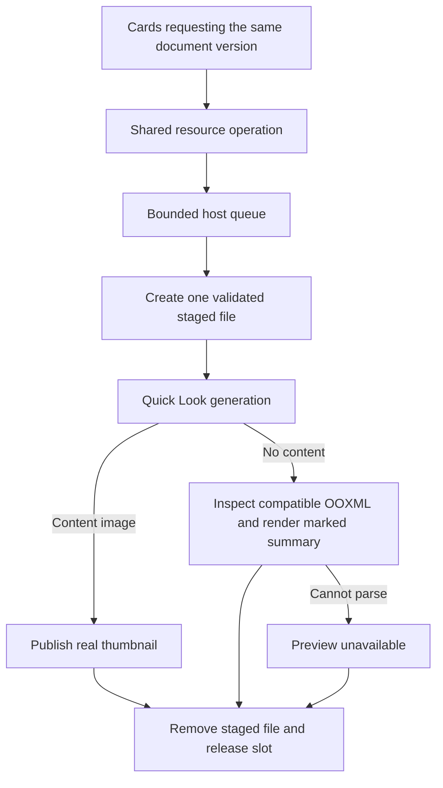

# Office previews in Notes / 手记 Office 预览

Implementation source: `2a907841b50a19b07488f5e9fff40dc4f3b9cf1f`.
[Qualification record](qualification/build185-release/notes-followup.json) records
compiler checks, original failures and subsequent cloud results separately.
This page documents candidate code; it does not establish TestFlight availability.

## 用户可见结果

手记文件卡片优先请求系统生成 Word、Excel、PPT 的真实缩略图。通用文件图标不计为文档预览。
系统没有生成内容时，兼容的 OOXML 文件可以显示带“摘要”标识的内容卡片；摘要来自文档实际文字、
单元格或幻灯片内容，并不保留原始排版。无法解析的文件明确显示预览不可用，仍可尝试打开文档。

生成任务不会阻塞书写或滚动。多个视图同时请求同一文档版本时，共用一个资源操作；某一个视图离开，
不会取消另一个视图仍然需要的工作。最后一个使用者取消时，操作才会取消并清理。
没有原生 Office 编辑引擎的构建仍保留返回手记、标签页和助手入口，避免停留在无法退出的页面。

## Ownership and request lifecycle

The shared operation is registered **before** acquiring the host slot or staging
bytes. Its identity includes the store instance, document/resource identifiers,
revision, extension, cover dimensions and source-size limit. Current callers
request integral 320 × 420 covers. A revision change cannot inherit an old result;
the view also checks its current key before applying a completed image.

At most 16 resource operations are tracked for request sharing. Beyond that cap,
requests retain the host queue bound without growing the sharing registry. The
shared preview gate has one slot; the engineering Quick Look fallback also uses
that gate. Native engineering-renderer paths remain separate. Staging happens
after acquiring the slot so queued cards do not each copy a large source file.

A resource has a 45-second generation budget after entering the slot. One request
receives the remaining budget. A timeout is terminal and cancels the system request
once. Only a callback-delivered non-timeout failure can be retried within the
remaining budget, up to three attempts. Generic icons are terminal. There is no
15-second cancellation/restart loop and no speculative warmup request.

The shared task owns the staged file through both Quick Look and native summary
inspection. A function-scope cleanup runs after success, failure or cancellation.
The continuation state accepts one result; a late callback cannot resume it again
or replace a newer cover. The source-size caps remain 128 MiB for the staged
source and 48 MiB for native summary inspection; image cache bounds are unchanged.

## Why the behavior changed

Original build 185 diagnosis, run
[35299378662](https://github.com/JiangNanGenius/floe-agent/actions/runs/35299378662),
reused the exact saved App binary. Word rendered on its second attempt at about
20 seconds, while Excel/PPT exhausted three 15-second app timeouts. System logs
later reported generation exceeding 60 seconds and extension errors. These are
observations of latency and cancellation interaction; they do not establish the
system extension's exclusive internal cause.

The repair removes repeated cancellation of cold/queued work while retaining the
same total budget. Whether that suffices for cold full-App generation must be
verified with the repaired binary. A summary fallback is never counted as a
successful original-layout Quick Look thumbnail.

## Verification / 验证

- Deterministic lifecycle tests cover timeout, one-shot cancellation, late
  callbacks, settled-failure retries and production-service request sharing.
- Actual Word/Excel/PPT imports exercise extensionless content-addressed storage,
  extension-carrying staged copies, native summaries and staged-file cleanup.
- Full-App qualification keeps its strict Office `quickLook` source assertion,
  then exercises rename, open/return and relaunch.
- The component workflow attempts iPad before iPhone and preserves both device
  outcomes. A failed first device remains a failed job even if the second passes.
- Swift semantic/object checks, component execution, full-App UI execution and
  physical-device acceptance are distinct evidence levels.

正常辅助功能朗读不包含内部诊断。UI 测试模式可附带有限的请求次数、超时标志、允许的系统错误域、
数字错误码和失败阶段；不附带文档内容、原始错误描述或本地路径。
