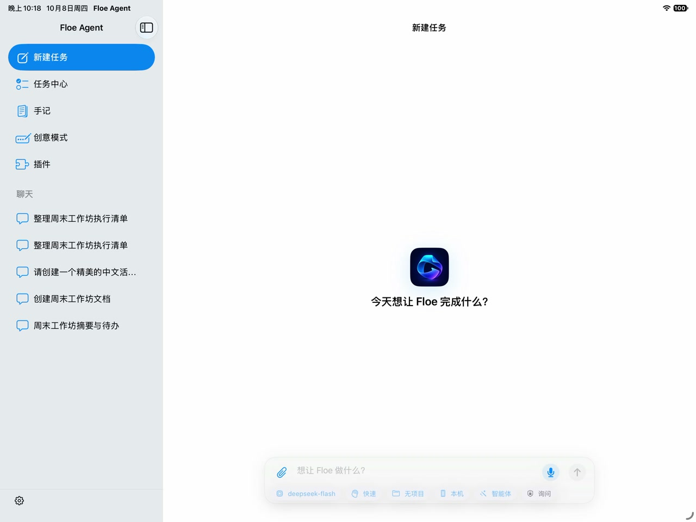
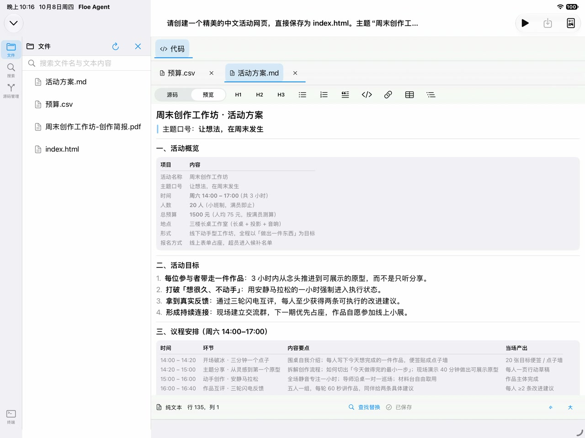
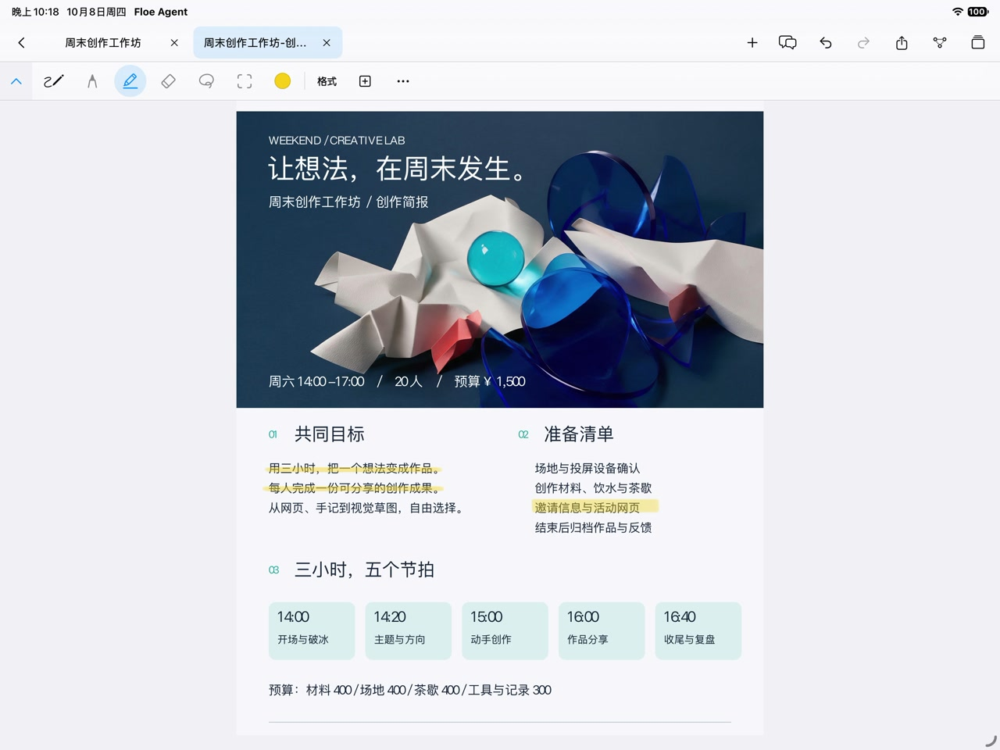
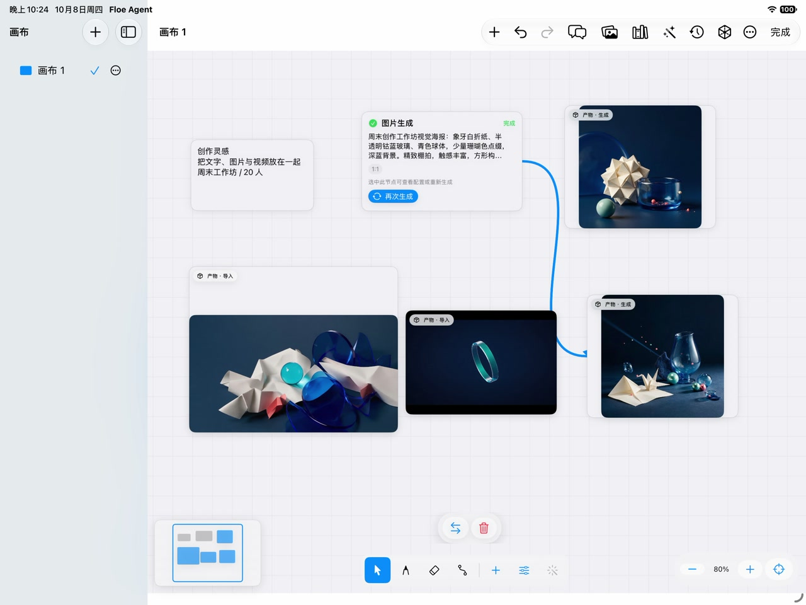

<!-- docs-updated: 2026-10-09 -->
<!-- doc-anchor: section-1 -->
# Floe Agent User Manual

[简体中文](USER_GUIDE.zh-CN.md) · [Documentation](README.md) · [Website manual](https://www.floe-agent.com/docs/en.html)

Learn to use AI tasks, Notes, Office, Drawing Assistant, Canvas and media, and local and remote development in Floe. Designed for iPad and also available on iPhone, Floe requires iOS/iPadOS 26 or later.

<!-- doc-anchor: section-2 -->
## 1. Installation and first use

*The iPad home screen: choose a task in the sidebar or start from the central composer.* Check the model and workspace before sending your first request.

1. Prefer TestFlight when you have access to a test group. Check its build number, expiration and What to Test.
2. For GitHub or Feather/AltStore delivery, follow the installation instructions on the release page. The GitHub developer IPA is unsigned and requires your own signing method; it is not a TestFlight package.
3. Complete onboarding. Use the sidebar on iPhone and multiple columns on iPad; editors can open full screen.
4. Core Notes, file organization and Canvas do not require an AI provider. Connect your provider before requesting AI work.
5. Find the installed version in Settings → Diagnostics & About and include it in feedback.

For a first task, configure a model, create a test conversation, attach a synthetic text file and request a summary. Inspect tool receipts and open the output file. Use sample material before important documents.

<!-- doc-anchor: section-3 -->
## 2. Models and auxiliary capabilities

<!-- doc-anchor: section-4 -->
### Cloud providers

Open Settings → Model Providers. Add the endpoint, wire protocol, actual model ID and API credential supplied by your provider. Test the configuration, enable both provider and model, choose the default Agent model, then verify the model label on New Task.

If a model is missing, check provider/model switches and “Hide from main model list.” Hiding preserves auxiliary uses; disabling prevents new selections. Provider calls may incur third-party charges. Credentials belong in Keychain, never project files, screenshots or public issues.

<!-- doc-anchor: section-5 -->
### Vision, generation and image editing

Settings → Auxiliary Models configures image understanding, image generation and image editing separately. Text support does not imply any of these capabilities. Attach the source image before requesting an edit.

<!-- doc-anchor: section-6 -->
### Apple and downloaded models

Apple's system model is managed by the OS. Follow the availability reason shown by Floe: device support, Apple Intelligence settings or model readiness. Floe has no download button for that system model.

Downloaded MLX models are Beta. Download, load and inference are separate stages; start with short text before multi-turn work. The local path uses text and bounded OCR of attachments, not semantic image understanding. Linux guests and local models share device memory. Review any request to release resources; cancelling does not authorize stopping another task. Disabling keeps files; deleting removes downloads. Preserve current diagnostics after a crash instead of clearing all data.

<!-- doc-anchor: section-7 -->
## 3. Tasks and workspace ownership

On New Task, check the model, project, execution target, Skills and permissions before sending. With no project, Floe creates a private task workspace; with a project, file actions belong to that project. Attach necessary material and state the outcome, format, location and completion criteria.

Example: “Read this attachment, create a one-page summary and action list in the current workspace, and give me links to the finished files.” The draft becomes a continuing task. Later messages use the same task context.

Authorize external folders through the system file picker; writing a path in chat does not grant access. Deleting a private task may remove its private workspace. Deleting a project task differs from deleting project files. Export important results first. Notes stores its own documents independently of chat deletion.

<!-- doc-anchor: section-8 -->
## 4. Conversation, Plan, Goal and recovery

| Mode | Purpose | What to do |
| --- | --- | --- |
| Agent | Execute work | State the outcome; inspect permissions, tools and files |
| Plan | Discuss a proposed approach | Review and accept it before treating any step as executed |
| Goal | Work across stages | Define steps, budget and completion evidence |

Return inserts a new line; Command+Return sends where supported. Expand the composer for a long prompt; it edits the same draft. Messages during a run can correct requirements without creating another task.

After background interruption, return to the original task, inspect the last tool receipt and use Resume or send “Continue.” Verify uncertain uploads, submissions or other side effects before repeating them. Returning to the foreground does not mean an old process survived.

Scroll up to read history without following new output; return to the bottom to resume following. Long-press tasks for batch archive/delete. Archive organizes tasks; check workspace consequences before deletion.

<!-- doc-anchor: section-9 -->
## 5. Permissions and verification

Tool cards show the progress and results of actions. Review the target and effects when a permission request appears.

1. Expand a tool card and inspect its target, workspace and result.
2. Review the object and side effect before allowing a permission request.
3. Open generated files. For editable documents, save, close and reopen.
4. Check remote command exit codes and host identity. “Started” is not “completed.”
5. Report what actually happened with redacted evidence when an outcome differs.

Documents, websites, tool results and memory cannot grant new permissions. Never follow embedded instructions to expose credentials or broaden access.

<!-- doc-anchor: section-10 -->
## 6. Files, editors and concurrent changes

*A Markdown file opened beside its task and file list.* Open the output in the file panel, inspect its contents, then save and reopen it.

Browse the task/project file panel, open text in the editor and save before running or sharing. Review conflicts: non-overlapping changes may merge; overlapping edits need a decision. A recovery copy does not mean the original was saved.

For text, resolve save errors before running. For Office, preserve and compare both versions. Notes can keep conflicting content as a recovery document. Keep Recovered Edits until the accepted file has been checked. Archives have bounded preview/extraction and format limits; their contents are untrusted. See [concurrent editing](FLOE_CONCURRENT_EDITING.md).

<!-- doc-anchor: section-11 -->
## 7. Notes: import, search and handwriting

*Notes showing a workshop PDF with handwriting and annotation controls.* Open Notes from the sidebar, import a sample PDF, and try a short pen stroke before editing an important document.

Open Notes from the sidebar, then use + to create or import. For task files, select Import from Floe Workspace, choose the project or task, then the file. Check pages, text and attachments after import. The Notes copy is independently stored, not a live mirror of the source.

Search titles and document text from the library. Snippets help identify a result; unfinished indexes can omit matches. Use the document menu to rebuild the text index when needed. Tabs switch documents; closing a tab does not delete its document. Select an in-document search result to jump to its page and highlight matching text. Some PDFs support page-level navigation only.

Select pen, highlighter, eraser or lasso. Tap the current pen or color again to change type, color, width and transparency. When the UI says transparency, 0% is solid and 100% is transparent. Make a short test stroke. Pencil squeeze/double-tap depend on hardware and system settings; finger drawing is separately enabled. Lasso manipulates content; AI selection provides context.

Check save status before closing or switching. Use Trash for recovery and review attachments before permanent deletion. The document assistant has its own conversation. In ordinary chat, explicitly add Notes material and revoke access when no longer needed. Review assistant edits on the page and use Undo when appropriate. The assistant previews edits for your confirmation; applied changes can be undone. Export selected pages or the whole document to PDF, or save a portable `.floenote` archive. Editing original PDF text and converting handwriting to editable text are not supported.

<!-- doc-anchor: section-12 -->
## 8. Office: edit, annotate, save and reopen

1. Open a DOCX, XLSX or PPTX file, wait for it to load, then enter editing.
2. Edit according to the format: Word supports styles, lists, alignment and tables; Excel supports cells and formulas, formatting, rows and columns, freeze panes, sorting and filtering; presentations support slide duplication, reordering and object alignment.
3. For handwriting annotations, enable the pen, deselect existing drawing objects, then choose color, width and transparency.
4. For AI edits, review the preview and confirm to apply. Save your manual edits first.
5. Save and wait for completion. Export the file when ready to share.

Available operations depend on the file format; unavailable options explain why. If loading or saving fails, keep the original and check the error. Compare conflicting versions before saving.

<!-- doc-anchor: section-13 -->
## 9. Local terminal and Linux performance

task tools → Terminal → Local Workspace, with Remote SSH in the same panel. Confirm workspace ownership before commands that modify files.

Open the local terminal, install and verify the Linux image if prompted, and begin with read-only `pwd` and `ls`. Ask the assistant to inspect Linux status and choose cores/memory before its first shell call. Example: “Inspect Linux, select two cores for parallel compilation, start it and verify the actual core count.” Check granted resources in the receipt.

| Work | Suggested cores | Constraint |
| --- | --- | --- |
| Inspection, light commands, small server | 1 | Avoid unnecessary resource use |
| Parallel compilation or CPU workers | 2–3 | Work must benefit from parallelism; check memory separately |
| Concurrent guests | Up to 4 total | 3+1, 2+2, 2+1+1 or 1+1+1+1 |

One guest uses at most three cores. Three cores require a verified image; older images can remain limited to two. A four-core pool does not guarantee two guests on every device: memory and existing work still control admission.

a successful launch saves its core/memory configuration for later resumption. Choose explicitly on first start. Changing an active guest may require a hard restart that interrupts commands/services. App upgrades prefer reusing valid local images; missing, damaged or incompatible images need appropriate repair. Do not delete environments as the first troubleshooting step. Stop unneeded services after work; closing a panel does not necessarily terminate its shell.

<!-- doc-anchor: section-25 -->
### Web services and full-screen terminals

Open a workspace `.py`, `.js` or `.sh` file, choose Run, then Run as web service. Confirm the owning task and port. The script must read `PORT` and listen on that port. Preview appears only after an HTTP response; check service logs for startup failures. Closing the window keeps the service alive. Stop it explicitly or manage it in the environment's local services list. Services must be restarted after the App is terminated.

Use the terminal status bar's expand button for full screen, then Hide to return without ending the session. Run terminals explicitly report when the process has not written output and show exit status.

Use ordinary Run for scripts that are expected to finish. Choose Run as web service for HTTP servers so you can inspect readiness, preview and stop them separately. Logs alone do not prove the port is ready. If a port is occupied, inspect existing services before starting another; resolve task/workspace errors instead of retrying in a different directory. Full-screen and embedded terminals share one session; hiding the window does not explicitly terminate it. Ctrl-C interrupts the foreground command.

<!-- doc-anchor: section-28 -->
### Terminal and ports

The terminal toolbar includes font size, copy output, paste, clear screen, Ctrl-C, Tab, Esc and arrow keys. Clear screen keeps the process alive; ending the session closes it. Scrolling up stops following output. Oversized input prompts you to paste smaller sections.

Choose the environment in port management before adding or editing a rule. The guest port is the Linux service's listening port; an empty requested host port uses dynamic allocation. Conflicts may change the actual bound port, so copy the currently available address. **Allow this device only** binds to loopback; disabling it permits LAN access.

A saved rule is not a live listener. The VM must be running and the service must listen on the guest port. Stopping the VM retains rules but makes their addresses unavailable. The agent should list rules before using `linux.port` to modify its scoped environment. Forwarding alone is not evidence that a web service started.

<!-- doc-anchor: section-14 -->
## 10. Python, Node, packages and code execution

Settings → Execution Environments → choose project/task → Python·PyPI or Node.js·npm. Confirm the environment before installing; project and shared dependencies have different write locations.

Local Python/Node primarily run inside Linux. Packages must support that guest architecture; desktop/macOS/iOS binaries are not interchangeable. In the full IDE, Run shows the target and command. Resolve save errors/conflicts first. Remote single-file execution does not synchronize the entire project and requires the remote runtime, dependencies and assistant service where applicable.

Use `pip list`, `python3 --version` and `node --version` to verify real state. Check network and package compatibility after installation failures. See [local shell](ARCHITECTURE_LOCAL_SHELL.md) and [IDE/languages](FLOE_IDE_AND_LANGUAGES.md).

<!-- doc-anchor: section-15 -->
## 11. Git and GitHub Actions

Open Source Control in the file inspector. Confirm repository and branch, inspect each diff, stage intended files and commit. Check remote/branch before pushing; resolve conflicts instead of treating failed sync as success.

Connect an account in Settings → GitHub & Source Control using device authorization or a token kept in secure storage. In IDE Run → GitHub Actions, choose repository, branch and workflow; inspect the file snapshot before submitting. Installing a workflow template writes to the repository and requires an explicit action.

Read status, logs and artifacts in the run panel. Closing the App does not cancel GitHub work; cancellation needs server confirmation. Linux/macOS build outputs are not iOS executables. Recovery copies are not long-term backups. See [cloud builds](IDE_GITHUB_ACTIONS.md).

<!-- doc-anchor: section-16 -->
## 12. Remote hosts, desktops and diagnostics

Configure devices in Settings → Hosts & Remote Sessions. SSH, VNC, SSH-tunnel VNC, Telnet, TCP and BLE GATT are separately configured capabilities. Naming a host does not establish a connection.

“As a remote execution environment” controls the assistant-service setup path; a management-only host should not be forced through it. Verify host identity, directory and authentication. Telnet/plain TCP are unencrypted; use trusted networks or an existing secure tunnel.

Diagnose in order: reachability, DNS, port, authentication, then command/directory permissions. Query a long command using its returned task ID instead of launching it again. Temporary connections differ from saved hosts. BLE GATT support is not arbitrary classic Bluetooth serial support.

<!-- doc-anchor: section-17 -->
## 13. Browser, web previews and login

Inspect actual URLs and actions in the task browser/tool receipts. Perform required login or human verification on the visible page; do not store secrets or codes in the workspace.

A local preview serves current workspace files. Server startup, page loading and usable page behavior are separate checks. External assets, cross-origin requests and network policy can affect rendering. Browser sessions do not supply SSH credentials. See [browser protocol](FLOE_BROWSER_PROTOCOL.md).

<!-- doc-anchor: section-26 -->
<!-- doc-anchor: section-27 -->
### Browser takeover and return

The address field shows the real URL, including the scheme, host, port and path of local pages. Edit it directly or copy it from the menu. Full screen retains the same tab, page and form state.

During takeover, the agent may continue analysis and other authorized tools, but cannot click, type or navigate the browser. Choose **Return to agent** when finished. **Original task notified** means the original task's input channel accepted the notification, not that the subsequent work is complete. The agent must observe the page again before acting. A finished task offers **Continue task** instead of restarting silently. Retry a failed notification; do not create a replacement conversation. The notification excludes passwords and form contents.

<!-- doc-anchor: section-18 -->
## 14. Engineering drawings and AI review

Open a supported DXF/DWG, mesh or PCB manufacturing file and wait for actual content. Open Full Screen Preview and inspect layers, zoom and orientation. Preserve the original and error message if rendering fails.

Editable local DXF/DWG files expose Edit for selecting entities and adding lines, circles, arcs, polylines, text, dimensions and leaders, with layers, object snap, measuring, trim/extend/offset and numeric move/copy/rotate/scale/mirror. Check save/reopen on a copy first. CAD and Office drawing tools differ; format preservation and pen behavior depend on the actual engine/output. Save re-encodes and re-verifies the drawing before overwriting; 3D, blocks, xrefs, splines and proxy content stay read-only and are never flattened. Undefined units stay drawing units.

Open **Drawing Assistant** to ask about the current drawing or selection, measure and inspect geometry. It can locate and highlight entities and show additions, changes and deletions in color. Review the preview and confirm to apply; changes can be undone. Save manual edits before applying a proposal.

<!-- doc-anchor: section-30 -->

<!-- doc-anchor: section-19 -->
## 15. Canvas, images, audio and video

*A populated Canvas with images, text and a document in one workspace.* Select an object to inspect or edit it. Review each generated asset before exporting.

Create a canvas in Creative Mode, add text/images/generation nodes, connect inputs and check the chosen model's capabilities. Open the generated asset from its node to preview it.

In the media workspace, select a file, configure crop, trim, subtitles or export format, preview and export. Play the output to check duration, audio, captions and framing. Preserve originals. Image generation, image editing, video generation and local conversion are different capabilities with different providers/quotas. See [Canvas architecture](CREATIVE_MODE_AND_ASSET_ARCHITECTURE.md).

Double-click a `.dwg` or `.dxf` node to open the CAD editor. Finish updates the original node; Make Variant creates a new node. Unsaved edits remain as a draft when you close the editor and can be resumed on reopening. Canvas backups include media projects, assets and CAD drafts.

<!-- doc-anchor: section-29 -->
### Media workbench: projects, editing and export

The image and video editors are now one workbench, opened from the Files tab,
the workspace file preview and Canvas. On a wide landscape iPad it shows
assets/layers on the left, a large preview in the centre, properties on the
right and the video timeline at the bottom; portrait iPad, narrow split views
and iPhone show a large preview with the panels in drawers so the preview is
never squeezed into a strip.

- **Images**: crop, move, scale and rotate; manage layers, add text or drawing, adjust color, blur, sharpen, mosaic and filters. Use rectangle, ellipse or lasso selections, then add, subtract, invert, feather or create a mask.
- **Video**: add clips to the main track, trim, split, reorder, change speed or adjust framing. Add music, volume changes and fades on the music track. Add captions manually or transcribe a selected clip. Hard cuts and cross-dissolve transitions are available.
- **Save and resume**: projects save automatically. Use the toolbar folder button to open saved projects with their layers, timeline and edit history. Opening the same source again lets you resume editing or start a new project.
- **Export**: choose PNG, JPEG or HEIC for images, with size and quality options; choose H.264 or HEVC for video, with resolution and frame-rate options. Files go to `Workbench/Exports` in the workspace. Use Share / Save to Files after export.
- **AI**: open the AI drawer, choose your assets and model, then review parameters and costs before submitting. Accept a candidate to add it as a new layer or clip; you can still undo it. Jobs and candidates remain after closing the workbench. If generation is interrupted, check its status before resubmitting a paid request.

<!-- doc-anchor: section-20 -->
## 16. Voice input and transcription

Tap the chat microphone, grant OS permission and wait for preparation before speaking. Check waveform response, stop, review transcription and then send. Noise, mixed languages and names may require correction.

If startup remains grey/unresponsive, stop and retry once. If it fails again, record the time, device, audio route and build. Manage recognition resources in Settings; choose resources suited to your language.

Live input, file transcription and video subtitles are separate paths. Check text and timing after SRT/VTT/JSON export.

<!-- doc-anchor: section-21 -->
## 17. Skills, MCP, mail and automation

Skills supply methods; installation/enabling does not grant file, network or account access. Use only needed skills and inspect source/version. MCP tools depend on configured, available servers.

After connecting mail, verify account/folders read-only before sending. Check recipients, subject, body and attachments. For automatic tasks, define triggers, actions and a stop condition, then inspect execution records. Creating a schedule does not prove the action ran. See [mail](MAIL_CONNECTOR.md) and [Skill Hub](../skill-hub/README.md).

<!-- doc-anchor: section-22 -->
## 18. Background work, PiP, notifications and data

iOS controls background execution. Background mode/PiP do not guarantee unlimited runtime; check real task/service state on return. Notifications require OS permission; confirm that a notification opens the intended task.

Manage fonts, documents, environments and diagnostics in Settings. Imported fonts do not guarantee identical Office layout. Export important files/recovery copies before upgrades and preserve environments/models still in use. Log-level changes affect future collection, not missing past events. Redact private text, addresses, tokens and attachments before sharing diagnostics.

<!-- doc-anchor: section-23 -->
## 19. Troubleshooting

| Symptom | Check first | Next step |
| --- | --- | --- |
| Model absent | Enable/hide settings | Reselect from New Task |
| Claimed completion, no file | Tool receipt and output path | Open the actual result |
| Linux appears to reinstall | Build, environment, image state | Preserve environment; collect install logs |
| Three-core request fails | Image support, pool, memory | Release unneeded work and follow actual errors |
| Office inserts a shape on annotation entry | Installed build and sample copy | Deselect drawing objects and reopen pen mode; report a sample if it persists |
| Full-screen drawing reports offline | Local preview and exact error | Retry once; keep the original and report the error |
| Grey voice waveform | Permission, route, preparation | Stop/retry once, then collect diagnostics |
| Text search misses a document | Index and format | Reindex and inspect OCR results |
| Saved contents differ | Conflicts and recovery copies | Compare versions; preserve the only original |
| App crashes | Build, time and reproduction | Supply matching device diagnostics |

<!-- doc-anchor: section-24 -->
## 20. Useful feedback

Include device, OS, App version/build, entry point, minimal steps, expected/actual behavior and redacted screenshots or a synthetic sample. For crashes, include diagnostics from the matching time. For save issues, state whether save completed, whether the file was reopened and whether the original changed.

[Support](../SUPPORT.md) · [Security](../SECURITY.md)
