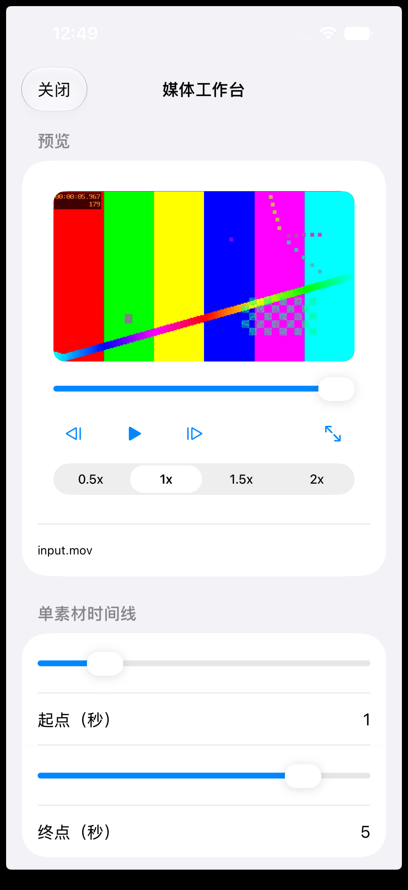
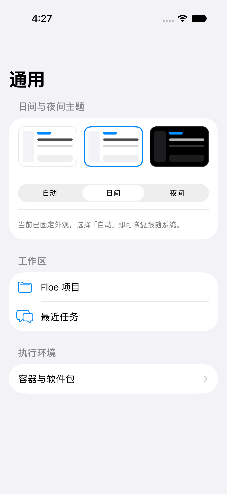
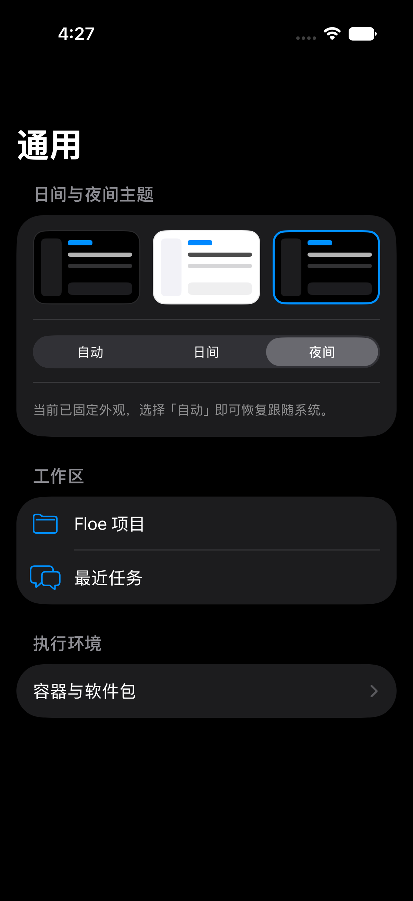
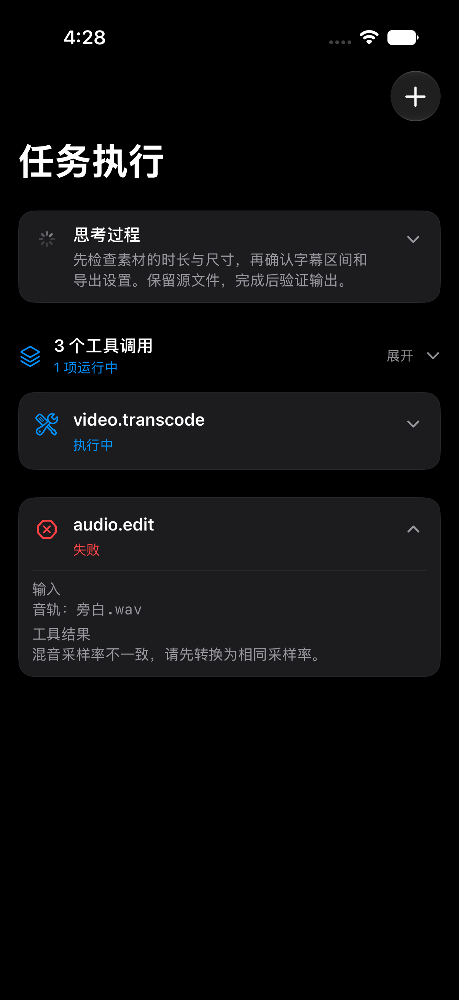

# Floe Agent 使用指南

[English](USER_GUIDE.md) · [官方网站](https://www.floe-agent.com/) · [中文 README](../README.zh-CN.md) · [安全策略](../SECURITY.zh-CN.md)

本指南覆盖现有 Floe 工作流与明确标注的 1.7 开发内容，界面以已安装构建为准。请结合[1.7 实施状态](FLOE_1_7_IMPLEMENTATION_STATUS.md)和[升级与恢复](FLOE_1_7_MIGRATION.md)阅读；源码提交或构建成功不代表 TestFlight 已可安装。

本文包含当前开发分支的工作流升级；范围、截图及未完成验收见[本轮更新](WORKFLOW_UPGRADE.md)。发布可用性需另行确认。

## 1.7 开发功能与使用边界 / Development features

开发分支已增加本地工作区视频入口：在 MP4/MOV/M4V 文件预览中打开“媒体工作台”，调整剪辑区间、速度/音量和导出设置，保存参数后可重开继续。导出后可切换播放处理结果。此入口仍待完整 App 与真机验收；共享队列和聊天附件回接尚未完成。

The development branch adds a media-workbench action to local workspace video previews. It carries the source automatically, saves edit parameters and offers export playback. Full App/device interaction checks, shared queues and chat attachment handoff remain open.

1.7 的环境、包管理和媒体工作台尚未完成全链路验收。已安装版本没有相应入口时，不要依据计划中的界面名称尝试操作。当前状态见[实施记录](FLOE_1_7_IMPLEMENTATION_STATUS.md)。

- 环境按会话、项目、共享、基础层查找依赖；写入必须绑定当前环境，不应猜测第一个项目或临时目录。旧数据迁移完成前保留恢复副本。
- Node 宿主与 npm/pnpm/yarn 启动已做定向验证；这不等于所有公共包可安装或可运行。原生 Linux 包不可直接在 iOS 执行。
- 媒体转码及音频转换仅接受已支持的参数组合。成功应能重新打开真实输出；插帧、超分等增强只有运行器和资源可用时才能使用。
- 软件包池和模型目录是候选清单，不能将条目数量当作已完成能力数。参见[兼容性说明](FLOE_1_7_COMPATIBILITY.md)。

The 1.7 environment/package/media flows remain under integration. Existing menu labels depend on the installed build. Check supported parameters and real resource availability before processing; preserve source files and verify exported files by reopening them.

### 媒体工作台：预览与剪辑区间

从工作区的 MP4/MOV/M4V 文件预览打开“媒体工作台”。图中展示素材播放器和重开后恢复的 1–5 秒剪辑区间；向下滚动可查看处理与导出设置。这是 iOS 模拟器开发界面，不代表发布验收完成。

## 1. 安全安装

有测试邀请时优先使用 TestFlight。使用社区未签名 IPA 时，必须先核验 SHA-256 与构建证明、检查源码，再使用自己的证书签名。不要导入陌生分发者提供的证书、API Key、SSH 私钥或描述文件。

Floe Agent 需要 iOS/iPadOS 26 或更高版本。文件审阅、浏览器接管、终端和多栏检查更适合在 iPad 上使用。

## 2. 配置模型服务商

1. 从侧边栏底部打开**设置**。
2. 进入**模型服务商**，添加兼容接口。
3. 按服务商要求填写 Endpoint、Wire Protocol、模型 ID 和 API 凭据。
4. 测试配置，随后设为默认 Agent 模型。
5. 返回**新建任务**；Composer 中的模型标签应从“未配置模型”变成所选模型。

API 凭据应保存在 Keychain。诊断导出会隐藏凭据值；不要把未脱敏的服务商响应贴到公开 Issue。

每个服务商和每个模型都有独立启用开关。关闭后仍会保留 Endpoint、凭据和模型元数据，设置中可以继续编辑，但不会再出现在新建任务的模型列表。模型列表会把 Apple/下载式本地模型单独分组，并按云端服务商分组，避免同名模型混在一起。

已启用模型还提供独立的**在主模型列表中隐藏**开关，默认关闭。适合把某个模型保留为辅助模型或内部路由，但不让它占据首页/新建任务的主 LLM 菜单；已经明确使用该模型的旧任务仍能继续解析。

## 3. 配置识图、生图和图片编辑模型

进入**设置 → 辅助模型**。三个角色相互独立：

- **识图模型**读取用户图片和浏览器截图，必须选择服务商真实支持图片输入的模型。
- **生图模型**根据提示创建新图片。
- **图片编辑模型**修改附件或已选择的图片。

模型能出现在 Agent 列表中，不代表它支持图片能力。Floe 会禁用不兼容组合，而不是发送注定失败的请求。

添加专用图片服务商时，可选择 **OpenAI** 或 **Google Gemini**，填写 API Key，并在保存前检查可编辑的 Base URL。OpenAI 默认使用 `gpt-image-2`；Google 通过原生 Gemini `generateContent` API 默认使用 Nano Banana Pro（`gemini-3-pro-image`）。只有端点真实实现对应能力时才启用生图、编辑或识图。代理地址可以自带路径前缀，Floe 构造请求时会保留该前缀。

### Apple Intelligence 与下载式本地模型

进入**设置 → 本地模型**。Apple Foundation Model 由系统管理，因此没有 Floe 下载按钮、API Key 或模型选择项。在 iOS/iPadOS 27 上，它会显示系统返回的真实状态：可用、设备不支持、Apple Intelligence 未开启、模型尚未就绪/仍在下载，或其他系统可用性错误。按该原因在系统设置中处理并等待 Floe 刷新；系统下载期间不要循环重试。

Qwen 与 Gemma 由用户主动下载，下载、加载和体验测试彼此独立。Floe 同一时间只运行一个下载式模型，并根据设备当时的可用空间安排运行。关闭后台大型 App 可能增加可用空间，但 iPadOS 在压力过大时仍可能终止进程。若加载被拒绝，可释放内存后重试一次或选择较小模型；若 App 被终止，应导出本次最新的 Xcode/设备日志或已上传诊断，不要用旧的不相关崩溃推断原因。

已经下载的模型可以在不删除文件的情况下停用；重新启用后会再次出现在任务模型列表。停用当前模型时，Floe 会立即释放它占用的运行空间。

本地模型会获得与当前请求最相关、数量受限但真实可执行的工具。它们使用独立的对话长度和历史整理策略，不会影响云端模型的上下文或工具能力。设备端推理统一按纯文字模式运行，不映射视觉组件。Floe 会用 Apple Vision OCR 转写附图，把有界结果保存到任务工作区的 **OCR** 文件夹，并把文字交给当前会话。PDF 文字检查、页面渲染与 OCR 仍然可用；语义识图 `image.inspect` 和依赖视觉的浏览器工具不会暴露给本地模型。OCR 没有识别到文字时，Floe 会直接说明限制而不会猜图。本地模型无法正确提出工具操作时，Floe 会说明原因，不会伪装为已经执行。

普通问候、闲聊、提问和头脑风暴不需要明确的“任务指令”。Apple Foundation Model 应直接自然回复；只有在缺失信息会实质改变高影响操作时才会追问。下载式模型会根据设备状态控制一次处理的内容，并在每轮回复或工具操作后释放临时占用，以降低偶发退出风险。

## 4. 新建任务

普通启动会直接进入**新建任务**。发送前可以通过 Composer 周围的标签选择：

- Agent 模型；
- 无项目或某个项目工作区；
- 本机或已授权的远程执行目标；
- 启用的 Skills；
- 初始任务权限。

添加文件或图片附件，输入请求并发送。草稿会在当前界面原地变成持续任务，不会跳到另一套聊天页面。

### 工作区归属

- **未选择项目：**Floe 为任务创建 App 内部私有工作区，并把任务显示在**聊天**分组。
- **选择项目：**任务归属于该项目，并显示在侧边栏项目文件夹下。
- 每个任务只能有一个工作区归属。之后移动任务必须走显式操作，因为文件权限范围会改变。
- 删除项目任务不会删除外部项目文件；删除私有任务可能同时清理其内部工作区和浏览器数据。

### 轻量源码管理

打开工作区的文件检查器并选择**源码管理**。非仓库工作区可以原地初始化。仓库中可查看状态、逐文件差异和最近提交，暂存全部、提交、创建或切换分支、抓取、快进拉取和推送。Floe 有意不提供破坏性 reset/clean、强制推送或历史改写。

进入**设置 → GitHub 与源码管理**可通过 GitHub 官方设备授权页直接登录；Floe 显示一次性验证码，并按 GitHub 返回的间隔等待授权完成。也可以继续使用细粒度 Token。获得的登录凭据会先向 GitHub 验证，只保存在设备钥匙串，绝不写入远程 URL、仓库文件、日志或模型提示。连接后可列出有权访问的仓库、克隆到当前工作区的子文件夹，或创建公开/私有仓库。应只授权实际操作所需的仓库范围。

### 远程设备与多种连接

进入**设置 → 主机与远程会话**可保存远程设备。同一设备可以同时配置 SSH、普通 VNC、经 SSH 隧道的 VNC、Telnet、普通 TCP 和 BLE GATT 串口。设备类型可以不设置；它只是帮助识别的备注，实际能力以已配置协议和连接时的实时探测为准。

只有打开**作为远端执行环境**的 SSH 设备才会在远端执行前自动检查、安装或更新 Floe 守护程序。未打开时，该设备只是管理或调试目标，不会被强制安装守护程序。模型可以读取并修改非秘密的设备与连接元数据，但密码和密钥仍只能通过安全界面进入钥匙串。

对已配对的 SSH 主机，Agent 可以调用有界只读的 `network.ping`、`network.traceroute`、`network.dnsLookup` 和 `network.tcpProbe`。探测在选定主机真实执行，并返回退出码和受限输出，可区分主机不可达、DNS、路由和端口服务故障；目标、次数、跳数、端口、超时和输出大小都受结构化参数限制。

用户在对话中明确给出地址、端口或 BLE GATT 标识时，模型可以建立仅供当前任务使用的临时 Telnet、TCP 或 BLE 串口会话，无需保存设备。临时连接不会同步，并会在 30 分钟后自动关闭。Telnet 和普通 TCP 不提供传输加密，只应在可信网络或用户已有的安全隧道内使用。iOS 不向普通 App 开放任意传统蓝牙 SPP；Floe 支持使用可写入/通知特征的 BLE GATT 串口，厂商 MFi 配件仍以其公开协议为准。

有状态工具必须先发现 ID 再执行：主机和已保存连接来自主机列表；长时间 SSH 命令返回供状态查询使用的 `taskID`；远程发布列表返回停止操作使用的 `shareID`；`cloudWorkspace.catalog` 返回远端文件和 Git 工具使用的 `workspaceID`。Harness 会在输出被截断前写入可信来源和有界的 `resourceBindings`，工具或模型文字不能伪造这些 ID 与游标。缺少 ID 时，Agent 只调用一次对应的只读发现步骤，不能猜 ID，也不能为了找 ID 重复有副作用的操作；畸形结构化调用只获得一次纠正机会，也不会制造假的调用/结果对。

## 5. 保持连续会话

之后的每次发送只会在同一个 Task 中创建新的 Run。Floe 会恢复此前消息、附件、工具结果、用户决策、当前计划和目标、作用域记忆、工作区说明以及任务权限。较旧历史可以压缩成带来源的摘要；已有工具证据只引用，不会静默重复执行。

任务显示中断时，可选择**恢复**或发送继续指令。结果不确定的副作用操作在重试前必须再次确认。

打开已有聊天时定位到最新内容；位于底部时跟随新回复，上翻查看历史时保持阅读位置。长按侧栏、任务中心或聊天列表中的任务，选择**选择多个**，即可筛选、全选并批量归档或删除；归档任务可批量恢复。运行中任务的归档会提示停止；失败项会单独显示。

## 6. 选择工作模式

- **Agent 模式：**可调用任务权限允许的工具，并继续经过正常审批。
- **Plan 模式：**只读；计划被接受前不能写文件、执行副作用命令或提交浏览器操作。
- **Goal 模式：**持久化步骤、预算、证据、子 Run 和完成条件；只有证据门槛满足后才能提出完成。

记忆分为全局、工作区和任务作用域。工作区或任务仍存在时，其长期记忆不会因为数量增长而自动删除；候选记忆仍需审阅后才启用，而且永远不能授予权限。

删除任务或工作区后，Floe 会保留记忆原来的归属，并开始逐步老化：先降低优先级，再减少用于搜索的细节，不会立刻抹掉内容。被再次召回的记忆会得到一段时间的强化。相关记忆可以跨任务检索，并结合关键词、语义相似度、归属和时间进行混合排序；当前任务和仍存在的工作区始终优先。

## 7. 查看进度和证据

任务时间线统一显示回复、思考预览、工具请求、工具结果、文件事件、错误、澄清问题、审批和检查点。右侧检查器默认收起，需要时可打开：

- **变更：**逐文件 diff 和增删行统计；
- **文件：**当前工作区目录；
- **浏览器：**任务独立的可见网页会话；
- **终端/主机：**已授权执行目标；
- **进度：**阶段、检查点和预算；
- **子 Agent：**独立子 Run 的状态与取消。

切换任务会立即清空上一个任务的检查器引用，避免浏览器或文件串到新任务。

## 8. 使用可见浏览器

浏览器是真实、可见的 `WKWebView`。在任务权限范围内，Agent 可以导航、读取有界语义 DOM、等待页面变化、截图、点击稳定元素引用、输入、滚动和管理标签页。

遇到登录、二维码、验证码、2FA、密码、支付、摄像头/麦克风、可信文件选择、Canvas 或无法安全定位的内容时，选择**用户接管**。直接在浏览器完成操作后，点击**交还 Agent**；Floe 会重新观察页面再继续。

元素引用绑定 `documentID`。导航或主要 DOM 变化后，旧引用会返回 `stale`，Agent 必须重新观察，不能猜坐标继续点击。

## 9. 理解任务权限

最终权限是全局上限、工作区默认值、任务覆盖、当前设备/主机能力和临时授权的交集。Provider 只会收到允许的工具 Schema，执行端还会再次检查。

当前任务的权限只从聊天输入框下方的权限按钮修改，选择后自动保存，不需要再点一次“保存”。运行中的任务也可以切换权限：新的模式会立即重新判断正在等待的工具，并用于之后的每次调用。右上角菜单和右侧检查器不再放置重复入口；“设置 → Agent 与权限”只管理新任务的默认值和已有临时授权。

有界只读、工作区检查、生图/识图、OCR、PDF 只读和局域网发现不等待审批模型。用户明确要求安装、部署、修复环境、更新 Floe 守护程序或在选定 SSH 主机准备环境后，完成这个目标所需的常规系统包、换源、依赖修复和守护程序原子更新会继承本任务授权，不会逐条重复询问。删除、凭据、上传、浏览器登录/付款、目标不明的宽泛远程改动和灾难性命令仍需明确复核；Git 强制推送、破坏性 reset/clean 与历史改写不对模型开放。

审批以用户目标和具体工具目标为依据，不做脆弱的关键词匹配。“帮我测试一下所有工具”可以授权安全诊断与有界无损检查，但不授权删除、读取凭据、任意远程命令、修改模型策略或写入持久个人数据。审批结果和原因显示在对应工具调用的展开区域内，不再作为脱离工具的独立底部消息。

## 10. 后台恢复和通知

离开任务页面不会取消 Run。模型阶段、工具边界、审批、等待输入、子 Agent 和部分回复都会写入检查点。回到 App 后，支持远端 Job/Cursor 的 Provider 会尝试重连；否则在同一 Task 内创建恢复 Run。

iOS 后台执行和调度属于系统尽力行为。通知或 Live Activity 会打开对应任务；普通冷启动仍进入新建任务。不要假定 App 被系统挂起后 SSH、VNC、浏览器或模型流仍保持连接。用户手动关闭画中画后，Floe 会为整个活动任务批次持久保留该决定，包括并发 Run 和冷启动恢复；后台执行本身仍可继续。前台自动收起、模式切换、任务结束和系统中断分别记录，旧批次的异步回调不能重建播放器。真正的新批次才会重新允许画中画。

## 11. Apple 能力、快捷指令与自动任务

进入**设置 → Apple 能力**，可以分别决定是否向 Agent 提供日历、提醒事项、家庭、地图、Web、Watch 状态、视觉识别、邮件撰写、文档/PDF、相机、位置、Shortcuts 和自动任务。开关只控制 Floe 的能力目录，不会代替系统授权；首次真实使用时仍由 iOS 询问权限，拒绝某项权限不会阻断任务的其他部分。

Floe 会向快捷指令公开**立即运行 Floe 任务**和**安排 Floe 任务**两个 App Intent。需要按准确的时间、专注模式、到达地点等条件触发时，应在系统“快捷指令”的个人自动化中使用“立即运行 Floe 任务”；Floe 内置计划使用 iOS 尽力后台调度，不能保证精确唤醒时间。立即运行会使用默认 Agent 模型创建普通持久任务，并可在不打开 Floe 界面的情况下启动。

## 12. 本机 Python、受管包和代码编辑

Floe 内置 Python 3.13，可处理日常脚本、文件、JSON、SQLite、压缩包和基础数据工作。模型可以为用户当前任务申请安装兼容的软件包；下载前，Floe 会审核用途是否与任务一致，下载后还会检查内容。来自任意地址的安装命令、系统程序、后台进程和可能逃离 App 范围的内容不会运行。

NumPy、Pillow 和 pandas 在支持的构建中原生提供，以当前运行时检查为准；更多锁定包（regex、PyYAML、MarkupSafe、orjson、pydantic-core）随 ios-wheelhouse 产线验收后内置。SciPy、scikit-learn、Matplotlib 因 iOS 没有 Fortran 工具链或过重原生栈无法内置，继续使用明确标注的浏览器 Pyodide 路径或已配置的可信 SSH 主机。模型必须区分本机、浏览器和远端的实际执行结果。

耗时 Python 工作（批量下载、数据清洗）不应阻塞对话：`jobs.submit` 可把 `exec.localPython`、`network.download`、`network.http`、`web.fetch` 提交为持久后台任务并立即返回 jobID，Python 协作时限放宽到 600 秒。用 `jobs.status` 查进度、`jobs.result` 取结果、`jobs.cancel` 取消；完成后结果自动回注对话并发送本地通知。后台下载在 App 挂起后继续，网络中断后透明续传（上限 2 GB）。

1.6.3 起：提交时即校验目标工具参数（写错参数名当场报缺失键，不再异步失败）；任务清单在完成全部步骤后自动完结，下一任务自动开新清单（旧历史保留）；某工具连续失败三次会被熔断并要求重读其 schema；长任务中若工作超过清单进度会收到计划保鲜提醒。画中画悬浮窗显示真实应用图标、当前工具与调用/失败计数、等待审批的工具名，速度数字仅反映模型 decode 速率（工具输出不计入）。

`exec.localNumerical` 提供无需额外运行时的受限 R、Stata 和 MATLAB/Octave 兼容数值表面，包括描述统计、分位数、协方差/相关和单自变量 OLS；Stata 兼容命令包括 `generate`、`display`、`summarize`、`correlate` 和 `regress`。它不是 GNU R 或 Stata。PyStata 仍要求另行安装并授权 Stata，`pyreadstat` 则依赖本机扩展，二者都不能伪装成纯 Python 包装进 iOS 沙箱；完整 R/Stata 应在已配置的可信 SSH 主机运行。

已安装技能可以附带受限的 UTF-8 `.py` 脚本和锁定版本的纯 Python 依赖。创建或安装技能时会统一验证路径与源码，只下载并检查通用 wheel，并记录脚本与依赖指纹。后续任务可以直接复用完全相同的已审计脚本，变化的任务数据通过 `inputJSON` 单独传入；源码或依赖变化、重要文件改动、凭据使用、提权、破坏性行为和外部副作用仍进入当前任务的正常审批。

从工作区打开 Python、JavaScript、MJS 或 CJS 文件，可以使用带行号、语法高亮、搜索替换、符号列表、撤销/重做和受限本机运行的结构化编辑器。

## 13. 创建并手工编辑 Office 文档

Agent 可通过 `document.createWord`、`document.createWorkbook` 和 `presentation.createDeck` 创建原生 DOCX、XLSX 与 PPTX；通过 `document.office.inspect` 读取语义字段，并使用 `document.office.updateText` 修改受限的文字、单元格、公式和幻灯片备注。这些操作在当前工作区内完成时属于本机低风险操作，不等待审批模型。

需要手工修改时，从工作区打开文件。Floe 先显示普通文档预览；点击**编辑 Office 文档**进入基础编辑器并保存。DOCX 显示文字字段，XLSX 显示工作表单元格与公式，PPTX 显示幻灯片文字及演讲者备注。保存会原子更新文件并保留未触碰的 OOXML 包内容。高级排版、图表、宏、修订、动画和桌面 Office 像素级兼容仍应使用 Microsoft Office、LibreOffice 等完整编辑器。

PDF 独立于 Office：从文件列表打开后直接阅读，在宽屏右侧预览，再按需全屏。阅读会话保留页码和缩放；本地文件变化会刷新。远端预览是下载后的只读快照。Office 保存会检查文件版本，冲突或保存失败时保留当前草稿。

## 14. 使用工作区画布与标准 MCP

打开工作区的文件检查器并选择**画布**。每个工作区最多拥有一个原生画布项目，项目内可以管理多张画布。当前原生界面支持可移动文本、自由手绘、平移、缩放、重命名单张画布和删除画布，并以原子方式保存在本机。画布内容继续归属于工作区，不会静默发布到全局资料库。

画布是专注的编辑面，不是第二个不受限浏览器。单指拖动空白处平移画布，拖动节点移动节点；双指随时平移缩放，Apple Pencil 用于绘制。双击空白处新建节点；从连接点拖向另一个节点即可连接，拖到空白处则快速新建下一节点。图片、视频等产物应从文件、相册或素材库导入，或者由生成任务产生，不再创建没有内容的空媒体节点。

选中节点后，下方的小 AI 输入框只原位修改该节点。它只发送节点最新内容、已保存配置、明确引用节点和本次指令，不打开右侧画布助手、不创建任务会话、不调用工具，也不会自动开始生成。对于生成任务，它可以完善提示词及供应商兼容参数。用户先**保存配置**，再在任务卡明确点击**开始生成**；任务卡和产物卡会显示排队、生成、下载、失败和完成状态，重试始终复用原任务节点和原产物节点。

生成上下文只沿显式来源连线读取。普通连线、仅用于布局的方向箭头、产物关系、未连线备注和历史结果都不会进入提示词。启动或重试已有任务只使用其已保存快照，不会再插入提示词节点；执行过程直接显示在任务卡和产物卡，只有配置和导入流程使用弹层。

右侧**画布助手**负责跨节点研究和编排，只获得画布工作面允许的工具。文本主模型遇到视觉内容时会先使用已配置的画布视觉模型；没有兼容视觉模型时只报告一次缺失能力，不循环重试。研究结果保持只读，只有点击**加入画布**才落成节点。公开网页图片会先下载、校验、去重和保存，再作为参考输入；不会把原始网页 URL 直接交给生图服务。标准 MCP 默认仍不向画布开放。可从 **… → 画布入门**随时重播引导。

需要连接标准远程工具服务器时，进入**插件 → 管理连接器 → 标准 MCP**并添加 Streamable HTTP 地址。Floe 支持无需认证、Bearer Token 和自定义请求头；秘密值只进入钥匙串，不写入服务器元数据。每个服务器和发现到的工具都能单独启用或停用。远程工具使用服务器专属命名空间，继续受当前任务的本地权限与审批约束，并把服务器描述和返回内容视为不可信数据。打开**允许画布使用**后，只有该服务器当前已启用的工具会进入后续画布 Run；此开关默认关闭，不会扩大普通任务权限，也不会绕过审批。

也可从侧栏**创意模式 → 新建画布**创建私人画布，不必先绑定工作区或配置生图模型。所有添加菜单优先显示生成任务。iPhone 使用紧凑操作菜单和可滚动的底部工具栏，新节点按实际可视区域创建。SVG、HTML、Markdown 的节点 AI 编辑会核对版本，避免覆盖同时发生的修改。

## 15. 安装和创建 Skills

- **Skill Creator：**创建本地声明式指令包。
- **Skill Finder：**下载 HTTPS 候选包，由所选模型规范化为 iOS 版本，再执行确定性的静态验证与兼容检查。

技能的工具调用继续受当前任务授权和运行时校验约束。支持的 UTF-8 Python 脚本和锁定版本的纯 Python 依赖在安装时审计；运行时只复用获准的相同指纹。代码或权限发生变化时重新检查，原生动态插件和安装钩子不在此范围内。

插件入口分为**发现**与**已安装**。官方条目显示名称、用途、版本和安装/更新操作；来源及技术细节折叠显示。卸载后的官方插件不会在下次启动时自动装回，可以从发现页重新安装。更新增加权限时仍会展示权限变化。

## 16. 常见问题

- **模型未配置：**添加服务商并选择默认 Agent 模型。
- **Apple Foundation Model 不可用：**查看**设置 → 本地模型**中的准确原因；它要求支持的设备、iOS/iPadOS 27、已开启 Apple Intelligence 且系统模型已经就绪。
- **下载式本地模型无法加载或导致退出：**释放设备内存、卸载其他模型后重试一次，并导出最新设备/Xcode 或已上传诊断；不要用旧的不相关崩溃下结论。
- **识图不可用：**选择明确声明并真实实现图片输入的服务商与模型。
- **本地模型不调用工具：**确认任务允许该工具，并在请求中说明预期动作；模型无法使用时，Floe 会显示能力或结构化调用解析原因。
- **切后台后任务中断：**重新打开任务，使用界面提供的安全恢复操作。
- **恢复后重复已完成工具：**停止当前 Run 并导出诊断；恢复应还原执行账本，不应重放已成功的同工具/同参数调用。
- **浏览器返回 `stale`：**重新观察页面后再交互。
- **远程工具不可用：**检查主机、SSH 授权、任务权限和网络路径。
- **局域网扫描无结果：**在系统设置中允许“本地网络”，确认设备位于同一局域网后重试。该功能只发现 App 已声明的 Bonjour 服务，不是通用端口扫描器。
- **工作区预览提示尚未打开：**重新打开文件检查器，确认任务已绑定私有工作区或预期项目，再打开文件。
- **画中画黑屏或无法启动：**Floe 会在任务开始时准备可见进度源；若准备期间切到后台，会保留启动请求，待 AVKit 报告就绪后再启动，而不会取消后重复创建。返回 Floe 会结束当前系统画中画会话；若用户主动关闭画中画，同一任务批次后续再次离开 App 时不会重建，开始新的 Run 才重置。持续黑屏时请同时提交画中画状态和最新诊断。
- **Python 包无法激活：**确认它提供纯 Python 通用 wheel；包含原生扩展的包只能下载和检查，需要在已信任的 SSH 主机上运行。
- **语音失败或退出：**检查麦克风和语音识别权限、音频路由，以及是否有其他 App 占用输入会话。

提交可复现问题时，可从**设置 → 隐私与安全**导出脱敏诊断报告。报告内容要求见[支持文档](../SUPPORT.zh-CN.md)；安全漏洞请按[安全策略](../SECURITY.zh-CN.md)私下报告。

## 17. 数据管理、字体、归档与同步凭据

进入**设置 → 数据管理**可查看 Floe 总占用、安装包、用户数据、可安全清理空间，以及本地模型、私有工作区、字体、附件、生成内容、浏览器产物、检查点和数据库等分类。安全清理只删除可重建缓存和一小时前遗留的临时文件，不会删除工作区、文档、模型、字体、附件、数据库或凭据。

**数据管理 → 归档区**支持滑动恢复、单项永久删除、多选恢复、多选删除和一键清空；永久删除始终要求确认。任务列表仍可左滑归档。

**数据管理 → 字体资源**保存一份按内容哈希去重的 Floe 全局字体，支持从“文件”导入或从公开 HTTPS 直链下载 TTF、OTF、TTC、OTC，单文件上限 32 MB。启动时 Floe 会重新注册这些字体，因此 Word、PDF 和所有工作区都能复用，不需要每个工作区重复下载。`font.list` 和受限的 `font.install` 在自动模式下不等待审批模型；影响所有工作区的 `font.remove` 仍需审核。受 Apple 公共 API 限制，任意网络字体不会被静默安装给 Floe 以外的其他 App；若 iOS 没有向 Floe 暴露所需系统字体，Agent 会说明平台边界，并改为把许可字体安装到 Floe 全局字体库。

任务历史只保存在本机。配置同步包含服务商/模型配置和主机非秘密配置，Provider API Key 使用 iCloud Keychain。“同步已保存凭据”默认关闭，并要求 Face ID 或设备密码认证。开启后只有用户明确提升到凭据库的项目才能同步，任务/工作区临时凭据永远不参与同步。CloudKit 描述符可能比 Keychain 项更早到达，此时界面会显示“等待密钥”，不会误报“同步完成”。

**设置 → 文件 → 浏览与管理文件**可快速进入项目、活跃聊天和归档聊天的工作区。浏览不会改变当前聊天的工作区；可复用目录搜索、预览、编辑、移动、导出和批量删除。删除私人任务会清理其独立文件，共享项目会保留；未完成的本地清理可在管理器中重试。

## 长思考阅读（本轮开发分支）

超长思考展开后，可在独立阅读区域内滚动，并通过“回到开头”“最新内容”和“全屏阅读”浏览全文。“复制”保留完整思考内容；显示分段不会截断对话记录。生成中的工具参数也会计入活跃状态，完整参数到齐并通过校验后才会执行工具。

### 直接转换文件（本轮测试版）

已有文件不需要让模型重新写一遍。可以说“把工作区里的 report.md 转成 Word/PDF，保留原文件”。Floe 使用本地转换工具，传入文件路径并生成新文件；转换正文不会重新送回模型上下文。支持 Markdown、Word DOCX、HTML、RTF 和文本互转，以及 PDF 输出和可提取文字的 PDF 输入。本地图片随文件嵌入。扫描件需先 OCR；复杂版式、浮动对象及 Markdown 无法表达的格式不保证原样保留。转换完成后打开输出文件检查即可。

### 可视化剪裁与字幕（1.7 开发中）

打开工作区视频后，在媒体工作台选择“剪裁、旋转与添加字幕”。先添加字幕文字和原素材起止秒数，再打开可视化编辑器；其中可以调整裁剪、旋转、速度及字幕位置和大小。保存或导出会生成工作区内的新文件。功能验收进度见[视频编辑集成说明](FLOE_1_7_VIDEO_EDITOR_INTEGRATION.md)。

### 音频处理与抽帧（1.7 测试候选）

可以让 Agent 对工作区音频执行区间剪辑、增益、淡入淡出或混音。混音素材需要相同采样率和声道；不同格式先用音频转换工具统一。增益范围为 0–16，合成峰值会限制在正常音频范围内。输出使用新的 WAV、CAF、AIFF 或 M4A 文件；处理中取消会保留原文件及原有输出。

抽帧支持真实 PNG/JPEG，指定时间点或间隔，并选择一个新的输出目录。整批成功后才提交目录；已有目录不会被覆盖。代理视频按指定最大尺寸缩小并保留宽高比。

## 日间、夜间与自动外观（1.7 测试版）

进入左下角 **设置 → 通用 → 日间与夜间主题**。选择「自动」后，Floe 随 iOS 外观切换；定时或日落切换在系统「设置 → 显示与亮度 → 自动」中配置。「日间」「夜间」可手动固定，选择会保存并即时应用。画布未单独指定外观时继承应用设置；文档纸张和视频画面保持原始内容。

思考与工具调用采用统一的可展开框。点击标题查看全文、输入、输出和审批记录；连续调用可整体折叠，后续结果不会反复打开已收起的历史记录。折叠时仍显示当前执行、失败和需要确认的操作。新步骤使用轻量淡入及位移动画，系统开启「减少动态效果」时关闭该动画。

## 管理项目、会话与软件包（1.7 测试版）

打开 **设置 → 执行环境 → 项目与会话容器管理**，按项目、会话、共享层及模板查看环境。支持搜索名称或 ID；打开环境后可查看状态、本层容量、归属、本层依赖和父层继承依赖。所有安装、卸载、版本固定操作都绑定当前页面的环境，继承依赖为只读。

软件源经过签名和索引校验后，才显示可安装版本。点击「验证并刷新软件源」，再选择软件包安装。没有已配置的可信源，或签名、下载校验失败时，页面显示原因，不能视为可用包目录；当前官方 apt 源配置与包池制作仍未完成。包操作显示运行状态、结果和取消入口；离开页面不会丢失运行任务，返回后可继续查看。

「停止此环境的任务」关闭该环境的新任务入口并等待其工作结束；「恢复环境」重新启用已停止且无需重建的环境。保存模板前须先停止环境。删除容器会先停止其任务；父项目仍有子会话，或执行器未结束时拒绝删除。容器是依赖、数据与生命周期分层，不是同进程原生代码的强安全沙箱。

下图为原生组件的开发验证画面，使用合成工作区和任务；对应入口为「设置 → 通用」。

折叠连续调用后，已完成记录收起，运行中的工具仍保留在画面中：

## 20. 画布图像与视频工作台（1.7 开发版）

选中图片后，从操作菜单选择 **编辑图片**，进入 ZLImageEditor 图像工作台。
可自由裁剪、涂鸦、添加文字、打马赛克、选择滤镜和调整颜色。完成编辑后可对比
原图，再保存一份 PNG 副本；画布新增一个与原素材关联的结果节点。
详见[图像编辑器说明](FLOE_1_7_IMAGE_EDITOR_INTEGRATION.md)。

选中本机视频后，选择 **剪辑与字幕**，复用工作区的视频编辑器。导出文件经过
验证后保存到素材库，并创建关联原视频的画布节点。如果编辑期间切换画布，结果
只保留在素材库，不会插入其他画布。

画布助手复用主聊天的 Markdown 回答、流式思考框和工具调用组；较早记录可通过
“查看更早的对话”继续查看。上述新增入口仍需完整 App 与真机验收。

## 1.7 开发候选：手记与本地语音

以下入口描述当前开发分支；完整应用、真机与 TestFlight 交付状态见[实施记录](FLOE_1_7_CONTINUATION_STATUS.md)。

侧栏依次为“新建任务 → 任务中心 → 手记 → 创意模式 → Plugins / Skills”，之后是项目与任务。设置在左下角。没有单独的资料库一级入口，手记和画布分别管理自己的内容。

1. 打开“手记”，通过右上角加号新建手记、笔记本、思维导图或 Office 文件，也可导入 PDF、Office、图片与 `.floenote` 归档。用笔记本筛选、搜索、收藏和回收站恢复管理内容；内容菜单支持重命名与移动。
2. 打开页面后，默认使用 Apple Pencil 书写。需要手指书写时，在书写工具栏的“更多”中单独开启。可插入文字、图片与形状，通过页面内容面板调整位置、尺寸与颜色。
3. 在 27 上用原生套索选中笔迹后点击“问 Floe”；“AI 选区”也可框选 PDF 背景、图文与笔迹。附图和页码进入助手输入框，检查内容、选择合适模型后发送。图片不会让纯文本模型获得视觉能力。
4. 回答下方可选择“保存到手记”，编辑文字后插入当前页面或导图，或者新建整理手记。长回答会分页，AI 来源身份保留；带来源的内容可打开源资料的当前页面。
5. “导出”可生成 PDF 或可编辑 `.floenote` 归档，导图还可导出 Markdown 大纲。归档包含当前内容和资源，导入为独立副本；不包含聊天授权、对话与历史撤销记录。PDF 是可阅读导出，并非可编辑笔迹工程的替代品。
6. Office 文件在现有原生引擎中编辑。格式转换、画笔与放映按钮依照实际宿主能力显示。保存冲突保留恢复副本，“恢复为独立文档”不会覆盖当前版本。Word 批注与 PPT 放映的真机结果仍需验收。
7. 已创建任务的附件菜单及画布助手可“添加手记资料”，默认只读，可显式允许编辑。在选择器中查看当前授权并移除；撤销授权不删除已经发送到对话的文字或 Office 附件。助手的 `notes.read`、`notes.search` 与 `notes.edit` 只使用当前对话已选择的手记范围。新任务首页的直接选择入口仍待接线。

在“设置 → 通用”选择浅色、深色或跟随系统；同一页面内的“Whisper 与语音识别”管理约 491 MB 的按需多语言模型。Whisper 不可用时使用 Apple 识别及其系统权限。视频自动字幕与 Agent 的 `audio.transcribe` 已接入此文件转录服务，Agent 可将工作区素材转为 SRT、VTT 或 JSON，保留原素材。真实中英混合识别质量、长录音及双端运行仍需验收。

可复用项目：视频编辑采用 [VideoEditorKit](FLOE_1_7_VIDEO_EDITOR_INTEGRATION.md)，图像编辑采用经 Floe 界面改造的 [ZLImageEditor 3.0.0](FLOE_1_7_IMAGE_EDITOR_INTEGRATION.md)，思维导图采用本地部署的 Mind Elixir 5.15.1。手记不是 Canvas 节点的另一种显示方式。
