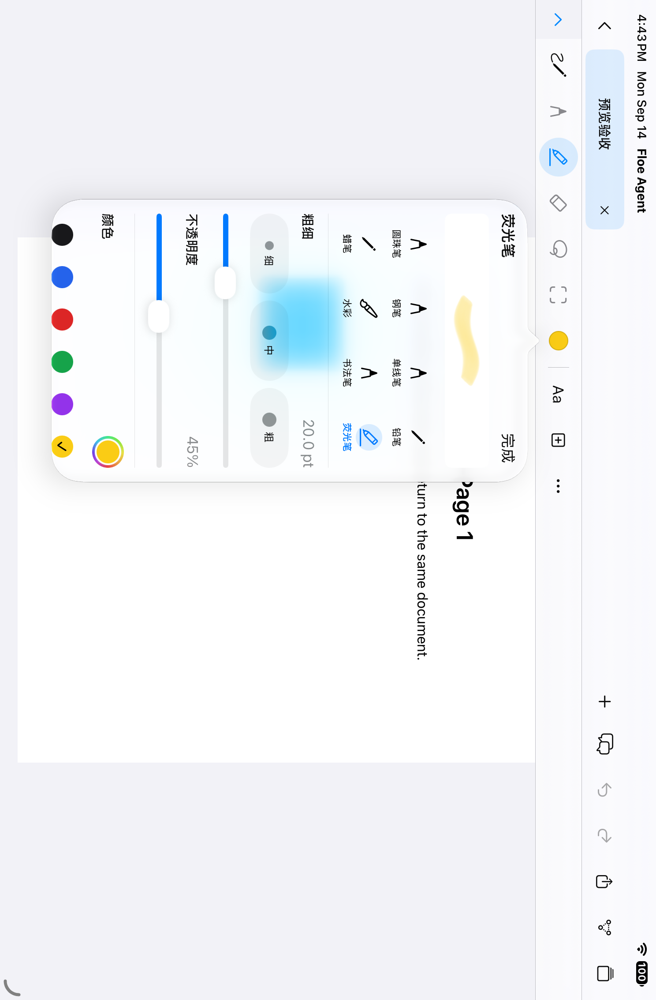
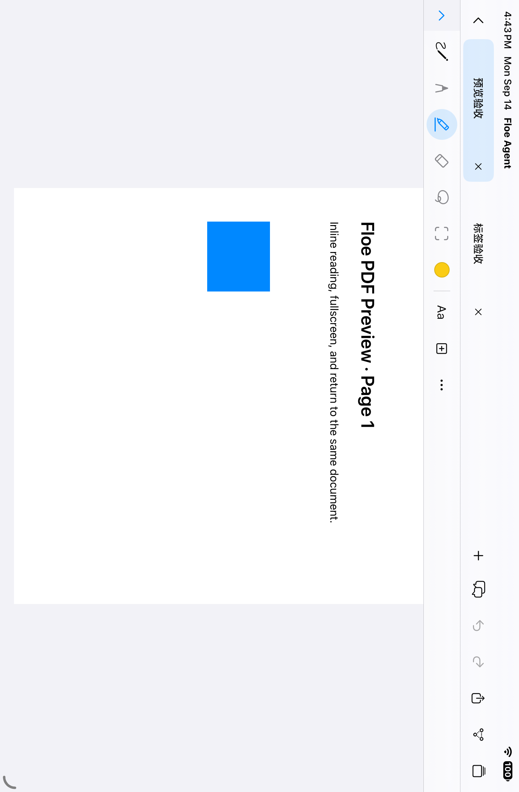
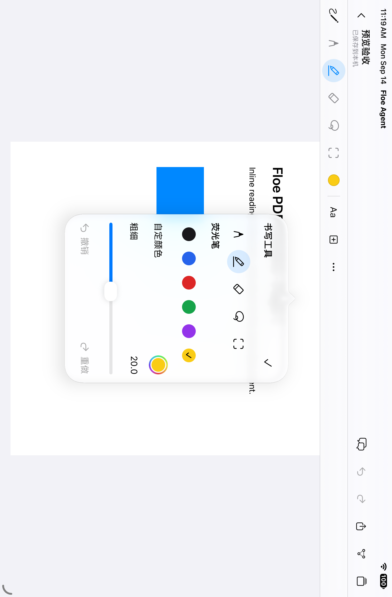
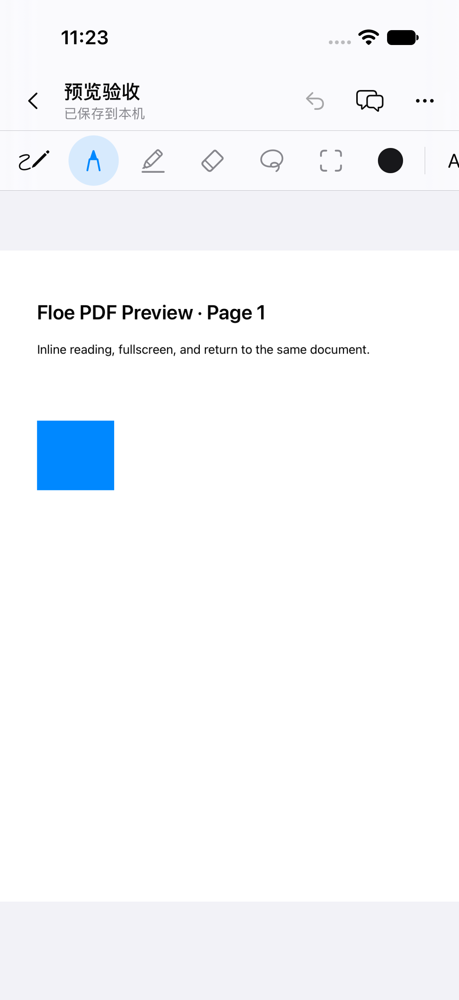
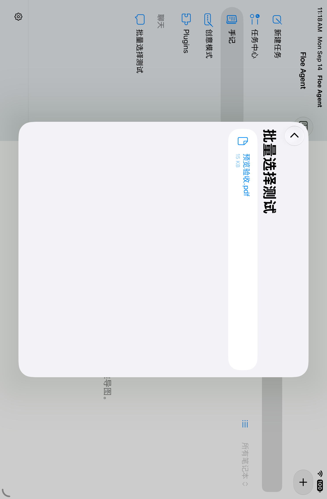
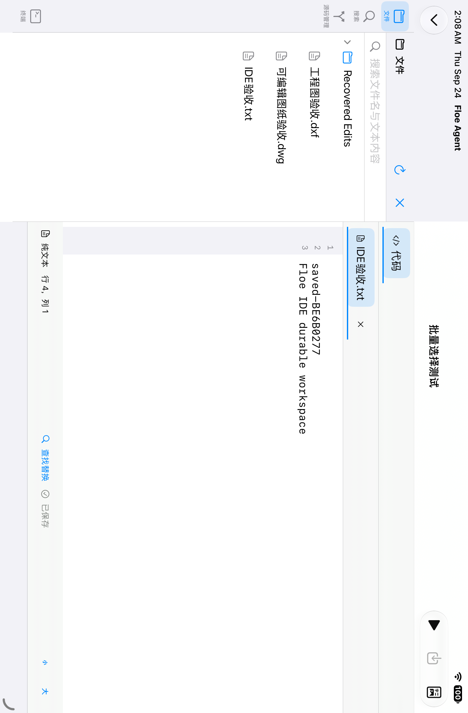
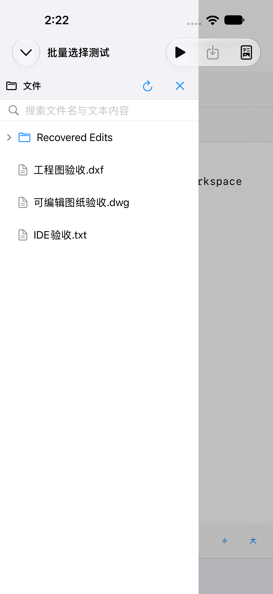
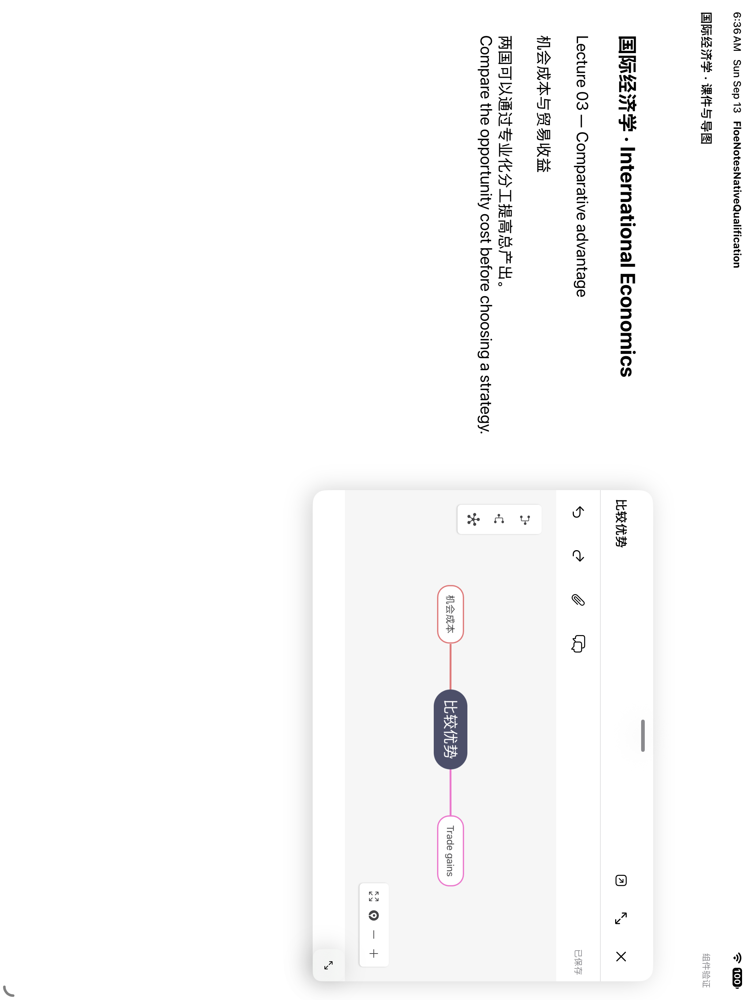
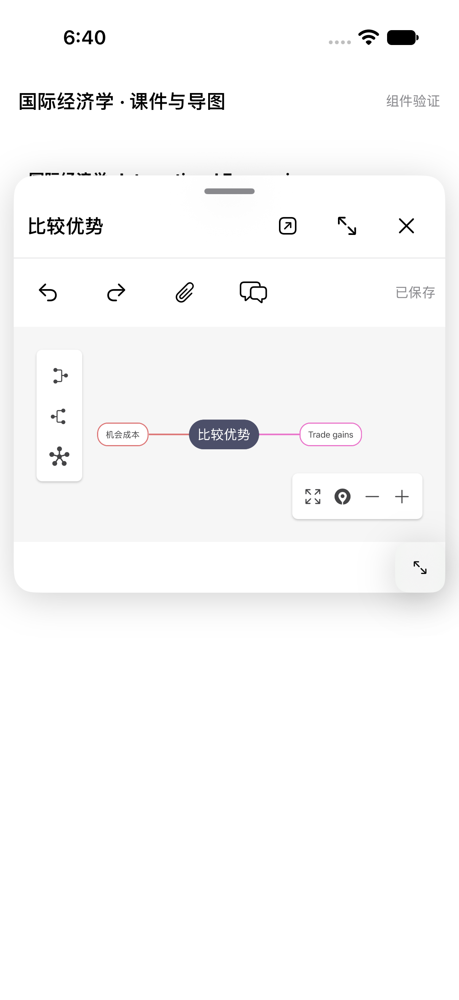

# Floe Agent 使用指南

当前内部交付为 **1.7.0（228）**。不可变标签 `v1.7.0-beta.85` 固定源码 `ed8f233a`；[发布 run 36009125622](https://github.com/JiangNanGenius/floe-agent/actions/runs/36009125622) 在签名前保留未签名 IPA（739,478,368 字节，SHA-256 `1cfe17ba4e95f869bf962d3a1238f333b6525fddfc1dde1b295f78a262d95076`），上传签名构建并发布 [GitHub 预发布](https://github.com/JiangNanGenius/floe-agent/releases/tag/v1.7.0-beta.85)。[核验 run 36015717443](https://github.com/JiangNanGenius/floe-agent/actions/runs/36015717443)确认 Apple `VALID`、未过期，且在唯一私有内部 Floe QA 组 `IN_BETA_TESTING`；中英文测试说明均已读回。匹配的未签名 GitHub 开发者 IPA 与 Feather 源条目已发布。Gitee 同步源码、标签和小型资源，附件配额不足以容纳约 705 MiB 的 IPA。[Build 228 说明](RELEASE_NOTES_1.7.0_BUILD_228.md) · [交付记录](TESTFLIGHT_1.7.0_BETA.md)。

**Build 228 的变化。** IDE Office 标签改用共享文档会话打开；PPT 编辑宿主增加有界进入路径；窄宽度 Git 按钮统一触控尺寸；本地模型与 Linux 的冲突在选择模型时提示。运行面板提供自动、单核、双核请求；修正后的等量负载测试未达到加速门槛，正式版的双核安全门仍关闭。云端 Qwen 预填充和 Office 宿主检查只是组件证据，不等于 iPad 验收。下文写着“下一构建”的条目，除其章节另有说明外，现已包含在 Build 228。

**仍需真机复测。** Build 227 的 iPad 测试报告普通 MLX 对话和测速崩溃、PPT 进入编辑后卡住、IDE 内 Office 持续加载。Build 228 包含针对性修复，但本地模型加载、测速与工具续轮、PPT 可编辑首帧和保存重开、IDE 内 DOCX/XLSX/PPTX 标签，以及 PiP、通知和键盘触控行为，均仍需在设备上核实。

下方 Build 191/192 说明与截图为历史记录，其中的候选及豁免措辞只描述当时版本，不代表当前可用状态。

Build 172 增加八种原生笔型，各自保存颜色、粗细和不透明度；再次点当前笔或颜色圆点即可调整。文档标签支持切换和关闭，关闭标签不会删除文档。顶部抬头可收起，书写工具保留。





以上为 SDK 27 完整 App 模拟器测试中的原始截图，对应 iPad 和 iPhone 手记操作测试均通过。[截图来源](evidence/floe-1.7/release-172/screenshots/manifest.json)。真实 Pencil 手势仍由用户真机检查。

[English](USER_GUIDE.md) · [官方网站](https://www.floe-agent.com/) · [中文 README](../README.zh-CN.md) · [安全策略](../SECURITY.zh-CN.md)

本指南覆盖现有 Floe 工作流与 1.7 内部测试版，界面以已安装构建为准。请结合[1.7 实施状态](FLOE_1_7_IMPLEMENTATION_STATUS.md)和[升级与恢复](FLOE_1_7_MIGRATION.md)阅读；源码提交或构建成功不代表 TestFlight 已可安装。

本文包含build 172 的工作流升级；范围、截图及未完成验收见[本轮更新](WORKFLOW_UPGRADE.md)。发布可用性需另行确认。

## Build 192 修复记录（历史）

以下段落保留 Build 192 候选在当时的边界：相关行为仅完成宿主级／夹具级验证，Build 191 当时仍是内部 TestFlight 交付。当前可用版本以上方记录为准。

- **Office 按引擎真实权限工作**：未知或缺失的只读标志不再被当作可编辑；受保护或只读文档回到预览并说明原因；需要编辑密码的文档会提示输入。对应的原生宿主已在云端运行 `35373122891` 编译链接通过，真机的保存／关闭／重开仍待验证。导入的带公式、多工作表或其他嵌入对象的工作簿不会被静默改写：严格保存校验可能拒绝保存并保留原文件。
- **IDE 按文件类型路由**：所有入口都按类型进入对应工作面——文本／代码进入代码编辑器，Office 进入 Office 编辑器，PDF、图纸、图片、媒体进入各自查看器，压缩包和未知二进制进入快速查看；代码工作台不再接收 Office 或二进制字节，读和写都会先做类型与二进制检查。在 IDE 内，文本／代码、PDF 和 Office 共用工作台的内部编辑标签与文件树：PDF／Office 的原生画面覆盖在内部标签上，一份 Office 文档在预览与编辑之间共用同一个工作副本；关闭该标签且有未保存修改时会先询问。图纸、图片、媒体和快速查看文档仍使用各自的原生标签。
- **文件预览共享当前文档**：新增“共享”；云端或网络文件会先在本地保存一份临时副本，屏幕上正在使用的预览副本不受影响；低频操作移入“更多”。
- **源码管理具备真实 Git 恢复**：快进现在真正更新 HEAD 与工作树；冲突列表正确；放弃暂存行会同时恢复索引和工作树，并在 `.git/floe-recovery` 保留恢复副本；合并冲突可编辑或中止。reset/clean、强制推送与历史改写仍不提供。
- **终端与包命令更诚实**：交互会话与关闭／过期之间的描述符竞态已修复；立即退出命令的最后输出不再丢失；IDE 底部面板可承载本地终端，关闭面板不会结束 shell。引擎忙时返回 exit 75（未启动）而不是伪装超时；取消的包命令返回 130 且不执行。显式 `npm install`／`pnpm install` 始终使用你输入的管理器，项目锁和偏好只用于自动选择。
- **模型回退修复失效默认值**：默认模型被禁用、删除或隐藏时，按固定顺序（当前选择、已存默认、最近运行、第一个可用）选择可用模型；运行中的请求保持自己的模型。
- **普通对话可用视频生成**：`video.models`、`video.generate`、`video.status`、`video.cancel` 只列出已启用且已适配的模型，并支持一张参考图（工作区路径或对话附件；PNG/JPEG/WebP，≤ 8 MiB，内联传输）。重放同一工具调用复用已有任务，取消优先于提交，取消中的下载不会被宣告就绪，过期结果如实标记。GIF 检查与转换使用真实帧与时长。
- **本地语言**：本机 Python、Node 与 Shell 运行在环境的 TinyEMU Linux 客体中，App 不包含原生 Python、Node 或 Ruby 载荷。Lua 5.4.8、Ruby 3.4.1、PHP 8.2.33 与 `floe-text` 通过已验证能力目录（`wasm.packages`）安装为签名 WASI 命令，它们是沙箱 WebAssembly 解释器而非 Debian 软件包，安装后注册 `floe-lua`、`floe-ruby`、`floe-php` 及对应别名。可安装性以该已验签目录为准，真机运行验收由测试者完成。PHP 8.2 处于安全维护期（至 2026-12-31），固定为已打补丁的 8.2.33。编译型语言走云端编译路线，暂存工件未签名。详见第 12 节。
- **本地模型**：MLX 作用域错误处理与 GPU 排空已就位，但 Build191 报告的 iPad 崩溃尚未证实修复；若再次出现，请导出本次会话的诊断日志。
- **发布流程（内部）**：预检查改为可移植实现（不依赖 `plutil`）；未签名设备工件在 dSYM 捕获前留存；复用需要符号证据；重复的已接受上传或非 `-unsigned.ipa` 的 Feather 资产会被拒绝。

## Soul 与用户画像自动生效

在“设置 → 记忆与个性化”保存、生成或启用 Soul／用户画像版本后，下一次新的模型请求会自动使用当前版本。正在执行的 Agent 会在当前工具步骤结束后应用，无需重复保存或重开对话。已经开始输出的回答，以及同一次网络请求的重试，保持原来的上下文。项目版本优先于全局版本；标记“待确认”的自动更新草稿仍需确认后才启用。手记和画布助手也读取当前偏好，各自的会话和文档范围保持独立。此行为已包含在内部测试版191中，真机验证另行进行。

## 1.7 开发功能与使用边界 / Development features

1.7 已增加本地工作区视频入口：在 MP4/MOV/M4V 文件预览中打开“媒体工作台”，调整剪辑区间、速度/音量和导出设置，保存参数后可重开继续。导出后可切换播放处理结果。此入口仍待完整 App 与真机验收；共享队列和聊天附件回接尚未完成。

The 1.7 release adds a media-workbench action to local workspace video previews. It carries the source automatically, saves edit parameters and offers export playback. Full App/device interaction checks, shared queues and chat attachment handoff remain open.

1.7 的环境、包管理和媒体工作台尚未完成全链路验收。已安装版本没有相应入口时，不要依据计划中的界面名称尝试操作。当前状态见[实施记录](FLOE_1_7_IMPLEMENTATION_STATUS.md)。

- 环境按会话、项目、共享、基础层查找依赖；写入必须绑定当前环境，不应猜测第一个项目或临时目录。旧数据迁移完成前保留恢复副本。
- 客体 Node 与 npm/pnpm/yarn 启动已做定向宿主测试；这不等于所有公共包可安装或可运行。原生 Linux 程序只能在 Linux 客体中运行，不能直接在 iOS 上执行。
- 媒体转码及音频转换仅接受已支持的参数组合。成功应能重新打开真实输出；插帧、超分等增强只有运行器和资源可用时才能使用。
- 软件包池和模型目录是候选清单，不能将条目数量当作已完成能力数。参见[兼容性说明](FLOE_1_7_COMPATIBILITY.md)。

The 1.7 environment/package/media flows remain under integration. Existing menu labels depend on the installed build. Check supported parameters and real resource availability before processing; preserve source files and verify exported files by reopening them.

### 媒体工作台：预览与剪辑区间


从工作区的 MP4/MOV/M4V 文件预览打开“媒体工作台”。图中展示素材播放器和重开后恢复的 1–5 秒剪辑区间；向下滚动可查看处理与导出设置。这是 iOS 模拟器开发界面，不代表发布验收完成。

### 普通对话视频生成（Build 192 修复候选）

普通对话现在提供 `video.models`、`video.generate`、`video.status` 和 `video.cancel`，覆盖已配置的云端视频服务商（Google Veo/Omni、火山方舟 Seedance、阿里云 DashScope Wan）。只会列出已启用且已适配的模型，以及它们真实的参数范围和参考图支持。可以用工作区路径或对话附件提供一张参考图（PNG/JPEG/WebP，上限 8 MiB），图片在本地读取后内联发送；不支持参考图的模型会明确拒绝该参数，而不是忽略。任务持久归属当前对话：重开 App 后自动继续查询，完成后视频下载到对话工作区并发送通知。重放同一工具调用会复用已有任务，新请求创建新任务；取消优先于提交，取消中的下载不会被宣告就绪，过期结果会如实标记。GIF 可检查真实帧数、循环与时长，并在本地转换为固定帧率视频，不产生云端费用。真实服务商验收（使用你自己的密钥）仍待完成。

## 1. 安全安装

有测试邀请时优先使用 TestFlight。使用社区未签名 IPA 时，必须先核验 SHA-256 与构建证明、检查源码，再使用自己的证书签名。不要导入陌生分发者提供的证书、API Key、SSH 私钥或描述文件。

Floe Agent 需要 iOS/iPadOS 26 或更高版本。文件审阅、浏览器接管、终端和多栏检查更适合在 iPad 上使用。

## 书写工具与 Apple Pencil

手记编辑器把返回、标题／保存状态和文档操作合在顶部一行，iPhone 的次要操作放入“文档操作”菜单。下方工具栏提供笔、荧光笔、橡皮、套索和 AI 选区；“画笔快捷菜单”集中切换书写工具。再次点当前画笔或颜色圆点可调整笔型、颜色、粗细和不透明度；撤销／重做位于文档操作栏。

支持捏压的 Apple Pencil 会按系统设置打开快捷菜单或切换工具；双击也遵循系统偏好。关闭手势或选择系统快捷指令时，Floe 不接管该动作。能够取得悬停位置时，菜单在笔尖附近打开；没有位置时在页面上方打开。手指书写仍需单独开启。[Apple Pencil 原生交互说明](https://developer.apple.com/documentation/uikit/uipencilinteraction)。

Build 172 包含文档标签：点标签切换，× 只关闭标签；＋可按名称或正文查找并打开已有文档。返回封面列表不清空标签，重启后仍从资料列表进入。书写栏左侧箭头收起或展开标题与标签区，笔、橡皮和套索始终保留。每份文档分别记住页面、缩放位置和工具，Office 保存失败时不会切走。捏一下在笔尖周围展开轻薄工具环，笔、荧光笔、橡皮、套索与 AI 选区位置固定。移动、悬停与抬笔不切换工具，轻触工具才确认；再捏一下、点空白处或中心关闭键均可关闭，不改变当前工具。在书写栏“更多 → 工具弧位置”选择正上方、左上方或右上方；默认正上方，选择会保存。点颜色圆点或再次点当前笔打开画笔面板，可选圆珠笔、钢笔、单线笔、铅笔、蜡笔、水彩、书法笔和荧光笔，各自记住颜色、粗细和不透明度；快捷环里的笔恢复最近使用的笔型。笔型与工具弧组件已通过双 SDK、双设备的 32 项检查；完整 App 界面与真机操作另行记录，本次按用户要求不作为上传门槛。

Build 164 已通过 SDK 27 下 iPad、iPhone 的完整 App 操作链测试；上传 SDK 验收与 TestFlight 分发仍待完成。模拟器不能替代 Pencil Pro 捏压的真机检查。





图为 build 164 的原始模拟器截图：iPad 快捷菜单与 iPhone 全屏编辑。固定提交与测试结果见[截图清单](validation/floe-156-feedback/screenshots/full-app-build164-sdk27/manifest.json)。

## 搜索与工作区导入（build 172）

以下行为已随 1.7 内部测试版交付；完整 App 与真机结果的原始记录见[修复验收记录](FLOE_156_FEEDBACK_REPAIR.md)。

- 手记：外层搜索名称与文档内容，不受“最近”或当前笔记本限制。结果显示命中片段，页面正文命中后定位到相应页面。Office 正文、扫描件与笔迹建立可重建索引；未完成或失败时会显示结果可能不完整，文档菜单可“重新索引正文”。
- 工作区导入：手记右上角“＋”→“从 Floe 工作区导入”，浏览会话或项目文件夹后选择文档。导入完成后资料由手记独立保存；UTF-8 文本和 Markdown 分页成为可编辑文字。
- 创意模式：搜索画布名称及节点文字，支持文件夹、移动画布、重命名及解散文件夹；解散文件夹保留画布。关闭编辑器和删除画布后列表重新读取。助手采用统一尺寸与拖动范围，并整理了输入、模型及语音操作。
- 会话：聊天列表、搜索对话和批量整理同时匹配标题与消息正文，支持中文片段并显示正文片段。

主入口顺序为“新建任务 → 任务中心 → 手记 → 创意模式 → 插件”，之后是项目和会话列表；设置按钮在左下角。外观和语音识别位于“设置 → 通用”；依赖安装位于“设置 → 执行环境 → 选择项目或会话 → Python·PyPI / Node.js·npm”。



图为开发版 iPad 的工作区导入页面：先选会话或项目，再选其中的文件。图中 PDF 已通过完整 App 的导入、全屏打开和正文检索测试；截图不代表新版 TestFlight 已交付。来源与使用范围见[截图记录](validation/floe-156-feedback/screenshots/README.md)。

## 2. 配置模型服务商

1. 从侧边栏底部打开**设置**。
2. 进入**模型服务商**，添加兼容接口。
3. 按服务商要求填写 Endpoint、Wire Protocol、模型 ID 和 API 凭据。
4. 测试配置，随后设为默认 Agent 模型。
5. 返回**新建任务**；Composer 中的模型标签应从“未配置模型”变成所选模型。

API 凭据应保存在 Keychain。诊断导出会隐藏凭据值；不要把未脱敏的服务商响应贴到公开 Issue。

每个服务商和每个模型都有独立启用开关。关闭后仍会保留 Endpoint、凭据和模型元数据，设置中可以继续编辑，但不会再出现在新建任务的模型列表。模型列表会把 Apple/下载式本地模型单独分组，并按云端服务商分组，避免同名模型混在一起。

已启用模型还提供独立的**在主模型列表中隐藏**开关，默认关闭。适合把某个模型保留为辅助模型或内部路由，但不让它占据首页/新建任务的主 LLM 菜单；已经明确使用该模型的旧任务仍能继续解析。

当默认模型或首页草稿指向被禁用、删除或隐藏的模型时，Build 192 修复会按固定顺序（当前选择、已存默认、最近运行使用、第一个可用）自动选择可用模型；运行中的请求保持自己的模型，只有在没有任何可用模型时才显示“未配置模型”。

## 3. 配置识图、生图和图片编辑模型

进入**设置 → 辅助模型**。三个角色相互独立：

- **识图模型**读取用户图片和浏览器截图，必须选择服务商真实支持图片输入的模型。
- **生图模型**根据提示创建新图片。
- **图片编辑模型**修改附件或已选择的图片。

模型能出现在 Agent 列表中，不代表它支持图片能力。Floe 会禁用不兼容组合，而不是发送注定失败的请求。

添加专用图片服务商时，可选择 **OpenAI** 或 **Google Gemini**，填写 API Key，并在保存前检查可编辑的 Base URL。OpenAI 默认使用 `gpt-image-2`；Google 通过原生 Gemini `generateContent` API 默认使用 Nano Banana Pro（`gemini-3-pro-image`）。只有端点真实实现对应能力时才启用生图、编辑或识图。代理地址可以自带路径前缀，Floe 构造请求时会保留该前缀。

### Apple Intelligence 与下载式本地模型

进入**设置 → 本地模型**。Apple Foundation Model 由系统管理，因此没有 Floe 下载按钮、API Key 或模型选择项。在 iOS/iPadOS 27 上，它会显示系统返回的真实状态：可用、设备不支持、Apple Intelligence 未开启、模型尚未就绪/仍在下载，或其他系统可用性错误。按该原因在系统设置中处理并等待 Floe 刷新；系统下载期间不要循环重试。

Qwen MLX 模型由用户主动下载，下载、加载和体验测试彼此独立。Floe 同一时间只运行一个下载式模型；映射权重前会按固定清单校验已安装快照，并从设备实时可用额度中扣除正在运行的 TinyEMU Linux 客体内存预留。关闭后台大型 App 可能增加可用空间，但 iPadOS 在压力过大时仍可能终止进程。快照损坏与内存不足会分别报错；若加载被拒绝，可释放内存后重试一次或选择较小模型；若 App 被终止，应导出本次最新的 Xcode/设备日志或已上传诊断，不要用旧的不相关崩溃推断原因。5.15 GB 的 Gemma 4 E4B 已不从推荐下载列表提供（计入 Floe 与 Linux 客体后通常无法在设备额度内加载），已下载的副本仍会列出以便明确删除。

已经下载的模型可以在不删除文件的情况下停用；重新启用后会再次出现在任务模型列表。停用当前模型时，Floe 会立即释放它占用的运行空间。

本地模型会获得与当前请求最相关、数量受限但真实可执行的工具。它们使用独立的对话长度和历史整理策略，不会影响云端模型的上下文或工具能力。设备端推理统一按纯文字模式运行，不映射视觉组件。Floe 会用 Apple Vision OCR 转写附图，把有界结果保存到任务工作区的 **OCR** 文件夹，并把文字交给当前会话。PDF 文字检查、页面渲染与 OCR 仍然可用；语义识图 `image.inspect` 和依赖视觉的浏览器工具不会暴露给本地模型。OCR 没有识别到文字时，Floe 会直接说明限制而不会猜图。本地模型无法正确提出工具操作时，Floe 会说明原因，不会伪装为已经执行。

普通问候、闲聊、提问和头脑风暴不需要明确的“任务指令”。Apple Foundation Model 应直接自然回复；只有在缺失信息会实质改变高影响操作时才会追问。下载式模型会根据设备状态控制一次处理的内容，并在每轮回复或工具操作后释放临时占用，以降低偶发退出风险。

Build 179 调整了本地模型的内存释放，Build 178 在 iPad 上报告的普通聊天崩溃作为历史记录保留。Build 219 加入上文所述的快照校验与客体内存核算，但本地模型加载的真机确认仍由测试者完成；若再次出现，请导出对应会话的诊断日志。在已交付的 Build 227 上，iPad 测试报告下载的 MLX 模型在普通对话与测速中崩溃，与是否使用工具无关；这是未修复的回归，不能视为通过。

**Build 227——本地模型与 Linux 的内存协调。**本地模型与 TinyEMU 客体竞争同一份设备内存，Floe 会主动协调而不是盲目并行：在本地模型驻留时请求启动 Linux，若模型没有正在执行的工作，会先卸载其权重（下一次模型调用会重新加载），提示词可正常继续；若确实有生成正在进行，Floe 不会静默取消它——Linux 启动会等待，随后以明确信息说明仍占用模型的对象。当本地模型任务自己的 Linux 工具留下正在运行的客体时，下一次模型调用可以只释放该任务自己的临时客体（绝不会释放其他任务的客体、用户自行启动的客体、服务或带有端口转发的客体）并自动继续；其余情况仍会先征得确认，被拒绝或已隔离的客体也回退到该确认。反过来，在 Linux 环境运行时请求本地模型会先征得确认并列出受影响的命令、终端与服务；选择取消不会触碰客体。在已下载模型之间切换会先确认，并在加载新模型时释放上一个模型，因此不会同时驻留两个本地模型。以上均为组件级验证，覆盖该释放/继续循环及其拒绝路径；真实内存压力下的设备行为仍由测试者验收。

## 4. 新建任务

普通启动会直接进入**新建任务**。发送前可以通过 Composer 周围的标签选择：

- Agent 模型；
- 无项目或某个项目工作区；
- 本机或已授权的远程执行目标；
- 启用的 Skills；
- 初始任务权限。

添加文件或图片附件，输入请求并发送。草稿会在当前界面原地变成持续任务，不会跳到另一套聊天页面。

**Build 227——提示词编辑器。** 输入框支持多行：文本增多时最多展开 8 行（iPad 宽度；iPhone 宽度 6 行），之后在内部滚动。**展开编辑**打开全高编辑器，与内联输入框始终编辑同一份草稿，无需复制粘贴；撤销/重做、选区和光标在切换后保留。普通回车始终换行，Command+回车发送（仅在允许发送且没有正在进行的输入法组合时）。未发送内容按会话（以及首页草稿）持久保存：切换任务、切后台或退出 App 都不会丢失提示词，发送失败会恢复完整草稿而不是被裁剪后的内容。目前为模拟器组件与 UI 测试证据；真机输入法与长文本行为仍待验收。

### 工作区归属

- **未选择项目：**Floe 为任务创建 App 内部私有工作区，并把任务显示在**聊天**分组。
- **选择项目：**任务归属于该项目，并显示在侧边栏项目文件夹下。
- 每个任务只能有一个工作区归属。之后移动任务必须走显式操作，因为文件权限范围会改变。
- 删除项目任务不会删除外部项目文件；删除私有任务可能同时清理其内部工作区和浏览器数据。

### 轻量源码管理

打开工作区的文件检查器并选择**源码管理**。非仓库工作区可以原地初始化。仓库中可查看状态、逐文件差异和最近提交；逐个文件暂存或取消暂存；提交；创建或切换分支；抓取；快进拉取或合并；推送；并在有界编辑器中处理合并冲突。放弃某个文件的修改前会先把恢复副本写入 `.git/floe-recovery`（暂存行会同时保留索引内容）。Build 192 修复让快进真正更新 HEAD 与工作树、修正冲突路径列表，并在放弃暂存行时同时恢复索引和工作树；Build 219 又让已打开的面板在仓库初始化或任何 Git 变更后立即刷新，并在回到前台时重新读取，因此 Agent 工具创建的仓库无需手动刷新即可显示。Floe 有意不提供破坏性 reset/clean、强制推送或历史改写。

同一文件检查器还可以浏览 ZIP、TAR 与 7z 压缩包：列出条目与大小并提供有界预览，解压会暂存到工作区内临时隐藏目录，关闭浏览器即清理。**Build 227** 增加本机处理压缩 tar（`.tar.gz`、`.tar.xz`）与单文件 gzip/xz，以及归档创建：Agent 可创建 ZIP、TAR、tar.gz、tar.xz、tar.bz2 及单文件 gzip/bzip2/xz 压缩包，也可列出或解压 ZIP、TAR、tar.gz、tar.xz 与 7z，全部受条目、大小与取消上限约束，且无需启动 Linux 客体。bzip2 **解压**与浏览 RAR 会给出明确原因（bzip2 仍可创建；RAR 需要 App 的已签名解码器，可让 Agent 解压）。App 无法读取的格式会如实说明，而不会静默启动客体或只返回通用错误。

进入**设置 → GitHub 与源码管理**可通过 GitHub 官方设备授权页直接登录；Floe 显示一次性验证码，并按 GitHub 返回的间隔等待授权完成。也可以继续使用细粒度 Token。获得的登录凭据会先向 GitHub 验证，只保存在设备钥匙串，绝不写入远程 URL、仓库文件、日志或模型提示。连接后可列出有权访问的仓库、克隆到当前工作区的子文件夹，或创建公开/私有仓库。应只授权实际操作所需的仓库范围。

### 远程设备与多种连接

进入**设置 → 主机与远程会话**可保存远程设备。同一设备可以同时配置 SSH、普通 VNC、经 SSH 隧道的 VNC、Telnet、普通 TCP 和 BLE GATT 串口。设备类型可以不设置；它只是帮助识别的备注，实际能力以已配置协议和连接时的实时探测为准。

只有打开**作为远端执行环境**的 SSH 设备才会在远端执行前自动检查、安装或更新 Floe 守护程序。未打开时，该设备只是管理或调试目标，不会被强制安装守护程序。模型可以读取并修改非秘密的设备与连接元数据，但密码和密钥仍只能通过安全界面进入钥匙串。

对已配对的 SSH 主机，Agent 可以调用有界只读的 `network.ping`、`network.traceroute`、`network.dnsLookup` 和 `network.tcpProbe`。探测在选定主机真实执行，并返回退出码和受限输出，可区分主机不可达、DNS、路由和端口服务故障；目标、次数、跳数、端口、超时和输出大小都受结构化参数限制。

用户在对话中明确给出地址、端口或 BLE GATT 标识时，模型可以建立仅供当前任务使用的临时 Telnet、TCP 或 BLE 串口会话，无需保存设备。临时连接不会同步，并会在 30 分钟后自动关闭。Telnet 和普通 TCP 不提供传输加密，只应在可信网络或用户已有的安全隧道内使用。iOS 不向普通 App 开放任意传统蓝牙 SPP；Floe 支持使用可写入/通知特征的 BLE GATT 串口，厂商 MFi 配件仍以其公开协议为准。

有状态工具必须先发现 ID 再执行：主机和已保存连接来自主机列表；长时间 SSH 命令返回供状态查询使用的 `taskID`；远程发布列表返回停止操作使用的 `shareID`；`cloudWorkspace.catalog` 返回远端文件和 Git 工具使用的 `workspaceID`。Harness 会在输出被截断前写入可信来源和有界的 `resourceBindings`，工具或模型文字不能伪造这些 ID 与游标。缺少 ID 时，Agent 只调用一次对应的只读发现步骤，不能猜 ID，也不能为了找 ID 重复有副作用的操作；畸形结构化调用只获得一次纠正机会，也不会制造假的调用/结果对。

## 5. 保持连续会话

之后的每次发送只会在同一个 Task 中创建新的 Run。Floe 会恢复此前消息、附件、工具结果、用户决策、当前计划和目标、作用域记忆、工作区说明以及任务权限。较旧历史可以压缩成带来源的摘要；已有工具证据只引用，不会静默重复执行。

任务显示中断时，可选择**恢复**或发送继续指令。结果不确定的副作用操作在重试前必须再次确认。

打开已有聊天时定位到最新内容；位于底部时跟随新回复，上翻查看历史时保持阅读位置。长按侧栏、任务中心或聊天列表中的任务，选择**选择多个**，即可筛选、全选并批量归档或删除；归档任务可批量恢复。运行中任务的归档会提示停止；失败项会单独显示。

## 6. 选择工作模式

- **Agent 模式：**可调用任务权限允许的工具，并继续经过正常审批。
- **Plan 模式：**只读；计划被接受前不能写文件、执行副作用命令或提交浏览器操作。
- **Goal 模式：**持久化步骤、预算、证据、子 Run 和完成条件；只有证据门槛满足后才能提出完成。

记忆分为全局、工作区和任务作用域。工作区或任务仍存在时，其长期记忆不会因为数量增长而自动删除；候选记忆仍需审阅后才启用，而且永远不能授予权限。

删除任务或工作区后，Floe 会保留记忆原来的归属，并开始逐步老化：先降低优先级，再减少用于搜索的细节，不会立刻抹掉内容。被再次召回的记忆会得到一段时间的强化。相关记忆可以跨任务检索，并结合关键词、语义相似度、归属和时间进行混合排序；当前任务和仍存在的工作区始终优先。

## 7. 查看进度和证据

任务时间线统一显示回复、思考预览、工具请求、工具结果、文件事件、错误、澄清问题、审批和检查点。右侧检查器默认收起，需要时可打开：

- **变更：**逐文件 diff 和增删行统计；
- **文件：**当前工作区目录，包括可在有界浏览器中打开的 ZIP、TAR 与 7z 压缩包（支持条目预览与暂存解压）。**Build 227** 增加本机 tar.gz/tar.xz 与单文件 gzip/xz 处理及归档创建；bzip2 解压与 RAR 浏览会说明具体原因，不会静默启动客体；
- **浏览器：**任务独立的可见网页会话；
- **终端/主机：**已授权执行目标；
- **进度：**阶段、检查点和预算；
- **子 Agent：**独立子 Run 的状态与取消。

切换任务会立即清空上一个任务的检查器引用，避免浏览器或文件串到新任务。

## 8. 使用可见浏览器

浏览器是真实、可见的 `WKWebView`。在任务权限范围内，Agent 可以导航、读取有界语义 DOM、等待页面变化、截图、点击稳定元素引用、输入、滚动和管理标签页。

遇到登录、二维码、验证码、2FA、密码、支付、摄像头/麦克风、可信文件选择、Canvas 或无法安全定位的内容时，选择**用户接管**。直接在浏览器完成操作后，点击**交还 Agent**；Floe 会重新观察页面再继续。

元素引用绑定 `documentID`。导航或主要 DOM 变化后，旧引用会返回 `stale`，Agent 必须重新观察，不能猜坐标继续点击。

## 9. 理解任务权限

最终权限是全局上限、工作区默认值、任务覆盖、当前设备/主机能力和临时授权的交集。Provider 只会收到允许的工具 Schema，执行端还会再次检查。

当前任务的权限只从聊天输入框下方的权限按钮修改，选择后自动保存，不需要再点一次“保存”。运行中的任务也可以切换权限：新的模式会立即重新判断正在等待的工具，并用于之后的每次调用。右上角菜单和右侧检查器不再放置重复入口；“设置 → Agent 与权限”只管理新任务的默认值和已有临时授权。

有界只读、工作区检查、生图/识图、OCR、PDF 只读和局域网发现不等待审批模型。用户明确要求安装、部署、修复环境、更新 Floe 守护程序或在选定 SSH 主机准备环境后，完成这个目标所需的常规系统包、换源、依赖修复和守护程序原子更新会继承本任务授权，不会逐条重复询问。删除、凭据、上传、浏览器登录/付款、目标不明的宽泛远程改动和灾难性命令仍需明确复核；Git 强制推送、破坏性 reset/clean 与历史改写不对模型开放。

审批以用户目标和具体工具目标为依据，不做脆弱的关键词匹配。“帮我测试一下所有工具”可以授权安全诊断与有界无损检查，但不授权删除、读取凭据、任意远程命令、修改模型策略或写入持久个人数据。审批结果和原因显示在对应工具调用的展开区域内，不再作为脱离工具的独立底部消息。

## 10. 后台恢复和通知

离开任务页面不会取消 Run。模型阶段、工具边界、审批、等待输入、子 Agent 和部分回复都会写入检查点。回到 App 后，支持远端 Job/Cursor 的 Provider 会尝试重连；否则在同一 Task 内创建恢复 Run。

iOS 后台执行和调度属于系统尽力行为。通知或 Live Activity 会打开对应任务；普通冷启动仍进入新建任务。不要假定 App 被系统挂起后 SSH、VNC、浏览器或模型流仍保持连接。用户手动关闭画中画后，Floe 会为整个活动任务批次持久保留该决定，包括并发 Run 和冷启动恢复；后台执行本身仍可继续。前台自动收起、模式切换、任务结束和系统中断分别记录，旧批次的异步回调不能重建播放器。真正的新批次才会重新允许画中画。

**默认后台路径。**你在前台发起的任务使用系统持续处理任务（系统 Live Activity）+ 有界完成窗口 + 持久检查点运行。Floe 不会用无声音频会话为自己续命；自动任务和定时任务也不会把自己变成系统 Live Activity——只有你的明确操作可以。**设置 → 后台执行**提供三种表面：普通后台任务（仅持续处理）、状态画中画、屏幕共享引导。状态画中画是受发布门控的**可选**表面：某个构建关闭它时该选项会被隐藏，选择画中画会按普通后台任务执行，而不会创建播放器。

**结束时的表现。**成功结束后状态表面会保留约三秒（“已完成 · 用时 …”）再自行关闭。失败或检查点**不会**被自动关闭：表面保留真实原因与恢复提示，持久记录使用同一身份，点击即可回到那一轮任务。关闭动作带代次校验，旧一轮的延迟关闭永远不会关掉新一轮的表面。

**通知。**每个对话有自己的通知策略（关闭／仅结束／仅关键／含阶段）。Floe 在前台时只显示一条应用内横幅，不再重复系统弹窗；点击横幅与点击通知去往同一目标。后台弹窗需要真实授权：被拒绝或从未询问的状态不会假装已送达，Floe 会如实显示该状态。完成/失败通知打开对应任务；Linux 会话或服务通知打开该环境的执行环境页面。**下一构建**为该表面加入受监督的服务退出通知，以及每次启动唯一的 VM 身份（runtime ID 与启动代次）；该表面的陈旧代次、事件流与启动/停止竞争修复仍在进行，因此目前仍是组件级验证，而非真机验收。

**让 Linux 环境在后台保持运行。**在**设置 → 执行环境**中，每个 Linux 环境都有明确的“后台保持运行”开关。开启时会向系统申请持续处理时间并启动有界资源采样；关闭开关或停止环境会同时结束两者。iOS 仍可能回收 App，TinyEMU 客体不会比进程活得更久：重新打开后会如实报告环境已停止（磁盘保留），不会声称它一直在运行。采样只显示真实测量值——模拟器线程 CPU、客体 CPU、客体内存与网络累计——未测量的显示“—”，GPU 恒为不可用，因为 TinyEMU 没有 GPU 直通（重图形使用原生 Apple 框架）。**下一构建**为悬浮窗加入 VM 短身份、客体上报的核心数、命令/终端/服务/端口计数，以及并发 Run 与保持运行环境之间的轮播；同一轮修复仍需处理事件丢失与身份过期问题，真机画中画表现仍待测试者验收。

## 11. Apple 能力、快捷指令与自动任务

进入**设置 → Apple 能力**，可以分别决定是否向 Agent 提供日历、提醒事项、家庭、地图、Web、Watch 状态、视觉识别、邮件撰写、文档/PDF、相机、位置、Shortcuts 和自动任务。开关只控制 Floe 的能力目录，不会代替系统授权；首次真实使用时仍由 iOS 询问权限，拒绝某项权限不会阻断任务的其他部分。

Floe 会向快捷指令公开**立即运行 Floe 任务**和**安排 Floe 任务**两个 App Intent。需要按准确的时间、专注模式、到达地点等条件触发时，应在系统“快捷指令”的个人自动化中使用“立即运行 Floe 任务”；Floe 内置计划使用 iOS 尽力后台调度，不能保证精确唤醒时间。立即运行会使用默认 Agent 模型创建普通持久任务，并可在不打开 Floe 界面的情况下启动。

## 12. 本机 Python、受管包和代码编辑

自 Phase 2（TinyEMU 迁移）起，本机 Python 与 Node.js 在每个任务环境的 TinyEMU Linux 客体中运行（riscv64 的真实 Debian 用户态），不再使用随包内置的 iOS 解释器。新建及未显式配置的环境默认使用 Linux 后端；显式选择**原生**的环境只保留 POSIX Shell 兼容子集（无 Python/Node）。尚未安装 Linux 组件时，所有依赖 Linux 的入口（Shell、Python、Node/npm、apt、后台服务、语言包）都会自行完成同一套固定目录、SHA-512 校验的“准备 → 下载 → 校验 → 安装 → 启动”流程，完成后继续执行原命令，不需要先让模型准备 Linux。组件下载始终先访问 GitHub Releases，只有在主源出现有界可用性失败后才回退 Gitee 镜像；镜像分片在导入前会按同一整包 SHA-512 重新校验。App IPA 本身仅由 GitHub 提供：Gitee 仓库附件配额无法容纳它，因此不提供任何 Gitee 直装包，也不作为 Feather/AltStore 源。**设置 → 执行环境**与终端提供同一份组件状态，以及下载、更新、启动、停止入口和客体上报的网络状态；进度、取消与重试都属于同一个共享任务。设置页与终端从已校验镜像、各环境磁盘和实时客体状态推导出唯一的权威组件状态：已安装或运行中的客体不会再显示“下载并启动”卡片；从多个入口同时开始准备（或由首次使用 Linux 自动触发）只会共用一次下载，不会重复拉取归档。

**Build 227——能力路由原生优先。** 图像、视频、音频、PDF 与 OCR 请求优先交给 App 自带的专用工具——设备侧的 Apple 框架（Vision、CoreImage、AVFoundation/VideoToolbox、CoreML、PDFKit），生成类任务使用已配置的模型通道——不会因为 Linux 客体已安装就发送给它。只有请求的操作没有可用的原生工具覆盖，或用户明确要求脚本/命令行时，才使用客体处理媒体。工具按任务选择，并只依据真实启用、配置好的能力：某个原生操作未配置时会如实说明，而不是悄悄改用脚本模拟；本地小模型收到的是按任务精选的集合，而非完整全局目录。路由契约及其剩余真机验证边界见[下一版状态文档](FLOE_1_7_NEXT_RELEASE_STATUS.md)。

每个 Linux 环境持有独立的持久磁盘：从已校验基础镜像稀疏克隆，原地（绝不替换）增长到 16 GiB 逻辑目标，已记录容量只增不减且最高 32 GiB；已安装的软件包与工作区改动在扩容和客体重启后仍然保留。客体的临时文件与软件包缓存位于持久环境层（`/floe/env/tmp`，pip/XDG/npm 缓存位于 `/floe/env/cache`），而不是紧凑的内存根分区；因此没有预编译包时的源码构建（例如 Pillow 的源码分发包）会使用设备可用存储作为构建目录，而不会写满客体根分区。若磁盘增长后无法完成客体文件系统扩展，客体仍按原容量启动，组件卡片会给出带原因的“修复”入口。对设备上已有磁盘的扩容以及物理设备上的 ext4 扩展由设备/云端资质覆盖，不构成本 App 构建单独证明的真机结果。

首次启动时客体自行配置网络：启用 slirp 网卡地址与默认路由，写入 `/etc/resolv.conf`（首选引擎自带的解析器别名 `10.0.2.3`，由 slirp 转发到宿主的解析器，其后是公共备用服务器），并在系统 git 配置中把 `/workspace` 与 `/floe/env` 标记为安全目录，使 apt 安装的客体 git 能接受 9p 挂载上属主为宿主的文件。客体会报告 `up`、`partial`（网卡可用但解析器无应答）或 `down`，设置界面显示该状态，而不是默认网络可用。

Shell、`exec.localPython`、受管安装服务和依赖页面共用每个环境唯一的解释器：客体 Debian python3 加该环境共享的 venv。`pip install`、`pip3` 与 `python3 -m pip` 直接运行客体真实 pip，并使用环境配置的索引——兼容的 Linux riscv64 wheel（含 NumPy、pandas、Pillow、lxml 等已发布版本）可正常安装。Node 使用客体 apt 的 `nodejs`/`npm` 与环境级前缀；客体自带 pnpm 时才提供 pnpm。失败或取消的变更保留上一代依赖；迁移前的旧安装保留在磁盘上（Python 包会在客体首次启动后按层清单重装到 venv；旧目录不会加入 PYTHONPATH）。调用工具所要求的任务权限和软件包审核仍然适用。

包索引与系统包来自客体自身配置的软件源：Linux 环境内的 `apt` 即标准 Debian 安装器；原生环境仍保留经审核的纯数据 `dpkg-deb` 操作。

耗时 Python 工作（批量下载、数据清洗）不应阻塞对话：`jobs.submit` 可把 `exec.localPython`、`network.download`、`network.http`、`web.fetch` 提交为持久后台任务并立即返回 jobID，Python 协作时限放宽到 600 秒。用 `jobs.status` 查进度、`jobs.result` 取结果、`jobs.cancel` 取消；完成后结果自动回注对话并发送本地通知。后台下载在 App 挂起后继续，网络中断后透明续传（上限 2 GB）。

1.6.3 起：提交时即校验目标工具参数（写错参数名当场报缺失键，不再异步失败）；任务清单在完成全部步骤后自动完结，下一任务自动开新清单（旧历史保留）；某工具连续失败三次会被熔断并要求重读其 schema；长任务中若工作超过清单进度会收到计划保鲜提醒。画中画悬浮窗显示真实应用图标、当前工具与调用/失败计数、等待审批的工具名，速度数字仅反映模型 decode 速率（工具输出不计入）。


`exec.localNumerical` 提供无需额外运行时的受限 R、Stata 和 MATLAB/Octave 兼容数值表面，包括描述统计、分位数、协方差/相关和单自变量 OLS；Stata 兼容命令包括 `generate`、`display`、`summarize`、`correlate` 和 `regress`。它不是 GNU R 或 Stata。PyStata 仍要求另行安装并授权 Stata，`pyreadstat` 则依赖本机扩展，二者都不再作为随 App 分发的载荷；有 riscv64 构建时可在 Linux 客体安装，完整 R/Stata 否则应在已配置的可信 SSH 主机运行。

已安装技能可以附带受限的 UTF-8 `.py` 脚本和锁定版本的纯 Python 依赖。创建或安装技能时会统一验证路径与源码，只下载并检查通用 wheel，并记录脚本与依赖指纹。后续任务可以直接复用完全相同的已审计脚本，变化的任务数据通过 `inputJSON` 单独传入；源码或依赖变化、重要文件改动、凭据使用、提权、破坏性行为和外部副作用仍进入当前任务的正常审批。

**Build 227——原生 IDE 编辑器。**打开文本、代码或未知文本文件时使用原生 Swift 编辑面：标签栏多缓冲区、行号、有界语法高亮、支持环绕的查找替换、撤销/重做，以及带版本校验的保存与保留草稿的并排冲突审阅。草稿按缓冲区保存：切换标签不会丢弃未保存内容。守卫规则明确而不静默——超过 4 MiB 文本上限或不是合法 UTF-8 文本时显示具体原因，并使用对应文件预览；最多同时打开 12 个缓冲区，当 12 个都含未保存草稿时，新打开会被拒绝并给出双语说明与**全部保存**入口，而不是关闭他人的草稿。高亮刻意限制在约 512 Ki UTF-16 单元以内，更大文件仍以纯样式打开。IDE 的文本与代码编辑只使用原生 UIKit 编辑器；没有 Web 文本编辑切换入口。Office 与 PDF 仍使用各自表面，文件树、源码管理、终端与运行面板共用，运行仍限于本机运行时提供的语言。[定向云端 App 与界面运行 35947162133](https://github.com/JiangNanGenius/floe-agent/actions/runs/35947162133) 在 iPad mini 和 iPhone 模拟器通过，包含保存与冷启动重开；iPhone 的 DXF 预览断言首次失败，自动重试通过。真机键盘和输入法行为仍待验收；Build 227 上从 IDE 文件树打开的 Office 文档停留在打开指示，也是未解决项。

以下截图取自 Build 227 交付的原生 IDE，在 iPad mini 与 iPhone 模拟器中使用合成测试工作区采集。它们展示原生布局和 iPhone 文件抽屉，不代表真机体验验收。




签名 WASI 目录以全应用方式安装沙箱 WebAssembly 命令，与环境层软件包及 Debian 相互独立：`wasm.packages` 工具列出已验证目录，并按 id 安装或删除条目；安装后的 `floe-lua`、`floe-ruby`、`floe-php`、`floe-text` 也可用 `lua`、`ruby`、`php` 别名在 Shell 中运行。Lua 5.4.8、Ruby 3.4.1 与 PHP 8.2.33 为目录条目；PHP 为 8.2 安全维护版本 8.2.33，带已复核补丁系列。Linux 环境内的 `apt` 是客体 Debian 安装器，不安装这些 WASI 命令。解释器启动可能超过 Shell 默认超时，请提高 `timeout` 或改用后台任务。Rust／Swift／C/C++ 不在本机编译，请按上文“运行当前代码文件”路由到已配置主机。

## 13. 创建并手工编辑 Office 文档

Agent 可通过 `document.createWord`、`document.createWorkbook` 和 `presentation.createDeck` 创建原生 DOCX、XLSX 与 PPTX；通过 `document.office.inspect` 读取语义字段，并使用 `document.office.updateText` 修改受限的文字、单元格、公式和幻灯片备注。这些操作在当前工作区内完成时属于本机低风险操作，不等待审批模型。

从工作区或手记打开文档，进入全屏 Office 编辑器。带有内嵌 Office 引擎的构建提供 Word、表格和演示文稿的版面与编辑控件，文档菜单按类型提供画笔批注和放映等操作；工作区预览中的 Office 文档保持这条独立全屏路径，只有在 IDE 文件树中打开的文档才使用 IDE 内嵌标签。手记保留文档标签页及助手入口。保存会检查原文件版本，冲突或失败时保留可恢复草稿；独立编辑器存在未保存修改时关闭会询问保存、放弃或取消，Command-S 会通过 DOCX/XLSX/PPTX 共用的保存流程原地保存。高级宏、动画和桌面 Office 格式完全保真不作保证。

Build 179 调整了 Office 的字体选择、保存和关闭处理。文档被其他编辑器修改时，会保留你的草稿并提供冲突处理选项。原生控件、保存重开和导出仍需设备验证。

Build 192 修复让可编辑状态与引擎真实权限一致：未知或缺失的权限不会被当作可编辑；受保护或只读文档回到预览并说明原因；需要编辑密码的文档会提示输入。导入的带公式、多工作表或其他嵌入对象的工作簿可能被严格保存校验拒绝，而不是被静默改写；原文件会保留。Build 219 为 DOCX、XLSX 与 PPTX 增加了同一套有界保存与关闭确认，为 PPTX 编辑增加加载看门狗，避免空白页或无限保存状态；在独立编辑器尚未打开完成前到达的编辑请求会继续进入编辑或重新打开文档，不会被静默丢弃。原生的图表往返、保存、关闭与重开仍需真机验证。

本轮演示文稿修复解决了 PPTX 专属的编辑失效：移动端引擎对所有演示文稿都先进入“无限滚动浏览版式”，此前的自动进入编辑逻辑拒绝了该版式下的引擎编辑入口，于是 PPTX 可能显示为可编辑，而引擎实际仍停留在浏览界面。现在 Floe 会对演示文稿和绘图格式执行引擎自身的受控移动端编辑入口，并在确认引擎真正切换到编辑界面后才声明可写。就绪状态也与渲染一致：演示文稿（PPT、PPTX、PPTM、PPS(X)、POT(X)、ODP/OTP/FODP、ODG/OTG/FODG）只有在宿主解码出真实文档图块且画布尺寸有效后才算“就绪”。若在限定时间内没有图块，编辑器会显示可操作的重试／恢复失败提示，而不是空白却显示就绪的编辑器，同时保留编辑副本。Word 与 Excel 文档维持原有的“打开即就绪”行为。Build 227 固定更新的云端宿主（运行 35818562658，提交 `912e3b59`，含编辑入口后的真实绘制校验，归档、可执行文件与资源摘要均已核对），使 App 构建在该契约之上；此前的宿主于 2026-09-22 由 `office-native-host` 运行 35668651442 编译并重新固定。四项设备能力回执（内嵌编辑器、可见渲染、真机往返与写回）仍未取得证据：在已交付的 Build 227 上，iPad 测试发现 PPT/PPTX 预览可以打开，但随后进入编辑的操作会停住，可编辑幻灯片内容、保存与重开均未验收；从 IDE 文件树打开的 Word/Excel/PPT 文档也停留在打开指示。

PDF 独立于 Office：从文件列表打开后直接阅读，在宽屏右侧预览，再按需全屏。阅读会话保留页码和缩放；本地文件变化会刷新。远端预览是下载后的只读快照。Office 保存会检查文件版本，冲突或保存失败时保留当前草稿。

## 14. 使用工作区画布与标准 MCP

打开工作区的文件检查器并选择**画布**。每个工作区最多拥有一个原生画布项目，项目内可以管理多张画布。当前原生界面支持可移动文本、自由手绘、平移、缩放、重命名单张画布和删除画布，并以原子方式保存在本机。画布内容继续归属于工作区，不会静默发布到全局资料库。

画布是专注的编辑面，不是第二个不受限浏览器。单指拖动空白处平移画布，拖动节点移动节点；双指随时平移缩放，Apple Pencil 用于绘制。双击空白处新建节点；从连接点拖向另一个节点即可连接，拖到空白处则快速新建下一节点。图片、视频等产物应从文件、相册或素材库导入，或者由生成任务产生，不再创建没有内容的空媒体节点。

选中节点后，下方的小 AI 输入框只原位修改该节点。它只发送节点最新内容、已保存配置、明确引用节点和本次指令，不打开右侧画布助手、不创建任务会话、不调用工具，也不会自动开始生成。对于生成任务，它可以完善提示词及供应商兼容参数。用户先**保存配置**，再在任务卡明确点击**开始生成**；任务卡和产物卡会显示排队、生成、下载、失败和完成状态，重试始终复用原任务节点和原产物节点。

生成上下文只沿显式来源连线读取。普通连线、仅用于布局的方向箭头、产物关系、未连线备注和历史结果都不会进入提示词。启动或重试已有任务只使用其已保存快照，不会再插入提示词节点；执行过程直接显示在任务卡和产物卡，只有配置和导入流程使用弹层。

右侧**画布助手**负责跨节点研究和编排，只获得画布工作面允许的工具。文本主模型遇到视觉内容时会先使用已配置的画布视觉模型；没有兼容视觉模型时只报告一次缺失能力，不循环重试。研究结果保持只读，只留在助手对话中，不会自动写入画布。公开网页图片会先下载、校验、去重和保存，再作为参考输入；不会把原始网页 URL 直接交给生图服务。标准 MCP 默认仍不向画布开放。可从 **… → 画布入门**随时重播引导。

需要连接标准远程工具服务器时，进入**插件 → 管理连接器 → 标准 MCP**并添加 Streamable HTTP 地址。Floe 支持无需认证、Bearer Token 和自定义请求头；秘密值只进入钥匙串，不写入服务器元数据。每个服务器和发现到的工具都能单独启用或停用。远程工具使用服务器专属命名空间，继续受当前任务的本地权限与审批约束，并把服务器描述和返回内容视为不可信数据。打开**允许画布使用**后，只有该服务器当前已启用的工具会进入后续画布 Run；此开关默认关闭，不会扩大普通任务权限，也不会绕过审批。

也可从侧栏**创意模式 → 新建画布**创建私人画布，不必先绑定工作区或配置生图模型。所有添加菜单优先显示生成任务。iPhone 使用紧凑操作菜单和可滚动的底部工具栏，新节点按实际可视区域创建。SVG、HTML、Markdown 的节点 AI 编辑会核对版本，避免覆盖同时发生的修改。

## 15. 安装和创建 Skills

- **Skill Creator：**创建本地声明式指令包。
- **Skill Finder：**下载 HTTPS 候选包，由所选模型规范化为 iOS 版本，再执行确定性的静态验证与兼容检查。

技能的工具调用继续受当前任务授权和运行时校验约束。支持的 UTF-8 Python 脚本和锁定版本的纯 Python 依赖在安装时审计；运行时只复用获准的相同指纹。代码或权限发生变化时重新检查，原生动态插件和安装钩子不在此范围内。

插件入口分为**发现**与**已安装**。官方条目显示名称、用途、版本和安装/更新操作；来源及技术细节折叠显示。卸载后的官方插件不会在下次启动时自动装回，可以从发现页重新安装。更新增加权限时仍会展示权限变化。

## 16. 常见问题

- **模型未配置：**添加服务商并选择默认 Agent 模型。
- **Apple Foundation Model 不可用：**查看**设置 → 本地模型**中的准确原因；它要求支持的设备、iOS/iPadOS 27、已开启 Apple Intelligence 且系统模型已经就绪。
- **下载式本地模型无法加载或导致退出：**释放设备内存、卸载其他模型后重试一次，并导出最新设备/Xcode 或已上传诊断；不要用旧的不相关崩溃下结论。若在 Build 227 上一启动下载的 MLX 模型进行普通对话或测速就崩溃，那是已知的未修复回归，不是配置问题。
- **识图不可用：**选择明确声明并真实实现图片输入的服务商与模型。
- **本地模型不调用工具：**确认任务允许该工具，并在请求中说明预期动作；模型无法使用时，Floe 会显示能力或结构化调用解析原因。
- **切后台后任务中断：**重新打开任务，使用界面提供的安全恢复操作。
- **恢复后重复已完成工具：**停止当前 Run 并导出诊断；恢复应还原执行账本，不应重放已成功的同工具/同参数调用。
- **浏览器返回 `stale`：**重新观察页面后再交互。
- **远程工具不可用：**检查主机、SSH 授权、任务权限和网络路径。
- **局域网扫描无结果：**在系统设置中允许“本地网络”，确认设备位于同一局域网后重试。该功能只发现 App 已声明的 Bonjour 服务，不是通用端口扫描器。
- **工作区预览提示尚未打开：**重新打开文件检查器，确认任务已绑定私有工作区或预期项目，再打开文件。
- **画中画黑屏或无法启动：**Floe 会在任务开始时准备可见进度源；若准备期间切到后台，会保留启动请求，待 AVKit 报告就绪后再启动，而不会取消后重复创建。返回 Floe 会结束当前系统画中画会话；若用户主动关闭画中画，同一任务批次后续再次离开 App 时不会重建，开始新的 Run 才重置。持续黑屏时请同时提交画中画状态和最新诊断。
- **Python 包无法激活：**Linux 环境内的 `pip` 安装的是客体真实 Linux 包，缺少 riscv64 兼容构建时会给出相应原因。由应用技能安装器安装的包仍限于纯 Python 通用 wheel。已退役的 iOS wheel 产线与原生扩展内置不再是 App 的一部分；既没有 riscv64 构建也没有经审计纯 Python wheel 的包，请在已配置的可信 SSH 主机上运行。
- **语音失败或退出：**检查麦克风和语音识别权限、音频路由，以及是否有其他 App 占用输入会话。

提交可复现问题时，可从**设置 → 隐私与安全**导出脱敏诊断报告。报告内容要求见[支持文档](../SUPPORT.zh-CN.md)；安全漏洞请按[安全策略](../SECURITY.zh-CN.md)私下报告。

## 17. 数据管理、字体、归档与同步凭据

进入**设置 → 数据管理**可查看 Floe 总占用、安装包、用户数据、可安全清理空间，以及本地模型、私有工作区、字体、附件、生成内容、浏览器产物、检查点和数据库等分类。安全清理只删除可重建缓存和一小时前遗留的临时文件，不会删除工作区、文档、模型、字体、附件、数据库或凭据。

**数据管理 → 归档区**支持滑动恢复、单项永久删除、多选恢复、多选删除和一键清空；永久删除始终要求确认。任务列表仍可左滑归档。

**数据管理 → 字体资源**保存一份按内容哈希去重的 Floe 全局字体，支持从“文件”导入或从公开 HTTPS 直链下载 TTF、OTF、TTC、OTC，单文件上限 32 MB。启动时 Floe 会重新注册这些字体，因此 Word、PDF 和所有工作区都能复用，不需要每个工作区重复下载。`font.list` 和受限的 `font.install` 在自动模式下不等待审批模型；影响所有工作区的 `font.remove` 仍需审核。受 Apple 公共 API 限制，任意网络字体不会被静默安装给 Floe 以外的其他 App；若 iOS 没有向 Floe 暴露所需系统字体，Agent 会说明平台边界，并改为把许可字体安装到 Floe 全局字体库。

**诊断与关于 → 第三方开源许可**是唯一的法律入口：完整呈现 TinyEMU/slirp 声明（MIT 核心，BSD-2-Clause 与 BSD-3-Clause 的 slirp 子集，以及可单独下载的 Linux 客体条款）和其他所有随包声明——PDFium、libarchive、文档转换、工程查看器/OCCT、Whisper、离线 IDE、图像/视频组件与每个随包中文字体族——并列出引擎、Swift 软件包、Python 运行时和转换/IDE 构件的版本、许可证标识与来源。每份文本都可就地复制；某次构建缺失的文件会显示为不可用，而不会被静默省略；版本与来源仍以仓库中脚本生成的 `FloeAgent/LICENSES-THIRD-PARTY.md` 为准。**Build 227** 把原先单独的 TinyEMU 许可页合并进这一入口；更早的构建会显示两个入口。

任务历史只保存在本机。配置同步包含服务商/模型配置和主机非秘密配置，Provider API Key 使用 iCloud Keychain。“同步已保存凭据”默认关闭，并要求 Face ID 或设备密码认证。开启后只有用户明确提升到凭据库的项目才能同步，任务/工作区临时凭据永远不参与同步。CloudKit 描述符可能比 Keychain 项更早到达，此时界面会显示“等待密钥”，不会误报“同步完成”。

**设置 → 文件 → 浏览与管理文件**可快速进入项目、活跃聊天和归档聊天的工作区。浏览不会改变当前聊天的工作区；可复用目录搜索、预览、编辑、移动、导出和批量删除。删除私人任务会清理其独立文件，共享项目会保留；未完成的本地清理可在管理器中重试。

## 长思考阅读

超长思考展开后，可在独立阅读区域内滚动，并通过“回到开头”“最新内容”和“全屏阅读”浏览全文。“复制”保留完整思考内容；显示分段不会截断对话记录。生成中的工具参数也会计入活跃状态，完整参数到齐并通过校验后才会执行工具。

### 直接转换文件

已有文件不需要让模型重新写一遍。可以说“把工作区里的 report.md 转成 Word/PDF，保留原文件”。Floe 使用本地转换工具，传入文件路径并生成新文件；转换正文不会重新送回模型上下文。支持 Markdown、Word DOCX、HTML、RTF 和文本互转，以及 PDF 输出和可提取文字的 PDF 输入。本地图片随文件嵌入。扫描件需先 OCR；复杂版式、浮动对象及 Markdown 无法表达的格式不保证原样保留。转换完成后打开输出文件检查即可。


### 可视化剪裁与字幕（1.7）

打开工作区视频后，在媒体工作台选择“剪裁、旋转与添加字幕”。先添加字幕文字和原素材起止秒数，再打开可视化编辑器；其中可以调整裁剪、旋转、速度及字幕位置和大小。保存或导出会生成工作区内的新文件。功能验收进度见[视频编辑集成说明](FLOE_1_7_VIDEO_EDITOR_INTEGRATION.md)。

### 音频处理与抽帧（1.7）

可以让 Agent 对工作区音频执行区间剪辑、增益、淡入淡出或混音。混音素材需要相同采样率和声道；不同格式先用音频转换工具统一。增益范围为 0–16，合成峰值会限制在正常音频范围内。输出使用新的 WAV、CAF、AIFF 或 M4A 文件；处理中取消会保留原文件及原有输出。

抽帧支持真实 PNG/JPEG，指定时间点或间隔，并选择一个新的输出目录。整批成功后才提交目录；已有目录不会被覆盖。代理视频按指定最大尺寸缩小并保留宽高比。

## 日间、夜间与自动外观（1.7 测试版）

进入左下角 **设置 → 通用 → 日间与夜间主题**。选择「自动」后，Floe 随 iOS 外观切换；定时或日落切换在系统「设置 → 显示与亮度 → 自动」中配置。「日间」「夜间」可手动固定，选择会保存并即时应用。画布未单独指定外观时继承应用设置；文档纸张和视频画面保持原始内容。

思考与工具调用采用统一的可展开框。点击标题查看全文、输入、输出和审批记录；连续调用可整体折叠，后续结果不会反复打开已收起的历史记录。折叠时仍显示当前执行、失败和需要确认的操作。新步骤使用轻量淡入及位移动画，系统开启「减少动态效果」时关闭该动画。

## 管理项目、会话与软件包（1.7 测试版）

打开 **设置 → 执行环境 → 项目与会话容器管理**，按项目、会话、共享层及模板查看环境。支持搜索名称或 ID；打开环境后可查看状态、本层容量、归属、本层依赖和父层继承依赖。所有安装、卸载、版本固定操作都绑定当前页面的环境，继承依赖为只读。

**Build 227——环境各自拥有什么。**环境自己安装的软件包位于本层；来自项目、共享或基础层的依赖为只读。两个环境即使来自同一基础也**不**共享已安装软件包、运行中的 VM 或 localhost：每个环境持有绑定已校验基础镜像的私有写时复制磁盘，一个环境的改动不会出现在另一个环境中。但在同一个环境内，命令、终端与本地服务都运行在同一个客体中，因此共享该环境的文件、已安装软件包、网络与 localhost。下载可以被缓存，但缓存下载不等于已安装软件包；保存的模板不可变——向环境安装任何内容都不会改变模板本身。安装状态与当前 VM 也是两件事：停止环境会保留磁盘与安装状态，下次启动是带新运行时身份的新 VM。保存模板时，相同内容幂等，不同内容生成新版本。软件模板页显示每个官方镜像的真实状态：基础镜像与开发文档镜像已通过云端资格检查并以组件预发布形式发布，但在本构建的安装路径检查通过之前，App 不会把它作为用户可下载项提供；页面会如实报告尚未满足的依赖，而不是承诺可安装。资源形状同样如实：新环境请求 1 个 vCPU 与较小内存档位，由资源池在设备预算内准入；在真正支持 SMP 的客体镜像通过验收前，双核请求会带明确原因失败关闭；更高性能的六 vCPU 档位尚未启用。本构建没有面向用户的 CPU/内存控制项。

软件源经过签名和索引校验后，才显示可安装版本。点击「验证并刷新软件源」，再选择软件包安装。没有已配置的可信源，或签名、下载校验失败时，页面显示原因，不能视为可用包目录；当前官方 apt 源配置与包池制作仍未完成。包操作显示运行状态、结果和取消入口；离开页面不会丢失运行任务，返回后可继续查看。

环境详情提供 **Python · PyPI** 和 **Node.js · npm** 管理页。输入包名及可选版本即可安装，列表区分本层与继承依赖，只允许卸载本层包。安装任务由应用持有，离开页面后继续，可返回查看结果或取消。npm 使用暂存与恢复记录；不支持的原生文件和安装脚本会明确报错。包操作安装到环境的 Linux 客体（共享 venv 或 npm 前缀）。进程内 Node 运行时与原生 Python 宿主已不再随包分发，其历史宿主级测试证据仅作存档；客体安装路径的真机验收仍待完成。

「停止此环境的任务」关闭该环境的新任务入口并等待其工作结束；「恢复环境」重新启用已停止且无需重建的环境。保存模板前须先停止环境。删除容器会先停止其任务；父项目仍有子会话，或执行器未结束时拒绝删除。容器是依赖、数据与生命周期分层，不是同进程原生代码的强安全沙箱。

下图为原生组件的开发验证画面，使用合成工作区和任务；对应入口为「设置 → 通用」。


折叠连续调用后，已完成记录收起，运行中的工具仍保留在画面中：


## 20. 画布图像与视频工作台（1.7）

选中图片后，从操作菜单选择 **编辑图片**，进入 ZLImageEditor 图像工作台。
可自由裁剪、涂鸦、添加文字、打马赛克、选择滤镜和调整颜色。完成编辑后可对比
原图，再保存一份 PNG 副本；画布新增一个与原素材关联的结果节点。
详见[图像编辑器说明](FLOE_1_7_IMAGE_EDITOR_INTEGRATION.md)。

选中本机视频后，选择 **剪辑与字幕**，复用工作区的视频编辑器。导出文件经过
验证后保存到素材库，并创建关联原视频的画布节点。如果编辑期间切换画布，结果
只保留在素材库，不会插入其他画布。

画布助手复用主聊天的 Markdown 回答、流式思考框和工具调用组；较早记录可通过
“查看更早的对话”继续查看。上述新增入口仍需完整 App 与真机验收。


## 1.7 手记与本地语音

以下入口描述 1.7 内部测试版；完整应用、真机与 TestFlight 交付状态见[实施记录](FLOE_1_7_CONTINUATION_STATUS.md)。

侧栏依次为“新建任务 → 任务中心 → 手记 → 创意模式 → Plugins / Skills”，之后是项目与任务。设置在左下角。没有单独的资料库一级入口，手记和画布分别管理自己的内容。

1. 打开“手记”，通过右上角加号新建手记、笔记本、思维导图或 Office 文件，也可导入 PDF、Office、图片与 `.floenote` 归档。用笔记本筛选、搜索、收藏和回收站恢复管理内容；内容菜单支持重命名与移动。
2. 打开页面后，默认使用 Apple Pencil 书写。需要手指书写时，在书写工具栏的“更多”中单独开启。可插入文字、图片与形状，通过页面内容面板调整位置、尺寸与颜色。
3. 在 27 上用原生套索选中笔迹后点击“问 Floe”；“AI 选区”也可框选 PDF 背景、图文与笔迹。附图和页码进入助手输入框，检查内容、选择合适模型后发送。图片不会让纯文本模型获得视觉能力。
4. 回答下方可选择“保存到手记”，编辑文字后插入当前页面或导图，或者新建整理手记。长回答会分页，AI 来源身份保留；带来源的内容可打开源资料的当前页面。
5. “导出”可生成 PDF 或可编辑 `.floenote` 归档，导图还可导出 Markdown 大纲。归档包含当前内容和资源，导入为独立副本；不包含聊天授权、对话与历史撤销记录。PDF 是可阅读导出，并非可编辑笔迹工程的替代品。
   导图选中主题后，可用顶部“主题图片”插入、替换或移除图片；未选中时使用中心主题，菜单显示目标名称。导图最多包含 64 张不同图片，图片随可编辑归档保存。编辑器左上角固定提供“新增子节点”和“新增同级节点”：选中主题后点按立即创建节点并进入文字编辑，不需要再点画布；未选主题或对中心主题新增同级时给出提示。新增后连线重新排布，修改可撤销并正常保存。
- 文档顶部“文档导图”可新建或关联独立导图，点击关联项在阅读区打开可移动、调整大小的小窗。主题“内容与附件”可保存附图、PDF/Office、音视频和其他文件，并预览、替换或分享。可编辑归档会同时携带关联导图；解除关联不会删除原导图。详见[图文思维导图](FLOE_1_7_MIND_MAPS.md)。

6. Office 文件在现有原生引擎中编辑。格式转换、画笔与放映按钮依照实际宿主能力显示。保存冲突保留恢复副本，“恢复为独立文档”不会覆盖当前版本。Word 批注与 PPT 放映的真机结果仍需验收。
7. 新任务首页、已创建任务的附件菜单及画布助手可“添加手记资料”，默认只读，可显式允许编辑。首页先选择资料，发送时才创建任务；失败重试保留草稿范围。在选择器中查看当前授权并移除；撤销授权不删除已经发送到对话的文字或 Office 附件。助手的 `notes.read`、`notes.search` 与 `notes.edit` 只使用当前对话已选择的手记范围。

在“设置 → 通用”选择浅色、深色或跟随系统；同一页面内的“Whisper 与语音识别”管理约 491 MB 的按需多语言模型。Whisper 不可用时使用 Apple 识别及其系统权限。视频自动字幕与 Agent 的 `audio.transcribe` 已接入此文件转录服务，Agent 可将工作区素材转为 SRT、VTT 或 JSON，保留原素材。真实中英混合识别质量、长录音及双端运行仍需验收。

可复用项目：视频编辑采用 [VideoEditorKit](FLOE_1_7_VIDEO_EDITOR_INTEGRATION.md)，图像编辑采用经 Floe 界面改造的 [ZLImageEditor 3.0.0](FLOE_1_7_IMAGE_EDITOR_INTEGRATION.md)，思维导图采用本地部署的 Mind Elixir 5.15.1。手记不是 Canvas 节点的另一种显示方式。

### 动态导图与回收站

导图根据主题文字、图片和分支层级自动排版。新增、删除、移动、展开或折叠主题后连线随布局更新；Agent 修改布局方向也会应用到编辑器。连续编辑保留缩放和选中主题，调整 PDF 小窗尺寸时适配全图。当前为树形自动布局。

“回收站”中可以恢复内容，或点“永久删除”后确认。永久删除不能撤销，也会移除该内容的历史和未来助手访问授权；独立关联导图、其他内容和对话中已有的附件副本保持独立。共享资源及其他内容撤销记录用到的资源会保留。正在预览或导出的资源延迟到关闭并重新启动应用后再尝试回收；失败会提示，并在下次打开重试。

`.floenote` 是保留可编辑内容、附图和关联导图的备份格式；PDF 用于阅读和批注成果分享，Markdown 用于导图大纲。永久删除前如需保留可编辑副本，请先导出 `.floenote`。


上图为 iPad SDK 27 组件测试重新读取的导出文件，用于说明文字与笔迹输出；不是完整应用界面截图。完整双端验收状态见[实施记录](FLOE_1_7_CONTINUATION_STATUS.md)。



此图来自固定提交 `4550b6d` 的 iPad 组件测试，展示 PDF 正文和导图小窗；不代表完整应用或真机验收。



同一项通过的组件测试也覆盖 iPhone 竖屏小窗。此图为组件场景；关闭小窗后继续阅读 PDF。

画笔参数（167 候选）：再次轻触当前画笔或颜色圆点，打开同一个画笔面板。上方显示当前笔迹，下方选择笔型；粗细可用细／中／粗三档或连续滑杆，数值以页面点（pt）计。不透明度可在 10–100% 之间调节；常用颜色和自定颜色在同一面板内。各笔型独立记住参数。笔尖工具弧负责快速切换工具；完整参数在画笔面板调整。新交互仍待完整 App 验证。


## 文档助手调整（已随构建 178 交付）

Build 172 后续修复版打开文档助手后即可直接聊天。面板顶部保留文档名称，不再把文档编号和工具使用说明显示成开场消息。你可以提问、要求修改文档，或把回答保存为手记内容；原有文档访问范围和编辑权限仍然生效。

宽屏 iPad 使用文档旁边留有间距的助手面板，较窄窗口使用可收起的面板。模型、模式和权限仍可操作。关闭助手可恢复书写空间，不会删除对话。这些调整正在验证，尚未随新的 TestFlight 发布，进度见[修复记录](FLOE_172_REPAIR_EXECUTION.md)。

### 常驻网页预览服务

在**设置 → 执行环境 → 选择环境 → 本地服务**中查看输出、打开已就绪的预览、停止服务或重新启动。可以直接让助手从工作区脚本启动 Node.js / Python 服务，也可以使用 Shell：

```sh
floe-service start node server.cjs 8080
floe-service start python server.py 8081
floe-service list
floe-service status JOB_ID
floe-service logs JOB_ID
floe-service stop JOB_ID
floe-service restart JOB_ID
```

脚本监听 `127.0.0.1`，从环境变量 `PORT` 取得指定端口；附加脚本参数写在 `--` 后。启动后先返回任务 ID，确认 HTTP 响应后才提供预览地址。关闭预览、结束一轮对话或切换会话不会停止服务。iOS 在后台可能暂停执行；App 进程退出后，服务会标记中断，需手动重启。停止操作会等待执行器实际退出。当前支持受管理的 Node/Python HTTP 脚本，不把任意 Linux 守护进程列为已支持能力。

环境中的 JavaScript 依赖支持在软件包页面选择**自动 / npm / pnpm**。自动读取所属项目的 `packageManager` 和唯一锁文件；提示冲突时，可明确选择管理器或先整理项目。此设置使用客体自带的管理器执行环境安装（客体提供 pnpm 时才用 pnpm），不修改项目清单、锁文件或其中声明的管理器版本。切换管理器会先生成并校验暂存依赖，再替换当前安装；失败时保留原依赖。Shell 中的 `npm`、`pnpm` 命令仍按你明确输入的管理器执行项目操作：显式命令不会因为项目锁文件或偏好被静默替换。

手记内的 Office 编辑器将返回、文档标签和操作集中在同一顶栏；窄屏下，附件、批注与放映位于文档操作菜单。助手按钮还可打开文档关联的思维导图。

Shell 中的 `npm install`、`pnpm install` 与设置页共用环境安装和失败恢复流程。不带包名时读取当前目录 package.json 中的 dependencies 与 devDependencies；项目清单和锁文件保持不变，因此不等于按项目锁文件精确复现。`require` 和 ES 模块导入均可查找解析后的环境依赖。取消的包命令返回 130 且不执行。

Python 包也可通过 `pip`、`pip3` 或 `python3 -m pip` 管理：安装 Linux 客体兼容包、逐个卸载本层依赖，或使用 list/show/freeze/check 检查实际依赖。命令与设置页共用安装器；缺少 riscv64 兼容构建的原生扩展会明确失败，而不是伪装成功。

软件包页面可点“软件源”修改当前环境的 Python Simple 索引或 npm 仓库，也可恢复官方地址。设置用于手动、Shell 和 Agent 安装；npm/pnpm 共用 Node 源。仅填写公开 HTTPS 源，不在网址中保存密钥。修改源会保留当前安装，下一次安装时生效；私有源认证及 Floe 语言包镜像尚未完成。

历史截图：[文档助手、画笔设置与 PDF 正文搜索](evidence/floe-1.7/build172-repair/notes-9e4434ca/README.md)。来自 `9e4434ca` 的完整 App 模拟器操作，不代表新版 TestFlight 已可安装。

### Build 173：搜索、画笔与诊断

在手记资料列表输入正文关键词后，结果以紧凑行显示预览、标题和命中片段；按键盘的搜索键收起键盘，清空关键词后恢复原来的封面／列表选择。该布局已随构建 178 交付，并经 iPad/iPhone 界面验证。

画笔面板改用透明度：**0% 为实心，100% 为完全透明**，不同笔型独立保存。已有数据仍按原来的 alpha 保存，不会将旧笔迹参数倒置；荧光笔保留自身的透明度。纸张上的笔迹按浅色纸面显示，应用深色主题不应把黑笔变为浅灰。

「设置 → 诊断与关于 → 日志设置」可选择调试、信息、警告或错误；默认信息，选择后仅收集对应及更高等级的新日志，已保存记录不会倒推补齐。App 的近期缓冲与日志服务器保留上限是两件事：服务器扩大到约 500 条的修改已通过本地检查，尚未确认部署，不能将客户端设置当作服务器已升级。

自 Build 173 修复起，每份文档的助手拥有自己的持久会话。聊天记录留在所属文档内，不出现在普通聊天、归档、聊天全文搜索或跨对话历史工具中；升级按已有文档绑定修正归属，保留消息。普通聊天通过“添加手记资料”引用文档时，仍然属于普通聊天。

Build 176：文档助手在宽屏 iPad 中使用完整右栏，iPhone 或较窄窗口使用独立面板。顶部的重新开始按钮为当前文档新建助手会话，先停止旧运行，保留文档和旧消息。助手提交修改后自动刷新当前页面；本地书写先完成保存，未保存笔迹受到保护。当前文档的可撤销编辑使用专属授权，其他工具仍执行正常权限检查。该版本最终源码的界面验证作为历史记录保留。

## 人和助手同时编辑

无需暂停任一方。保存时若原文件已改变，文本编辑器会显示合并审阅：不重叠的修改合并，重叠处由你选择，也可调整合并结果。原稿在“Recovered Edits”中保留；再次有人修改时会重新检查。Office 提供两个版本的预览与导出；手记的冲突修改保存在独立恢复副本中，可保留两个版本或审阅后应用本次修改。副本导出不表示原件已经保存。详细范围及未完成验证见[同时编辑说明](FLOE_CONCURRENT_EDITING.md)。

### 运行当前代码文件

在全屏 IDE 中打开代码文件后选择“运行”。面板先展示本机运行时或 SSH 主机及将执行的命令。Floe 会先保存编辑内容；保存失败或存在未解决冲突时，不会运行旧版本。已安装的 Python、Node、Shell 和 Lua 使用本机运行时；Rust、Swift、C/C++、PHP、Ruby、Go、Java、Kotlin 需要配置安装了对应工具的主机。

远程运行仅传输并校验当前文件，上限 1 MiB，需要主机上的 Floe 远程助手，不会同步整个项目的依赖。“停止”可取消准备工作或请求中止程序；无法确认远端进程退出或清理结果时会明确显示。关闭 IDE 会停止它所属的本机运行。此项已完成定向代码测试，完整 App 与真实主机验收仍待完成。

### 本地终端

IDE 底部面板可以承载本地终端，并复用应用级 shell 会话，因此关闭面板不会结束 shell；独立终端仍提供重新启动和结束会话操作。Build 192 修复解决了交互会话与并发关闭／过期之间的描述符竞态，并保留立即退出命令的最后输出。引擎仍在执行其他命令时，新命令返回 exit 75（未启动），而不是伪装成执行超时。不响应协作取消的原生命令仍可能一直占用引擎直到它自行停止；请等待其结束或重启 App，不要假定命令已经执行。

Office 编辑器还增加了“画笔批注”的颜色、线宽和透明度设置。**0% 透明度表示实心**，设置按文档保存。更改默认画笔前，需取消选中已有绘图对象；出现“尚未确认生效”表示引擎还未确认设置。原生绘制、导出和保存重开验收仍待完成。

### 工程图纸预览

从工作区文件或 IDE 打开 DXF／DWG、三维网格或 Gerber／钻孔文件后，可展开为全屏。DXF／DWG 提供“编辑”：点击图元或从列表选择，新增线、圆、文字，修改位置、半径或文字，撤销／重做，再按原格式保存。原版和发生冲突时的草稿保留在 `Recovered Edits`；若人或 Agent 已修改文件，不会覆盖对方的新版本。远程 CAD 和其他 3D／PCB 格式暂为只读。

当前修复分支为本地 DXF／DWG 增加“画笔”批注。打开“编辑”可选择笔色和线宽，再用 Apple Pencil 绘制；手指绘制需要单独开启，默认关闭。一笔对应一次撤销，批注层可在“图层”中独立隐藏。保存会保持原格式并重新校验输出；若底层格式处理无法保留某些样式或布局数据，将拒绝保存并保留原文件。屏幕预览可能简化实际打印线宽。此项已有引擎和浏览器组件证据，原生 Pencil 验收与 TestFlight 交付仍待完成。

点击 **AI 审图**，可查看当前视口截图和提取的图层、单位、图元等信息，输入问题后使用已配置模型发送。缺失引用和抽样范围会明确标注。它可辅助检查可见内容，不代表完整工程验收。实际支持版本、验证边界和待接入的 KiCad 见[工程查看器说明](FLOE_ENGINEERING_VIEWERS.md)。

### 从文件直接审图（Build 177）

在工作区文件中打开支持的图纸，选择“AI 审图”，查看截取的视口与提取信息，填写问题后发送。
当前没有属于该工作区的聊天时，会在发送时建立审图任务；单纯打开面板不会创建任务或调用模型。
审图需要配置模型，缺失引用、视口范围和格式限制会保留在资料说明中。
IDE 与图纸控件跟随应用语言；该版本的固定源码验证作为历史记录保留。

### Build 179 记录（历史）

本节保留当时的候选边界；后续内部交付已取代该版本。

- 手记新增 Word、Excel、PPT 封面预览，可导入 DXF／DWG 图纸并只读预览。助手可分段读取长文档，并在页面指定位置放置文字。
- Office 调整字体选择、保存、关闭和按文档保存的画笔设置。发生修改冲突时保留草稿供你审阅。
- IDE 可保存并运行当前文件、停止执行，并使用已配置主机运行远端语言。Shell 新增签名 Lua 安装（当时记录的 `apt install floe/lua` 形式已不再安装路径，现从已验证 WASI 目录安装）。
- 本地 MLX 模型调整推理内存释放方式。报告的 iPad 聊天崩溃仍需真机复核。

云端完整 App 的手记测试在 iPad、iPhone 各通过三项，各跳过一项原生 Office 测试。可查看[留存的手记截图](qualification/build178-feedback/full-app-955e346a/README.md)。该运行的 IDE 保存测试失败；之后的定向运行 35223435570 已在两个模拟器设备各通过三项 IDE 用例。发布运行 35228451173 随后在发布 SDK 的手记检查超时，未进入上传。Office 原生交互、真实 SSH 执行及本候选的 TestFlight 交付仍待完成，详见[修复记录](FLOE_BUILD178_FEEDBACK_REPAIR.md)与[候选版说明](RELEASE_1.7.0_BETA_36.md)。


### IDE 云端构建（Build 180）

在设置中连接 GitHub 后，从完整 IDE 打开源码文件，选择**运行 → GitHub Actions**。
选择仓库、基础分支与工作流，检查将要上传的文件快照，再提交构建。仓库尚无合适工作流时，
可以查看并安装 Floe 模板；此操作会向仓库默认分支添加工作流文件，需要主动点击安装。

任务记录独立于编辑器和聊天保存。关闭编辑器或 App 不会取消 GitHub 上的构建；
重新打开 App 后会自动回读未完成任务，并在 App 活跃期间主动查询。状态不变、断网或
达到服务限流时会延长查询间隔。点击取消后，需等 GitHub 确认停止才显示已取消。
若提交响应丢失，Floe 会先寻找原快照对应的运行，不会自动再开一轮构建。

回到 IDE 运行面板可以查看状态、日志及可下载产物。云端生成的 Linux／macOS 程序不能
作为 iOS 程序直接在本机执行；构建期间，本机源码仍可继续编辑。这项新增功能尚待固定
源码的云端和界面验收，详见[云端构建说明](IDE_GITHUB_ACTIONS.md)。

本轮封面验收明确包括 Word、Excel、PPT、DXF 和 DWG。功能验收要求真实内容：系统缩略图，
或带标注且经独立内容断言验证的 Office 摘要；通用图标和空白仍判失败。严格“仅系统缩略图”
检查单独记录，绝不把失败当作通过。标记为“内容摘要”的 Office 封面不等于原排版缩略图；
详见[缩略图验收记录](NOTES_OFFICE_THUMBNAIL_ACCEPTANCE.md)。

### Build 186 与 Build 187 验收记录（未上传）

Build 186 / beta.43 验收失败，未上传：聚焦 App 回归 204/204（含 23 条 IDE 用例）通过；
手记组件 iPhone 84/84、iPad 83/84（单条 Excel 严格缩略图用例在 45 秒期限到达时，真实
带标注摘要已经返回）；完整 App 两端手记 UI 腿均失败——已打开 Office 文档的返回按钮
辅助功能标识被父级顶栏覆盖（按钮本身存在，并非导航缺失）。封面冷启动阶段未执行。
Build 187 中，现代 Office 卡片会在摘要就绪时先显示带标注的真实内容，系统缩略图
就绪后自动升级；系统超时则保留该摘要而不是空白卡片。摘要有明确上限（最多 240 个字段、
Excel 只取第一张工作表），不等于原始排版。Build 187 已在 `d77aa11f` 打标签 `v1.7.0-beta.44`，
云端 run `35312393708` 已出现组件与界面验收失败，尚未上传；详见 [beta.44 记录](RELEASE_1.7.0_BETA_44.md)。


### 历史 Build188 云端候选版

187 的 SDK27 App 回归通过204/204，但手记界面与原组件用例失败，未上传。
188 修正封面卡片辅助信息的查询路径，并为 WebKit 截图等待加上明确期限。
固定源码 `c5656276a3fed0cc0546d2ab360603e443b7f87e`，[云端运行35317532109](https://github.com/JiangNanGenius/floe-agent/actions/runs/35317532109)未进入上传；不宣称可安装。

上述候选版日志按原日期保留；188 至 190 均未交付，191 曾内部交付。当前交付状态以本指南顶部记录为准。
