# Editing and workflow upgrade / 编辑与工作流升级

本轮新增需求与逐项验收以 [完整升级执行台账](WORKFLOW_UPGRADE_IMPLEMENTATION.md) 为准：完整 Office 用户前端，右侧只读／全屏编辑，以及工具目录、跨轮目标、底部跟随和历史按需加载。下表为既有版本状态，不代表新台账已完成。

Status: **1.5.3 (134) is available in the Floe QA internal TestFlight group**, with Apple `VALID` and group visibility verified on 2026-09-09 (Australia/Sydney). Immutable release source: `5f9eeec8d80c6af74816391c49e0248757c8f239`. See the [release verification](RELEASE_VERIFICATION_1.5.3.md). 更新范围覆盖完整编辑能力、插件与文件管理、画布和任务反馈；本轮大计划尚未完成全部验收。

[English guide](USER_GUIDE.md) · [中文使用指南](USER_GUIDE.zh-CN.md) · [Architecture](ARCHITECTURE_OVERVIEW.md)

## Scope and implementation status / 更新范围

| Area | Implemented in this branch | Still required |
| --- | --- | --- |
| File conversion | Offline path-based Markdown, DOCX, HTML, RTF and text conversion; separate PDF conversion; local/embedded images, source preservation and bounded status replies | Device verification; complex Word layout and scanned-PDF OCR remain explicit limits. Local round trips and the 48,122-character/42-page integrity test passed |
| Office: Word, Excel, PowerPoint | Word/workbook creation and exact existing-text/cell updates; existing PowerPoint slide/note text updates; content digest, stale-write rejection, staged save and reopened-field verification | Qualified offline engine, PowerPoint creation, full formatting/layout/backgrounds, charts, embedded attachments, formula recalculation, object positioning, masters and advanced presentation editing; cross-client round trips |
| PDF, separate tool group | Inline reader, shared fullscreen reading session, changed-file reload, password/error handling; corrected JavaScript package loading for forms | Complete editing matrix, large files, real-device fullscreen/reading-position verification |
| Plugin marketplace | Discover/Installed; official installation, persistent uninstall/reinstall, enablement, import and connector entries; version/update controls; verified catalog and expanded-permission review | Broader catalog coverage and live installation/update connectivity matrix |
| Task navigation | Initial bottom positioning, live follow while at bottom, explicit historical-run selection retained | Long-history, search, keyboard and device lifecycle matrix |
| Batch task management | Long-press a task → Select Multiple; initial task selected; filter/select all/archive/delete/restore; per-item errors | Large running batches and remote cleanup recovery on devices |
| Workspace lifecycle | Transactional durable cleanup intent, startup retry, visible retry, shared projects preserved | Offline remote cleanup scenarios and legacy unknown-orphan review |
| All workspaces | Active/archived private and project workspaces; isolated browsing and remote connection registry; existing search/edit/move/export/batch deletion; bounded remote previews | Cross-workspace aggregate file search, space accounting, full remote reconnect validation |
| Canvas editing | Generation task first in creation menus; existing SVG/HTML/Markdown node refinement with bounded source and revision checks; single undo and visible save errors | Real-model repeated editing, partial selections, final layout fidelity |
| iPhone canvas | Compact navigation, viewport-based creation, size-change centering, compact actions, scrollable touch controls and bounded panels; opening a canvas independent of image-model setup | Further landscape overlay spacing, full keyboard and physical-device interaction matrix |
| Very long text | Expanded reasoning uses a bounded inline reader, stable lazy text fragments, off-main preparation, coalesced updates and optional fullscreen; original text remains intact. Tool-argument progress prevents false idle detection; text-file arguments accept up to 1 MiB | Real-device traces and live-provider long writes; long composer input and Markdown-answer parsing/layout remain separate follow-ups |
| Live state | Snapshot revision race/coalescing fixes, visible conversation/canvas reconciliation, protection of interactive canvas drafts | Long-running concurrent tasks, reconnect and background/foreground device matrix |
| Picture in Picture | Stage, elapsed time, last activity; reported token speed or explicitly labeled character speed while streaming; fixed percentage removed | Physical-device long-tool, disconnect, multi-task and audio/PiP checks |
| Motion and composer | Stable insertion-only text block animation, subtle tool transitions, reduced-motion support, consistent microphone/send/stop controls | Dynamic Type, VoiceOver, keyboard, high-volume streaming and device polish |
| Tool foundation | Stata `clear` reset semantics, installed versus loaded schemas distinguished, exact tool calls do not require reading an official guide | Full compatibility matrix for public/third-party skills and older tool clients |

## Editing acceptance criteria / 编辑验收标准

Word, Excel and PowerPoint remain together in Office. PDF remains separate. The minimum bar is correct content, formatting and object placement, with deterministic save/reopen behavior; visual polish is secondary. Every supported operation needs model and manual execution coverage, undo where applicable, and durable save/reopen checks. Unchanged content must survive edits. Unsupported operations must be reported explicitly.

Office qualification includes styles, font sizes, paragraph/cell/shape formatting, page/slide backgrounds, charts and data, real embedded attachments, formula recalculation, slide creation and editing, layout/master behavior, precise object geometry, and preservation of unrelated package parts. Use Microsoft Office reopening, structural assertions and rendered comparisons; inspect attachment hashes and chart data. Test concurrent edits, cancellation, restart and insufficient disk space. A successful file write alone is insufficient.

Authorized third-party skills must use the same reliable tool contracts. Correctness and access rules belong to tool/runtime contracts, not only official Skill prose.

## Reuse and engine qualification / 复用与引擎验证

The candidate is [Collabora Office for iOS](https://github.com/CollaboraOnline/online.mirror/tree/27b21dc1a90ac67c90fb1addd6f9fb22eec40ccc/ios), pinned in [engine.lock.json](../FloeAgent/ThirdParty/Collabora/engine.lock.json). The [qualification workflow](../.github/workflows/office-engine-qualification.yml) runs separately from app release workflows. Native build, embedded editor, licensing/resources, physical-device operation and file round trips are separate gates. Full advanced editing is not enabled or advertised as complete by the current basic OpenXML editor.

PDF reuses PDFKit and the existing pdf-lib tool path. File browsing, import/export, task lifecycle, model configuration and signed Skill installation reuse the existing app services. A required paid service or always-online Office server is not the intended baseline.

## Verification evidence / 验证记录

- Release source `5f9eeec`: [full CI passed](https://github.com/JiangNanGenius/floe-agent/actions/runs/34233559888), with 1,007 SwiftPM test executions, 122/122 app regressions, Linux and App Store SDK builds, secret scan and 152-dependency license inventory. This includes the new converters and corrected signed plugin catalog. Apple upload and tester visibility are tracked separately.

- Source `535902c`: [full CI passed](https://github.com/JiangNanGenius/floe-agent/actions/runs/34210137026), with 999 SwiftPM test executions, 111 app regression tests, Linux build and the App Store SDK compatibility build. This evidence applies to that source revision.
- Source `0f2c7ec`: [full CI passed](https://github.com/JiangNanGenius/floe-agent/actions/runs/34213618033), including the later cleanup, plugin lifecycle and contextual selection changes. Later edits are covered by the release-source CI result above.
- Source `6c79dd8`: [full CI passed](https://github.com/JiangNanGenius/floe-agent/actions/runs/34219181630), including iPhone canvas changes, app regressions, SwiftPM tests, Linux compilation and App Store SDK compatibility. Later long-text changes are covered by the release-source CI result above.
- Source `0eaebfe`: [full CI passed](https://github.com/JiangNanGenius/floe-agent/actions/runs/34222601257), including the long-reasoning reader and streaming activity changes.
- Earlier local checks: 32 app regression tests across canvas contracts, touch geometry and plugin lifecycle passed; iPhone portrait/landscape canvas and iPad PDF round-trip navigation UI tests passed. A local-only CloudKit SwiftPM check was blocked locally by a missing Metal compiler; the current full cloud CI result above is the release gate.
- Subsequent focused checks: durable cleanup/ownership, independent network registries, plugin uninstall/reinstall, long-press batch selection, workspace-manager navigation and canvas contracts. These changes are covered by the release-source CI result above.
- iPad simulator screenshots below use test data. iPhone portrait/landscape creation and editing also passed the focused UI test; captures were visually inspected. Physical-device verification remains open.
- [Office qualification run](https://github.com/JiangNanGenius/floe-agent/actions/runs/34212234638): stopped at the disk reserve before app integration. Native embedding and advanced editing remain unfinished.

## Screenshots / 操作截图

Screenshots record the tested interaction state, not a promise that every row above is complete. Capture portrait/landscape canvas creation and editing, contextual task selection, Discover/Installed, all-workspace browsing and inline/fullscreen PDF reading. Keep test data in public screenshots; retain detailed failures and logs in local implementation evidence.

### iPad: plugins and task selection

These simulator captures show Discover after a successful signed online catalog check, with a version-only update action, then the task-selection sheet opened from a long-press menu. Only test tasks are shown.

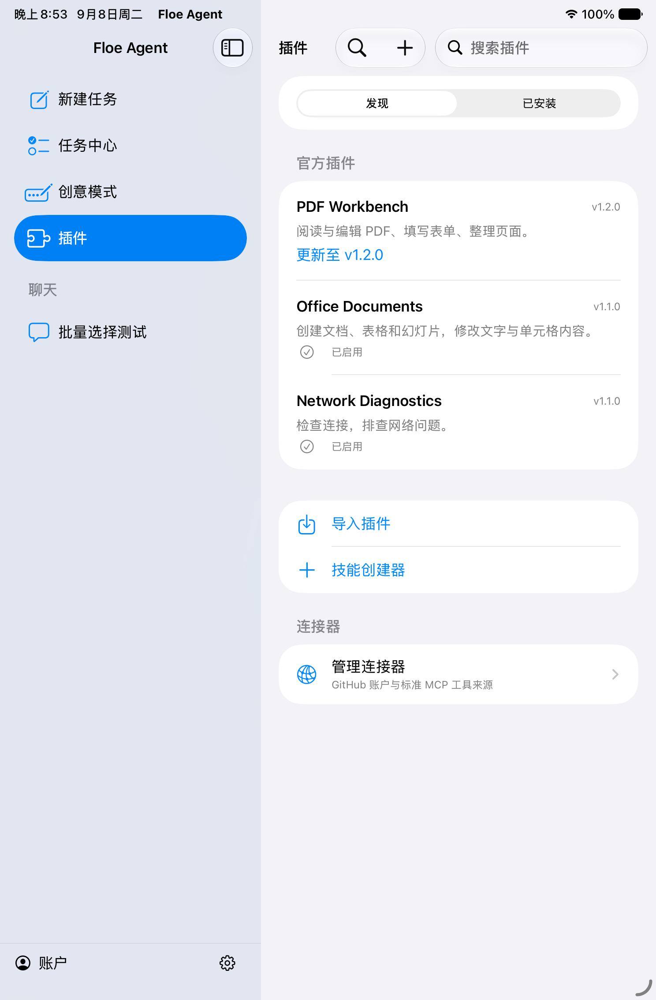
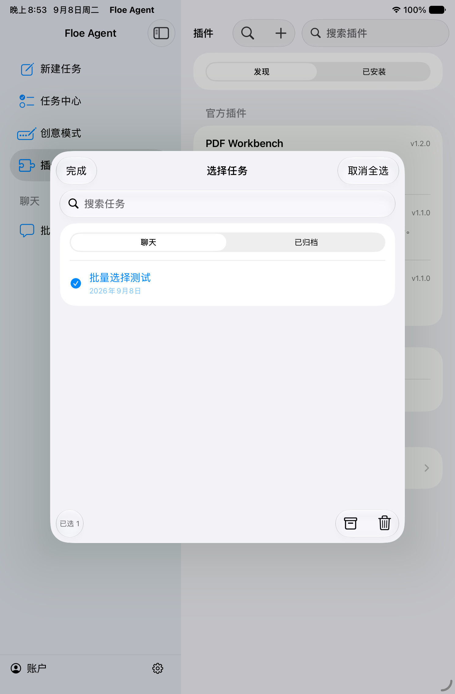

### iPad: all-workspace entry

The initial navigation check below covers the empty state and filters. A populated workspace and actual file-reading flow require separate screenshots and assertions.

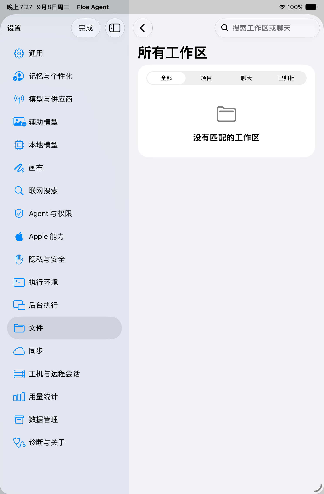

### iPad: populated workspace and PDF reading

The two focused iPad UI tests passed on 2026-09-08. They open the test conversation workspace, read an actual two-page PDF inline, expand it, return to the original panel width and go back to the file list. These checks do not yet establish physical-device reading-position fidelity.

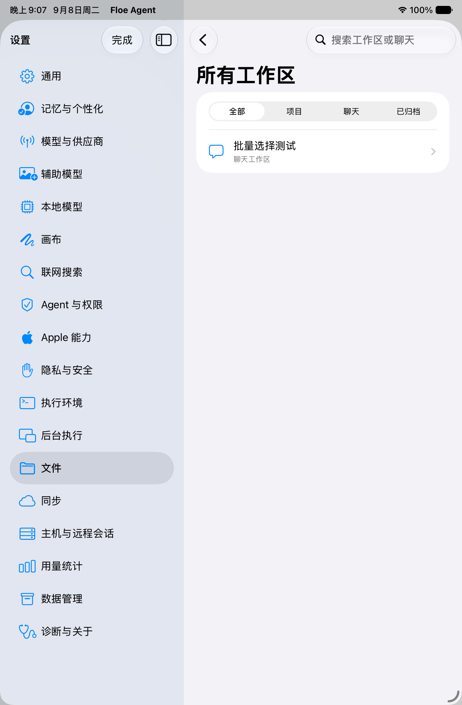
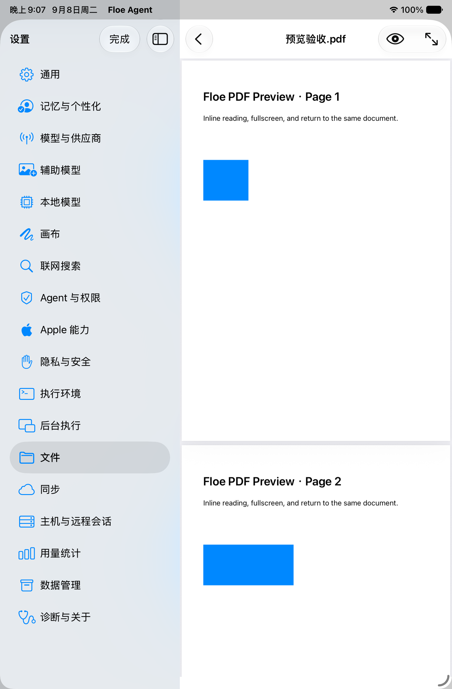
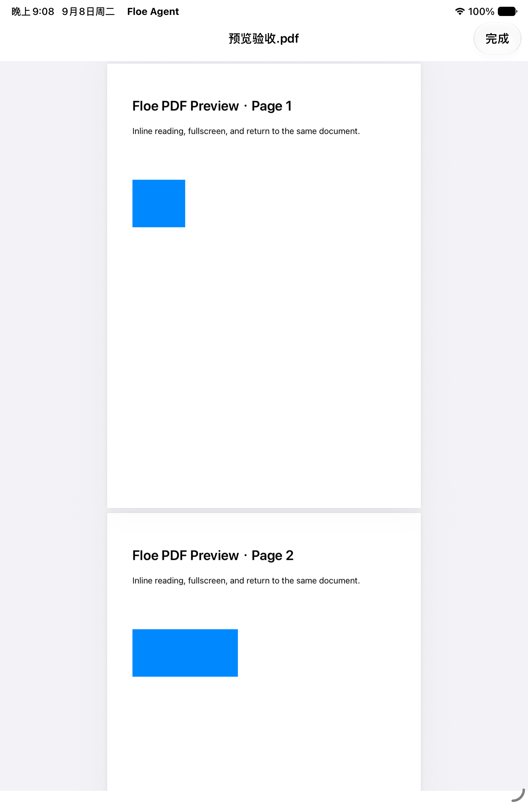

## Reproducing the screenshots / 复现截图

Use the `FloeAgent` scheme with a configured iOS simulator and the full Xcode developer directory. The UI tests create synthetic local task/PDF fixtures; they do not require personal documents or model credentials. Run these test selectors on the corresponding device:

- iPhone: `FloeAgentUITests/HomeChatVoiceIPhoneUITests/testCanvasCreationRemainsVisibleInPortraitAndLandscape`
- iPhone: `FloeAgentUITests/HomeChatVoiceIPhoneUITests/testExpandedLongReasoningRemainsInteractive`
- iPad: `FloeAgentUITests/HomeChatVoiceIPadUITests/testPluginMarketplaceAndBatchEntry`
- iPad: `FloeAgentUITests/HomeChatVoiceIPadUITests/testWorkspacePDFInlineAndFullscreen`

Keep the `.xcresult` bundle and export original attachments with `xcrun xcresulttool export attachments --path <result.xcresult> --output-path <directory>`. Retain failed-run screenshots separately. Inspect orientation, keyboard visibility, rendered content and touch targets before adding successful captures to this page. The screenshot helpers use the whole simulator screen to avoid application-frame cropping during rotation.

### iPhone: portrait and landscape canvas

The focused test passed with new SVG nodes inside the visible viewport and the editing completion control reachable in both orientations. Original full-screen captures show rendered SVG content after editing. This is simulator evidence: the landscape selection/zoom/input overlays remain crowded and need further layout refinement before final device acceptance.

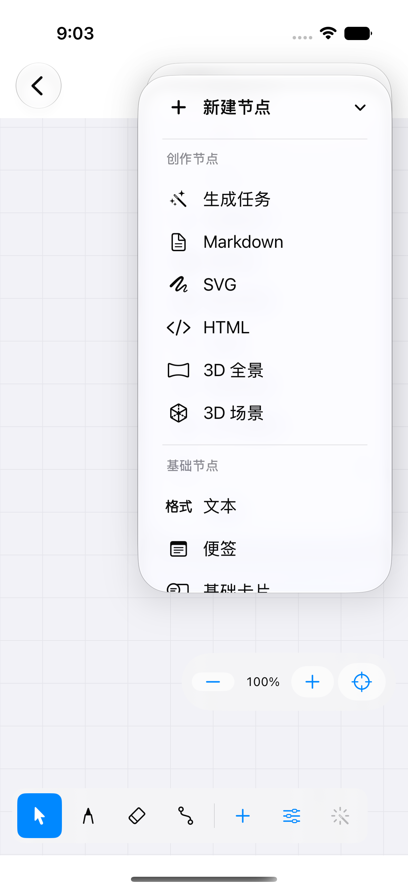
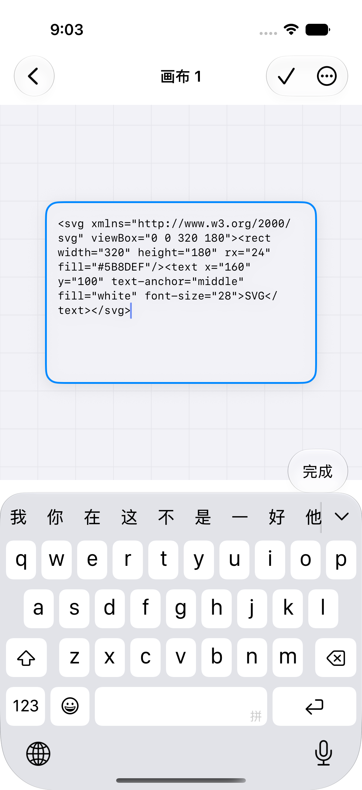
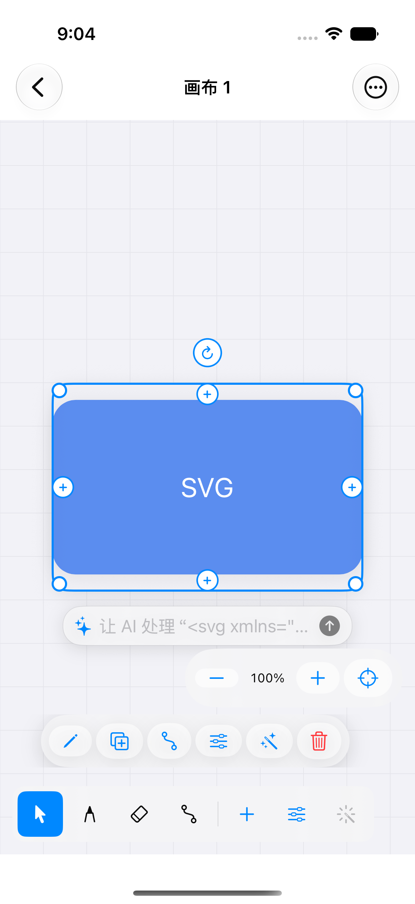

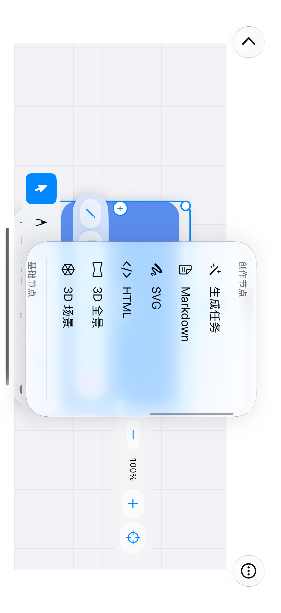

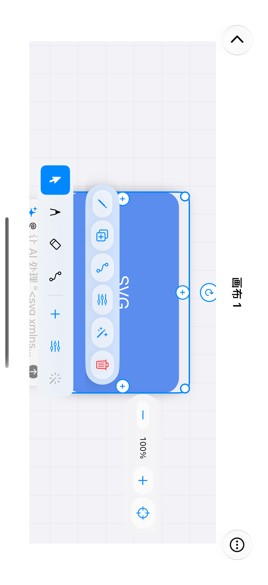

## Long-text responsiveness / 长文响应

The reported reproduction is specifically smooth while reasoning is folded and severely slow once it expands. Previously expansion put the entire transcript into one selectable SwiftUI `Text` and animated its full height. The new long-reasoning path prepares stable fragments away from the main actor, coalesces updates, and lays out only the fragments around a bounded reading viewport. Fullscreen reading, beginning/end navigation and full-text copying remain available; storage, model context and generation limits are unchanged.

Stress coverage includes tens of thousands of Chinese characters with no line breaks, emoji/composed Unicode, continuous additions while expanded, collapse/reopen and fullscreen. Verify exact reconstruction and the final marker, not just a responsive spinner. The broader long-input and Markdown-answer paths still need their own profiling and fixes; this change does not certify all long-text performance.

### Long file-writing requests and stream timeouts

The reported 30-second first-event and 45-second idle failures expose a separate transport/runtime path. Complete short SSE events now leave the receive buffer at line boundaries. Chat Completions, Responses and Anthropic adapters report actual partial tool-argument progress through an attempt-scoped callback, without dispatching incomplete JSON or placing partial arguments into the transcript. The watchdog remains active for silent streams; stale-attempt callbacks are ignored. Tool-argument preparation uses the reasoning idle allowance, the default first-event allowance is 120 seconds, and HTTP request inactivity is bounded at 180 seconds.

Workspace create/write/patch arguments accept up to 1 MiB, including JSON overhead; other tools retain the 64 KiB default. The file service still enforces path ownership, revision checks and its write ceiling. This permits tens of thousands of Chinese characters in one text write without removing general tool limits. Actual provider buffering, output limits and mobile-network failures still require live validation.

The 27-test local timeline/long-text regression suite passed on 2026-09-08. It verifies lossless Unicode reconstruction, coalesced updates, short SSE delivery, bounded long arguments and partial-call rejection. A simulated stream with continuing argument fragments outlasts the configured watchdog deadlines and completes on its first attempt; an otherwise identical silent stream fails. These accelerated tests exercise runtime behavior, not a real mobile-network request.

### Long reasoning: simulator captures

These synthetic stress captures exercise the actual reasoning disclosure/reader component with tens of thousands of characters. They are not a live Kimi session or physical-device frame-rate measurement. The iPhone UI test passed on 2026-09-08, checking the original end marker, appended end marker, fullscreen controls and collapse/reopen.

## File-to-file conversion / 直接转换已有文件

Use `document.convert` for Markdown, DOCX, HTML, RTF and plain text. Use `document.pdf.convert` when either side is PDF. Arguments contain `inputPath`, `outputPath` and `format`; the model does not need to read and rewrite the body. Tools return a compact saved-file status, digest and warnings. Existing output files are refused and source files are preserved.

For example: `document.convert` with `inputPath: "report.md"`, `outputPath: "report.docx"`, `format: "docx"`; or `document.pdf.convert` with the same source, `outputPath: "report.pdf"`, `format: "pdf"`. Word/HTML/RTF can be converted back with `format: "markdown"`. Local images resolve relative to the input document and are embedded; external images must first be downloaded to the workspace. Text and converted images do not enter the model transcript.

The [bundled engine and dependency lock](../FloeAgent/ThirdParty/DocumentConversion/README.md) reuse Marked, Mammoth, TurboDocx html-to-docx, Turndown/GFM and DOMPurify. PDF uses Apple WebKit printing and PDFKit extraction. RTF uses native rich-text import/export. There are no runtime package downloads or third-party conversion servers.

These are semantic conversions. Markdown cannot retain every Word font/layout property; RTF covers basic rich text. PDF extraction preserves searchable text and page order, not original table/image layout. Scanned pages fail explicitly and require the existing OCR workflow. Unsupported images, permission errors and unsafe paths fail without publishing a partial output.

The PDF export font preserves distinct Unicode mappings rather than normalizing the source. The following image was rendered from the actual simulator conversion output; Chinese headings, bold/italic text, lists, table borders and links are visible. This is generated-file evidence, not a physical-device screenshot.

## Official media refresh

The [2026-09-08 model verification](MEDIA_MODEL_CATALOG_2026-09-08.md) adds Seedance 2.5 and Seedream 5.0 Pro/Lite without overwriting user-configured IDs or removing older presets. Wan 3.0's duration and wire parameters are corrected. Provider-request tests run without billable model generation; account/region access and actual generated output remain live-test boundaries.

Validation on 2026-09-08: 45 model/catalog and conversion tests passed, followed by the final Unicode/long-document rerun and the image/path rejection suite. The 48,122-character fixture produced 42 pages; all 200 paragraph markers, distinct CJK/radical/full-width characters and the final marker survived. Source bytes remained unchanged. Full cloud release gates and real-device acceptance are tracked separately.
