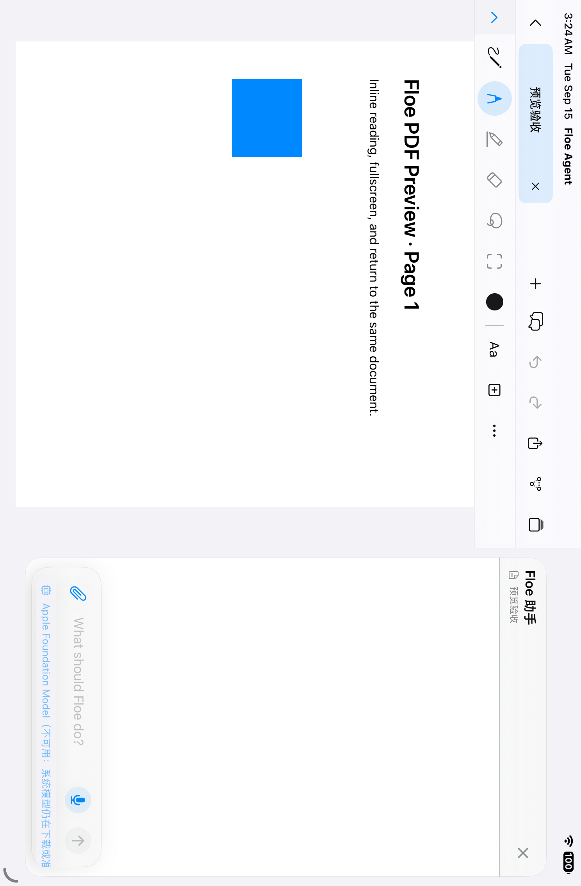
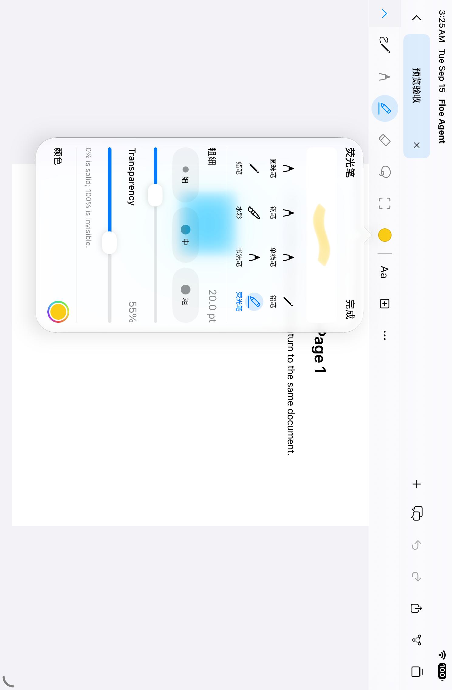
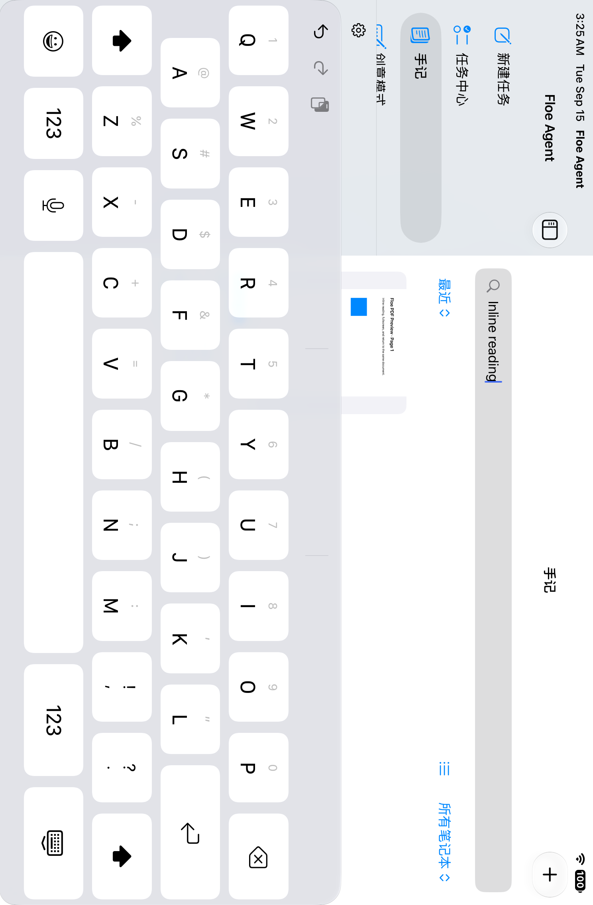

# Notes repair candidate: original simulator captures

Source `83cbc383`, [cloud run 34922624182](https://github.com/JiangNanGenius/floe-agent/actions/runs/34922624182), SDK 27. Notes UI passed on iPad mini A17 Pro and iPhone 17 Pro. The separate App runtime suite failed two tests; this source is not a qualified release. See [manifest.json](manifest.json) for attachment identities and SHA-256 hashes. Files are original, unretouched simulator attachments with synthetic documents; iPad PNG orientation metadata is preserved.

## iPad document assistant

The original setup message is absent. The long model-availability label still crowds the lower controls; a later candidate limits its width. This capture does not demonstrate a model response.

## Brush settings

The UI test exercises the palette through its button; real Pencil squeeze and pressure require physical-device checks.

## Document body search

The query appears inside the PDF, not its title. iPhone captures are retained in the same directory. These images predate the later plain, leading-aligned library-card repair.
