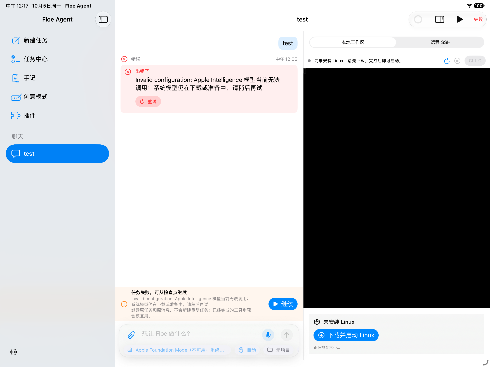

# Build 256 terminal verification

- Source: `45ba78e3` (candidate; app version remains 1.7.14/255 until release preparation).
- Toolchain: Xcode 27.0 / build 27A266a, iOS 27 Simulator, arm64.
- Target: full FloeAgent App, Debug, unsigned Simulator build.
- Device: task-owned iPad Air 13-inch (M4) Simulator, now shut down.
- Verified: opening Terminal mounts the task workspace; Local workspace is selected; a missing Linux image produces the installation card; switching to Remote SSH shows the host list.
- The synthetic `test` conversation displays the unavailable Apple model error. No model execution, guest command execution, Office ink behavior or physical-device acceptance is claimed by this screenshot.

