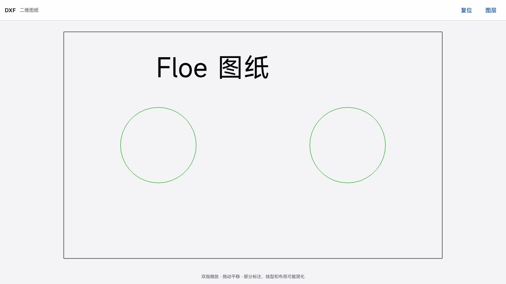
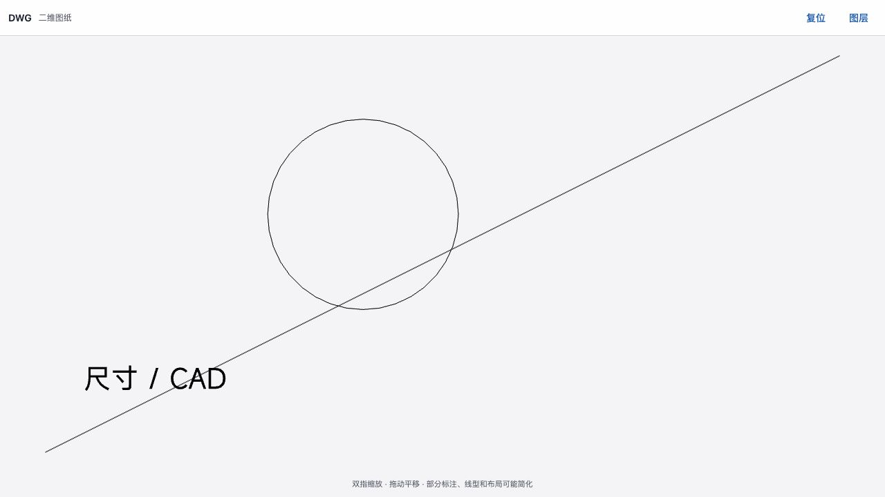
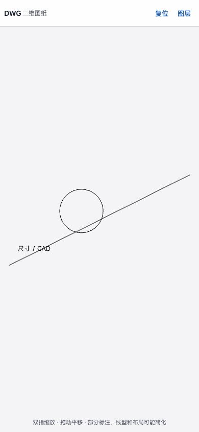

# Build 178 feedback: directed CAD viewer checks

Observed 2026-09-17 by the primary agent. Source:
`84d6500e013c6f0b44b30972c6a6ce19a8b272c1`.

These are **desktop browser component captures**, not screenshots from an iPad
or iPhone running Floe. A localhost qualification harness supplies the bundled
synthetic `sample-plate.dxf` / `sample-editable.dwg` to the actual bundled
EngineeringViewers parser and renderer in read-only mode. It does not replace
geometry with images or bypass the real DWG decoder. App Notes import, native
bridge behavior, physical gestures, editing and save are not covered here.

Primary-operated checks:

- DXF: Chinese text and geometry render; unchecking the `Holes` layer removes
  the two circles; rechecking restores them. Zoom changes the view, and Fit
  restores the complete drawing.
- DWG: the bundled WASM decoder renders the line, circle and Chinese text.
  Hiding layer `0` removes the geometry; enabling it restores the drawing.
- DWG at 390 × 844: Fit and Layers remain reachable, and Fit shows the complete
  drawing. Resizing preserves the earlier zoom, so Fit is needed to reframe.

## DXF, wide viewport

## DWG, wide viewport

## DWG, compact viewport after Fit

临时浏览器页面和本地服务已关闭，视口已恢复。以上截图来自真实组件操作，
不代表手记原生导入流程或真机验收通过。
