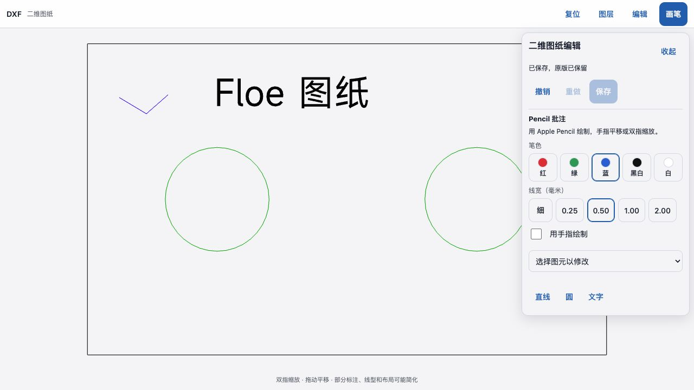
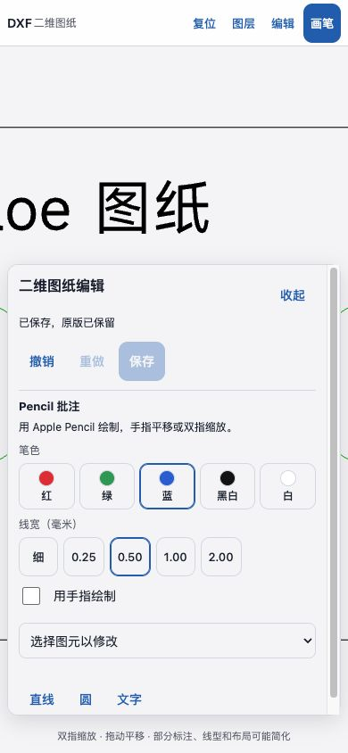

# CAD ink component evidence — 2026-09-17

The rebuilt engine passed 16 native Rust tests in [run 35191461614](https://github.com/JiangNanGenius/floe-agent/actions/runs/35191461614), source `175adf04be75f02d1c34f540baa646e8da2cd9cf`.
The bundled real WASM then passed 73 geometry, capability, editor-contract and ink round-trip checks.

Primary-operated browser checks exercised DWG drawing, atomic undo/redo, saving and actual-file re-read; DXF blue ink saved and reopened with ACI 5 and line weight 50 (0.50 mm). Zoom stayed stable across a subsequent edit, and the annotation layer could be hidden independently. Original synthetic-fixture screenshots are retained below; `manifest.json` records their hashes and source limits.

This is a desktop browser component run with CDP pen input. The local test harness saves through a synthetic file adapter, so it does not qualify the native Office/Notes bridge, iOS permissions, Apple Pencil palm rejection or physical-device behavior. CAD display can simplify line weights; saved width values were checked by re-reading the engine output. The earlier DWG screenshot predates the final swatch layout.
