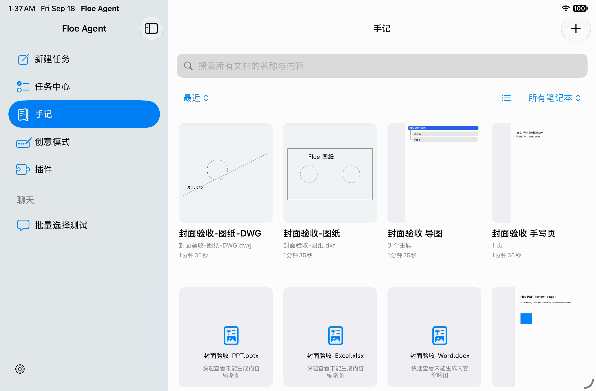
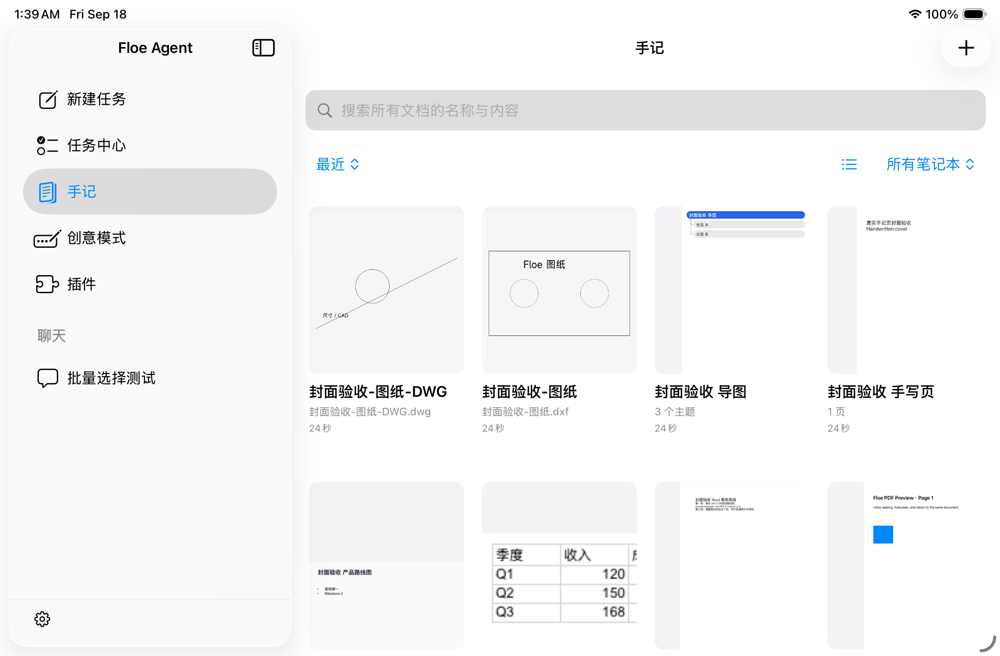

# Build 185 full-App UI evidence — qualification failed

Source `42ecc4527fdbeb171dd0aed1d0776375770f1572`, [run 35292395886](https://github.com/JiangNanGenius/floe-agent/actions/runs/35292395886), SDK 27 iPad mini (A17 Pro) simulator. This is the full App, not the NativeNotes component host.

Three Notes UI tests passed; the Office cover test failed, and the native Office editor test was explicitly skipped because the simulator build does not link that device-only engine. The SDK 27 iPhone test runner exited during bootstrap before executing tests. These results do not qualify this build for release.

The failed recording shows real DXF, DWG, PDF, handwritten-page and mind-map content in the library, but Word, Excel and PPT show generic unavailable-preview cards. The source assertion stopped at Word, so the other Office failures are visual observations, not separate passed/failed test cases. Component cover-service success does not close this App failure.

Retained successful-flow screenshots show document tabs, body search, Pencil controls and the document-only assistant. They use synthetic fixtures and prove only the pictured simulator states. EXIF orientation was applied for document display; originals and recordings remain in the source artifact. `evidence.json` records attachment names and hashes.

## Contrasting accepted-SDK iPad result

The same source on the accepted SDK rendered all seven covers and regenerated Word after rename, then failed when opening Word exposed an unavailable-engine page without a return control. The screenshot below is partial positive evidence, not a passed UI leg or a fix for the other devices.

