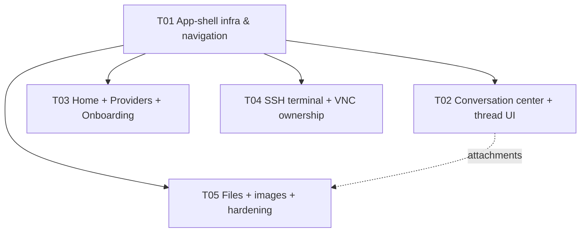

# Floe Agent — Daily-Use Alpha Architecture

Status: implementation-ready design for `agent/alpha-daily`
Author: 高见远 (Architect, Bob)
Audience: 寇豆码 (Engineer), 严过关 (QA), team-lead

This document is the binding design for the remaining greedy phases in
`docs/workbuddy/ALPHA_GREEDY_EXECUTION_PLAN.md`. Phases 1–3 are already
committed (schema v3, stores, AppEnvironment, ProviderAdapterFactory,
presets, `/models` discovery, connection test, SecretRedactor,
ConversationRunService); this design **binds to those committed APIs by name**
and then fully specifies Phase 4 (daily-use UI), Phase 5 (SSH/VNC), and
Phase 6 (Files/images). It is design + signatures only; it contains no
production implementation code beyond short illustrative fragments.

Design north stars (from `PRODUCT.md` / `DESIGN.md`, non-negotiable):

1. The **execution thread is canonical** — every assistant delta, tool step,
   terminal line, file action, approval, error, usage checkpoint and evidence
   marker is one foldable chronological thread (`run_events`), never scattered.
2. **Honest states only.** Disconnected / suspended / unknown / waiting-for-secret
   are first-class and can never look like success. No invented live data.
3. **Secrets only in Keychain**, referenced everywhere else by `SecretReference`.
   The DB, logs, and CloudKit never carry a secret body.
4. **Catastrophic gate is independent** and runs before every approval policy,
   including full control. It is never weakened by a grant.
5. **iPhone = 5 locked tabs** (Home, Chat, Files, Hosts, More);
   **iPad = 3-column `NavigationSplitView`**. Home is a task workbench, not a
   card grid. Glass only on chrome/composer; reading surfaces stay opaque.

---

## Part A — Current committed reality (baseline)

The design below extends these committed, green (184-test) building blocks.
Nothing here is redesigned; the new work is additive.

| Layer | Committed API (exact) | Notes |
| --- | --- | --- |
| Persistence core | `DatabaseManager` actor (`reader`/`writer`/`migrate`/`userVersion`), `PersistenceCodec` (ISO-8601-fractional dates) | v1/v2 published & frozen; v3 appended |
| Schema v3 | `V3AgentDaily` migration → `message_parts`, `attachments`, `run_events`, `run_usage`, `run_errors`, `checkpoints`, `remote_sessions` | append-only, STRICT, secret-free |
| Stores | `ConversationStore`/`SQLiteConversationStore`, `RunStore`/`SQLiteRunStore`, `RemoteSessionRegistry`/`SQLiteRemoteSessionRegistry`, `ModelConfigurationStore`, `RemoteHostStore`, `ConfigSyncMetadataStore` | protocol-typed, actor-backed |
| Thread model | `MessagePart`, `AttachmentRef`, `RunEventRecord`, `RunUsageRecord`, `RunErrorRecord`, `RemoteSessionRecord` (all in FloeModels/AgentThread.swift) | wire & storage neutral |
| Runtime | `FloeAgentRuntime` actor + `AgentState` enum, `ConversationRunService` actor (`start/cancel/resolveApproval/snapshot`), `AgentCheckpoint`, `ConversationMessage` | one instance per run; sink-forwarder mirrors events into stores |
| Providers | `ProviderAdapter` (`stream`/`listModels`), `ProviderStreamRequest`, `ProviderAdapterFactory.adapter(for:)`, `ProviderPreset.all`, `ModelDiscovery`, `SecretRedactor`, SSE stack | three wire adapters real; `listModels` still empty-skeleton but `ModelDiscovery` exists |
| Security | `ApprovalPolicy` (Human/Model/FullControl+Grant), `ApprovalDecision`, `ApprovalScope`, `ApprovalGrant`, `ApprovalGrantStore`, `CatastrophicActionGate`, `AuditChain`, `KeychainStore`, `CanonicalJSONEncoder` | gate independent, fail-closed |
| Remote | `SSHConnectionService` → `SSHSessionHandle` (`openPTY`, `openDirectTCPIP`, `close`), `PTYSessionHandle`, `LoopbackSSHForwarder`, `PersistentHostKeyValidator`, `RemoteHostProfile`, `RemoteRun.derivedLifecycle`, `VNCSession`, `VNCViewer`, `VNCAction`+`VisualActionBudget` | real PTY/VNC; session ownership still view-bound (to fix) |
| Tools | `ToolCatalog` (compile-time registry), `AgentTool`, `ToolContext`, `CancellationToken`, `CatalogToolExecutor`, `RiskLabel` | no dynamic loading |
| Documents/Images | `SecurityScopedDocumentWorkspace` (`open/save/close`), `DocumentCommand`, `ImageOperation` (validated, precompiled) | Office engine is a stub (deferred) |
| App shell | `FloeAgentApp` (TabView iPhone / NavigationSplitView iPad placeholder), `AppEnvironment` (live/preview), `AppModel`, M0 diagnostics under DEBUG | replaced by production shell |
| Sync | `KeychainSecretStore` (sync opt-out, `.waitingForSecret`), `ConfigSyncEngine`, `ConfigMerge`, `SyncStatus` | CloudKit custom zone; secrets in iCloud Keychain |

The central gap the remaining phases close: **the app shell still shows
placeholders, SSH/VNC session ownership is view-bound, and there is no
production view-model layer binding `ConversationRunService` + the stores to
SwiftUI.** Everything below is organized to close exactly that.

---

## Part B — Module & layer architecture (target picture)

We keep the existing SPM target boundaries. New SwiftUI/view-model code lives
in the app target (`FloeApp/`), grouped by feature, never in the SPM packages.
The packages stay platform-neutral where they already are; only FloeApp depends
on SwiftUI/UIKit. This preserves the cross-platform test suite.

```
┌───────────────────────────────────────────────────────────────────────┐
│ FloeApp (SwiftUI/UIKit, iOS 26)                                        │
│  ┌───────────────┐  ┌──────────────────────────┐  ┌─────────────────┐ │
│  │ Shell         │  │ Feature ViewModels        │  │ Feature Views   │ │
│  │ AppRouter     │  │ (ObservableObject,        │  │ (SwiftUI, opaque│ │
│  │ RootView      │  │  @MainActor, testable)    │  │  surfaces)      │ │
│  └───────────────┘  └──────────────────────────┘  └─────────────────┘ │
│  ┌──────────────────────────────────────────────────────────────────┐ │
│  │ AppEnvironment (committed) + AppCoordinators (NEW, see below)     │ │
│  └──────────────────────────────────────────────────────────────────┘ │
└───────────────────────────────────────────────────────────────────────┘
        │ binds (protocols only, async)            │ owns (in-memory)
        ▼                                          ▼
┌─────────────────────────┐          ┌──────────────────────────────────┐
│ FloeAgentRuntime        │          │ RemoteSessionCenter (NEW, app)   │
│ ConversationRunService  │          │ SSHSessionOwner / VNCSessionOwner│
│ (persisted run actor)   │          │ (own Citadel/RoyalVNC handles    │
└─────────────────────────┘          │  OUTSIDE the view lifecycle)     │
        │                            └──────────────────────────────────┘
        ▼                                            │
┌─────────────────────────────────────────────────┐  ▼
│ FloePersistence (stores over DatabaseManager)   │  FloeSSH / FloeVNC
│ FloeProviders (wire adapters + discovery)       │  FloeDocuments / FloeImages
│ FloeSecurity (gate, policies, keychain, audit)  │  FloeSync (KeychainSecretStore)
└─────────────────────────────────────────────────┘
```

Three NEW app-level coordinators tie the committed services to the UI. They are
the seam QA mocks in tests and the seam the Engineer builds in dependency order:

- **`ConversationCenter`** — owns live `ConversationRunService` instances and
  the conversation list; mediates composer → run → persisted thread.
- **`RemoteSessionCenter`** — owns SSH/VNC session objects independent of any
  view; reconciles the in-memory handle with the durable `remote_sessions` row
  and `RemoteRun.derivedLifecycle` so a backgrounded/relaunched app reports
  connected/suspended/unknown honestly.
- **`FilesCenter`** — owns document/image working copies, security-scoped
  bookmarks, and the local image pipeline; exposes recent files and Quick Look.

These are `@MainActor ObservableObject`s injected via `AppEnvironment`. Views
never touch GRDB, Citadel, or RoyalVNC directly — only the centers and the
committed store/service protocols.

---

## Part C — Phase 4: Daily-use UI (locked IA + view-model layer)

### C.1 Information architecture (locked)

**iPhone** — exactly five tabs, in this order, in a `TabView`. No more, no less:

| Tab | Root view | Purpose |
| --- | --- | --- |
| **Home** | `HomeWorkbenchView` | Task workbench: compact new-task composer on top, then Active Tasks, Pending Approvals, Recent Sessions, Connection Status. NOT a card grid. |
| **Chat** | `ConversationListView` → `ThreadDetailView` | Conversations; push to the canonical thread. |
| **Files** | `FilesView` | Recents, picker, Quick Look, working-copy writeback. |
| **Hosts** | `HostListView` → `HostDetailView` | Host CRUD, connect, terminal/VNC entry. |
| **More** | `MoreView` | Runs, Providers, Settings, Privacy, Diagnostics (DEBUG/internal). |

**iPad** — one `NavigationSplitView` with three columns:

- Column 1 (sidebar): functional sections — Workbench, Conversations, Files,
  Hosts, Runs, Providers, Settings.
- Column 2 (content): the task/session/conversation list for the selection.
- Column 3 (detail): the selected thread / terminal / VNC / document.

Both idioms are driven by one `AppRouter` (NEW) so navigation state and the
selected run/conversation are shared, restorable, and identical in logic.

### C.2 View-model layer (the binding seam)

Every screen has one `@MainActor final class …ViewModel: ObservableObject`.
ViewModels hold only presentation state and call centers/stores; they never own
sockets, PTYs, or GRDB handles. All are constructible with in-memory stores for
previews/tests (QA's fixture matrix).

New/changed app files (all under `FloeApp/`):

**Shell**
- MODIFY `FloeApp/App/FloeAgentApp.swift` — replace placeholder `RootView` with
  `AppRouter`-driven root; keep M0 diagnostics reachable under More in DEBUG.
- NEW `FloeApp/Shell/AppRouter.swift` — `@MainActor final class AppRouter:
  ObservableObject`; owns `selection: AppDestination`, iPad
  `NavigationSplitView` column visibility, selected conversation/run/host IDs,
  and scene-phase → `PlatformBackgroundPolicy` wiring (moved out of the view).
- NEW `FloeApp/Shell/AppDestination.swift` — locked destination enum (home,
  chat, files, hosts, more + iPad-only runs/providers/settings surfaced under
  sidebar sections), SF Symbol + localized title mapping, `More` sub-destinations.

**Home workbench**
- NEW `FloeApp/Home/HomeWorkbenchView.swift`
- NEW `FloeApp/Home/HomeWorkbenchViewModel.swift` — composes: active runs
  (`RunStore.runs` filtered non-terminal), pending approvals (from
  `ConversationCenter.pendingApprovals`), recent remote sessions
  (`RemoteSessionRegistry.activeSessions()`), and provider/connection status.
- NEW `FloeApp/Home/NewTaskComposerView.swift` — compact composer (text field,
  model picker, attachment button, send). Glass on the composer only.

**Chat / thread**
- NEW `FloeApp/Chat/ConversationListView.swift`
- NEW `FloeApp/Chat/ConversationListViewModel.swift`
- NEW `FloeApp/Chat/ThreadDetailView.swift` — the canonical foldable thread.
- NEW `FloeApp/Chat/ThreadDetailViewModel.swift` — binds one
  `ConversationRunService`; consumes its snapshot + the persisted
  `run_events` to render the foldable timeline; drives cancel/retry/model-switch.
- NEW `FloeApp/Chat/ThreadEventView.swift` — renders one `RunEventRecord` by
  `kind` (assistantText/reasoning/toolRequest/toolResult/terminal/file/
  approval/error/usage/checkpoint/status) with fold/collapse and evidence.
- NEW `FloeApp/Chat/ApprovalCardView.swift` — shows action, scope, host/path,
  risk rationale, expiry; Approve / Deny / (when gate-stopped) review-only
  affordance. Amber for pending, red for destructive.

**Providers (under More, and surfaced in onboarding)**
- NEW `FloeApp/Providers/ProviderListView.swift`
- NEW `FloeApp/Providers/ProviderListViewModel.swift`
- NEW `FloeApp/Providers/ProviderEditorView.swift`
- NEW `FloeApp/Providers/ProviderEditorViewModel.swift` — preset picker
  (`ProviderPreset.all`), protocol/base-URL/key fields, non-sensitive headers,
  capability flags, **Test connection** (calls the committed connection test +
  `ModelDiscovery`), manual-model fallback editor, iCloud Keychain sync toggle
  (via `KeychainSecretStore.setSyncEnabled`). Shows `.waitingForSecret`
  honestly when config synced but the secret hasn't.
- NEW `FloeApp/Providers/ModelPickerView.swift` — `/models` discovery results
  with manual fallback when discovery is unsupported/fails.

**Onboarding**
- NEW `FloeApp/Onboarding/OnboardingView.swift`
- NEW `FloeApp/Onboarding/OnboardingViewModel.swift` — no Floe account; first
  run adds a provider + model; honest empty state thereafter.

**More**
- NEW `FloeApp/More/MoreView.swift`, `MoreViewModel.swift` — Runs history,
  Providers, Settings, Privacy, Diagnostics (DEBUG).

**Localization & accessibility**
- NEW `FloeApp/Resources/Localizable.xcstrings` — English + Simplified Chinese;
  no hard-coded user-facing strings in production views.
- NEW `FloeApp/Design/FloeTheme.swift` — semantic color tokens (selection/
  progress/primary = brand cyan-blue-violet; amber pending; red destructive;
  green confirmed), typography roles (title/section/body/metadata/mono-evidence),
  44pt minimum targets, Dynamic Type, VoiceOver labels, Reduce Motion,
  light/dark. Centralized so views never hard-code color/hex.

### C.3 ConversationCenter (NEW app coordinator)

```swift
@MainActor
final class ConversationCenter: ObservableObject {
    @Published private(set) var conversations: [ConversationRecord] = []
    @Published private(set) var activeRuns: [UUID: RunRecord] = [:]
    @Published private(set) var pendingApprovals: [PendingApproval] = []

    init(environment: AppEnvironment)

    func reload() async
    func createConversation(title: String?) async throws -> ConversationRecord
    func runService(for conversationID: UUID,
                    provider: ProviderProfile,
                    model: ModelProfile) throws -> ConversationRunService
    func send(goal: String, in conversationID: UUID,
              provider: ProviderProfile, model: ModelProfile) async throws
    func cancel(runID: UUID) async
    func retry(runID: UUID) async throws
    func switchModel(runID: UUID, to model: ModelProfile) async throws
    func resolve(_ approval: PendingApproval, decision: ApprovalDecision) async
}
```

`PendingApproval` (NEW, app-level value) wraps `AgentState.WaitingApproval` with
the tool descriptor's risk labels and scope for the approval card. The center is
the single owner of live `ConversationRunService` actors keyed by runID; the
thread detail view-model observes through it. Cancellation, retry, and model
switch all funnel here so the persisted thread and the live runtime never
diverge.

### C.4 Provider presets → wire protocol mapping (recap, committed)

The factory maps `ProviderProfile.wireProtocol` → adapter; compatible gateways
reuse the Chat Completions adapter:

| Preset | `ProviderKind` | `ModelProtocol` | Base URL | `/models` | Auth |
| --- | --- | --- | --- | --- | --- |
| OpenAI (Responses) | openAI | openai-responses | api.openai.com/v1 | yes | bearer |
| OpenAI (Chat Completions) | openAI | openai-chat-completions | api.openai.com/v1 | yes | bearer |
| Anthropic | anthropic | anthropic-messages | api.anthropic.com | yes | x-api-key |
| Volcengine Ark (compatible) | volcengineArk | openai-chat-completions | ark.cn-beijing.volces.com/api/v3 | yes | bearer |
| Alibaba Model Studio (compatible) | alibabaStudio | openai-chat-completions | dashscope.aliyuncs.com/compatible-mode/v1 | yes | bearer |
| Custom compatible | custom | (user picks) | (user) | no → manual fallback | bearer/none |

Model discovery: when `ProviderPreset.supportsModelDiscovery`, the editor calls
`ModelDiscovery` (`fetchOpenAICompatibleModels` / `fetchAnthropicModels`);
on failure or when unsupported, the editor offers manual model entry with
conservative default limits (already the `ModelDiscovery` fallback shape).
Capability flags default to `[.text, .tools]` and are user-editable.

---

## Part D — Phase 5: SSH terminal & VNC completion (session ownership)

The single most important correctness fix: **session objects must be owned by
`RemoteSessionCenter`, not by views.** Today `M0DiagnosticsModel` holds
`sshSession`/`ptySession`/`forwarder`/`vncSession` as view-model state, so
dismissing a view kills the connection. The production model inverts this.

### D.1 RemoteSessionCenter (NEW app coordinator)

```swift
@MainActor
final class RemoteSessionCenter: ObservableObject {
    @Published private(set) var sessions: [UUID: RemoteSessionSnapshot] = [:]

    init(environment: AppEnvironment)

    // SSH terminal
    func connectTerminal(to host: RemoteHostProfile) async throws -> UUID // sessionID
    func send(_ data: Data, to sessionID: UUID) async throws
    func resize(sessionID: UUID, columns: Int, rows: Int) async throws
    func disconnectTerminal(sessionID: UUID) async

    // VNC over SSH
    func connectVNC(to host: RemoteHostProfile) async throws -> UUID // sessionID
    func sendVNC(_ action: VNCAction, to sessionID: UUID) async throws
    func disconnectVNC(sessionID: UUID) async
    func emergencyStop(sessionID: UUID) async

    // Reconnect / honest state
    func reconcileOnLaunch() async
    func handleScenePhase(_ phase: ScenePhase) async
}
```

`RemoteSessionSnapshot` (NEW) is the UI-facing, value-type projection of a live
session: its `RemoteSessionRecord` (durable), the derived lifecycle (from
`RemoteRun.derivedLifecycle`), current FPS (VNC), and an `isInteractive` flag.
Views render only snapshots; they never hold a handle.

Internally the center owns **session owner objects** (NEW, non-view):

- `SSHSessionOwner` — wraps `SSHSessionHandle` + `PTYSessionHandle`; owns the
  output pump task, paste/resize/selection channel, and reconnect logic. Writes
  state transitions into `RemoteSessionRegistry.updateState`.
- `VNCSessionOwner` — wraps `LoopbackSSHForwarder` + `VNCSession`; owns the FPS
  window and the emergency-stop path. Always connects through the SSH loopback
  forwarder (never a public listener).

### D.2 Honest session state machine

Durable state (`remote_sessions.state`) reconciled with the live handle:

```
connecting ──connect()──▶ connected ──background──▶ suspended
    │                        │                          │
    │                        ▼ socket dropped           ▶ resume → reconcile
    │                     unknown  (unmanaged, NEVER reported as paused)
    │                        │
    └──failed──▶ disconnected ◀── user disconnect / error
```

Hard rules (from PRODUCT/DEVELOPMENT_PLAN):
- A disconnect of an **unmanaged** session surfaces `unknown`, never `paused`.
- On app backgrounding the center requests only legitimate short completion
  time, marks sessions `suspended`, and permits iOS suspension. On resume it
  reconciles (`reconcileOnLaunch` / heartbeat age via
  `RemoteRun.derivedLifecycle`) and re-marks honestly.
- Host-key changes hard-stop (`SSHConnectionError.hostKeyChanged`); TOFU shows
  a fingerprint sheet via the committed `HostKeyDecisionHandler` — the center
  surfaces it as a `PendingHostKeyTrust` the UI must resolve before proceeding.

### D.3 New/changed files (Phase 5)

- NEW `FloeApp/Hosts/HostListView.swift`, `HostListViewModel.swift` — host CRUD
  backed by `RemoteHostStore`, Keychain secret references via
  `KeychainSecretStore` (`.host(id)` scope), connect buttons, honest status.
- NEW `FloeApp/Hosts/HostEditorView.swift`, `HostEditorViewModel.swift` —
  address/port/user, auth (password / imported key / device key), jump chain,
  host-key policy, optional VNC endpoint. Secrets go straight to Keychain; the
  editor holds only `SecretReference`s.
- NEW `FloeApp/Hosts/HostKeyTrustSheet.swift` — TOFU fingerprint review.
- NEW `FloeApp/Terminal/TerminalView.swift` — SwiftTerm-backed PTY surface
  (keyboard, paste, selection, resize), bound to a session snapshot.
- NEW `FloeApp/Terminal/TerminalViewModel.swift` — thin; delegates to center.
- NEW `FloeApp/Terminal/SSHSessionOwner.swift` (app-internal, owns handles).
- NEW `FloeApp/VNC/VNCView.swift` — wraps committed `VNCViewer`; adds status
  bar (state, FPS), disconnect, and a persistent emergency stop.
- NEW `FloeApp/VNC/VNCViewModel.swift`, `VNCSessionOwner.swift`.
- NEW `FloeApp/Remote/RemoteSessionCenter.swift`, `RemoteSessionSnapshot.swift`.
- MODIFY `FloeApp/App/AppEnvironment.swift` — vend `RemoteSessionCenter`.

The committed `VNCSession`/`VNCViewer`/`SSHSessionHandle`/`LoopbackSSHForwarder`
are reused unchanged; only **ownership** moves from view-model to center.

---

## Part E — Phase 6: Files & image workflows

### E.1 FilesCenter (NEW app coordinator)

```swift
@MainActor
final class FilesCenter: ObservableObject {
    @Published private(set) var recentFiles: [AttachmentRef] = []
    @Published private(set) var imageSessions: [UUID: ImageEditSession] = [:]

    init(environment: AppEnvironment)

    func pickDocument() async throws -> AttachmentRef     // document picker + bookmark
    func openQuickLook(_ attachment: AttachmentRef)       // QLPreviewController
    func makeWorkingCopy(of attachment: AttachmentRef) async throws -> DocumentSession
    func saveWorkingCopy(_ session: DocumentSession, of attachment: AttachmentRef) async throws
    func saveAs(_ session: DocumentSession, to url: URL) async throws

    func openImage(_ attachment: AttachmentRef) async throws -> UUID // sessionID
    func apply(_ operation: ImageOperation, to sessionID: UUID) async throws
    func undo(sessionID: UUID) async throws
    func exportImage(sessionID: UUID, format: ImageOperation.ImageFormat) async throws -> URL
}
```

- Security-scoped access: `pickDocument` uses `UIDocumentPickerViewController`,
  creates a bookmark, stores an `AttachmentRef` with
  `storage = .securityScopedBookmark` (the committed `attachments` schema).
- Working copies reuse the committed `SecurityScopedDocumentWorkspace`
  (`open/save/close`) — coordinated writeback with recovery copy. Office editing
  engine remains deferred (see Part H); the Alpha ships **open / preview /
  safe writeback / Save As**, never a fake full editor.
- Conflict-safe writeback surfaces an explicit conflict state when the
  underlying provider changed the file.

### E.2 Local image pipeline (NEW, FloeImages executor)

`ImageOperation` (committed) already validates every operation. Phase 6 adds the
deterministic Core Image executor and a non-destructive session model:

- NEW `Sources/FloeImages/ImagePipeline.swift` —
  `struct ImagePipeline { func apply(_ op: ImageOperation, to source: CGImage)
  throws -> CGImage }` using Core Image / ImageIO; deterministic and pure so it
  is unit-testable on macOS without the iOS SDK.
- NEW `Sources/FloeImages/ImageEditSession.swift` — value-type edit history
  (source + ordered `[ImageOperation]`) enabling undo/redo and reproducible
  re-render. Never mutates the source.
- NEW `FloeApp/Files/ImageEditorView.swift`, `ImageEditorViewModel.swift` —
  preview, undo, crop/rotate/resize/convert/compress/adjust/metadata-removal
  controls. (iOS-only UI.)

### E.3 ImageProviderAdapter boundary (NEW, compile-safe foundation)

Remote image operations are provider- and capability-gated. We land a
compile-safe protocol now and concrete remote calls only where a committed
adapter contract exists:

```swift
public protocol ImageProviderAdapter: Sendable {
    var providerKind: ProviderKind { get }
    var supportedOperations: Set<ImageOperationKind> { get }   // capability-gated
    func edit(_ request: ImageEditRequest,
              credentials: ProviderCredentials) async throws -> ImageEditResult
}
```

- NEW `Sources/FloeProviders/Image/ImageProviderAdapter.swift` — the protocol +
  `ImageEditRequest`/`ImageEditResult` value types + `ImageOperationKind`.
- Concrete adapters (OpenAI/Ark/Alibaba) are added **only** for operations the
  current wire contract actually supports; anything else is surfaced as an
  explicit "unsupported by this provider" state — never emulated success.
- NEW `FloeApp/Files/RemoteImageUnavailableView.swift` — honest unsupported UI.

### E.4 New/changed files (Phase 6)

- NEW `FloeApp/Files/FilesView.swift`, `FilesViewModel.swift`
- NEW `FloeApp/Files/DocumentPickerView.swift` (UIViewControllerRepresentable)
- NEW `FloeApp/Files/QuickLookView.swift` (QLPreviewController wrapper)
- NEW `FloeApp/Files/ImageEditorView.swift`, `ImageEditorViewModel.swift`
- NEW `FloeApp/Files/FilesCenter.swift`
- NEW `Sources/FloeImages/ImagePipeline.swift`, `ImageEditSession.swift`
- NEW `Sources/FloeProviders/Image/ImageProviderAdapter.swift`
- MODIFY `FloeApp/App/AppEnvironment.swift` — vend `FilesCenter`.
- MODIFY `Tests/FloeDocumentsTests/DocumentWorkspaceTests.swift` + add bookmark
  round-trip, conflict-writeback, image-determinism, cancellation tests.

---

## Part F — Schema v3 recap & store protocol contract

Schema v3 (committed in `V3AgentDaily.swift`, append-only; v1/v2 frozen). Exact
tables, all `STRICT`, all secret-free:

| Table | Purpose | Key columns |
| --- | --- | --- |
| `message_parts` | Typed multimodal content for a message | `message_id`, `part_index`, `kind`(text/reasoning/image/file), `text`, `attachment_id`, `metadata_json` |
| `attachments` | Binary/large payload references | `conversation_id`, `message_id`, `kind`, `display_name`, `uti`, `byte_count`, `sha256`, `storage`(none/applicationSupport/securityScopedBookmark), `url_bookmark`, `relative_path` |
| `run_events` | Canonical append-only agent thread | `run_id`, `sequence`, `kind`(assistantText/reasoning/toolRequest/toolResult/terminal/file/approval/error/usage/checkpoint/status), `payload_json` |
| `run_usage` | Per-run token/cost checkpoints | `run_id`, `input_tokens`, `output_tokens`, `cost_estimate` |
| `run_errors` | Structured provider-normalized errors | `run_id`, `kind`, `message`, `http_status`, `recoverable` |
| `checkpoints` | Durable relaunch/recovery snapshots | `run_id`(PK), `conversation_id`, `format_version`, `state`, `body_json` |
| `remote_sessions` | Live SSH/VNC session registry | `host_id`, `kind`(sshTerminal/vnc), `state`(connecting/connected/suspended/disconnected/unknown), `remote_session_ref`, `last_heartbeat_at` |

Store protocol contract (committed; the UI binds only to these):

- `ConversationStore` — conversations, messages, parts, attachments (CRUD +
  deterministic ordering; cancellation-safe writes via GRDB serialized writers).
- `RunStore` — run header, append-only event thread (`appendEvent` allocates a
  per-run monotonic sequence atomically), usage, errors, checkpoints (upsert by
  run). Events are never rewritten in place.
- `RemoteSessionRegistry` — upsert/session/sessions(host)/activeSessions/
  updateState/removeSession; `activeSessions` = connecting/connected/suspended.
- `ProviderAdapterFactory` — `adapter(for:)` by wire protocol + presets.
- `ImageProviderAdapter` — Phase 6 remote-image boundary (above).
- `RemoteSessionRegistry` backs honest reconnect after relaunch.

Invariants the stores guarantee (and tests must lock): no secret columns;
`run_events` append-only with `UNIQUE(run_id, sequence)`; `checkpoints` upsert
by `run_id`; dates via `PersistenceCodec` (ISO-8601 fractional); corrupt rows
throw `FloeError.storageCorrupted`.

---

## Part G — Dependency order & implementation task list

Hard rules honored: ≤ 5 tasks, each ≥ 3 related files, grouped by module/layer,
T01 = infrastructure. Every task lands a compilable commit; package tests stay
green between tasks. Local SPM builds use
`swift build --build-path /tmp/floe-build` (default `.build` on this exFAT
volume fails manifest writes). Because Phases 1–3 are already committed, T01
below is the *app-shell infrastructure* task (not a re-do of schema/providers).

### Required packages (already pinned in `Package.swift`; do not change pins)

```
- GRDB.swift @ exact 7.8.0            : SQLite persistence
- swift-nio @ exact 2.88.0            : transport
- swift-nio-ssh (Wellz26 fork) 0.3.6  : SSH protocol
- Citadel @ revision ae8562f…         : SSH client (PTY, jump, direct-tcpip)
- SwiftTerm @ exact 1.10.0            : terminal emulation
- swift-crypto @ exact 3.15.1         : hashes/keys
- royalvnc @ revision 92d4427…        : RFB/VNC
```

No new third-party packages are introduced by Phases 4–6 (UI is SwiftUI/UIKit;
image work is Core Image/ImageIO; Quick Look is QuickLook framework). Pin/license
check remains 18 pins.

### Task list (ordered by dependency)

| ID | Name | Source files (create/modify) | Depends on | Priority |
| --- | --- | --- | --- | --- |
| **T01** | App-shell infrastructure & navigation | `FloeApp/App/FloeAgentApp.swift` (M), `FloeApp/Shell/AppRouter.swift` (N), `FloeApp/Shell/AppDestination.swift` (N), `FloeApp/App/AppEnvironment.swift` (M, vend centers), `FloeApp/Design/FloeTheme.swift` (N), `FloeApp/Resources/Localizable.xcstrings` (N) | — (Phases 1–3 committed) | P0 |
| **T02** | Conversation center + chat/thread UI | `FloeApp/Remote/ConversationCenter.swift` (N), `FloeApp/Chat/ConversationListView{,Model}.swift` (N), `FloeApp/Chat/ThreadDetailView{,Model}.swift` (N), `FloeApp/Chat/ThreadEventView.swift` (N), `FloeApp/Chat/ApprovalCardView.swift` (N) | T01 | P0 |
| **T03** | Home workbench + providers + onboarding | `FloeApp/Home/HomeWorkbenchView{,Model}.swift` (N), `FloeApp/Home/NewTaskComposerView.swift` (N), `FloeApp/Providers/ProviderListView{,Model}.swift` (N), `FloeApp/Providers/ProviderEditorView{,Model}.swift` (N), `FloeApp/Providers/ModelPickerView.swift` (N), `FloeApp/Onboarding/OnboardingView{,Model}.swift` (N), `FloeApp/More/MoreView{,Model}.swift` (N) | T01 | P0 |
| **T04** | SSH terminal + VNC session ownership | `FloeApp/Remote/RemoteSessionCenter.swift` (N), `FloeApp/Remote/RemoteSessionSnapshot.swift` (N), `FloeApp/Hosts/HostListView{,Model}.swift` (N), `FloeApp/Hosts/HostEditorView{,Model}.swift` (N), `FloeApp/Hosts/HostKeyTrustSheet.swift` (N), `FloeApp/Terminal/TerminalView{,Model}.swift` (N), `FloeApp/Terminal/SSHSessionOwner.swift` (N), `FloeApp/VNC/VNCView{,Model}.swift` (N), `FloeApp/VNC/VNCSessionOwner.swift` (N) | T01 | P1 |
| **T05** | Files + images + integration hardening | `FloeApp/Files/FilesView{,Model}.swift` (N), `FloeApp/Files/FilesCenter.swift` (N), `FloeApp/Files/DocumentPickerView.swift` (N), `FloeApp/Files/QuickLookView.swift` (N), `FloeApp/Files/ImageEditorView{,Model}.swift` (N), `FloeApp/Files/RemoteImageUnavailableView.swift` (N), `Sources/FloeImages/ImagePipeline.swift` (N), `Sources/FloeImages/ImageEditSession.swift` (N), `Sources/FloeProviders/Image/ImageProviderAdapter.swift` (N), `Tests/FloeDocumentsTests/DocumentWorkspaceTests.swift` (M) | T01 (binds T02 centers for attachments) | P1 |

Notes on the split:
- T01 is deliberately the only cross-cutting infra task (router + theme +
  environment wiring + string catalog) so T02–T05 each stay within one feature
  and depend only on T01, keeping the dependency graph shallow.
- T05 touches SPM sources (FloeImages/FloeProviders) and so also re-runs the
  cross-platform package tests; T02–T04 are app-target only and rely on the
  xcodebuild/simulator path (team-lead has that running outside the sandbox).
- Phase 7 (hardening/handoff report) is a verification pass by team-lead/QA per
  `REVIEW_HANDOFF.md`, not a design task, so it is not assigned a design task ID.

### Task dependency graph



---

## Part H — Cross-cutting invariants & explicit deferrals

### Invariants (assert in code + tests)

1. **Secrets only in Keychain.** DB/CloudKit/logs carry `SecretReference`s only.
   `SecretRedactor` scrubs any error/log text. Tests: redaction tests (already
   added in Phase 2) + a store-level "no secret-shaped string persisted" scan.
2. **No invented live data.** Empty / loading / streaming / approval /
   disconnected / unsupported are explicit states. No placeholder live rows.
3. **Catastrophic gate independent.** It runs before Human/Model/FullControl and
   is not bypassed by any grant. Fail-closed on high-confidence destructive
   patterns; normalized shell form; never substring-only.
4. **Append-only thread & audit.** `run_events` never edited; `audit_entries`
   UPDATE/DELETE raise. Cancellation never drops an audit record.
5. **MPL-2.0 headers preserved** on all new source files.
6. **Honest backgrounding.** The app never promises an unmanaged SSH/VNC socket
   survives iOS suspension; `unknown` is surfaced, never `paused` for unmanaged.
7. **No new pins / licenses** introduced in Phases 4–6.

### Explicitly deferred (per non-goals) + graceful degradation

| Deferred item | How it degrades gracefully |
| --- | --- |
| Full Collabora/Office editing engine | `DocumentEngineBridge` stays the committed stub; UI exposes open/preview/safe-writeback/Save-As and an explicit "editing unavailable in this build" state. Boundary test: stub throws structured error; UI renders unavailable, never a fake editor. |
| Autonomous computer-use over VNC | VNC is manual + per-session enable + persistent emergency stop. No autonomous loop. `VisualActionBudget` retained for the future loop. |
| Rust remote helper / tmux-managed pause | Unmanaged disconnect ⇒ `unknown` state + honest copy. No helper socket. |
| Downloaded plugins / arbitrary on-device code exec | Tool catalog is compile-time only; `CatalogToolExecutor` rejects unknown tools. |
| Floe account / backend / hosted proxy / analytics / ads / IAP | None present; onboarding has no account step. |
| Remote image ops beyond current adapter contract | `ImageProviderAdapter` capability-gated; unsupported ops render explicit unsupported UI. |
| Xcode Cloud / TestFlight | Not triggered during implementation; manual once after Codex review. |

---

## Part I — Anything UNCLEAR / assumptions

1. **ConversationCenter vs. one long-lived run per conversation.** I assume a
   conversation may host multiple sequential runs (retry/model-switch create a
   new run against the same conversation). If product wants one run per
   conversation, T02's center simplifies to a 1:1 map — flag to team-lead.
2. **Approval model selection storage.** `ApprovalModelSelection` CloudKit record
   type is not yet wired (FRAMEWORK_AUDIT blocker #1). I assume the Alpha keeps
   approval-model selection local (UserDefaults) and defers its CloudKit record;
   confirm.
3. **iPad column state restoration.** Assumed via `NavigationSplitView` scene
   restoration; exact restoration key strategy is an Engineer choice within T01.
4. **`listModels` vs. `ModelDiscovery` duplication.** `ProviderAdapter.listModels`
   is still an empty skeleton while `ModelDiscovery` does the real fetch. I
   assume the provider editor uses `ModelDiscovery` directly and `listModels`
   remains for future adapter-local needs; alternatively T03 may route
   `listModels` through `ModelDiscovery` for symmetry. Minor; Engineer may pick.
5. **Attachment bytes location.** Assumed `AttachmentRef.Storage.applicationSupport`
   bytes live under Application Support keyed by attachment ID; exact directory
   layout is an Engineer detail in T05.
